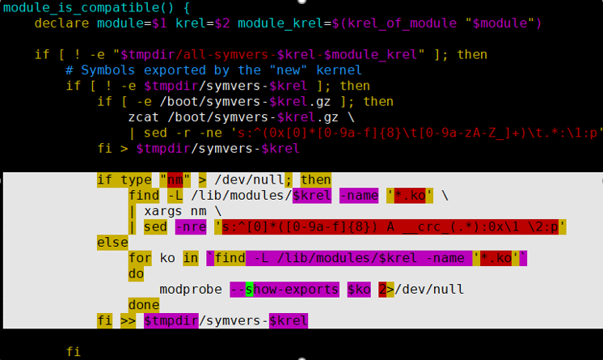

# 问题现象<a name="ZH-CN_TOPIC_0000001792578289"></a>

安装umdk-urma-kmod和umdk-urma-compat-ib-kmod依赖时，虽然安装成功，但是提示内核4.19.90-2012.5.0.0054.oe1.x86\_64中的模块ubcore.ko与内核4.19.90-2109.1.0.0108.oe1.x86\_64的符号不兼容，在使用**modinfo**和**modprobe**查看和加载ko文件时，无法找到ko文件。

-   安装umdk-urma-kmod依赖：

    ```
    [root@localhost dlock]# rpm -ivh umdk-urma-kmod-1.3.0-206.3.0.B130.x86_64.rpm 
    Verifying...                          ################################# [100%]
    Preparing...                          ################################# [100%]
    Updating / installing...
       1:umdk-urma-kmod-1.3.0-206.3.0.B130################################# [100%]
    /var/tmp/rpm-tmp.wSpThz: line 2: fg: no job control
    Module ubcore.ko from kernel 4.19.90-2012.5.0.0054.oe1.x86_64 is not compatible   with kernel 4.19.90-2109.1.0.0108.oe1.x86_64 in symbols: memcpy_s memset_s
    Module uburma.ko from kernel 4.19.90-2012.5.0.0054.oe1.x86_64 is not compatible   with kernel 4.19.90-2109.1.0.0108.oe1.x86_64 in symbols: snprintf_s
    ```

-   安装umdk-urma-compat-ib-kmod依赖：

    ```
    [root@localhost dlock]# rpm -ivh umdk-urma-compat-ib-kmod-1.3.0-206.3.0.B130.x86_64.rpm 
    Verifying...                          ################################# [100%]
    Preparing...                          ################################# [100%]
    Updating / installing...
       1:umdk-urma-compat-ib-kmod-1.3.0-20################################# [100%]
    Module uboib.ko from kernel 4.19.90-2012.5.0.0054.oe1.x86_64 is not compatible   with kernel 4.19.90-2109.1.0.0108.oe1.x86_64 in symbols: ib_destroy_cq_user ib_register_client ib_set_client_data ib_destroy_qp_user rdma_query_gid ib_query_port ib_unregister_client memcpy_s __ib_create_cq ib_dealloc_pd_user backport_dependency_symbol ib_query_qp strcpy_s __ib_alloc_pd memset_s ib_create_qp
    Created symlink /etc/systemd/system/multi-user.target.wants/uboib-module.service → /usr/lib/systemd/system/uboib-module.service.
    ```

# 问题原因<a name="ZH-CN_TOPIC_0000001745738600"></a>

uboib依赖于OFED，而OFED是系统安装后单独安装的，其符号是在“/lib/modules/当前内核版本/extra“下的，在安装RPM依赖时，weak-modules脚本运行中找不到其符号，使用系统默认的符号去和ubcore等对应，判断兼容性出错。

**操作系统兼容性信息<a name="section10808359184915"></a>**

**表 1**  操作系统兼容性信息

<a name="table288711225504"></a>
<table><thead align="left"><tr id="row158871322155020"><th class="cellrowborder" valign="top" width="50%" id="mcps1.2.3.1.1"><p id="p7864203111506"><a name="p7864203111506"></a><a name="p7864203111506"></a>操作系统</p>
</th>
<th class="cellrowborder" valign="top" width="50%" id="mcps1.2.3.1.2"><p id="p18642031115015"><a name="p18642031115015"></a><a name="p18642031115015"></a>存在兼容性问题</p>
</th>
</tr>
</thead>
<tbody><tr id="row6887322155012"><td class="cellrowborder" valign="top" width="50%" headers="mcps1.2.3.1.1 "><p id="p98641031185012"><a name="p98641031185012"></a><a name="p98641031185012"></a>openEuler 20.03 SP1 x86</p>
</td>
<td class="cellrowborder" valign="top" width="50%" headers="mcps1.2.3.1.2 "><p id="p386443113507"><a name="p386443113507"></a><a name="p386443113507"></a>是</p>
</td>
</tr>
<tr id="row788712225508"><td class="cellrowborder" valign="top" width="50%" headers="mcps1.2.3.1.1 "><p id="p1786573195020"><a name="p1786573195020"></a><a name="p1786573195020"></a>openEuler 20.03 SP1 Arm</p>
</td>
<td class="cellrowborder" valign="top" width="50%" headers="mcps1.2.3.1.2 "><p id="p20865113112505"><a name="p20865113112505"></a><a name="p20865113112505"></a>是</p>
</td>
</tr>
<tr id="row1188714229502"><td class="cellrowborder" valign="top" width="50%" headers="mcps1.2.3.1.1 "><p id="p78651631195014"><a name="p78651631195014"></a><a name="p78651631195014"></a>openEuler 20.03 SP3 x86</p>
</td>
<td class="cellrowborder" valign="top" width="50%" headers="mcps1.2.3.1.2 "><p id="p9866431115015"><a name="p9866431115015"></a><a name="p9866431115015"></a>否</p>
</td>
</tr>
<tr id="row16887132217502"><td class="cellrowborder" valign="top" width="50%" headers="mcps1.2.3.1.1 "><p id="p886718312501"><a name="p886718312501"></a><a name="p886718312501"></a>openEuler 20.03 SP3 Arm</p>
</td>
<td class="cellrowborder" valign="top" width="50%" headers="mcps1.2.3.1.2 "><p id="p18867231115014"><a name="p18867231115014"></a><a name="p18867231115014"></a>否</p>
</td>
</tr>
<tr id="row188871222505"><td class="cellrowborder" valign="top" width="50%" headers="mcps1.2.3.1.1 "><p id="p086783112508"><a name="p086783112508"></a><a name="p086783112508"></a>openEuler 20.03 LTS x86</p>
</td>
<td class="cellrowborder" valign="top" width="50%" headers="mcps1.2.3.1.2 "><p id="p1867173175020"><a name="p1867173175020"></a><a name="p1867173175020"></a>否</p>
</td>
</tr>
<tr id="row14888922195018"><td class="cellrowborder" valign="top" width="50%" headers="mcps1.2.3.1.1 "><p id="p7867173175016"><a name="p7867173175016"></a><a name="p7867173175016"></a>openEuler 20.03 LTS Arm</p>
</td>
<td class="cellrowborder" valign="top" width="50%" headers="mcps1.2.3.1.2 "><p id="p1286733113501"><a name="p1286733113501"></a><a name="p1286733113501"></a>否</p>
</td>
</tr>
<tr id="row16888192210505"><td class="cellrowborder" valign="top" width="50%" headers="mcps1.2.3.1.1 "><p id="p128672031205012"><a name="p128672031205012"></a><a name="p128672031205012"></a>openEuler 22.03 LTS x86</p>
</td>
<td class="cellrowborder" valign="top" width="50%" headers="mcps1.2.3.1.2 "><p id="p18867931105018"><a name="p18867931105018"></a><a name="p18867931105018"></a>否</p>
</td>
</tr>
<tr id="row834016155211"><td class="cellrowborder" valign="top" width="50%" headers="mcps1.2.3.1.1 "><p id="p1934016610523"><a name="p1934016610523"></a><a name="p1934016610523"></a>openEuler 22.03 LTS Arm</p>
</td>
<td class="cellrowborder" valign="top" width="50%" headers="mcps1.2.3.1.2 "><p id="p8340136105212"><a name="p8340136105212"></a><a name="p8340136105212"></a>否</p>
</td>
</tr>
</tbody>
</table>

**根本原因<a name="section15471185032115"></a>**

urma内核版本和系统版本不匹配。

-   使用**rpm -ql umdk-urma-kmod**命令查看urma编译使用的内核小版本。

    ```
    /etc/modules-load.d/ubcore.conf
    /etc/modules-load.d/uburma.conf
    /lib/modules/4.19.90-2012.5.0.0054.oe1.x86_64/extra/urma
    /lib/modules/4.19.90-2012.5.0.0054.oe1.x86_64/extra/urma/ubcore.ko
    /lib/modules/4.19.90-2012.5.0.0054.oe1.x86_64/extra/urma/uburma.ko
    /usr/include/umdk
    /usr/src/ubcore/Module.symvers
    ```

-   使用**uname -r**查看系统小版本。

    ```
    4.19.90-2109.1.0.0108.oe1.x86_64
    ```

查询得知，urma编译使用的内核小版本和实际的系统小版本不匹配。

**直接原因<a name="section2073617383186"></a>**

没有正确获取到实际使用的ko文件进行兼容性判断，导致误判成不兼容。

weak-modules脚本判断是否兼容流程：

1.  获取当前系统内核编译时的符号表，这里记为**S-kernel**。
2.  获取“/lib/modules/$module\_krel/extra“中额外ko文件的符号表，这里记为**S-extra**。
3.  将前两步的符号表合并为**S-all**。
4.  获取待检查的ko文件的符号表，这里记为**S-target**。
5.  检查**S-target**中的所有符号是否能在**S-all**中找到匹配。

-   如果**S-target**中的所有符号都能在**S-all**中找到，那么兼容性就判断为可兼容，则在“/lib/modules/$\(uname -r\)/weak-updates/“中创建原ko文件的符号链接。
-   如果**S-target**中有符号不能在**S-all**中找到，那么兼容性将判断为不兼容，将会直接报错。处理方法请参见[解决方法](解决方法.md)。

# 预防措施和规范建议<a name="ZH-CN_TOPIC_0000001792658541"></a>

在安装RPM包之前，先检查urma编译使用的内核小版本和实际的系统小版本，版本匹配后再进行安装操作。

如果不匹配，亦可参见[解决方法](解决方法.md)处理。

# 解决方法<a name="ZH-CN_TOPIC_0000001745579444"></a>

将当前已RPM安装的ko文件加入**S-all**中进行符号依赖的判断。

1.  登录服务器，打开weak-modules脚本文件。

    ```
    vi /sbin/weak-modules
    ```

2.  在图片白色位置新增对应脚本。

    

    脚本如下：

    ```
    if type "nm" > /dev/null; then
        find -L /lib/modules/$krel -name '*.ko' \
        | xargs nm \
        | sed -nre 's:^[0]*([0-9a-f]{8}) A __crc_(.*):0x\1 \2:p'
    else
        for ko in `find -L /lib/modules/$krel -name '*.ko'`
        do
                modprobe --show-exports $ko 2>/dev/null
        done
    fi >> $tmpdir/symvers-$krel
    ```

3.  保存之后重新执行安装操作。

