# 识别CX4/CX5网卡<a name="ZH-CN_TOPIC_0000001792578585"></a>

执行以下命令。

```
lspci |grep Mellanox
```

回显如下：

```
81:00.0 Ethernet controller: Mellanox Technologies MT27800 Family [ConnectX-5]
81:00.1 Ethernet controller: Mellanox Technologies MT27800 Family [ConnectX-5]
```

# 安装MLNX驱动<a name="ZH-CN_TOPIC_0000001745738900"></a>

1.  选择下载与OS匹配的驱动包，地址：[https://network.nvidia.com/products/infiniband-drivers/linux/mlnx\_ofed/](https://network.nvidia.com/products/infiniband-drivers/linux/mlnx_ofed/)。

    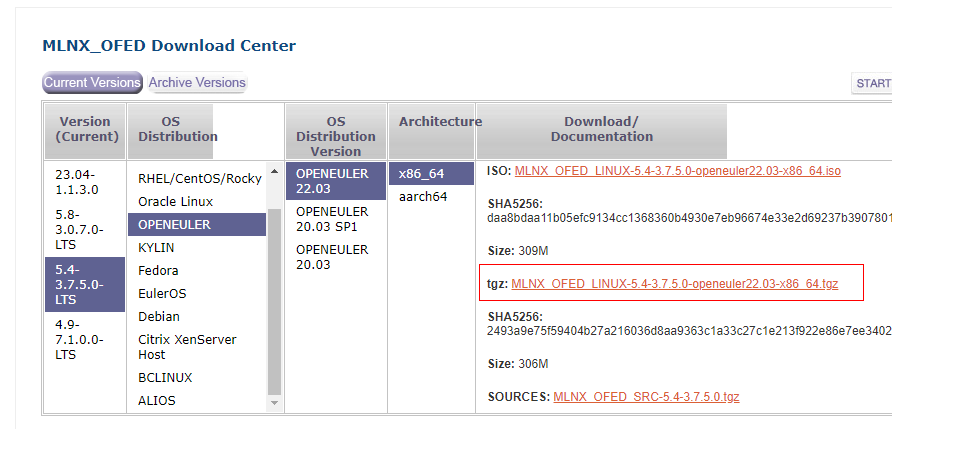

2.  新建目录，将OS镜像文件挂载至新建目录。OS镜像名称请根据实际情况进行修改。

    ```
    mkdir -p /mnt/iso
    mount openEuler-22.03-LTS-x86_64-dvd.iso /mnt/iso
    ```

3.  安装过程中需要部分依赖，请配置好OS镜像源，例如本地镜像。
    1.  打开镜像源文件。

        ```
        vim /etc/yum.repos.d/openEuler.repo
        ```

    2.  按“i”进入编辑模式，只保留以下内容。

        ```
        [OS]
        name=OS
        baseurl=file:///mnt/iso
        enabled=1
        gpgcheck=0
        ```

    3.  按“Esc”键，输入**:wq!**，按“Enter”保存并退出编辑。
    4.  缓存软件包。

        ```
        yum makecache
        ```

4.  上传驱动包至服务器并解压。驱动包名称请根据实际情况进行修改。

    ```
    tar -zxvf MLNX_OFED_LINUX-5.4-3.7.5.0-openeuler22.03-x86_64.tgz
    ```

5.  进入解压后的驱动包目录，执行以下命令安装驱动。

    ```
    ./mlnxofedinstall --without-depcheck --without-fw-update --force
    ```

    如果提示内核不匹配，则执行以下命令。

    ```
    ./mlnxofedinstall --add-kernel-support
    ```

6.  设置重启后自动拉起驱动。

    ```
    chkconfig --add openibd
    /etc/init.d/openibd start
    chkconfig openibd on
    ```

7.  安装完成后重启服务器。

# 安装检查<a name="ZH-CN_TOPIC_0000001745579736"></a>

1.  检查驱动RoCE LAG功能。
    1.  <a name="li389014811257"></a>查看RoCE LAG功能是否启用。

        ```
        find /sys/ -name roce_lag_enable | xargs cat
        ```

        -   输出为1，则表示开启。
        -   输出为0或无输出，则表示关闭。
        -   预期要关闭才可以，如果没有关闭，请执行[1.b](#li519083722516)。

    2.  <a name="li519083722516"></a>关闭RoCE LAG功能。

        ```
        sed '/load_module mlx5_core/a\ files=`find /sys -name roce_lag_enable`;for file in $files;do echo 0 > $file;done' -i /etc/init.d/openibd
        ```

    3.  执行后重启节点使其生效，重启后再执行[1.a](#li389014811257)查看是否生效。

        ```
        reboot
        ```

2.  检查驱动版本。

    ```
    ofed_info -s
    ```

    回显驱动版本与[安装MLNX驱动](安装MLNX驱动.md)版本一致则版本无误。

3.  加载MST工具。

    ```
    mst start
    ```

    回显如下表示加载成功。

    ```
    Starting MST (Mellanox Software Tools) driver set
    Loading MST PCI module - Success
    Loading MST PCI configuration module - Success
    Create devices
    Unloading MST PCI module (unused) - Success
    ```

4.  查询设备路径和网络端口。
    1.  查询设备上RoCE和IB卡的设备路径。

        ```
        mst status
        ```

        回显如下：

        ```
        MST modules:
        ------------
            MST PCI module is not loaded
            MST PCI configuration module loaded
        
        MST devices:
        ------------
        /dev/mst/mt4119_pciconf0         - PCI configuration cycles access.
                                           domain:bus:dev.fn=0000:81:00.0 addr.reg=88 data.reg=92 cr_bar.gw_offset=-1
                                           Chip revision is: 00
        ```

        其中，MST devices字段枚举的设备路径/dev/mst/mst\_typeN（N取值：0，1，2，……）代表一张CX卡，mst\_type和CX网卡型号映射关系参考[表1](#table93856218287)。

        **表 1**  mst\_type和CX网卡型号映射关系

        <a name="table93856218287"></a>
        <table><thead align="left"><tr id="row53858216280"><th class="cellrowborder" valign="top" width="50%" id="mcps1.2.3.1.1"><p id="p10385182110284"><a name="p10385182110284"></a><a name="p10385182110284"></a><strong id="b6385121122815"><a name="b6385121122815"></a><a name="b6385121122815"></a>mst_type</strong></p>
        </th>
        <th class="cellrowborder" valign="top" width="50%" id="mcps1.2.3.1.2"><p id="p5385162117284"><a name="p5385162117284"></a><a name="p5385162117284"></a><strong id="b1838592120288"><a name="b1838592120288"></a><a name="b1838592120288"></a>网卡型号</strong></p>
        </th>
        </tr>
        </thead>
        <tbody><tr id="row838562118287"><td class="cellrowborder" valign="top" width="50%" headers="mcps1.2.3.1.1 "><p id="p1238514214283"><a name="p1238514214283"></a><a name="p1238514214283"></a>mt4099_pci_cr</p>
        </td>
        <td class="cellrowborder" valign="top" width="50%" headers="mcps1.2.3.1.2 "><p id="p18385162111285"><a name="p18385162111285"></a><a name="p18385162111285"></a>CX3</p>
        </td>
        </tr>
        <tr id="row183851321162810"><td class="cellrowborder" valign="top" width="50%" headers="mcps1.2.3.1.1 "><p id="p6385172122812"><a name="p6385172122812"></a><a name="p6385172122812"></a>mt4117_pciconf</p>
        </td>
        <td class="cellrowborder" valign="top" width="50%" headers="mcps1.2.3.1.2 "><p id="p15385321202818"><a name="p15385321202818"></a><a name="p15385321202818"></a>CX4-Lx</p>
        </td>
        </tr>
        <tr id="row193851821152815"><td class="cellrowborder" valign="top" width="50%" headers="mcps1.2.3.1.1 "><p id="p738522111286"><a name="p738522111286"></a><a name="p738522111286"></a>mt4119_pciconf</p>
        </td>
        <td class="cellrowborder" valign="top" width="50%" headers="mcps1.2.3.1.2 "><p id="p16385192112814"><a name="p16385192112814"></a><a name="p16385192112814"></a>CX5</p>
        </td>
        </tr>
        <tr id="row193859216280"><td class="cellrowborder" valign="top" width="50%" headers="mcps1.2.3.1.1 "><p id="p143851221112815"><a name="p143851221112815"></a><a name="p143851221112815"></a>mt4123_pciconf</p>
        </td>
        <td class="cellrowborder" valign="top" width="50%" headers="mcps1.2.3.1.2 "><p id="p1838592119285"><a name="p1838592119285"></a><a name="p1838592119285"></a>CX6</p>
        </td>
        </tr>
        </tbody>
        </table>

    2.  查看需要检查的网络端口，后续步骤将对查询到的所有端口进行检查。

        ```
        ll /dev/mst
        ```

        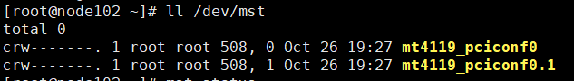

        当前节点需要对“mt4119\_pciconf0”和“mt4119\_pciconf0.1”这两个端口进行检查。

5.  检查固件版本。
    1.  查询RoCE/IB卡的固件版本，其中“/dev/mst/mt4119\_pciconf0“为上一步中查询到的设备路径，请根据实际情况进行替换。

        ```
        flint -d /dev/mst/mt4119_pciconf0 q
        ```

        查询结果如下。

        ```
        Image type:            FS4
        FW Version:            16.31.2006
        FW Release Date:       31.8.2021
        Product Version:       16.31.2006
        Rom Info:              type=UEFI version=14.24.15 cpu=AMD64
                               type=PXE version=3.6.404 cpu=AMD64
        Description:           UID                GuidsNumber
        Base GUID:             ec0d9a0300c152e4        8
        Base MAC:              ec0d9ac152e4            8
        Image VSD:             N/A
        Device VSD:            N/A
        PSID:                  MT_0000000012
        Security Attributes:   N/A
        ```

6.  检查固件网络协议。
    1.  查看当前网络协议，此处以ETH协议为例。

        ```
        ibdev2netdev -v
        ```

        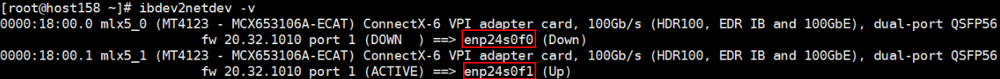

        -   若网卡名前缀为ib，则表示当前网络协议为IB，执行[6.b](#li7704752131814)。
        -   若网卡名前缀为en，则表示当前网络协议为ETH，跳至[7](#li71941554151214)。

    2.  <a name="li7704752131814"></a>查看LINK\_TYPE\_P1、LINK\_TYPE\_P2的值，以/dev/mst/mt4123\_pciconf0为例。

        ```
        mlxconfig -d /dev/mst/mt4123_pciconf0 q|grep LINK_TYPE_P1
        mlxconfig -d /dev/mst/mt4123_pciconf0 q|grep LINK_TYPE_P2
        ```

        -   若结果为空，表示此环境不支持更改网络协议，请更换环境。
        -   若查询有结果，表示网络协议可修改。
            -   查询值应为ETH\(2\)，跳至[7](#li71941554151214)。

                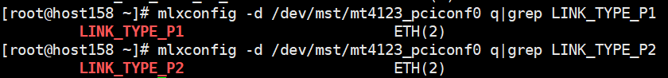

            -   若查询值为IB\(1\)，则执行[6.c](#li1297794616574)修改。

                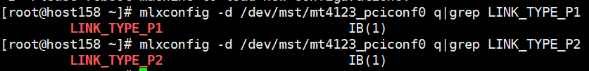

    3.  <a name="li1297794616574"></a>设置LINK\_TYPE\_P1和LINK\_TYPE\_P2的值，以/dev/mst/mt4123\_pciconf0为例。

        ```
        mlxconfig -d /dev/mst/mt4123_pciconf0 s LINK_TYPE_P1=2
        mlxconfig -d /dev/mst/mt4123_pciconf0 s LINK_TYPE_P2=2
        ```

        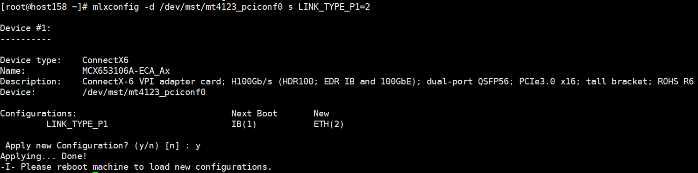

    4.  执行**reboot**命令重启，重复[6.b](#li7704752131814)确认已修改成功。

7.  <a name="li71941554151214"></a>验证RDMA网络。

    Server节点执行：

    ```
    ib_send_bw -d mlx5_1
    ```

    Client节点执行（xx.xx.xx.xx为Server节点的IP地址）：

    ```
    ib_send_bw -d mlx5_1 xx.xx.xx.xx
    ```

8.  <a name="li1555794655417"></a>（可选）设置固件选项。

    > **说明：** 
    >此步骤属于优化项，可以降低网络时延，建议用户进行操作。

    1.  查询CX卡固件选项PCI\_WR\_ORDERING的值。

        以“/dev/mst/mt4119\_pciconf0“为例，查询该设备的两个端口固件设置，查询结果中per\_mkey值应为1，若不为1则执行[8.b](#li19557114614540)修改。

        ```
        mlxconfig -d /dev/mst/mt4119_pciconf0 q | grep PCI_WR_ORDERING
        mlxconfig -d /dev/mst/mt4119_pciconf0.1 q | grep PCI_WR_ORDERING
        ```

        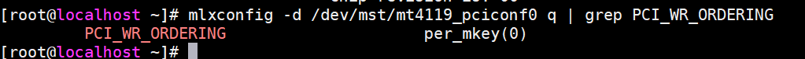

    2.  <a name="li19557114614540"></a>对一张CX5卡两个端口的固件选项PCI\_WR\_ORDERING进行设置，然后执行**reboot**命令重启，环境恢复后，按照[8](#li1555794655417)再次检查一遍，检查是否修改成功。

        ```
        mlxconfig -y -d /dev/mst/mt4119_pciconf0 s PCI_WR_ORDERING=1
        ```

        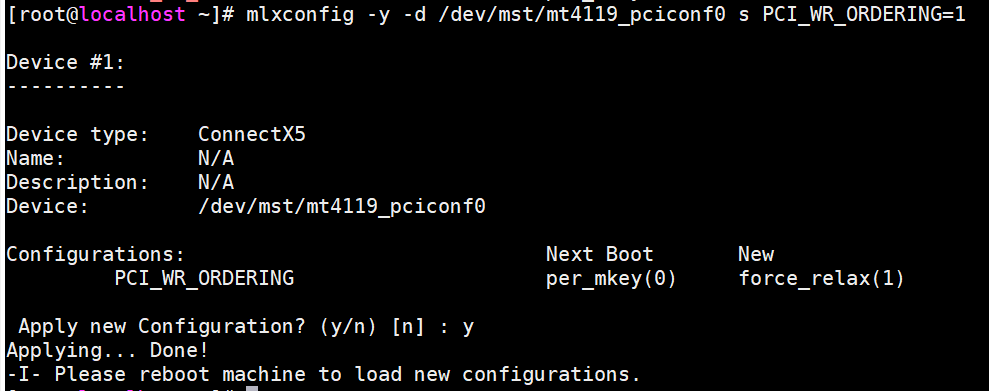

        ```
        mlxconfig -y -d /dev/mst/mt4119_pciconf0.1 s PCI_WR_ORDERING=1
        ```

        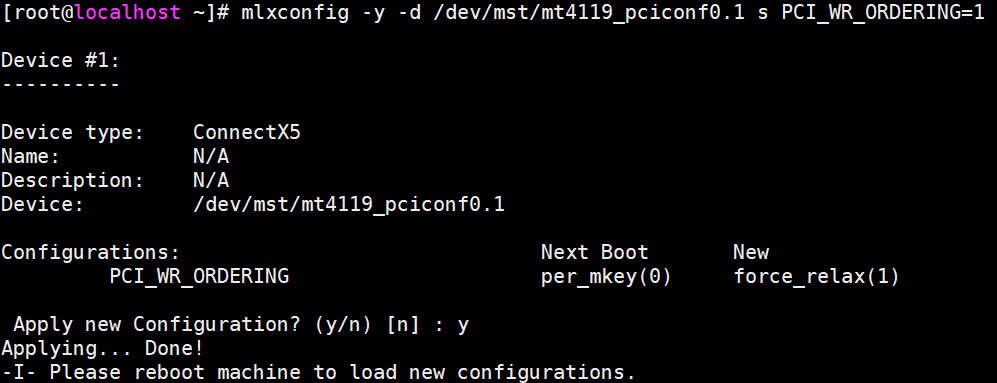

# 配置网卡IP<a name="ZH-CN_TOPIC_0000001792578589"></a>

1.  查看以太网设备和IB设备/端口之间的关联。

    ```
    ibdev2netdev -v
    ```

    -   当前节点网卡驱动客户端mlx5\_0关联网卡名称enp24s0f0
    -   当前节点网卡驱动客户端mlx5\_1关联网卡名称enp24s0f1

    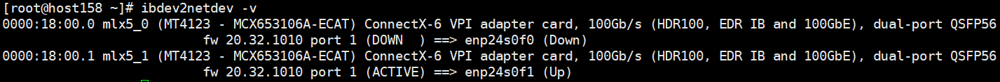

2.  <a name="li1681619318285"></a>查看网卡状态。

    ```
    ifconfig -a
    ```

    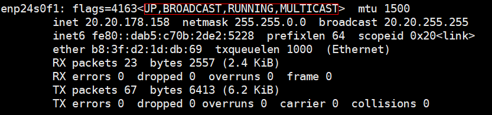

    若四个状态均正常表示可正常使用。

    -   UP：代表网卡开启状态。
    -   RUNNING：代表网卡的网线被接上。
    -   MULTICAST：支持组播。
    -   MTU 1500：最大传输单元。

3.  根据环境配置网卡IP地址。以下为添加“/etc/sysconfig/network-scripts/ifcfg-enp24s0f0“config文件方式。使用**systemctl restart network.service**重启应用。

    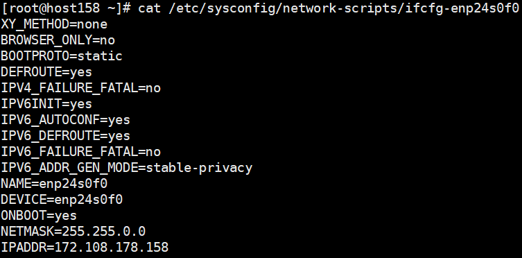

    配置完成后，根据[2](#li1681619318285)查看网卡状态。

    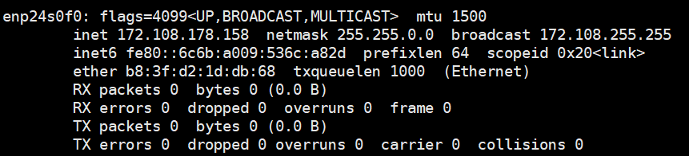

# 常用IB命令<a name="ZH-CN_TOPIC_0000001792658849"></a>

**表 1**  常用IB命令

<a name="table1240142904111"></a>
<table><thead align="left"><tr id="row44011295414"><th class="cellrowborder" valign="top" width="43.669999999999995%" id="mcps1.2.3.1.1"><p id="p1240142914417"><a name="p1240142914417"></a><a name="p1240142914417"></a><strong id="b1132123717487"><a name="b1132123717487"></a><a name="b1132123717487"></a>命令</strong></p>
</th>
<th class="cellrowborder" valign="top" width="56.330000000000005%" id="mcps1.2.3.1.2"><p id="p18401132904110"><a name="p18401132904110"></a><a name="p18401132904110"></a><strong id="b6895439184812"><a name="b6895439184812"></a><a name="b6895439184812"></a>含义</strong></p>
</th>
</tr>
</thead>
<tbody><tr id="row1340162913416"><td class="cellrowborder" valign="top" width="43.669999999999995%" headers="mcps1.2.3.1.1 "><p id="p44015296418"><a name="p44015296418"></a><a name="p44015296418"></a>lspci |grep Mell</p>
</td>
<td class="cellrowborder" valign="top" width="56.330000000000005%" headers="mcps1.2.3.1.2 "><p id="p9401229134114"><a name="p9401229134114"></a><a name="p9401229134114"></a>查看机器上是否存在IB卡（搜索厂商名字Mellanox）。</p>
</td>
</tr>
<tr id="row5401429144120"><td class="cellrowborder" valign="top" width="43.669999999999995%" headers="mcps1.2.3.1.1 "><p id="p1640118291416"><a name="p1640118291416"></a><a name="p1640118291416"></a>ibstatus</p>
</td>
<td class="cellrowborder" valign="top" width="56.330000000000005%" headers="mcps1.2.3.1.2 "><p id="p124015299418"><a name="p124015299418"></a><a name="p124015299418"></a>查看IB卡相关信息：链路状态，端口速率，端口GUID等信息。</p>
</td>
</tr>
<tr id="row1340192944116"><td class="cellrowborder" valign="top" width="43.669999999999995%" headers="mcps1.2.3.1.1 "><p id="p840112297419"><a name="p840112297419"></a><a name="p840112297419"></a>ibstat</p>
</td>
<td class="cellrowborder" valign="top" width="56.330000000000005%" headers="mcps1.2.3.1.2 "><p id="p5401152974110"><a name="p5401152974110"></a><a name="p5401152974110"></a>ibstat功能与ibstatus相似。</p>
</td>
</tr>
<tr id="row10401102924112"><td class="cellrowborder" valign="top" width="43.669999999999995%" headers="mcps1.2.3.1.1 "><p id="p540118293415"><a name="p540118293415"></a><a name="p540118293415"></a>ofed_info -s</p>
</td>
<td class="cellrowborder" valign="top" width="56.330000000000005%" headers="mcps1.2.3.1.2 "><p id="p1540142964113"><a name="p1540142964113"></a><a name="p1540142964113"></a>查询当前安装的驱动版本。</p>
</td>
</tr>
<tr id="row114013299416"><td class="cellrowborder" valign="top" width="43.669999999999995%" headers="mcps1.2.3.1.1 "><p id="p1540119298413"><a name="p1540119298413"></a><a name="p1540119298413"></a>ibv_devinfo</p>
</td>
<td class="cellrowborder" valign="top" width="56.330000000000005%" headers="mcps1.2.3.1.2 "><p id="p64011629174118"><a name="p64011629174118"></a><a name="p64011629174118"></a>查询当前节点系统中IB设备信息。</p>
</td>
</tr>
<tr id="row12401202934118"><td class="cellrowborder" valign="top" width="43.669999999999995%" headers="mcps1.2.3.1.1 "><p id="p840192917410"><a name="p840192917410"></a><a name="p840192917410"></a>ibqueryerrors -C mlx4_0 -P 1</p>
</td>
<td class="cellrowborder" valign="top" width="56.330000000000005%" headers="mcps1.2.3.1.2 "><p id="p1340152904119"><a name="p1340152904119"></a><a name="p1340152904119"></a>检查当前IB网络各端口的统计信息。</p>
</td>
</tr>
<tr id="row1640118292416"><td class="cellrowborder" valign="top" width="43.669999999999995%" headers="mcps1.2.3.1.1 "><p id="p14401112912419"><a name="p14401112912419"></a><a name="p14401112912419"></a>perfquery</p>
</td>
<td class="cellrowborder" valign="top" width="56.330000000000005%" headers="mcps1.2.3.1.2 "><p id="p1240162916418"><a name="p1240162916418"></a><a name="p1240162916418"></a>查看IB卡端口丢包、端口符号错误。</p>
</td>
</tr>
<tr id="row253215111438"><td class="cellrowborder" valign="top" width="43.669999999999995%" headers="mcps1.2.3.1.1 "><p id="p14532125184315"><a name="p14532125184315"></a><a name="p14532125184315"></a>ibv_devices</p>
</td>
<td class="cellrowborder" valign="top" width="56.330000000000005%" headers="mcps1.2.3.1.2 "><p id="p232mcpsimp"><a name="p232mcpsimp"></a><a name="p232mcpsimp"></a>查询当前节点的IB卡 - ibv_devices。</p>
</td>
</tr>
<tr id="row139501754144316"><td class="cellrowborder" valign="top" width="43.669999999999995%" headers="mcps1.2.3.1.1 "><p id="p10950854204311"><a name="p10950854204311"></a><a name="p10950854204311"></a>ibdump</p>
</td>
<td class="cellrowborder" valign="top" width="56.330000000000005%" headers="mcps1.2.3.1.2 "><p id="p195035474320"><a name="p195035474320"></a><a name="p195035474320"></a>该工具可以抓取IB层报文，由Mellanox提供。</p>
</td>
</tr>
<tr id="row1173411217449"><td class="cellrowborder" valign="top" width="43.669999999999995%" headers="mcps1.2.3.1.1 "><p id="p137342212440"><a name="p137342212440"></a><a name="p137342212440"></a>ethtool --set-priv-flags eth-s0 sniffer on</p>
</td>
<td class="cellrowborder" valign="top" width="56.330000000000005%" headers="mcps1.2.3.1.2 "><p id="p1273419234413"><a name="p1273419234413"></a><a name="p1273419234413"></a>用ethtool命令使能Sniffer，可以使用TCPDUMP抓包。</p>
</td>
</tr>
<tr id="row11238111445"><td class="cellrowborder" valign="top" width="43.669999999999995%" headers="mcps1.2.3.1.1 "><p id="p1923121144417"><a name="p1923121144417"></a><a name="p1923121144417"></a>ib_atomic_bw</p>
</td>
<td class="cellrowborder" valign="top" width="56.330000000000005%" headers="mcps1.2.3.1.2 "><p id="p92320164414"><a name="p92320164414"></a><a name="p92320164414"></a>计算一对机器之间RDMA原子事务的带宽，一个server端一个client端，通过CPU采样获取接受完整消息时间计算带宽。该测试支持双向测试，支持更换MTU大小，tx大小，迭代数，消息大小等，更多用法参见“-a”参数。</p>
</td>
</tr>
<tr id="row3814156144314"><td class="cellrowborder" valign="top" width="43.669999999999995%" headers="mcps1.2.3.1.1 "><p id="p239mcpsimp"><a name="p239mcpsimp"></a><a name="p239mcpsimp"></a>ib_atomic_lat</p>
</td>
<td class="cellrowborder" valign="top" width="56.330000000000005%" headers="mcps1.2.3.1.2 "><p id="p188148569438"><a name="p188148569438"></a><a name="p188148569438"></a>计算一对机器之间RDMA一定消息大小下原子事务的时延，client端发送RDMA atomic操作到服务器端，并对CPU时钟采样获取它接收消息完成情况，从而计算时延。</p>
</td>
</tr>
<tr id="row08091343441"><td class="cellrowborder" valign="top" width="43.669999999999995%" headers="mcps1.2.3.1.1 "><p id="p138093484417"><a name="p138093484417"></a><a name="p138093484417"></a>ib_read_bw</p>
</td>
<td class="cellrowborder" valign="top" width="56.330000000000005%" headers="mcps1.2.3.1.2 "><p id="p480917412443"><a name="p480917412443"></a><a name="p480917412443"></a>计算一对机器之间RDMA read操作带宽。</p>
</td>
</tr>
<tr id="row1838635864314"><td class="cellrowborder" valign="top" width="43.669999999999995%" headers="mcps1.2.3.1.1 "><p id="p243mcpsimp"><a name="p243mcpsimp"></a><a name="p243mcpsimp"></a>ib_read_lat</p>
</td>
<td class="cellrowborder" valign="top" width="56.330000000000005%" headers="mcps1.2.3.1.2 "><p id="p1338655818432"><a name="p1338655818432"></a><a name="p1338655818432"></a>计算一对机器之间RDMA一定消息大小下read操作时延。</p>
</td>
</tr>
<tr id="row922025320433"><td class="cellrowborder" valign="top" width="43.669999999999995%" headers="mcps1.2.3.1.1 "><p id="p12201653144314"><a name="p12201653144314"></a><a name="p12201653144314"></a>ib_send_bw -d mlx5_1</p>
</td>
<td class="cellrowborder" valign="top" width="56.330000000000005%" headers="mcps1.2.3.1.2 "><p id="p7220185317436"><a name="p7220185317436"></a><a name="p7220185317436"></a>计算一对机器之间RDMA send操作带宽。</p>
</td>
</tr>
<tr id="row20926183404519"><td class="cellrowborder" valign="top" width="43.669999999999995%" headers="mcps1.2.3.1.1 "><p id="p247mcpsimp"><a name="p247mcpsimp"></a><a name="p247mcpsimp"></a>ib_send_lat</p>
</td>
<td class="cellrowborder" valign="top" width="56.330000000000005%" headers="mcps1.2.3.1.2 "><p id="p492693419458"><a name="p492693419458"></a><a name="p492693419458"></a>计算一对机器之间RDMA一定消息大小下send操作时延。</p>
</td>
</tr>
<tr id="row19813183694519"><td class="cellrowborder" valign="top" width="43.669999999999995%" headers="mcps1.2.3.1.1 "><p id="p18130360455"><a name="p18130360455"></a><a name="p18130360455"></a>ib_write_bw</p>
</td>
<td class="cellrowborder" valign="top" width="56.330000000000005%" headers="mcps1.2.3.1.2 "><p id="p208134364452"><a name="p208134364452"></a><a name="p208134364452"></a>计算一对机器之间RDMA write操作带宽。</p>
</td>
</tr>
<tr id="row1306341194511"><td class="cellrowborder" valign="top" width="43.669999999999995%" headers="mcps1.2.3.1.1 "><p id="p330610417452"><a name="p330610417452"></a><a name="p330610417452"></a>ib_write_lat</p>
</td>
<td class="cellrowborder" valign="top" width="56.330000000000005%" headers="mcps1.2.3.1.2 "><p id="p252mcpsimp"><a name="p252mcpsimp"></a><a name="p252mcpsimp"></a>计算一对机器之间RDMA一定消息大小下write操作时延。</p>
</td>
</tr>
<tr id="row889364211452"><td class="cellrowborder" valign="top" width="43.669999999999995%" headers="mcps1.2.3.1.1 "><p id="p1189494264518"><a name="p1189494264518"></a><a name="p1189494264518"></a>raw_ethernet_bw</p>
</td>
<td class="cellrowborder" valign="top" width="56.330000000000005%" headers="mcps1.2.3.1.2 "><p id="p9894154212454"><a name="p9894154212454"></a><a name="p9894154212454"></a>计算一对机器之间send带宽。</p>
</td>
</tr>
<tr id="row1139844434513"><td class="cellrowborder" valign="top" width="43.669999999999995%" headers="mcps1.2.3.1.1 "><p id="p839854454516"><a name="p839854454516"></a><a name="p839854454516"></a>raw_ethernet_lat</p>
</td>
<td class="cellrowborder" valign="top" width="56.330000000000005%" headers="mcps1.2.3.1.2 "><p id="p1639824411458"><a name="p1639824411458"></a><a name="p1639824411458"></a>计算一对机器之间send一定大小消息的时延。</p>
</td>
</tr>
<tr id="row2703153911458"><td class="cellrowborder" valign="top" width="43.669999999999995%" headers="mcps1.2.3.1.1 "><p id="p6703173934511"><a name="p6703173934511"></a><a name="p6703173934511"></a>rping</p>
</td>
<td class="cellrowborder" valign="top" width="56.330000000000005%" headers="mcps1.2.3.1.2 "><p id="p1170323914454"><a name="p1170323914454"></a><a name="p1170323914454"></a>检测RDMA CM连接是否OK。</p>
</td>
</tr>
</tbody>
</table>

