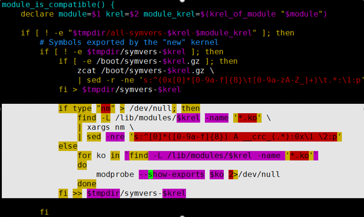

# Symptom<a name="EN-US_TOPIC_0000001792578289"></a>

Although the  **umdk-urma-kmod**  and  **umdk-urma-compat-ib-kmod**  dependencies are successfully installed, the system displays a message indicating that the  **ubcore.ko**  module in kernel 4.19.90-2012.5.0.0054.oe1.x86\_64 is incompatible with the symbols of kernel 4.19.90-2109.1.0.0108.oe1.x86\_64. When the  **modinfo**  and  **modprobe**  commands are used to view and load the .ko files, the .ko file cannot be found.

-   Install the  **umdk-urma-kmod**  dependency.

    ```
    [root@localhost dlock]# rpm -ivh umdk-urma-kmod-1.3.0-206.3.0.B130.x86_64.rpm 
    Verifying...                          ################################# [100%]
    Preparing...                          ################################# [100%]
    Updating / installing...
       1:umdk-urma-kmod-1.3.0-206.3.0.B130################################# [100%]
    /var/tmp/rpm-tmp.wSpThz: line 2: fg: no job control
    Module ubcore.ko from kernel 4.19.90-2012.5.0.0054.oe1.x86_64 is not compatible   with kernel 4.19.90-2109.1.0.0108.oe1.x86_64 in symbols: memcpy_s memset_s
    Module uburma.ko from kernel 4.19.90-2012.5.0.0054.oe1.x86_64 is not compatible   with kernel 4.19.90-2109.1.0.0108.oe1.x86_64 in symbols: snprintf_s
    ```

-   Install the  **umdk-urma-compat-ib-kmod**  dependency.

    ```
    [root@localhost dlock]# rpm -ivh umdk-urma-compat-ib-kmod-1.3.0-206.3.0.B130.x86_64.rpm 
    Verifying...                          ################################# [100%]
    Preparing...                          ################################# [100%]
    Updating / installing...
       1:umdk-urma-compat-ib-kmod-1.3.0-20################################# [100%]
    Module uboib.ko from kernel 4.19.90-2012.5.0.0054.oe1.x86_64 is not compatible   with kernel 4.19.90-2109.1.0.0108.oe1.x86_64 in symbols: ib_destroy_cq_user ib_register_client ib_set_client_data ib_destroy_qp_user rdma_query_gid ib_query_port ib_unregister_client memcpy_s __ib_create_cq ib_dealloc_pd_user backport_dependency_symbol ib_query_qp strcpy_s __ib_alloc_pd memset_s ib_create_qp
    Created symlink /etc/systemd/system/multi-user.target.wants/uboib-module.service → /usr/lib/systemd/system/uboib-module.service.
    ```

# Possible Cause<a name="EN-US_TOPIC_0000001745738600"></a>

The uboib module depends on OFED which is installed separately after the OS is installed. The OFED symbols are in  **/lib/modules/**_current\_kernel\_version_**/extra**. When RPM dependencies are installed, the OFED symbols cannot be found when the  **weak-modules**  script is running, and the default symbols of the OS are used to correspond to the ubcore module. As a result, a compatibility error occurs.

**OS Compatibility<a name="section10808359184915"></a>**

**Table  1**  OS compatibility information

<a name="table288711225504"></a>
<table><thead align="left"><tr id="row158871322155020"><th class="cellrowborder" valign="top" width="50%" id="mcps1.2.3.1.1"><p id="p7864203111506"><a name="p7864203111506"></a><a name="p7864203111506"></a>OS</p>
</th>
<th class="cellrowborder" valign="top" width="50%" id="mcps1.2.3.1.2"><p id="p18642031115015"><a name="p18642031115015"></a><a name="p18642031115015"></a>Compatibility Issue Detected</p>
</th>
</tr>
</thead>
<tbody><tr id="row6887322155012"><td class="cellrowborder" valign="top" width="50%" headers="mcps1.2.3.1.1 "><p id="p98641031185012"><a name="p98641031185012"></a><a name="p98641031185012"></a>openEuler 20.03 SP1 x86</p>
</td>
<td class="cellrowborder" valign="top" width="50%" headers="mcps1.2.3.1.2 "><p id="p386443113507"><a name="p386443113507"></a><a name="p386443113507"></a>Yes</p>
</td>
</tr>
<tr id="row788712225508"><td class="cellrowborder" valign="top" width="50%" headers="mcps1.2.3.1.1 "><p id="p1786573195020"><a name="p1786573195020"></a><a name="p1786573195020"></a>openEuler 20.03 SP1 Arm</p>
</td>
<td class="cellrowborder" valign="top" width="50%" headers="mcps1.2.3.1.2 "><p id="p20865113112505"><a name="p20865113112505"></a><a name="p20865113112505"></a>Yes</p>
</td>
</tr>
<tr id="row1188714229502"><td class="cellrowborder" valign="top" width="50%" headers="mcps1.2.3.1.1 "><p id="p78651631195014"><a name="p78651631195014"></a><a name="p78651631195014"></a>openEuler 20.03 SP3 x86</p>
</td>
<td class="cellrowborder" valign="top" width="50%" headers="mcps1.2.3.1.2 "><p id="p9866431115015"><a name="p9866431115015"></a><a name="p9866431115015"></a>No</p>
</td>
</tr>
<tr id="row16887132217502"><td class="cellrowborder" valign="top" width="50%" headers="mcps1.2.3.1.1 "><p id="p886718312501"><a name="p886718312501"></a><a name="p886718312501"></a>openEuler 20.03 SP3 Arm</p>
</td>
<td class="cellrowborder" valign="top" width="50%" headers="mcps1.2.3.1.2 "><p id="p18867231115014"><a name="p18867231115014"></a><a name="p18867231115014"></a>No</p>
</td>
</tr>
<tr id="row188871222505"><td class="cellrowborder" valign="top" width="50%" headers="mcps1.2.3.1.1 "><p id="p086783112508"><a name="p086783112508"></a><a name="p086783112508"></a>openEuler 20.03 LTS x86</p>
</td>
<td class="cellrowborder" valign="top" width="50%" headers="mcps1.2.3.1.2 "><p id="p1867173175020"><a name="p1867173175020"></a><a name="p1867173175020"></a>No</p>
</td>
</tr>
<tr id="row14888922195018"><td class="cellrowborder" valign="top" width="50%" headers="mcps1.2.3.1.1 "><p id="p7867173175016"><a name="p7867173175016"></a><a name="p7867173175016"></a>openEuler 20.03 LTS Arm</p>
</td>
<td class="cellrowborder" valign="top" width="50%" headers="mcps1.2.3.1.2 "><p id="p1286733113501"><a name="p1286733113501"></a><a name="p1286733113501"></a>No</p>
</td>
</tr>
<tr id="row16888192210505"><td class="cellrowborder" valign="top" width="50%" headers="mcps1.2.3.1.1 "><p id="p128672031205012"><a name="p128672031205012"></a><a name="p128672031205012"></a>openEuler 22.03 LTS x86</p>
</td>
<td class="cellrowborder" valign="top" width="50%" headers="mcps1.2.3.1.2 "><p id="p18867931105018"><a name="p18867931105018"></a><a name="p18867931105018"></a>No</p>
</td>
</tr>
<tr id="row834016155211"><td class="cellrowborder" valign="top" width="50%" headers="mcps1.2.3.1.1 "><p id="p1934016610523"><a name="p1934016610523"></a><a name="p1934016610523"></a>openEuler 22.03 LTS Arm</p>
</td>
<td class="cellrowborder" valign="top" width="50%" headers="mcps1.2.3.1.2 "><p id="p8340136105212"><a name="p8340136105212"></a><a name="p8340136105212"></a>No</p>
</td>
</tr>
</tbody>
</table>

**Root Cause<a name="section15471185032115"></a>**

The urma kernel version does not match the system version.

-   Run the  **rpm -ql umdk-urma-kmod**  command to check the minor kernel version used for urma compilation.

    ```
    /etc/modules-load.d/ubcore.conf
    /etc/modules-load.d/uburma.conf
    /lib/modules/4.19.90-2012.5.0.0054.oe1.x86_64/extra/urma
    /lib/modules/4.19.90-2012.5.0.0054.oe1.x86_64/extra/urma/ubcore.ko
    /lib/modules/4.19.90-2012.5.0.0054.oe1.x86_64/extra/urma/uburma.ko
    /usr/include/umdk
    /usr/src/ubcore/Module.symvers
    ```

-   Run the  **uname -r**  command to query the minor version of the OS.

    ```
    4.19.90-2109.1.0.0108.oe1.x86_64
    ```

According to the query result, the minor version of the kernel used for urma compilation does not match the minor version of the OS.

**Direct Cause<a name="section2073617383186"></a>**

The .ko file in use is not correctly obtained for compatibility check. As a result, the OS incorrectly determines that the .ko file is incompatible.

The  **weak-modules**  script checks OS compatibility as follows:

1.  Obtain the symbol table when the current OS kernel is compiled, which is recorded as  **S-kernel**.
2.  Obtain the symbol tables of extra .ko files in  **/lib/modules/$module\_krel/extra**, which is recorded as  **S-extra**.
3.  Combine the symbol tables in the first two steps into  **S-all**.
4.  Obtain the symbol table of the .ko file to be checked, which is recorded as  **S-target**.
5.  Check whether all symbols in  **S-target**  can be matched in  **S-all**.

-   If all symbols in  **S-target**  can be found in  **S-all**, the .ko file is determined as compatible. In this case, the symbolic link of the .ko file is created in  **/lib/modules/$\(uname -r\)/weak-updates/**.
-   If any symbol in  **S-target**  cannot be found in  **S-all**, the .ko file is considered incompatible and an error is reported. For details about error handling, see  [Solution](solution.md).

# Precautions and Recommendations<a name="EN-US_TOPIC_0000001792658541"></a>

Before installing the RPM packages, check whether the minor kernel version used for urma compilation matches the minor version of the OS. If they match, install the RPM packages.

If not, refer to  [Solution](solution.md).

# Solution<a name="EN-US_TOPIC_0000001745579444"></a>

Add the .ko files that have been installed using RPM to  **S-all**  to determine symbol dependency.

1.  Log in to the server and open the  **weak-modules**  script.

    ```
    vi /sbin/weak-modules
    ```

2.  Add the corresponding script to the white-background area shown in the following figure.

    

    The script is as follows:

    ```
    if type "nm" > /dev/null; then
        find -L /lib/modules/$krel -name '*.ko' \
        | xargs nm \
        | sed -nre 's:^[0]*([0-9a-f]{8}) A __crc_(.*):0x\1 \2:p'
    else
        for ko in `find -L /lib/modules/$krel -name '*.ko'`
        do
                modprobe --show-exports $ko 2>/dev/null
        done
    fi >> $tmpdir/symvers-$krel
    ```

3.  Save the content and perform the installation again.

