# Identifying CX4/CX5 NICs<a name="EN-US_TOPIC_0000001792578585"></a>

Run the following command:

```
lspci |grep Mellanox
```

Command output:

```
81:00.0 Ethernet controller: Mellanox Technologies MT27800 Family [ConnectX-5]
81:00.1 Ethernet controller: Mellanox Technologies MT27800 Family [ConnectX-5]
```

# Installing the MLNX Driver<a name="EN-US_TOPIC_0000001745738900"></a>

1.  Download the driver package that matches the OS from  [https://network.nvidia.com/products/infiniband-drivers/linux/mlnx\_ofed/](https://network.nvidia.com/products/infiniband-drivers/linux/mlnx_ofed/).

    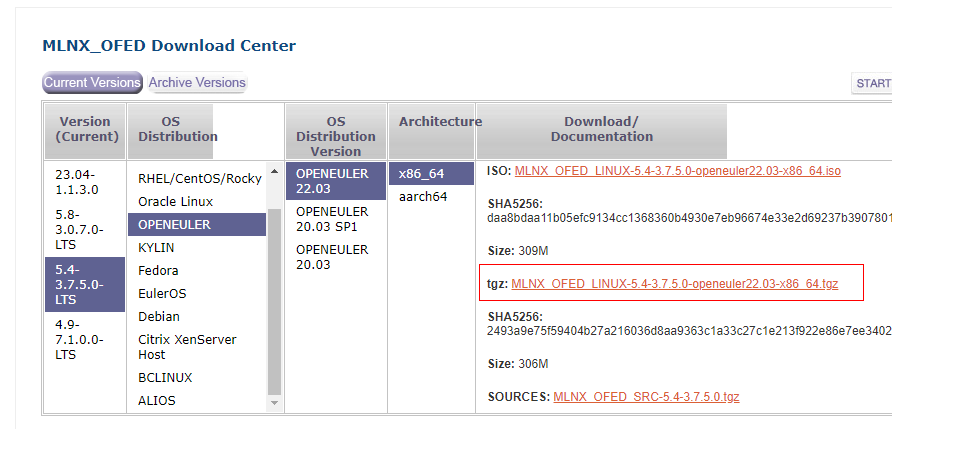

2.  Create a directory and mount the OS image file to this directory. Change the OS image name to the actual one.

    ```
    mkdir -p /mnt/iso
    mount openEuler-22.03-LTS-x86_64-dvd.iso /mnt/iso
    ```

3.  Configure the OS image source, for example, the local image, to obtain dependencies required during the installation.
    1.  Open the image source file.

        ```
        vim /etc/yum.repos.d/openEuler.repo
        ```

    2.  Press  **i**  to enter the insert mode and retain only the following content:

        ```
        [OS]
        name=OS
        baseurl=file:///mnt/iso
        enabled=1
        gpgcheck=0
        ```

    3.  Press  **Esc**, type  **:wq!**, and press  **Enter**  to save the file and exit.
    4.  Cache the software package.

        ```
        yum makecache
        ```

4.  Upload the driver package to the server and decompress it. Change the driver package name to the actual one.

    ```
    tar -zxvf MLNX_OFED_LINUX-5.4-3.7.5.0-openeuler22.03-x86_64.tgz
    ```

5.  Go to the driver package directory extracted after the decompression and run the following command to install the driver:

    ```
    ./mlnxofedinstall --without-depcheck --without-fw-update --force
    ```

    If the system displays a message indicating that the kernel does not support the driver version, run the following command:

    ```
    ./mlnxofedinstall --add-kernel-support
    ```

6.  Configure the system to automatically start the driver upon system restart.

    ```
    chkconfig --add openibd
    /etc/init.d/openibd start
    chkconfig openibd on
    ```

7.  Reboot the server after the installation is complete.

# Verifying the Installation<a name="EN-US_TOPIC_0000001745579736"></a>

1.  Check the RoCE LAG function of the driver.
    1.  <a name="li389014811257"></a>Check whether the RoCE LAG function is enabled.

        ```
        find /sys/ -name roce_lag_enable | xargs cat
        ```

        -   If the command output is  **1**, the function is enabled.
        -   If the command output is  **0**  or no command output is displayed, the function is disabled.
        -   The function is expected to be disabled. If the function is enabled, go to  [1.b](#li519083722516).

    2.  <a name="li519083722516"></a>Disable the RoCE LAG function.

        ```
        sed '/load_module mlx5_core/a\ files=`find /sys -name roce_lag_enable`;for file in $files;do echo 0 > $file;done' -i /etc/init.d/openibd
        ```

    3.  Reboot the node to apply the modification. Then, perform  [1.a](#li389014811257)  again to check whether the modification takes effect.

        ```
        reboot
        ```

2.  Query the driver version.

    ```
    ofed_info -s
    ```

    If the queried driver version is the same as the version installed in  [Installing the MLNX Driver](installing-the-mlnx-driver.md), the driver version is correct.

3.  Load the MST tool.

    ```
    mst start
    ```

    If the following information is displayed, the loading is successful.

    ```
    Starting MST (Mellanox Software Tools) driver set
    Loading MST PCI module - Success
    Loading MST PCI configuration module - Success
    Create devices
    Unloading MST PCI module (unused) - Success
    ```

4.  Query the device path and network port.
    1.  Query the device paths of RoCE and IB cards.

        ```
        mst status
        ```

        Command output:

        ```
        MST modules:
        ------------
            MST PCI module is not loaded
            MST PCI configuration module loaded
        
        MST devices:
        ------------
        /dev/mst/mt4119_pciconf0         - PCI configuration cycles access.
                                           domain:bus:dev.fn=0000:81:00.0 addr.reg=88 data.reg=92 cr_bar.gw_offset=-1
                                           Chip revision is: 00
        ```

        A device path  **/dev/mst/**_mst\_typeN_  \(_N_  can be 0, 1, 2, ...\) enumerated in the  **MST devices**  field indicates a CX card. For details about the mapping between  **mst\_type**  and CX NIC models, see  [Table 1](#table93856218287).

        **Table  1**  Mapping between mst\_type and CX NIC models

        <a name="table93856218287"></a>
        <table><thead align="left"><tr id="row53858216280"><th class="cellrowborder" valign="top" width="50%" id="mcps1.2.3.1.1"><p id="p10385182110284"><a name="p10385182110284"></a><a name="p10385182110284"></a><strong id="b6385121122815"><a name="b6385121122815"></a><a name="b6385121122815"></a>mst_type</strong></p>
        </th>
        <th class="cellrowborder" valign="top" width="50%" id="mcps1.2.3.1.2"><p id="p5385162117284"><a name="p5385162117284"></a><a name="p5385162117284"></a><strong id="b1963122355415"><a name="b1963122355415"></a><a name="b1963122355415"></a>NIC Model</strong></p>
        </th>
        </tr>
        </thead>
        <tbody><tr id="row838562118287"><td class="cellrowborder" valign="top" width="50%" headers="mcps1.2.3.1.1 "><p id="p1238514214283"><a name="p1238514214283"></a><a name="p1238514214283"></a>mt4099_pci_cr</p>
        </td>
        <td class="cellrowborder" valign="top" width="50%" headers="mcps1.2.3.1.2 "><p id="p18385162111285"><a name="p18385162111285"></a><a name="p18385162111285"></a>CX3</p>
        </td>
        </tr>
        <tr id="row183851321162810"><td class="cellrowborder" valign="top" width="50%" headers="mcps1.2.3.1.1 "><p id="p6385172122812"><a name="p6385172122812"></a><a name="p6385172122812"></a>mt4117_pciconf</p>
        </td>
        <td class="cellrowborder" valign="top" width="50%" headers="mcps1.2.3.1.2 "><p id="p15385321202818"><a name="p15385321202818"></a><a name="p15385321202818"></a>CX4-Lx</p>
        </td>
        </tr>
        <tr id="row193851821152815"><td class="cellrowborder" valign="top" width="50%" headers="mcps1.2.3.1.1 "><p id="p738522111286"><a name="p738522111286"></a><a name="p738522111286"></a>mt4119_pciconf</p>
        </td>
        <td class="cellrowborder" valign="top" width="50%" headers="mcps1.2.3.1.2 "><p id="p16385192112814"><a name="p16385192112814"></a><a name="p16385192112814"></a>CX5</p>
        </td>
        </tr>
        <tr id="row193859216280"><td class="cellrowborder" valign="top" width="50%" headers="mcps1.2.3.1.1 "><p id="p143851221112815"><a name="p143851221112815"></a><a name="p143851221112815"></a>mt4123_pciconf</p>
        </td>
        <td class="cellrowborder" valign="top" width="50%" headers="mcps1.2.3.1.2 "><p id="p1838592119285"><a name="p1838592119285"></a><a name="p1838592119285"></a>CX6</p>
        </td>
        </tr>
        </tbody>
        </table>

    2.  Query the network ports to be checked. Subsequent steps will check all the queried ports.

        ```
        ll /dev/mst
        ```

        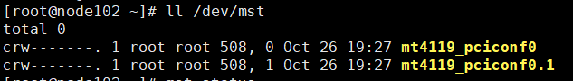

        Ports  **mt4119\_pciconf0**  and  **mt4119\_pciconf0.1**  on the current node will be checked.

5.  Check the firmware version.
    1.  Query the firmware version of the RoCE or IB card. In the command,  **/dev/mst/mt4119\_pciconf0**  is the device path queried in the previous step. Replace it as required.

        ```
        flint -d /dev/mst/mt4119_pciconf0 q
        ```

        The command output is as follows:

        ```
        Image type:            FS4
        FW Version:            16.31.2006
        FW Release Date:       31.8.2021
        Product Version:       16.31.2006
        Rom Info:              type=UEFI version=14.24.15 cpu=AMD64
                               type=PXE version=3.6.404 cpu=AMD64
        Description:           UID                GuidsNumber
        Base GUID:             ec0d9a0300c152e4        8
        Base MAC:              ec0d9ac152e4            8
        Image VSD:             N/A
        Device VSD:            N/A
        PSID:                  MT_0000000012
        Security Attributes:   N/A
        ```

6.  Check the firmware network protocol.
    1.  Query the current network protocol. The ETH protocol is used as an example.

        ```
        ibdev2netdev -v
        ```

        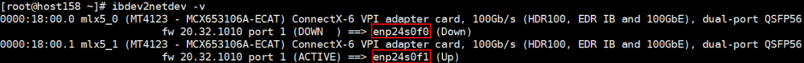

        -   If the NIC name prefix is  **ib**, the current network protocol is IB. Go to  [6.b](#li7704752131814).
        -   If the NIC name prefix is  **en**, the current network protocol is ETH. Go to  [7](#li71941554151214).

    2.  <a name="li7704752131814"></a>Query the values of  **LINK\_TYPE\_P1**  and  **LINK\_TYPE\_P2**. The following uses  **/dev/mst/mt4123\_pciconf0**  as an example.

        ```
        mlxconfig -d /dev/mst/mt4123_pciconf0 q|grep LINK_TYPE_P1
        mlxconfig -d /dev/mst/mt4123_pciconf0 q|grep LINK_TYPE_P2
        ```

        -   If the command output is empty, the network protocol cannot be changed in the current environment. In this case, change the environment.
        -   If the query result is displayed, the network protocol can be modified.
            -   The queried values are expected to be  **ETH\(2\)**. If so, go to  [7](#li71941554151214).

                

            -   If the queried values are  **IB\(1\)**, go to  [6.c](#li1297794616574).

                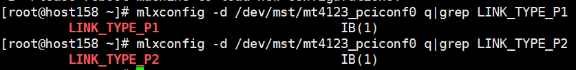

    3.  <a name="li1297794616574"></a>Change the values of  **LINK\_TYPE\_P1**  and  **LINK\_TYPE\_P2**. The following uses  **/dev/mst/mt4123\_pciconf0**  as an example.

        ```
        mlxconfig -d /dev/mst/mt4123_pciconf0 s LINK_TYPE_P1=2
        mlxconfig -d /dev/mst/mt4123_pciconf0 s LINK_TYPE_P2=2
        ```

        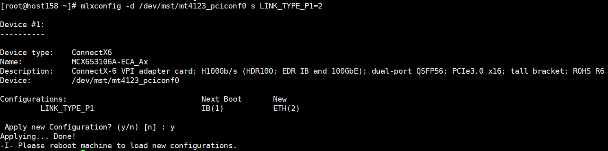

    4.  Run the  **reboot**  command to reboot the system and perform  [6.b](#li7704752131814)  to verify that the modification is successful.

7.  <a name="li71941554151214"></a>Verify the RDMA network.

    Run the following command on the server node:

    ```
    ib_send_bw -d mlx5_1
    ```

    Run the following command on the client node \(_xx.xx.xx.xx_  indicates the IP address of the server node\):

    ```
    ib_send_bw -d mlx5_1 xx.xx.xx.xx
    ```

8.  <a name="li1555794655417"></a>\(Optional\) Set firmware options.

    > **NOTE:** 
    >You are recommended to perform this step to reduce the network delay.

    1.  Query the value of the CX card firmware option  **PCI\_WR\_ORDERING**.

        Take  **/dev/mst/mt4119\_pciconf0**  as an example. Query the firmware settings of the two ports of the device. In the query result, the value of  **per\_mkey**  is expected to be  **1**. If not, go to  [8.b](#li19557114614540).

        ```
        mlxconfig -d /dev/mst/mt4119_pciconf0 q | grep PCI_WR_ORDERING
        mlxconfig -d /dev/mst/mt4119_pciconf0.1 q | grep PCI_WR_ORDERING
        ```

        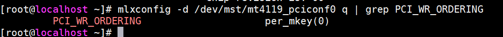

    2.  <a name="li19557114614540"></a>Set the firmware option  **PCI\_WR\_ORDERING**  for the two ports of a CX5 card, and run the  **reboot**  command to restart the system. After the environment is restored, perform  [8](#li1555794655417)  again to check whether the modification is successful.

        ```
        mlxconfig -y -d /dev/mst/mt4119_pciconf0 s PCI_WR_ORDERING=1
        ```

        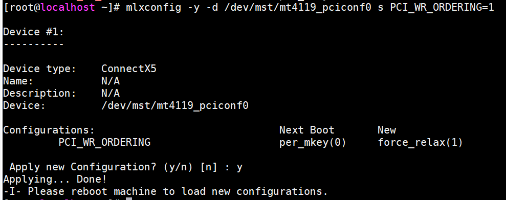

        ```
        mlxconfig -y -d /dev/mst/mt4119_pciconf0.1 s PCI_WR_ORDERING=1
        ```

        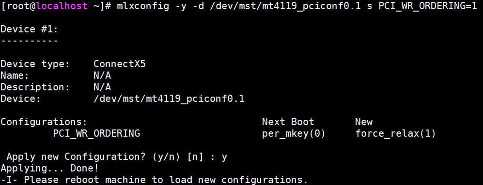

# Configuring NIC IP Addresses<a name="EN-US_TOPIC_0000001792578589"></a>

1.  View the association between Ethernet devices and IB devices/ports.

    ```
    ibdev2netdev -v
    ```

    -   Name of the NIC associated with the NIC driver client mlx5\_0 on the current node:  **enp24s0f0**
    -   Name of the NIC associated with the NIC driver client mlx5\_1 on the current node:  **enp24s0f1**

    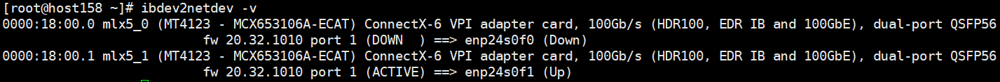

2.  <a name="li1681619318285"></a>Check the NIC status.

    ```
    ifconfig -a
    ```

    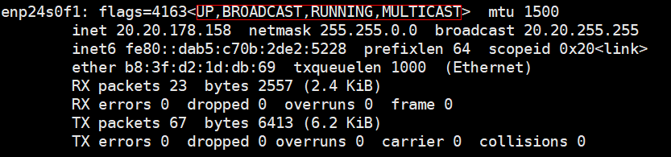

    If the four states are normal, the NIC can be used properly.

    -   **UP**  indicates that the NIC is enabled.
    -   **RUNNING**  indicates that the network cable of the NIC is connected.
    -   **MULTICAST**  indicates that multicasting is supported.
    -   **MTU 1500**  indicates the maximum transmission unit.

3.  Configure the NIC IP address based on your environment. The following describes how to add the NIC IP address in the  **/etc/sysconfig/network-scripts/ifcfg-enp24s0f0**  configuration file. Run  **systemctl restart network.service**  to restart the application.

    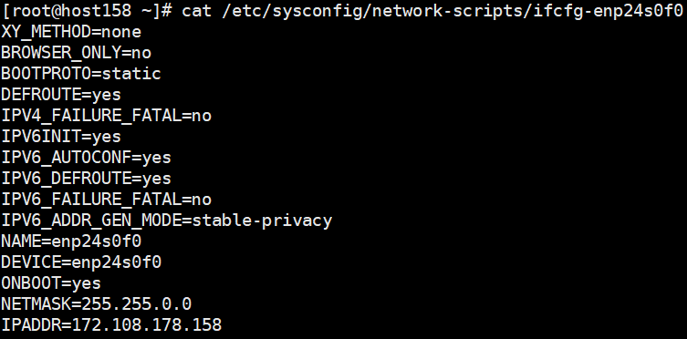

    After the configuration is complete, check the NIC status by referring to  [2](#li1681619318285).

    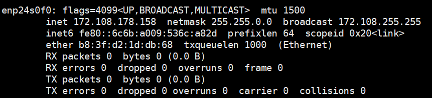

# Common IB Commands<a name="EN-US_TOPIC_0000001792658849"></a>

**Table  1**  Common IB commands

<a name="table1240142904111"></a>
<table><thead align="left"><tr id="row44011295414"><th class="cellrowborder" valign="top" width="43.669999999999995%" id="mcps1.2.3.1.1"><p id="p1240142914417"><a name="p1240142914417"></a><a name="p1240142914417"></a>Command</p>
</th>
<th class="cellrowborder" valign="top" width="56.330000000000005%" id="mcps1.2.3.1.2"><p id="p18401132904110"><a name="p18401132904110"></a><a name="p18401132904110"></a>Description</p>
</th>
</tr>
</thead>
<tbody><tr id="row1340162913416"><td class="cellrowborder" valign="top" width="43.669999999999995%" headers="mcps1.2.3.1.1 "><p id="p44015296418"><a name="p44015296418"></a><a name="p44015296418"></a>lspci |grep Mell</p>
</td>
<td class="cellrowborder" valign="top" width="56.330000000000005%" headers="mcps1.2.3.1.2 "><p id="p9401229134114"><a name="p9401229134114"></a><a name="p9401229134114"></a>Checks whether an IB card exists on the host (by searching for the vendor name Mellanox).</p>
</td>
</tr>
<tr id="row5401429144120"><td class="cellrowborder" valign="top" width="43.669999999999995%" headers="mcps1.2.3.1.1 "><p id="p1640118291416"><a name="p1640118291416"></a><a name="p1640118291416"></a>ibstatus</p>
</td>
<td class="cellrowborder" valign="top" width="56.330000000000005%" headers="mcps1.2.3.1.2 "><p id="p124015299418"><a name="p124015299418"></a><a name="p124015299418"></a>Views IB card information, including the link status, port rate, and port GUID.</p>
</td>
</tr>
<tr id="row1340192944116"><td class="cellrowborder" valign="top" width="43.669999999999995%" headers="mcps1.2.3.1.1 "><p id="p840112297419"><a name="p840112297419"></a><a name="p840112297419"></a>ibstat</p>
</td>
<td class="cellrowborder" valign="top" width="56.330000000000005%" headers="mcps1.2.3.1.2 "><p id="p5401152974110"><a name="p5401152974110"></a><a name="p5401152974110"></a>Has similar functions to those of <strong id="b1881292213495"><a name="b1881292213495"></a><a name="b1881292213495"></a>ibstatus</strong>.</p>
</td>
</tr>
<tr id="row10401102924112"><td class="cellrowborder" valign="top" width="43.669999999999995%" headers="mcps1.2.3.1.1 "><p id="p540118293415"><a name="p540118293415"></a><a name="p540118293415"></a>ofed_info -s</p>
</td>
<td class="cellrowborder" valign="top" width="56.330000000000005%" headers="mcps1.2.3.1.2 "><p id="p1540142964113"><a name="p1540142964113"></a><a name="p1540142964113"></a>Queries the version of the installed driver.</p>
</td>
</tr>
<tr id="row114013299416"><td class="cellrowborder" valign="top" width="43.669999999999995%" headers="mcps1.2.3.1.1 "><p id="p1540119298413"><a name="p1540119298413"></a><a name="p1540119298413"></a>ibv_devinfo</p>
</td>
<td class="cellrowborder" valign="top" width="56.330000000000005%" headers="mcps1.2.3.1.2 "><p id="p64011629174118"><a name="p64011629174118"></a><a name="p64011629174118"></a>Queries the IB device information on the current node.</p>
</td>
</tr>
<tr id="row12401202934118"><td class="cellrowborder" valign="top" width="43.669999999999995%" headers="mcps1.2.3.1.1 "><p id="p840192917410"><a name="p840192917410"></a><a name="p840192917410"></a>ibqueryerrors -C mlx4_0 -P 1</p>
</td>
<td class="cellrowborder" valign="top" width="56.330000000000005%" headers="mcps1.2.3.1.2 "><p id="p1340152904119"><a name="p1340152904119"></a><a name="p1340152904119"></a>Queries the statistics of each port on the current IB network.</p>
</td>
</tr>
<tr id="row1640118292416"><td class="cellrowborder" valign="top" width="43.669999999999995%" headers="mcps1.2.3.1.1 "><p id="p14401112912419"><a name="p14401112912419"></a><a name="p14401112912419"></a>perfquery</p>
</td>
<td class="cellrowborder" valign="top" width="56.330000000000005%" headers="mcps1.2.3.1.2 "><p id="p1240162916418"><a name="p1240162916418"></a><a name="p1240162916418"></a>Queries whether packet loss occurs on the IB card port and whether any port symbol is incorrect.</p>
</td>
</tr>
<tr id="row253215111438"><td class="cellrowborder" valign="top" width="43.669999999999995%" headers="mcps1.2.3.1.1 "><p id="p14532125184315"><a name="p14532125184315"></a><a name="p14532125184315"></a>ibv_devices</p>
</td>
<td class="cellrowborder" valign="top" width="56.330000000000005%" headers="mcps1.2.3.1.2 "><p id="p232mcpsimp"><a name="p232mcpsimp"></a><a name="p232mcpsimp"></a>Queries the IB card of the current node.</p>
</td>
</tr>
<tr id="row139501754144316"><td class="cellrowborder" valign="top" width="43.669999999999995%" headers="mcps1.2.3.1.1 "><p id="p10950854204311"><a name="p10950854204311"></a><a name="p10950854204311"></a>ibdump</p>
</td>
<td class="cellrowborder" valign="top" width="56.330000000000005%" headers="mcps1.2.3.1.2 "><p id="p195035474320"><a name="p195035474320"></a><a name="p195035474320"></a>Captures packets at the IB layer. It is provided by Mellanox.</p>
</td>
</tr>
<tr id="row1173411217449"><td class="cellrowborder" valign="top" width="43.669999999999995%" headers="mcps1.2.3.1.1 "><p id="p137342212440"><a name="p137342212440"></a><a name="p137342212440"></a>ethtool --set-priv-flags eth-s0 sniffer on</p>
</td>
<td class="cellrowborder" valign="top" width="56.330000000000005%" headers="mcps1.2.3.1.2 "><p id="p1273419234413"><a name="p1273419234413"></a><a name="p1273419234413"></a>Enables the sniffer function so that tcpdump can be used to capture packets.</p>
</td>
</tr>
<tr id="row11238111445"><td class="cellrowborder" valign="top" width="43.669999999999995%" headers="mcps1.2.3.1.1 "><p id="p1923121144417"><a name="p1923121144417"></a><a name="p1923121144417"></a>ib_atomic_bw</p>
</td>
<td class="cellrowborder" valign="top" width="56.330000000000005%" headers="mcps1.2.3.1.2 "><p id="p92320164414"><a name="p92320164414"></a><a name="p92320164414"></a>Calculates the bandwidth of RDMA atomic transactions between a pair of machines (one server and one client). It obtains the time for receiving complete messages through CPU sampling to calculate the bandwidth. It supports two-way tests and allows you to change the MTU size, TX size, number of iterations, and message size. For more usage, see the <strong id="b93671716911"><a name="b93671716911"></a><a name="b93671716911"></a>-a</strong> parameter.</p>
</td>
</tr>
<tr id="row3814156144314"><td class="cellrowborder" valign="top" width="43.669999999999995%" headers="mcps1.2.3.1.1 "><p id="p239mcpsimp"><a name="p239mcpsimp"></a><a name="p239mcpsimp"></a>ib_atomic_lat</p>
</td>
<td class="cellrowborder" valign="top" width="56.330000000000005%" headers="mcps1.2.3.1.2 "><p id="p188148569438"><a name="p188148569438"></a><a name="p188148569438"></a>Calculates the delay of atomic transactions between a pair of machines in certain RDMA message size. The client sends RDMA atomic operations to the server, samples the CPU clock to obtain the time when all the messages are received, and calculates the delay.</p>
</td>
</tr>
<tr id="row08091343441"><td class="cellrowborder" valign="top" width="43.669999999999995%" headers="mcps1.2.3.1.1 "><p id="p138093484417"><a name="p138093484417"></a><a name="p138093484417"></a>ib_read_bw</p>
</td>
<td class="cellrowborder" valign="top" width="56.330000000000005%" headers="mcps1.2.3.1.2 "><p id="p480917412443"><a name="p480917412443"></a><a name="p480917412443"></a>Calculates the bandwidth of RDMA read operations between a pair of machines.</p>
</td>
</tr>
<tr id="row1838635864314"><td class="cellrowborder" valign="top" width="43.669999999999995%" headers="mcps1.2.3.1.1 "><p id="p243mcpsimp"><a name="p243mcpsimp"></a><a name="p243mcpsimp"></a>ib_read_lat</p>
</td>
<td class="cellrowborder" valign="top" width="56.330000000000005%" headers="mcps1.2.3.1.2 "><p id="p1338655818432"><a name="p1338655818432"></a><a name="p1338655818432"></a>Calculates the read operation delay between a pair of machines in certain RDMA message size.</p>
</td>
</tr>
<tr id="row922025320433"><td class="cellrowborder" valign="top" width="43.669999999999995%" headers="mcps1.2.3.1.1 "><p id="p12201653144314"><a name="p12201653144314"></a><a name="p12201653144314"></a>ib_send_bw -d mlx5_1</p>
</td>
<td class="cellrowborder" valign="top" width="56.330000000000005%" headers="mcps1.2.3.1.2 "><p id="p7220185317436"><a name="p7220185317436"></a><a name="p7220185317436"></a>Calculates the RDMA send operation bandwidth between a pair of machines.</p>
</td>
</tr>
<tr id="row20926183404519"><td class="cellrowborder" valign="top" width="43.669999999999995%" headers="mcps1.2.3.1.1 "><p id="p247mcpsimp"><a name="p247mcpsimp"></a><a name="p247mcpsimp"></a>ib_send_lat</p>
</td>
<td class="cellrowborder" valign="top" width="56.330000000000005%" headers="mcps1.2.3.1.2 "><p id="p492693419458"><a name="p492693419458"></a><a name="p492693419458"></a>Calculates the send operation delay between a pair of machines in certain RDMA message size.</p>
</td>
</tr>
<tr id="row19813183694519"><td class="cellrowborder" valign="top" width="43.669999999999995%" headers="mcps1.2.3.1.1 "><p id="p18130360455"><a name="p18130360455"></a><a name="p18130360455"></a>ib_write_bw</p>
</td>
<td class="cellrowborder" valign="top" width="56.330000000000005%" headers="mcps1.2.3.1.2 "><p id="p208134364452"><a name="p208134364452"></a><a name="p208134364452"></a>Calculates the RDMA write operation bandwidth between a pair of machines.</p>
</td>
</tr>
<tr id="row1306341194511"><td class="cellrowborder" valign="top" width="43.669999999999995%" headers="mcps1.2.3.1.1 "><p id="p330610417452"><a name="p330610417452"></a><a name="p330610417452"></a>ib_write_lat</p>
</td>
<td class="cellrowborder" valign="top" width="56.330000000000005%" headers="mcps1.2.3.1.2 "><p id="p252mcpsimp"><a name="p252mcpsimp"></a><a name="p252mcpsimp"></a>Calculates the write operation delay between a pair of machines in certain RDMA message size.</p>
</td>
</tr>
<tr id="row889364211452"><td class="cellrowborder" valign="top" width="43.669999999999995%" headers="mcps1.2.3.1.1 "><p id="p1189494264518"><a name="p1189494264518"></a><a name="p1189494264518"></a>raw_ethernet_bw</p>
</td>
<td class="cellrowborder" valign="top" width="56.330000000000005%" headers="mcps1.2.3.1.2 "><p id="p9894154212454"><a name="p9894154212454"></a><a name="p9894154212454"></a>Calculates the send bandwidth between a pair of machines.</p>
</td>
</tr>
<tr id="row1139844434513"><td class="cellrowborder" valign="top" width="43.669999999999995%" headers="mcps1.2.3.1.1 "><p id="p839854454516"><a name="p839854454516"></a><a name="p839854454516"></a>raw_ethernet_lat</p>
</td>
<td class="cellrowborder" valign="top" width="56.330000000000005%" headers="mcps1.2.3.1.2 "><p id="p1639824411458"><a name="p1639824411458"></a><a name="p1639824411458"></a>Calculates the delay for sending messages of a certain size between a pair of machines.</p>
</td>
</tr>
<tr id="row2703153911458"><td class="cellrowborder" valign="top" width="43.669999999999995%" headers="mcps1.2.3.1.1 "><p id="p6703173934511"><a name="p6703173934511"></a><a name="p6703173934511"></a>rping</p>
</td>
<td class="cellrowborder" valign="top" width="56.330000000000005%" headers="mcps1.2.3.1.2 "><p id="p1170323914454"><a name="p1170323914454"></a><a name="p1170323914454"></a>Checks whether the RDMA CM connection is normal.</p>
</td>
</tr>
</tbody>
</table>

