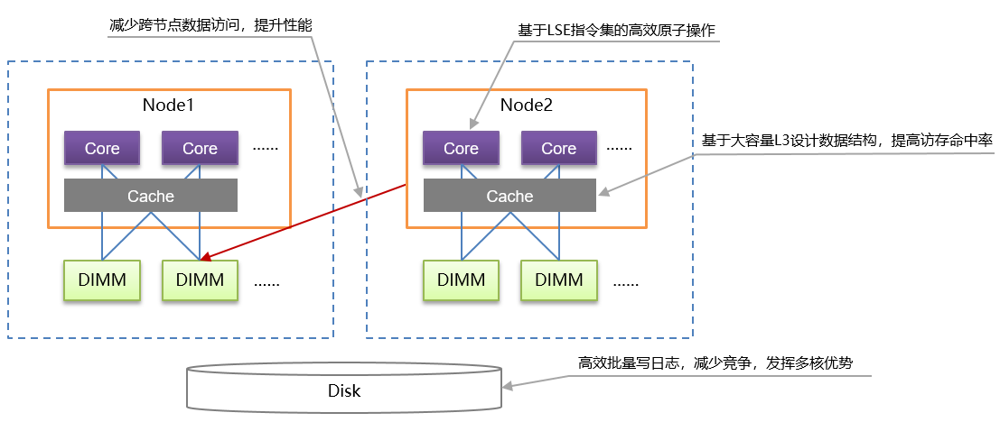

# 高性能

## CBO优化器

openGauss优化器是典型的基于代价的优化 （Cost-Based Optimization，简称CBO）。在这种优化器模型下，数据库根据表的元组数、字段宽度、NULL记录比率、distinct值、MCV值、HB值等表的特征值，以及一定的代价计算模型，计算出每一个执行步骤的不同执行方式的输出元组数和执行代价（cost），进而选出整体执行代价最小/首元组返回代价最小的执行方式进行执行。

CBO优化器能够在众多计划中依据代价选出最高效的执行计划，最大限度的满足客户业务要求。

## 行列混合存储

openGauss支持行存储和列存储两种存储模型，用户可以根据应用场景，建表的时候选择行存储还是列存储表。

一般情况下，如果表的字段比较多（大宽表），查询中涉及到的列不很多的情况下，适合列存储。如果表的字段个数比较少，查询大部分字段，那么选择行存储比较好。

列存储方式如[图1](#zh-cn_concept_0283139011_zh-cn_topic_0242724708_fig4487133722819)所示。

**图 1**  列存储示意图  

在大宽表、数据量比较大的场景中，查询经常关注某些列，行存储引擎查询性能比较差。例如气象局的场景，单表有200\~800个列，查询经常访问10个列，在类似这样的场景下，向量化执行技术和列存储引擎可以极大的提升性能和减少存储空间。

行存表和列存表各有优劣，建议根据实际情况选择。

-   行存表

    默认创建表的类型。数据按行进行存储，即一行数据紧挨着存储。行存表支持完整的增删改查。适用于对数据需要经常更新的场景。

-   列存表

    数据按列进行存储，即一列所有数据紧挨着存储。单列查询IO小，比行存表占用更少的存储空间。适合数据批量插入、更新较少和以查询为主统计分析类的场景。列存表不适合点查询，insert插入单条记录性能差。

行存表和列存表的选择原则如下：

-   更新频繁程度

    数据如果频繁更新，选择行存表。

-   插入频繁程度

    频繁的少量插入，选择行存表。一次插入大批量数据，选择列存表。

-   表的列数

    表的列数很多，选择列存表。

-   查询的列数

    如果每次查询时，只涉及了表的少数（<50%总列数）几个列，选择列存表。

-   压缩率

    列存表比行存表压缩率高。但高压缩率会消耗更多的CPU资源。

## In-place update存储

新增的In-place update存储引擎很好的解决了Append update存储引擎空间膨胀，元组较大的劣势，高效回滚段的设计是In-place update存储引擎的基础。

## Xlog无锁刷新与并行Page回放

**图 2**  Xlog lock less Design  

本特性对WalInsertLock进行优化，利用LSN（Log Sequence Number）及LRC（Log Record Count）记录了每个backend的拷贝进度，取消WalInsertLock机制。在backend将日志拷贝至WalBuffer时，不用对WalInsertLock进行争抢，可直接进行日志拷贝操作。并利用专用的WalWriter写日志线程，不需要backend线程自身来保证xlog的Flush。通过以上优化，取消WalInsertLock争抢及WalWriter专用磁盘写入线程，在保持原有XLog功能不变的基础上，可进一步提升系统性能。针对Ustore Inplace update WAL log写入，Ustore DML operation并行回放分发进行优化。通过利用Prefix和suffix来减少update WAL log的写入。通过把回放线程分多个类型来解决Ustore DML WAL大多都是多页面回放问题。同时把Ustore的数据页面回放分为按照blkno去分发里更好的提高并行回放的并行程度。

## 自适应压缩

当前主流数据库通常都会采用数据压缩技术。数据类型不同，适用于它的压缩算法不同。对于相同类型的数据，其数据特征不同，采用不同的压缩算法达到的效果也不相同。自适用压缩正是从数据类型和数据特征出发，采用相应的压缩算法，实现了良好的压缩比、快速的入库性能以及良好的查询性能。

数据入库和频繁的海量数据查询是用户的主要应用场景。 在数据入库场景中，自适应压缩可以大幅度地减少数据量，成倍提高IO操作效率，将数据簇集存储，从而获得快速的入库性能。当用户进行数据查询时，少量的IO操作和快速的数据解压可以加快数据获取的速率，从而在更短的时间内得到查询结果。

目前，数据库已实现了RLE、DELTA、BYTEPACK/BITPACK、LZ4、ZLIB、LOCAL DICTIONARY等多种压缩算法。数据库支持的数据类型与压缩算法的映射关系如下表所示。

<table><thead align="left"><tr id="zh-cn_concept_0283139011_zh-cn_concept_0238164467_row37135808"><th class="cellrowborder" valign="top" width="30.930000000000007%" id="mcps1.1.8.1.1">
-

</th>
<th class="cellrowborder" valign="top" width="8.250000000000002%" id="mcps1.1.8.1.2">
RLE

</th>
<th class="cellrowborder" valign="top" width="10.31%" id="mcps1.1.8.1.3">
DELTA

</th>
<th class="cellrowborder" valign="top" width="16.490000000000002%" id="mcps1.1.8.1.4">
BITPACK/BYTEPACK

</th>
<th class="cellrowborder" valign="top" width="9.280000000000001%" id="mcps1.1.8.1.5">
LZ4

</th>
<th class="cellrowborder" valign="top" width="10.31%" id="mcps1.1.8.1.6">
ZLIB

</th>
<th class="cellrowborder" valign="top" width="14.430000000000003%" id="mcps1.1.8.1.7">
LOCAL DICTIONARY

</th>
</tr>
</thead>
<tbody><tr id="zh-cn_concept_0283139011_zh-cn_concept_0238164467_row66685840"><td class="cellrowborder" valign="top" width="30.930000000000007%" headers="mcps1.1.8.1.1 ">
Smallint/int/bigint/Oid

Decimal/real/double

Money/time/date/

timestamp

</td>
<td class="cellrowborder" valign="top" width="8.250000000000002%" headers="mcps1.1.8.1.2 ">
√

</td>
<td class="cellrowborder" valign="top" width="10.31%" headers="mcps1.1.8.1.3 ">
√

</td>
<td class="cellrowborder" valign="top" width="16.490000000000002%" headers="mcps1.1.8.1.4 ">
√

</td>
<td class="cellrowborder" valign="top" width="9.280000000000001%" headers="mcps1.1.8.1.5 ">
√

</td>
<td class="cellrowborder" valign="top" width="10.31%" headers="mcps1.1.8.1.6 ">
√

</td>
<td class="cellrowborder" valign="top" width="14.430000000000003%" headers="mcps1.1.8.1.7 ">
-

</td>
</tr>
<tr id="zh-cn_concept_0283139011_zh-cn_concept_0238164467_row32789069"><td class="cellrowborder" valign="top" width="30.930000000000007%" headers="mcps1.1.8.1.1 ">
Tinterval/interval/Time with time zone/

</td>
<td class="cellrowborder" valign="top" width="8.250000000000002%" headers="mcps1.1.8.1.2 ">
-

</td>
<td class="cellrowborder" valign="top" width="10.31%" headers="mcps1.1.8.1.3 ">
-

</td>
<td class="cellrowborder" valign="top" width="16.490000000000002%" headers="mcps1.1.8.1.4 ">
-

</td>
<td class="cellrowborder" valign="top" width="9.280000000000001%" headers="mcps1.1.8.1.5 ">
-

</td>
<td class="cellrowborder" valign="top" width="10.31%" headers="mcps1.1.8.1.6 ">
√

</td>
<td class="cellrowborder" valign="top" width="14.430000000000003%" headers="mcps1.1.8.1.7 ">
-

</td>
</tr>
<tr id="zh-cn_concept_0283139011_zh-cn_concept_0238164467_row13305603"><td class="cellrowborder" valign="top" width="30.930000000000007%" headers="mcps1.1.8.1.1 ">
Numeric/char/varchar/text/nvarchar2

以及其他支持数据类型

</td>
<td class="cellrowborder" valign="top" width="8.250000000000002%" headers="mcps1.1.8.1.2 ">
√

</td>
<td class="cellrowborder" valign="top" width="10.31%" headers="mcps1.1.8.1.3 ">
√

</td>
<td class="cellrowborder" valign="top" width="16.490000000000002%" headers="mcps1.1.8.1.4 ">
√

</td>
<td class="cellrowborder" valign="top" width="9.280000000000001%" headers="mcps1.1.8.1.5 ">
√

</td>
<td class="cellrowborder" valign="top" width="10.31%" headers="mcps1.1.8.1.6 ">
√

</td>
<td class="cellrowborder" valign="top" width="14.430000000000003%" headers="mcps1.1.8.1.7 ">
√

</td>
</tr>
</tbody>
</table>

例如，支持类手机号字符串的大整数压缩、支持numeric类型的大整数压缩、支持对压缩算法进行不同压缩水平的调整。

## 分区

在openGauss系统中，数据分区是在一个实例内部按照用户指定的策略对数据做进一步的水平分表，将表按照指定范围划分为多个数据互不重叠的部分。

对于大多数用户使用场景，分区表和普通表相比具有以下优点：

-   改善查询性能：对分区对象的查询可以仅搜索自己关心的分区，提高检索效率。
-   增强可用性：如果分区表的某个分区出现故障，表在其他分区的数据仍然可用。
-   方便维护：如果分区表的某个分区出现故障，需要修复数据，只修复该分区即可。
-   均衡I/O：可以把不同的分区映射到不同的磁盘以平衡I/O，改善整个系统性能。

目前openGauss数据库支持的分区表为范围分区表、列表分区表、哈希分区表。

-   范围分区表：将数据基于范围映射到每一个分区，这个范围是由创建分区表时指定的分区键决定的。这种分区方式是最为常用的。

    范围分区功能，即根据表的一列或者多列，将要插入表的记录分为若干个范围（这些范围在不同的分区里没有重叠），然后为每个范围创建一个分区，用来存储相应的数据。

-   列表分区表：将数据基于各个分区内包含的键值映射到每一个分区，分区包含的键值在创建分区时指定。

    列表分区功能，即根据表的一列，将要插入表的记录中出现的键值分为若干个列表（这些列表在不同的分区里没有重叠），然后为每个列表创建一个分区，用来存储相应的数据。

-   哈希分区表：将数据通过哈希映射到每一个分区，每一个分区中存储了具有相同哈希值的记录。

    哈希分区功能，即根据表的一列，通过内部哈希算法将要插入表的记录划分到对应的分区中。

用户在CREATE TABLE时增加PARTITION参数，即表示针对此表应用数据分区功能。

用户可以在实际使用中根据需要调整建表时的分区键，使每次查询结果尽可能存储在相同或者最少的分区内（称为“分区剪枝”），通过获取连续I/O大幅度提升查询性能。

实际业务中，时间经常被作为查询对象的过滤条件。因此，用户可考虑选择时间列为分区键，键值范围可根据总数据量、一次查询数据量调整。

## SQL by pass

在典型的OLTP场景中，简单查询占了很大一部分比例。这种查询的特征是只涉及单表和简单表达式的查询，因此为了加速这类查询，提出了SQL-BY-PASS框架，在parse层对这类查询做简单的模式判别后，进入到特殊的执行路径里，跳过经典的执行器执行框架，包括算子的初始化与执行、表达式与投影等经典框架，直接重写一套简洁的执行路径，并且直接调用存储接口，这样可以大大加速简单查询的执行速度。

## 鲲鹏NUMA架构优化

鲲鹏NUMA架构优化图如下。

**图 3**  鲲鹏NUMA架构优化图  

1.  openGauss根据鲲鹏处理器的多核NUMA架构特点，进行针对性一系列NUMA架构相关优化，一方面尽量减少跨核内存访问的时延问题，另一方面充分发挥鲲鹏多核算力优势，所提供的关键技术包括重做日志批插，热点数据NUMA分布，CLog分区等，大幅提升TP系统的处理性能。
2.  openGauss基于鲲鹏芯片所使用的ARMv8.1架构，利用LSE扩展指令集实现高效的原子操作，有效提升CPU利用率，从而提升多线程间同步性能，XLog写入性能等。
3.  openGauss基于鲲鹏芯片提供的更宽的L3缓存cacheline，针对热点数据访问进行优化，有效提高缓存访问命中率，降低Cache缓存一致性维护开销，大幅提升系统整体的数据访问性能。

## 线程池高并发

在OLTP领域中，数据库需要处理大量的客户端连接。因此，高并发场景的处理能力是数据库的重要能力之一。

对于外部连接最简单的处理模式是per-thread-per-connection模式，即来一个用户连接产生一个线程。这个模式好处是架构上处理简单，但是高并发下，由于线程太多，线程切换和数据库轻量级锁区域的冲突过大导致性能急剧下降，使得系统性能（吞吐量）严重下降，无法满足用户性能的SLA。

因此，需要通过线程资源池化复用的技术来解决该问题。线程池技术的整体设计思想是线程资源池化、并且在不同连接之间复用。系统在启动之后会根据当前核数或者用户配置启动固定一批数量的工作线程，一个工作线程会服务一到多个连接session，这样把session和thread进行了解耦。因为工作线程数是固定的，因此在高并发下不会导致线程的频繁切换，而由数据库层来进行session的调度管理。

## 并行查询

openGauss的SMP并行技术是一种利用计算机多核CPU架构来实现多线程并行计算，以充分利用CPU资源来提高查询性能的技术。在复杂查询场景中，单个查询的执行较长，系统并发度低，通过SMP并行执行技术实现算子级的并行，能够有效减少查询执行时间，提升查询性能及资源利用率。SMP并行技术的整体实现思想是对于能够并行的查询算子，将数据分片，启动若干个工作线程分别计算，最后将结果汇总，返回前端。SMP并行执行增加数据交互算子（Stream），实现多个工作线程之间的数据交互，确保查询的正确性，完成整体的查询。

