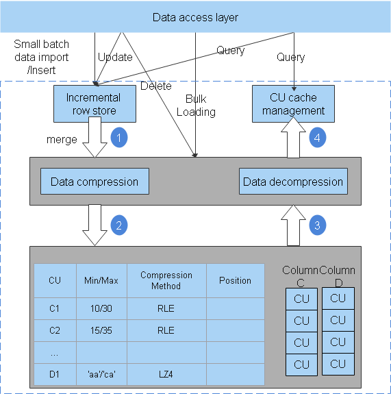

# Hybrid Row-Column Store

## Availability

This feature is available since openGauss 1.0.0.

## Introduction

openGauss supports both row-store and column-store models. Choose a row-store or column-store table as needed.

Column-store is recommended if a table contains many columns \(called a wide table\) but its query involves only a few columns.  [Figure 1](#fig114741818102620)  shows the column-store model. Row store is recommended if a table contains only a few columns and a query involves most of the fields.

**Figure  1**  Column-store  

## Benefits

In a wide table containing a huge amount of data, a query usually only includes certain columns. In this case, the query performance of the row-store engine is poor. For example, a single table containing the data of a meteorological agency has 200 to 800 columns. Among these columns, only 10 are frequently accessed. In this case, a vectorized execution and column-store engine can significantly improve performance by saving storage space.

## Description

Tables are categorized into row-store and column-store tables. Each storage model applies to specific scenarios. Select an appropriate model when creating a table.

-   Row-store table

    Row-store tables are created by default. Data is stored by row. Row-store supports adding, deleting, modifying, and querying data of a complete row. Therefore, this storage model applies to scenarios where data needs to be updated frequently.

-   Column-store table

    Data is stored by column. The I/O of data query in a single column is small, and column-store tables occupy less storage space than row-store tables. This storage model applies to scenarios where data is inserted in batches, less updated, and queried for statistical analysis. The performance of single point query and single record insertion in a column-store table is poor.

-   Selecting a storage model
    -   Update frequency

        If data is frequently updated, use a row-store table.

    -   Data insertion frequency

        If a small amount of data is frequently inserted each time, use a row-store table. If a large amount of data is inserted at a time, use a column-store table.

    -   Number of columns

        If a table is to contain many columns, use a column-store table.

    -   Number of columns to be queried

        If only a small number of columns \(less than 50% of the total\) is queried each time, use a column-store table.

    -   Compression ratio

        The compression ratio of a column-store table is higher than that of a row-store table. High compression ratio consumes more CPU resources.

## Enhancements

None.

## Constraints

None.

## Dependencies

None.

