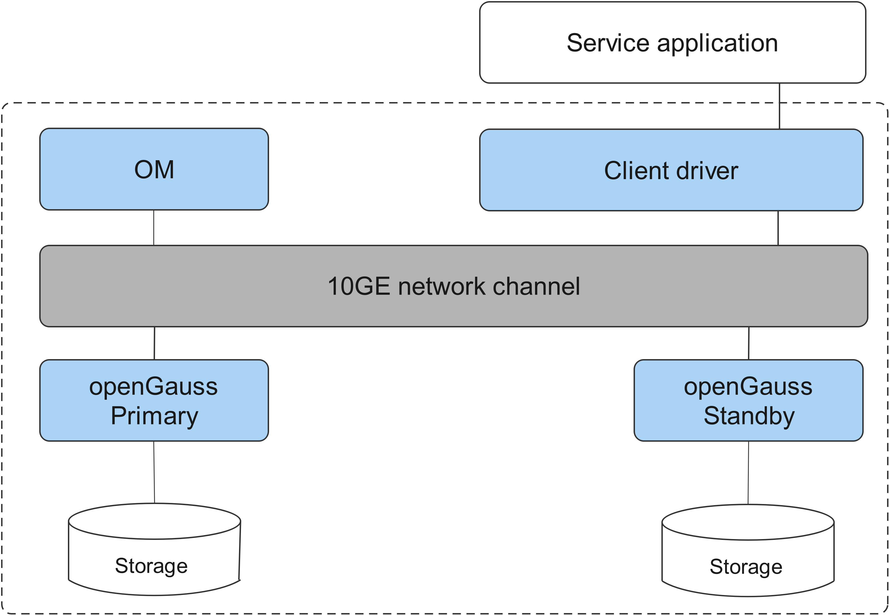

# Software Architecture

openGauss is a standalone system that supports one primary and up to eight standby servers.

Service data is stored on a single physical node, and data access tasks are pushed to service nodes and then executed. The high concurrency of servers enables quick response to data processing. In addition, data can be copied to the standby server through log replication, ensuring high reliability and scalability.

## Software Architecture

[Figure 1](#en-us_topic_0283136530_en-us_topic_0237080634_en-us_topic_0231764167_fig5205420191411)  shows the logical components of openGauss.

**Figure  1**  openGauss logical architecture  

**Table  1**  Architecture description

<table><thead align="left"><tr id="en-us_topic_0283136530_en-us_topic_0237080634_en-us_topic_0231764167_row4411284819151"><th class="cellrowborder" valign="top" width="14.469999999999999%" id="mcps1.2.3.1.1">
Name

</th>
<th class="cellrowborder" valign="top" width="85.53%" id="mcps1.2.3.1.2">
Description

</th>
</tr>
</thead>
<tbody><tr id="en-us_topic_0283136530_en-us_topic_0237080634_en-us_topic_0231764167_row3200216592122"><td class="cellrowborder" valign="top" width="14.469999999999999%" headers="mcps1.2.3.1.1 ">
OM

</td>
<td class="cellrowborder" valign="top" width="85.53%" headers="mcps1.2.3.1.2 ">
Operation Manager (OM) provides management interfaces and tools for routine maintenance and configuration management of the database. This module is optional and is often used in enterprise-level scenarios.

</td>
</tr>
<tr id="en-us_topic_0283136530_en-us_topic_0237080634_en-us_topic_0231764167_row6476976919151"><td class="cellrowborder" valign="top" width="14.469999999999999%" headers="mcps1.2.3.1.1 ">
Client driver

</td>
<td class="cellrowborder" valign="top" width="85.53%" headers="mcps1.2.3.1.2 ">
A client driver receives the access requests from applications, and returns the execution results to the applications. It communicates with openGauss instances, sends application SQL commands, and receives execution results. This module is mandatory. The client program gsql also depends on the driver to connect to the database.

</td>
</tr>
<tr id="en-us_topic_0283136530_en-us_topic_0237080634_en-us_topic_0231764167_row5813821019151"><td class="cellrowborder" valign="top" width="14.469999999999999%" headers="mcps1.2.3.1.1 ">
openGauss (Primary/Standby)

</td>
<td class="cellrowborder" valign="top" width="85.53%" headers="mcps1.2.3.1.2 ">
openGauss primary and standby DNs store service data, execute data queries, and return execution results to the client.

openGauss supports one primary and multiple standbys. You are advised to deploy them on different physical nodes.

The primary/standby mode is optional. openGauss can also be deployed in standalone mode. The primary/standby mode is often used in enterprise-level scenarios.

</td>
</tr>
<tr id="en-us_topic_0283136530_en-us_topic_0237080634_en-us_topic_0231764167_row4354812919183"><td class="cellrowborder" valign="top" width="14.469999999999999%" headers="mcps1.2.3.1.1 ">
Storage

</td>
<td class="cellrowborder" valign="top" width="85.53%" headers="mcps1.2.3.1.2 ">
It functions as the server's local storage resources to store data permanently.

</td>
</tr>
</tbody>
</table>

