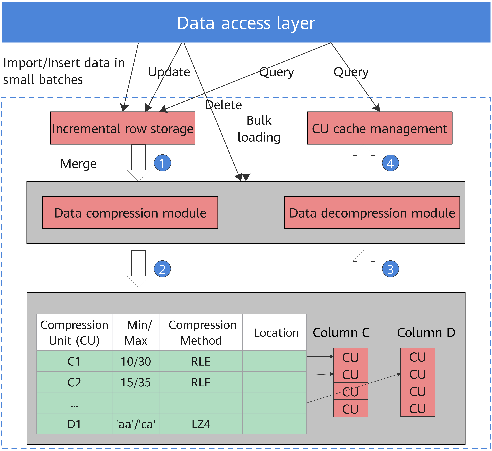

# Enhanced Features

## Data Partitioning

Data partitioning is a general function for most database products. In the openGauss, data is partitioned horizontally with a user-specified policy. This operation splits a table into multiple partitions that are not overlapped.

openGauss supports:

-   Range partitioning. It can divide a record, which is to be inserted into a table, into multiple ranges using one or more columns and create a partition for each range to store data. Partition ranges do not overlap.
-   List partitioning. It divides the key values in the records to be inserted into a table into multiple lists \(the lists do not overlap in different partitions\) based on a column of the table, and then creates a partition for each list to store the corresponding data.
-   Hash partitioning. It uses the internal hash algorithm to divide records to be inserted into a table into partitions based on a column of the table. If you specify the  **PARTITION**  parameter when running the  **CREATE TABLE**  statement, data in the table will be partitioned.

For example,  [Table 1](#en-us_topic_0283136537_en-us_topic_0237080621_en-us_topic_0231764089_en-us_topic_0059777656_t77b9e09809f742f1aaadea05d041bc23)  uses an xDR scenario to describe the benefits provided after data is partitioned based on time fragments.

**Table  1**  Partitioning benefits

<table><thead align="left"><tr id="en-us_topic_0283136537_en-us_topic_0237080621_en-us_topic_0231764089_en-us_topic_0059777656_r136f4522bccc4ec8ac473a07709c0737"><th class="cellrowborder" valign="top" width="50%" id="mcps1.2.3.1.1">
Application Scenario

</th>
<th class="cellrowborder" valign="top" width="50%" id="mcps1.2.3.1.2">
Benefits

</th>
</tr>
</thead>
<tbody><tr id="en-us_topic_0283136537_en-us_topic_0237080621_en-us_topic_0231764089_en-us_topic_0059777656_rdfb6ee78653a46059253db9ed1e35114"><td class="cellrowborder" valign="top" width="50%" headers="mcps1.2.3.1.1 ">
Frequently accessed rows in a table are located in one separate or a few partitions.

</td>
<td class="cellrowborder" valign="top" width="50%" headers="mcps1.2.3.1.2 ">
Improve access performance by significantly reducing search space.

</td>
</tr>
<tr id="en-us_topic_0283136537_en-us_topic_0237080621_en-us_topic_0231764089_en-us_topic_0059777656_r7ddefafe50e44ec0bddd409e82ecafa5"><td class="cellrowborder" valign="top" width="50%" headers="mcps1.2.3.1.1 ">
Most partition records need to be queried or updated.

</td>
<td class="cellrowborder" valign="top" width="50%" headers="mcps1.2.3.1.2 ">
Improve performance because only one partition rather than the whole table needs to be consecutively scanned

</td>
</tr>
<tr id="en-us_topic_0283136537_en-us_topic_0237080621_en-us_topic_0231764089_en-us_topic_0059777656_r569c0fbda7794f0b9d7c2f11ab573eab"><td class="cellrowborder" valign="top" width="50%" headers="mcps1.2.3.1.1 ">
Records that need to be loaded or deleted in batches are located in one separate or a few partitions.

</td>
<td class="cellrowborder" valign="top" width="50%" headers="mcps1.2.3.1.2 ">
Improve processing performance because related partitions can be directly read or deleted. Reduce fragmented deleting operations because records can be deleted in batches.

</td>
</tr>
</tbody>
</table>

Data partitioning provides the following benefits:

-   **Improve manageability:**  Tables and indexes are divided into smaller and more manageable units. In this way, data management can be performed by partitions. Database administrators will perform maintenance in the designated area of the table.
-   **Improve deleting performance:**  Delete an entire partition rather than delete data by row, which is very efficient.

    The  **DROP TABLE**  syntax can be used to delete both ordinary tables and partitioned tables.

-   **Improve query performance:**  Restrict the volume of data to be checked or operated to facilitate query.

    With partition pruning, also known as partition elimination, openGauss filters out unexpected partitions and scans only the remaining partitions. Partition pruning greatly improves query performance.

-   **Partition-wise Join**: Partitioning can also improve the performance of multi-table joins by using a technique known as partition-wise join. Partition-wise joins can be applied when two tables are joined and at least one of these tables is partitioned using a join key. Partition-wise joins break a large join into smaller joins of "identical" datasets. "Identical" here is defined as covering the same set of partitioning key values on both sides of the join, ensuring that only a join of these 'identical' datasets will produce a result without considering other datasets. List partitions and hash partitions are not supported currently.

## Vectorized Executor and Hybrid Row-Column Storage Engine

In a wide table containing a huge amount of data, a query usually only involves certain columns. In this case, the query performance of the row-store engine is poor. For example, a single table containing the data of a meteorological agency has 200 to 800 columns. Among these columns, only 10 are frequently accessed. In this case, the vectorized execution technology and column-store engine can significantly improve performance by saving storage space.

-   Vectorized execution

    [Figure 1](#en-us_topic_0283136537_en-us_topic_0237080624_en-us_topic_0231764690_en-us_topic_0059777898_f9d90aebe179a40759039d0263492489d)  shows a standard iterator module. Control flow travels in the downlink direction \(shown as solid lines in the following figure\) and data flow in the uplink direction \(shown as dotted lines in the following figure\). The upper-layer node invokes the lower-layer node to request data and the lower-layer node only returns one tuple to the upper-layer node at a time.

    By contrast, the vectorized executor returns a batch of tuples at a time, which significantly improves performance using column store.

    **Figure  1**  Vectorized executor  
    

    .png)

-   Hybrid row-column storage engine

    openGauss supports both the row-store and column-store models. Users can choose a row-store or column-store table based on their needs.

    Generally, column store is applicable to OLAP service scenarios \(The range statistics query and batch import operations are frequent. The update, deletion, point query, and point insertion operations are infrequent. The table contains many columns, that is, a wide table. Only a few columns are involved in the query.\) The row store is applicable to OLTP service scenarios \(The query, insert, delete, and update operations are frequent. The range statistics query and batch import operations are infrequent. The number of table columns is small. Most columns are queried.\)

    The hybrid row-column storage engine achieves higher data compression ratio \(column store\), index performance \(column store\), and point update and point query \(row store\) performance, as shown in  [Figure 2](#en-us_topic_0283136537_en-us_topic_0237080624_en-us_topic_0231764690_en-us_topic_0059777898_fbb2af39ce12a419cb437829aaf1cf4fb).

    **Figure  2**  Hybrid row-column storage engine  
    

    

    The restrictions of the column store engine are as follows:

    -   For DDL statements, only CREATE TABLE, DROP TABLE, and TRUNCATE TABLE are supported.

        Partition management using DDL statements \(such as  **ADD PARTITION**,  **DROP PARTITION**,** MERGE PARTITION**,** and EXCHANGE**\) is supported.

        The  **CREATE TABLE LIKE**  statement is supported.

        The  **ALTER TABLE**  statement is partially supported.

        Other DDL statements are not supported.

    -   For DML statements, UPDATE, COPY, BULKLOAD, and DELETE are supported.
    -   Triggers and primary foreign keys are not supported.
    -   Psort index, B-tree index, and GIN index are supported. For details, see "**SQL Reference**  \>  **SQL Syntax**  \>  **CREATE INDEX**" in the  *Developer Guide*.

-   Data compression in column store

    Inactive and earlier data can be compressed to free up space, reducing procurement and O&M costs.

    In openGauss, data can be compressed using delta encoding, dictionary coder, RLE, LZ4, and ZLIB algorithms. The system automatically selects a compression algorithm based on data characteristics. The average compression ratio is 7:1. Compressed data can be directly accessed and is transparent to services. This greatly reduces the preparation time before accessing historical data.

## Fusion Storage Engine

The fusion engine architecture supports the pluggable storage engine architecture. The in-place update storage engine is added. The indexing multiversion supports adding transaction information to indexes. The Xlog lockless update greatly improves the Xlog write efficiency. The parallel page playback improves the playback efficiency of the standby node, and the enterprise-level flashback provides a stable query state for users.

-   In-place update storage engine

    The in-place update storage engine solves the problems of space expansion and large tuples of the Append update storage engine. The design of efficient rollback segments is the basis of the in-place update storage engine.

-   Indexing multiversion

    **Figure  3**  Comparison between UBTree and BTree searching and updating  
    

    UBtree can check multiversion concurrency control \(MVCC\) visibility at the index layer by maintaining version information on tuples on the index page. In addition, the UBtree can independently determine whether the index tuple is dead based on the version information, so that the in-place update engine can implement page-level space cleanup for the data table and index table, and build an independent garbage collection mechanism independent of AutoVacuum.

-   Xlog lockless update

    **Figure  4**  Xlog lockless design  
    

    This feature optimizes the WalInsertLock mechanism by using log sequence numbers \(LSNs\) and log record counts \(LRCs\) to record the copy progress of each backend and canceling the WalInsertLock mechanism. The backend can directly copy logs to the WalBuffer without contending for the WalInsertLock. In addition, a dedicated WALWriter thread is used to write logs, and the backend thread does not need to ensure the Xlog flushing. After the preceding optimization, the WalInsertLock contention and WalWriter dedicated disk write threads are canceled. The system performance can be further improved while the original Xlog function remains unchanged.

-   Parallel page playback

    This feature optimizes the Ustore in-place update WALs and Ustore DML operation parallel playback and distribution. Prefixes and suffixes are used to reduce the update WALs. The playback thread is divided into multiple types to solve the problem that most Ustore DML WALs are replayed on multiple pages. In addition, the Ustore data page playback is distributed based on blkno to improve the degree of parallel playback.

-   Enterprise-class feature flashback

    Flashback is a part of the database recovery technology. It enables the DBA to selectively and efficiently cancel the impact of a committed transaction and restore data from incorrect manual operations. Before the flashback technology is used, the committed database modification can be retrieved only by means of restoring backup and PITR. The restoration takes several minutes or even hours. After the flashback technology is used, it takes only seconds to restore the submitted data before the database is modified. The restoration time is irrelevant to the database size.

    This feature supports the following flashback modes:

    -   Flashback query: You can query a snapshot of a table at a certain time point in the past. This feature can be used to view and logically rebuild damaged data that is accidentally deleted or modified. The flashback query is based on the MVCC mechanism. You can retrieve and query the old version to obtain the data of the specified old version.
    -   Flashback table: You can restore a table to a specific point in time. When only one table or a group of tables are logically damaged instead of the entire database, this feature can be used to quickly restore the table data. Based on the MVCC mechanism, the flashback table deletes incremental data at a specified time point and after the specified time point and retrieves the data deleted at the specified time point and the current time point to restore table-level data.
    -   Flashback drop: You can restore tables that are deleted by mistake and their auxiliary structures, such as indexes and table constraints, from the recycle bin. Flashback drop is based on the recycle bin mechanism. You can restore physical table files recorded in the recycle bin to restore dropped tables.
    -   Flashback truncate: You can restore tables that are truncated by mistake and restore the physical data of the truncated tables and indexes from the recycle bin. Flashback truncate is based on the recycle bin mechanism. You can restore physical table files recorded in the recycle bin to restore truncated tables.

## High Availability \(HA\) Transaction Processing

openGauss manages transactions and guarantees the ACID properties.

openGauss provides a primary/standby HA mechanism to reduce the service interruption time when the primary node is faulty. It protects key user programs and continuously provides external services, minimizing the impact of hardware, software, and human faults on services to ensure service continuity.

**Fault recovery**

Node faults can be recovered and the ACID properties still exist after the recovery. openGauss ensures zero data loss after a node is recovered from a fault or restarted.

**Transaction management**

-   Support transaction blocks. The  **Start Transaction**  command can be used to start a transaction block explicitly.
-   Support single-statement transactions. If explicit startup is not performed, a single statement is processed as a transaction.

## High Concurrency and High Performance

openGauss supports 10,000 concurrent connections through server thread pools. It supports thread nucleophilicity and millions of tpmC using the NUMA-based kernel data structure, manages TB-level large memory buffers through efficient hot and cold data elimination, achieves multi-version access without read/write blocks using CSN-based snapshots, and avoids performance fluctuation caused by full-page writes using incremental checkpoints.

## SQL Self-Diagnosis

To locate performance issues of a query, you can use  **EXPLAIN PERFORMANCE**  to query its execution plan. However, this method produces many logs, requires to modify service logic, and depends on expertise to locate problems. SQL self-diagnosis enables users to locate performance issues more efficiently.

Before running a job, set the GUC parameters  **resource\_track\_level**  and  **resource\_track\_cost**, and obtain the possible performance issues after job execution by checking the related system view. The system view describes the possible causes of performance issues. To optimize low-performance jobs, see "**Performance Tuning **\>  **SQL Tuning**  \>  **Typical SQL Optimization Methods**  \>  **Optimizing SQL Self-Diagnosis**" in the  *Developer Guide*.

SQL self-diagnosis helps users locate and optimize performance issues without affecting operations or modifying service logic.

## Multiple Storage Engines

openGauss is based on the unified transaction mechanism, log system, concurrency control system, metadata information, and cache management, provides Table Access Method API, and supports different storage engines.

Currently, the Astore and Ustore storage engines are supported.

## Primary/Standby Deployment

The primary/standby deployment mode supports synchronous and asynchronous replication. Applications are deployed based on service scenarios. For synchronous replication, one primary node and two standby nodes are deployed. This ensures reliability but affects performance. For asynchronous replication, one primary node and one standby node are deployed. This has little impact on performance, but data may be lost when exceptions occur. openGauss supports automatic recovery of damaged pages. When a page on the primary node is damaged, the damaged page can be automatically recovered on the standby node. Besides, openGauss supports concurrent log recovery on the standby node to minimize the service unavailability time when the primary node is down.

In addition, in primary/standby deployment mode, if the read function of the standby node is enabled, the standby node supports read operations instead of write operations \(such as table creation, data insertion, and data deletion\), reducing the pressure on the primary node.

> **NOTE:** 
>In the current Lite scenario, openGauss does not support deployment with one primary and two standbys.

## Logical Log Replication

In logical replication, the primary database is called the source database, and the standby database is called the target database. The source database parses the WAL file based on the specified logical parsing rules and parses the DML operations into certain logical change information \(standard SQL statements\). The source database sends standard SQL statements to the target database. After receiving the SQL statements, the target database applies them to implement data synchronization. Logical replication involves only DML operations. Logical replication can implement cross-version replication, heterogeneous database replication, dual-write database replication, and table-level replication.

## Automatic WDR Performance Analysis Report

Periodically and proactively analyzes run logs and WDR reports \(which are automatically generated in the background and can be triggered by key indicator thresholds such as the CPU usage, memory usage, and long SQL statement proportions\) and generates reports in HTML and PDF formats. The performance report can be automatically generated. The WDR generates a performance report between two different time points based on the system performance snapshot data at two different time points. The report is used to diagnose database kernel performance faults.

The WDR module consists of the following two components:

-   Snapshot: The performance snapshot can be configured to collect a certain amount of performance data from the kernel at a specified interval and store the data in the user tablespace. Any snapshot can be used as a performance baseline for comparison with other snapshots.
-   WDR Reporter: This tool analyzes the overall system performance based on two snapshots, calculates the changes of more specific performance indicators between the two time points, and generates summarized and detailed performance data.

## Incremental Backup and Restoration \(beta\)

Supports full backup and incremental backup of the database, manages backup data, and views the backup status. Supports combination of incremental backups and deletion of expired backups. The database server dynamically tracks page changes, and when a relational page is updated, the page is marked for backup. The incremental backup function requires that the GUC parameter enable\_cbm\_tracking be enabled to allow the server to track the modification page.

## Point-In-Time Recovery \(PITR\)

PITR uses basic hot backup, write-ahead logs \(WALs\), and archived WALs for backup and recovery. When replaying a WAL record, you can stop at any point in time, so that there is a snapshot of the consistent database at any point in time. That is, you can restore the database to the state at any time since the backup starts. During recovery, you can specify a recovery stop point with a terminal ID \(TID\), time, and license serial number \(LSN\).

## Generated Columns

Generated columns are calculated based on other columns in the table. Column generation is a standard SQL feature. Columns generated by SQL statements are automatically calculated when data is inserted or updated. Similar to common columns, they also occupy storage space.

## Hash Index

openGauss supports the hash index. The performance of long-index column equality query is better than that of B-tree. Lock management is optimized to provide higher concurrency. Xlog protection is provided to prevent data loss.

## State Cryptography Administration \(SCA\) Algorithms

User authentication modes \(gsql, JDBC, and ODBC\) support the SM3 algorithm. APIs are provided for the SM4 algorithm to encrypt and decrypt data, hardening database security.

## Plug-in-based Architecture

The syntax and semantics of the SQL engine are decoupled to implement plug-ins for the syntax and semantics layers of openGauss and decouple the syntax module of heterogeneous databases from the openGauss Kernel. Operator plug-ins are supported, implementing plug-ins for specific operators from plan creation, optimization, to execution.

## Others

-   UPSERT supports subqueries.

    A subquery expression can be used in the UPSERT statement to assign a value, and EXCLUDED can be used in the subquery expression to reference conflicting rows.

-   Column-store tables support unique indexes.

    You can create the unique indexes based on CBTree, the primary keys, and the unique key constraints in a column-store table, preventing duplicate data in a table and extending the application scenarios of column-store tables.

-   The jsonb data type is supported.

    The JSONB data type is supported to efficiently operate JSON data. Various operators and operation functions of JSON and JSONB types are supported. Indexes can be created on JSONB to meet the JSON application and search scenarios.

-   The UCE fault detection and response are supported.

    When a memory UCE error occurs, the SIGBUS signal sent by the system is detected, and the corresponding logs are displayed and the openGauss database state is changed according to the carried physical address. Then, the corresponding database process exits.

-   Monitoring and automatic elimination of unique SQL statements are supported.

    openGauss supports automatic elimination of unique SQL statements. It uses the LRU algorithm to automatically eliminate old unique SQL information based on the update time, ensuring that the latest statistics can be continuously recorded and improving database O&M.

-   The gs\_cgroup load management is supported.

    gs\_cgroup is a load management tool. It creates and manages Cgroups in the database kernel and sets system resource quotas and resource limits to manage the resource usage and priorities of users and services, fully utilizing machine resources.
