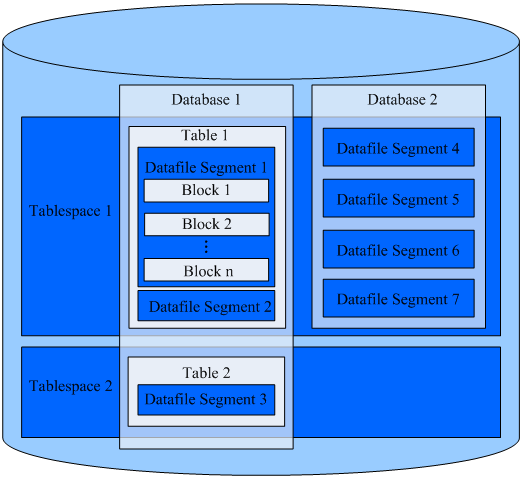

# Database Logical Architecture

Data nodes \(DNs\) in openGauss store data on disks. This section describes the objects on each DN from the logical view and the relationship between these objects.  [Figure 1](#en-us_topic_0283136742_en-us_topic_0237120245_en-us_topic_0059779316_fb2fa3b3cc8824dea95318504e0537913)  shows the database logical structure.

**Figure  1**  Database logical architecture  

> **NOTE:** 
>-   Tablespace: Directory storing physical files of its databases. Multiple tablespaces can coexist, and each of them can contain files belonging to different databases.
>-   Database: A database manages various data objects and is isolated from each other. Objects managed by a database can be distributed to multiple tablespaces.
>-   Datafile Segment: Data file, each of which stores data of only one table. A table containing more than 1 GB of data is stored in multiple datafile segments.
>-   One table belongs to only one database and one tablespace. The datafile segments storing the data of the same table must be in the same tablespace.
>-   Block: Basic unit of database management. Its default size is 8 KB.

