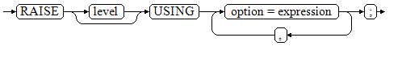
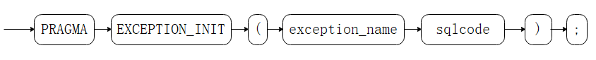

# Debugging<a name="EN-US_TOPIC_0289899819"></a>

## Syntax<a name="en-us_topic_0283137518_en-us_topic_0237122256_en-us_topic_0059777683_s74daa5f17f364352aa643a41e14579e1"></a>

**RAISE**

The syntax of RAISE is as follows:

**Figure  1**  raise\_format::=<a name="en-us_topic_0283137518_en-us_topic_0237122256_en-us_topic_0059777683_f6472e23fec9048d4ba578ba43c6695c1"></a>  


**Figure  2**  raise\_condition::=<a name="en-us_topic_0283137518_en-us_topic_0237122256_en-us_topic_0059777683_f6ac2ae7415ba4112b5c289de87c4d236"></a>  


**Figure  3**  raise\_sqlstate::=<a name="en-us_topic_0283137518_en-us_topic_0237122256_en-us_topic_0059777683_f91407ffec97e43fb870c74c5f81f6c0d"></a>  


**Figure  4**  raise\_option::=<a name="en-us_topic_0283137518_en-us_topic_0237122256_en-us_topic_0059777683_ffb6af581afa249b0b37f8bd8b97c55cd"></a>  


**Figure  5**  raise::=<a name="en-us_topic_0283137518_en-us_topic_0237122256_en-us_topic_0059777683_f6b9d7253ecad413e9ee92ba78199a6b4"></a>  


**Parameter description**:

-   The level option is used to specify the error level, that is,  **DEBUG**,  **LOG**,  **INFO**,  **NOTICE**,  **WARNING**, or  **EXCEPTION**  \(default\).  **EXCEPTION**  throws an error that normally terminates the current transaction and the others only generate information at their levels. The  [log\_min\_messages](logging-time.md#en-us_topic_0283137528_en-us_topic_0237124722_en-us_topic_0059778452_sc6c47ec8cc1b47e28be98dbb24b1b39a)  and  [client\_min\_messages](logging-time.md#en-us_topic_0283137528_en-us_topic_0237124722_en-us_topic_0059778452_s2955da1f1cb24b0aa68ddc77700233e0)  parameters control whether the error messages of specific levels are reported to the client and are written to the server log.
-   **format**: specifies the error message text to be reported, a format string. The format string can be appended with an expression for insertion to the message text. In a format string,  **%**  is replaced by the parameter value attached to format and  **%%**  is used to print  **%**. For example:

    ```
    --v_job_id replaces % in the string.
    RAISE NOTICE 'Calling cs_create_job(%)',v_job_id;
    ```

-   **option = expression**: inserts additional information to an error report. The keyword option can be  **MESSAGE**,  **DETAIL**,  **HINT**, or  **ERRCODE**, and each expression can be any string.
    -   **MESSAGE**: specifies the error message text. This option cannot be used in a  **RAISE**  statement that contains a format character string in front of  **USING**.
    -   **DETAIL**: specifies detailed information of an error.
    -   **HINT**: prints hint information.
    -   **ERRCODE**: designates an error code \(SQLSTATE\) to a report. A condition name or a five-character SQLSTATE error code can be used.

-   **condition\_name**: specifies the condition name corresponding to the error code.
-   **sqlstate**: specifies the error code.

If neither a condition name nor an  **SQLSTATE**  is designated in a  **RAISE EXCEPTION**  command, the  **RAISE EXCEPTION \(P0001\)**  is used by default. If no message text is designated, the condition name or SQLSTATE is used as the message text by default.

> **NOTICE:** 
>-   If the  **SQLSTATE**  designates an error code, the error code is not limited to a defined error code. It can be any error code containing five digits or ASCII uppercase rather than  **00000**. Do not use an error code ended with three zeros because such error codes are category codes and can be captured by the whole category.
>-   In O-compatible mode, SQLCODE is equivalent to SQLSTATE.

> **NOTE:** 
>The syntax described in  [Figure 5](#en-us_topic_0283137518_en-us_topic_0237122256_en-us_topic_0059777683_f6b9d7253ecad413e9ee92ba78199a6b4)  does not append any parameter. This form is used only for the  **EXCEPTION**  statement in a  **BEGIN**  block so that the error can be re-processed.

**EXCEPTION\_INIT**

In O-compatible mode, EXCEPTION\_INIT can be used to define the SQLCODE error code. The syntax is as follows:

**Figure  6**  exception\_init::=<a name="fig1171943461612"></a>  




**Parameter description**:

-   **exception\_name**  indicates the name of the exception declared by the user. The  **EXCEPTION\_INIT**  syntax must follow the declared exception.
-   **sqlcode**  is a customized SQL code, which must be a negative integer ranging from –2147483647 to –1.

> **NOTICE:** 
>When  **EXCEPTION\_INIT**  is used to customize an SQL code, SQLSTATE is equivalent to SQLCODE, and SQLERRM is in the format of  _xxx_**: non-GaussDB Exception**. For example, if the customized SQL code is  **–1**, SQLSTATE is  **–1**  and SQLERRM is  **1: non-GaussDB Exception**.

## Example<a name="en-us_topic_0283137518_en-us_topic_0237122256_en-us_topic_0059777683_s962620630e7349e7b37b844648a267a1"></a>

Display error and hint information when a transaction terminates:

```
CREATE OR REPLACE PROCEDURE proc_raise1(user_id in integer)
AS 
BEGIN 
RAISE EXCEPTION 'Noexistence ID --> %',user_id USING HINT = 'Please check your user ID'; 
END; 
/

call proc_raise1(300011);

-- Execution result:
ERROR:  Noexistence ID --> 300011
HINT:  Please check your user ID
```

Two methods are available for setting  **SQLSTATE**:

```
CREATE OR REPLACE PROCEDURE proc_raise2(user_id in integer)
AS 
BEGIN 
RAISE 'Duplicate user ID: %',user_id USING ERRCODE = 'unique_violation'; 
END; 
/

\set VERBOSITY verbose
call proc_raise2(300011);

-- Execution result:
ERROR:  Duplicate user ID: 300011
SQLSTATE: 23505
```

If the main parameter is a condition name or  **SQLSTATE**, the following applies:

RAISE division\_by\_zero;

RAISE SQLSTATE '22012';

For example:

```
CREATE OR REPLACE PROCEDURE division(div in integer, dividend in integer) 
AS 
DECLARE 
res int; 
    BEGIN 
    IF dividend=0 THEN 
        RAISE division_by_zero; 
        RETURN; 
    ELSE 
        res := div/dividend; 
        RAISE INFO 'division result: %', res;
        RETURN; 
    END IF; 
    END; 
/
call division(3,0);

-- Execution result:
ERROR:  division_by_zero
```

Alternatively:

```
RAISE unique_violation USING MESSAGE = 'Duplicate user ID: ' || user_id;
```

In O-compatible mode, EXCEPTION\_INIT can be used to customize error codes SQLCODE.

```
declare
    deadlock_detected exception;
    pragma exception_init(deadlock_detected, -1);
begin
    if 1 > 0 then
        raise deadlock_detected;
    end if;
exception
    when deadlock_detected then
        raise notice 'sqlcode:%,sqlstate:%,sqlerrm:%',sqlcode,sqlstate,sqlerrm;
end;
/
-- Execution result:
NOTICE:  sqlcode:-1,sqlstate:-1,sqlerrm: 1: non-GaussDB Exception
```

