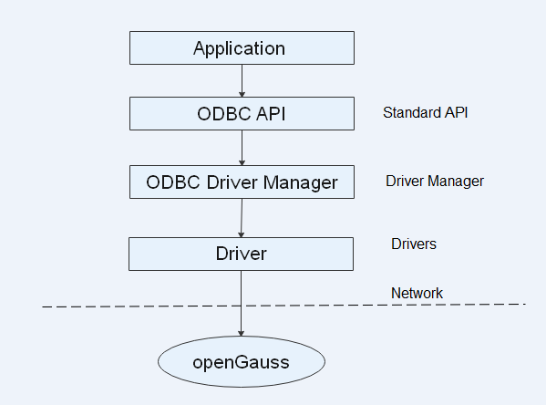

# Development Based on ODBC

Open Database Connectivity \(ODBC\) is a Microsoft API for accessing databases based on the X/OPEN CLI. Applications interact with the database through the APIs provided by ODBC, which enhances their portability, scalability, and maintainability.

[Figure 1](#fig1255101034110)  shows the system structure of ODBC.

**Figure  1**  ODBC system structure  

openGauss supports ODBC 3.5 in the following environments.

**Table  1**  OSs Supported by ODBC

<table><thead align="left"><tr id="en-us_topic_0237120405_en-us_topic_0059778944_re1a7b791067f4bac9743d0de9f2ae8b6"><th class="cellrowborder" valign="top" width="78.64%" id="mcps1.2.3.1.1">
OS

</th>
<th class="cellrowborder" valign="top" width="21.36%" id="mcps1.2.3.1.2">
Platform

</th>
</tr>
</thead>
<tbody><tr id="en-us_topic_0237120405_en-us_topic_0059778944_row246633982912"><td class="cellrowborder" valign="top" width="78.64%" headers="mcps1.2.3.1.1 ">
CentOS 6.4/6.5/6.6/6.7/6.8/6.9/7.0/7.1/7.2/7.3/7.4

</td>
<td class="cellrowborder" align="left" valign="top" width="21.36%" headers="mcps1.2.3.1.2 ">
x86_64

</td>
</tr>
<tr id="en-us_topic_0237120405_row196422068554"><td class="cellrowborder" valign="top" width="78.64%" headers="mcps1.2.3.1.1 ">
CentOS 7.6

</td>
<td class="cellrowborder" valign="top" width="21.36%" headers="mcps1.2.3.1.2 ">
ARM64

</td>
</tr>
<tr id="en-us_topic_0237120405_en-us_topic_0059778944_row1915312215011"><td class="cellrowborder" valign="top" width="78.64%" headers="mcps1.2.3.1.1 ">
EulerOS 2.0 SP2/SP3

</td>
<td class="cellrowborder" align="left" valign="top" width="21.36%" headers="mcps1.2.3.1.2 ">
x86_64

</td>
</tr>
<tr id="en-us_topic_0237120405_row1728515110349"><td class="cellrowborder" valign="top" width="78.64%" headers="mcps1.2.3.1.1 ">
EulerOS 2.0 SP8

</td>
<td class="cellrowborder" valign="top" width="21.36%" headers="mcps1.2.3.1.2 ">
ARM64

</td>
</tr>
</tbody>
</table>

The ODBC Driver Manager running on UNIX or Linux can be unixODBC or iODBC. unixODBC-2.3.0 is used as the component for connecting the database.

Windows has a native ODBC Driver Manager. You can locate  **Data Sources \(ODBC\)**  by choosing  **Control Panel**  \>  **Administrative Tools**.

> **NOTE:**   
>The current database ODBC driver is based on an open-source version and may be incompatible with data types tinyint, smalldatetime, and nvarchar2.  

