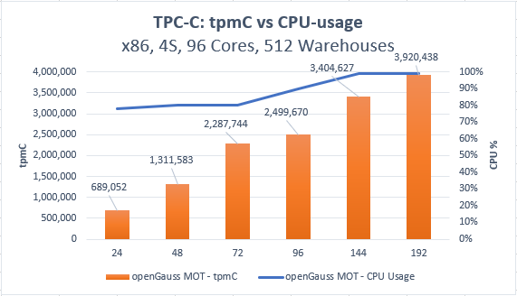

# MOT Scale-up Architecture

To  **scale up**  means to add additional cores to the  _same machine_  in order to add computing power. To scale up refers to the most common traditional form of adding computing power in a machine that has a single pair of controllers and multiple cores. Scale-up architecture is limited by the scalability limits of a machine's controller.

## Technical Requirements

MOT has been designed to achieve the following –

-   **Linear Scale-up –**  MOT delivers a transactional storage engine that utilizes all the cores of a single NUMA architecture server in order to provide near-linear scale-up performance. This means that MOT is targeted to achieve a direct, near-linear relationship between the quantity of cores in a machine and the multiples of performance increase.

> **NOTE:** 
>
>The near-linear scale-up results achieved by MOT significantly outperform all other existing solutions, and come as close as possible to achieving optimal results, which are limited by the physical restrictions and limitations of hardware, such as wires.

-   **No Maximum Number of Cores Limitation –**  MOT does not place any limits on the maximum quantity of cores. This means that MOT is scalable from a single core up to 1000s of cores, with minimal degradation per additional core, even when crossing NUMA socket boundaries.
-   **Extremely High Transactional Throughout –**  MOT delivers a transactional storage engine that can achieve extremely high transactional throughout compared with any other OLTP vendor on the market.
-   **Extremely Low Transactional Latency –**  MOT delivers a transactional storage engine that can reach extremely low transactional latency compared with any other OLTP vendor on the market.
-   **Seamless Integration and Leveraging with/of openGauss –**  MOT integrates its transactional engine in a standard and seamless manner with the openGauss product. In this way, MOT reuses maximum functionality from the openGauss layers that are situated on top of its transactional storage engine.

## Design Principles

To achieve the requirements described above \(especially in an environment with many-cores\), our storage engine's architecture implements the following techniques and strategies –

-   **Data and indexes only reside in memory.**
-   **Data and indexes are not laid out with physical partitions**  \(because these might achieve lower performance for certain types of applications\).
-   Transaction concurrency control is based on** Optimistic Concurrency Control \(OCC\)**  without any centralized contention points. See the  [MOT Concurrency Control Mechanism](mot-concurrency-control-mechanism.md)  section for more information about OCC.
-   **Parallel Redo Logs \(ultimately per core\)**  are used to efficiently avoid a central locking point.
-   **Indexes are lock-free.**  See the  [MOT Indexes](mot-indexes.md)  section for more information about lock-free indexes.
-   **NUMA-awareness memory allocation**  is used to avoid cross-socket access, especially for session lifecycle objects. See the  [NUMA Awareness Allocation and Affinity](numa-awareness-allocation-and-affinity.md)  section for more information about NUMA-awareness.
-   **A customized MOT memory management allocator**  with pre-cached object pools is used to avoid expensive runtime allocation and extra points of contention. This dedicated MOT memory allocator makes memory allocation more efficient by pre-accessing relatively large chunks of memory from the operating system as needed and then divvying it out to the MOT as needed.

## Integration using Foreign Data Wrappers \(FDW\)

MOT complies with and leverages openGauss's standard extensibility mechanism – Foreign Data Wrapper \(FDW\), as shown in the following diagram.

The PostgreSQL Foreign Data Wrapper \(FDW\) feature enables the creation of foreign tables in an MOT database that are proxies for some other data source, such as MySQL, Redis, X3 and so on. When a query is made on a foreign table, the FDW queries the external data source and returns the results, as if they were coming from a table in your database.

openGauss relies on the PostgreSQL Foreign Data Wrappers \(FDW\) and Index support so that SQL is entirely covered, including stored procedures, user defined functions, system functions calls.

**Figure  1**  MOT Architecture  

In the diagram above, the MOT engine is represented in green, while the existing openGauss \(based on Postgres\) components are represented in the top part of this diagram in blue. As you can see, the Foreign Data Wrapper \(FDW\) mediates between the MOT engine and the openGauss components.

**MOT-Related FDW Customizations**

Integrating MOT through FDW enables the reuse of the most upper layer openGauss functionality and therefore significantly shortened MOT's time-to-market without compromising SQL coverage.

However, the original FDW mechanism in openGauss was not designed for storage engine extensions, and therefore lacks the following essential functionalities –

-   Index awareness of foreign tables to be calculated in the query planning phase
-   Complete DDL interfaces
-   Complete transaction lifecycle interfaces
-   Checkpoint interfaces
-   Redo Log interface
-   Recovery interfaces
-   Vacuum interfaces

In order to support all the missing functionalities, the SQL layer and FDW interface layer were extended to provide the necessary infrastructure in order to enable the plugging in of the MOT transactional storage engine.

## Result – Linear Scale-up

The following shows the results achieved by the MOT design principles and implementation described above.

To the best of our knowledge, MOT outperforms all existing industry-grade OLTP databases in transactional throughput of ACID-compliant workloads.

openGauss and MOT have been tested on the following many-core systems with excellent performance scalability results. The tests were performed both on x86 Intel-based and ARM/Kunpeng-based many-core servers. For details about performance evaluation, see  [MOT Performance Benchmarks](mot-performance-benchmarks.md).

Our TPC-C benchmark dated June 2020 tested an openGauss MOT database on a Taishan 2480 server. A 4-socket ARM/Kunpeng server, achieved throughput of 4.8 M tpmC. The following graph shows the near-linear nature of the results, meaning that it shows a significant increase in performance correlating to the increase of the quantity of cores –

**Figure  2**  TPC-C on ARM \(256 Cores\)  
.png "tpc-c-on-arm-(256-cores)")

The following is an additional example that shows a test on an x86-based server also showing CPU utilization.

**Figure  3**  tpmC vs CPU Usage  

The chart shows that MOT demonstrates a significant performance increase correlation with an increase of the quantity of cores. MOT consumes more and more of the CPU correlating to the increase of the quantity of cores. Other industry solutions do not increase and sometimes show slightly degraded performance, which is a well-known problem in the database industry that affects customers' CAPEX and OPEX expenses and operational efficiency.

