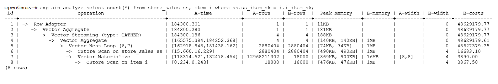

# Optimizing Operators<a name="EN-US_TOPIC_0289900563"></a>

## Background<a name="en-us_topic_0283137632_en-us_topic_0237121527_en-us_topic_0073253804_en-us_topic_0062578364_section1340508119330"></a>

A query statement needs to go through multiple operator procedures to generate the final result. Sometimes, the overall query performance deteriorates due to long execution time of certain operators, which are regarded as bottleneck operators. In this case, you need to execute the  **EXPLAIN ANALYZE**  or  **EXPLAIN PERFORMANCE**  command to view the bottleneck operators, and then perform optimization.

For example, in the following execution process, the execution time of the  **Hashagg**  operator accounts for about 66% \[\(51016-13535\)/56476 ≈ 66%\] of the total execution time. Therefore, the  **Hashagg**  operator is the bottleneck operator for this query. Optimize this operator first.


## Example<a name="en-us_topic_0283137632_en-us_topic_0237121527_en-us_topic_0073253804_en-us_topic_0062578364_section22173273193836"></a>

1. Scan the base table. For queries requiring large volume of data filtering, such as point queries or queries that need range scanning, a full table scan using SeqScan will take a long time. To facilitate scanning, you can create indexes on the condition column and select IndexScan for index scanning.

```
openGauss=#  explain (analyze on, costs off) select * from store_sales where ss_sold_date_sk = 2450944;
 id |             operation          |       A-time        | A-rows | Peak Memory  | A-width
----+--------------------------------+---------------------+--------+--------------+---------
  1 | ->  Streaming (type: GATHER)   | 3666.020            |   3360 | 195KB        |
  2 |    ->  Seq Scan on store_sales | [3594.611,3594.611] |   3360 | [34KB, 34KB] |
(2 rows)

 Predicate Information (identified by plan id) 
-----------------------------------------------
   2 --Seq Scan on store_sales
         Filter: (ss_sold_date_sk = 2450944)
         Rows Removed by Filter: 4968936
```

```
openGauss=#  create index idx on store_sales_row(ss_sold_date_sk);
CREATE INDEX
openGauss=#  explain (analyze on, costs off) select * from store_sales_row where ss_sold_date_sk = 2450944;
 id |                   operation                    |     A-time      | A-rows | Peak Memory  | A-width
----+------------------------------------------------+-----------------+--------+--------------+----------
  1 | ->  Streaming (type: GATHER)                   | 81.524          |   3360 | 195KB        |
  2 |    ->  Index Scan using idx on store_sales_row | [13.352,13.352] |   3360 | [34KB, 34KB] |
(2 rows)
```

In this example, the full table scan filters much data and returns 3360 records. After an index has been created on the  **ss\_sold\_date\_sk**  column, the scanning efficiency is significantly boosted from 3.6s to 13 ms by using  **IndexScan**.

2: If NestLoop is used for joining tables with a large number of rows, the join may take a long time. In the following example, NestLoop takes 181s. If  **enable\_mergejoin**  is set to  **off**  to disable merge join and  **enable\_nestloop**  is set to  **off**  to disable NestLoop so that the optimizer selects hash join, the join takes more than 200 ms.




3. Generally, query performance can be improved by selecting  **HashAgg**. If  **Sort**  and  **GroupAgg**  are used for a large result set, you need to set  **enable\_sort**  to  **off**.  **HashAgg**  consumes less time than  **Sort**  and  **GroupAgg**.


