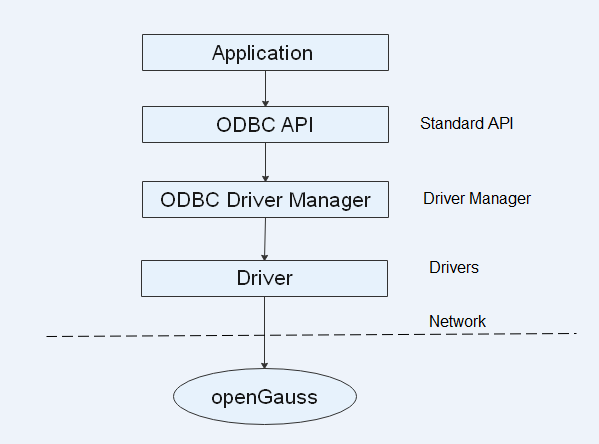

# ODBC<a name="EN-US_TOPIC_0000001210461846"></a>

Open Database Connectivity \(ODBC\) is a Microsoft API for accessing databases based on the X/OPEN CLI. Applications interact with the database through the APIs provided by ODBC, which enhances their portability, scalability, and maintainability.

[Figure 1](#en-us_topic_0283137057_fig1255101034110)  shows the system structure of ODBC.

**Figure  1**  ODBC system structure<a name="en-us_topic_0283137057_fig1255101034110"></a>  


openGauss supports ODBC in the following environments.

**Table  1**  OSs Supported by ODBC

<a name="en-us_topic_0283137057_en-us_topic_0237120405_en-us_topic_0059778944_tcc3bf62098e14505b94680dffaa5940d"></a>
<table><thead align="left"><tr id="en-us_topic_0283137057_en-us_topic_0237120405_en-us_topic_0059778944_re1a7b791067f4bac9743d0de9f2ae8b6"><th class="cellrowborder" valign="top" width="78.64%" id="mcps1.2.3.1.1"><p id="en-us_topic_0283137057_en-us_topic_0237120405_en-us_topic_0059778944_aa56cbe2a342d43b59dfc4501d2fc6172"><a name="en-us_topic_0283137057_en-us_topic_0237120405_en-us_topic_0059778944_aa56cbe2a342d43b59dfc4501d2fc6172"></a><a name="en-us_topic_0283137057_en-us_topic_0237120405_en-us_topic_0059778944_aa56cbe2a342d43b59dfc4501d2fc6172"></a>OS</p>
</th>
<th class="cellrowborder" valign="top" width="21.36%" id="mcps1.2.3.1.2"><p id="en-us_topic_0283137057_en-us_topic_0237120405_en-us_topic_0059778944_a645fcd4314514ac5b4409e804145c94b"><a name="en-us_topic_0283137057_en-us_topic_0237120405_en-us_topic_0059778944_a645fcd4314514ac5b4409e804145c94b"></a><a name="en-us_topic_0283137057_en-us_topic_0237120405_en-us_topic_0059778944_a645fcd4314514ac5b4409e804145c94b"></a>Platform</p>
</th>
</tr>
</thead>
<tbody><tr id="en-us_topic_0283137057_en-us_topic_0237120405_en-us_topic_0059778944_row246633982912"><td class="cellrowborder" valign="top" width="78.64%" headers="mcps1.2.3.1.1 "><p id="en-us_topic_0283137057_en-us_topic_0237120405_en-us_topic_0059778944_p55601140183018"><a name="en-us_topic_0283137057_en-us_topic_0237120405_en-us_topic_0059778944_p55601140183018"></a><a name="en-us_topic_0283137057_en-us_topic_0237120405_en-us_topic_0059778944_p55601140183018"></a>CentOS 6.4/6.5/6.6/6.7/6.8/6.9/7.0/7.1/7.2/7.3/7.4</p>
</td>
<td class="cellrowborder" align="left" valign="top" width="21.36%" headers="mcps1.2.3.1.2 "><p id="en-us_topic_0283137057_en-us_topic_0237120405_en-us_topic_0059778944_p37001047123019"><a name="en-us_topic_0283137057_en-us_topic_0237120405_en-us_topic_0059778944_p37001047123019"></a><a name="en-us_topic_0283137057_en-us_topic_0237120405_en-us_topic_0059778944_p37001047123019"></a>x86_64</p>
</td>
</tr>
<tr id="en-us_topic_0283137057_en-us_topic_0237120405_row196422068554"><td class="cellrowborder" valign="top" width="78.64%" headers="mcps1.2.3.1.1 "><p id="en-us_topic_0283137057_en-us_topic_0237120405_p12643116125510"><a name="en-us_topic_0283137057_en-us_topic_0237120405_p12643116125510"></a><a name="en-us_topic_0283137057_en-us_topic_0237120405_p12643116125510"></a>CentOS 7.6</p>
</td>
<td class="cellrowborder" valign="top" width="21.36%" headers="mcps1.2.3.1.2 "><p id="en-us_topic_0283137057_en-us_topic_0237120405_p864386185519"><a name="en-us_topic_0283137057_en-us_topic_0237120405_p864386185519"></a><a name="en-us_topic_0283137057_en-us_topic_0237120405_p864386185519"></a>ARM64</p>
</td>
</tr>
<tr id="en-us_topic_0283137057_en-us_topic_0237120405_en-us_topic_0059778944_row1915312215011"><td class="cellrowborder" valign="top" width="78.64%" headers="mcps1.2.3.1.1 "><p id="en-us_topic_0283137057_en-us_topic_0237120405_en-us_topic_0059778944_p826525664919"><a name="en-us_topic_0283137057_en-us_topic_0237120405_en-us_topic_0059778944_p826525664919"></a><a name="en-us_topic_0283137057_en-us_topic_0237120405_en-us_topic_0059778944_p826525664919"></a>EulerOS 2.0 SP2/SP3</p>
</td>
<td class="cellrowborder" align="left" valign="top" width="21.36%" headers="mcps1.2.3.1.2 "><p id="en-us_topic_0283137057_en-us_topic_0237120405_en-us_topic_0059778944_p93583610509"><a name="en-us_topic_0283137057_en-us_topic_0237120405_en-us_topic_0059778944_p93583610509"></a><a name="en-us_topic_0283137057_en-us_topic_0237120405_en-us_topic_0059778944_p93583610509"></a>x86_64</p>
</td>
</tr>
<tr id="en-us_topic_0283137057_en-us_topic_0237120405_row1728515110349"><td class="cellrowborder" valign="top" width="78.64%" headers="mcps1.2.3.1.1 "><p id="en-us_topic_0283137057_en-us_topic_0237120405_p1028612118342"><a name="en-us_topic_0283137057_en-us_topic_0237120405_p1028612118342"></a><a name="en-us_topic_0283137057_en-us_topic_0237120405_p1028612118342"></a>EulerOS 2.0 SP8</p>
</td>
<td class="cellrowborder" valign="top" width="21.36%" headers="mcps1.2.3.1.2 "><p id="en-us_topic_0283137057_en-us_topic_0237120405_p162863113411"><a name="en-us_topic_0283137057_en-us_topic_0237120405_p162863113411"></a><a name="en-us_topic_0283137057_en-us_topic_0237120405_p162863113411"></a>ARM64</p>
</td>
</tr>
</tbody>
</table>

## ODBC Packages for the Linux OS<a name="section1352910461980"></a>

Obtain the  **openGauss-\*.\*.0-ODBC.tar.gz**  package from the release package. In the Linux OS, unixODBC header files \(including  **sql.h**  and  **sqlext.h**\) and a library file \(**libodbc.so**\) are required in application development. The header files and library file can be obtained from the  **unixODBC-2.3.0**  installation package.

## Configuring the Data Source<a name="section12696151016177"></a>

The ODBC driver \(**psqlodbcw.so**\) provided by openGauss can be used after it is configured in a data source. To configure a data source, you must configure the  **odbc.ini**  and  **odbcinst.ini**  files on the server. The two files are generated during the unixODBC compilation and installation, and are saved in the  **/usr/local/etc**  directory by default.

1.  Obtain the  **unixODBC-2.3.9**  source code package.

    Download address: http://www.unixodbc.org/download.html

2.  Install unixODBC. If the unixODBC of another version has been installed on the host, overwrite the existing unixODBC.

    Currently, unixODBC-2.2.1 is not supported. For example, to install unixODBC-2.3.0, run the commands below. unixODBC is installed in the  **/usr/local**  directory by default. The data source file is generated in the  **/usr/local/etc**  directory, and the library file is generated in the  **/usr/local/lib**  directory.

    ```
    tar zxvf unixODBC-2.3.9.tar.gz
    cd unixODBC-2.3.9
    # Modify the configure file. (If it does not exist, modify the configure.ac file.) Find LIB_VERSION.
    # Change the value of LIB_VERSION to 1:0:0 to compile a *.so.1 dynamic library with the same dependency on psqlodbcw.so.
    vim configure
    
    ./configure --enable-gui=no # To perform compilation on an ARM server, add the **configure** parameter **--build=aarch64-unknown-linux-gnu**.
    make
    # The installation may require root permissions.
    make install
    ```

3.  Replace the openGauss client driver.
    1.  Decompress  **openGauss-x.x.x-ODBC.tar.gz**  to the  **/usr/local/lib**  directory. The  **psqlodbcw.la**  and  **psqlodbcw.so**  files are obtained.
    2.  Copy the library in the  **lib**  directory obtained after decompressing  **openGauss-x.x.x-ODBC.tar.gz**  to the  **/usr/local/lib**  directory.

4.  Configure a data source.
    1.  Configure the ODBC driver file.

        Add the following content to the  **/xxx/odbc/etc/odbcinst.ini**  file:

        ```
        [GaussMPP]
        Driver64=/xxx/odbc/lib/psqlodbcw.so
        setup=/xxx/odbc/lib/psqlodbcw.so
        ```

        For descriptions of the parameters in the  **odbcinst.ini**  file, see  [Table 2](#en-us_topic_0283136654_en-us_topic_0237120407_en-us_topic_0059778464_td564f21e7c8e458bbd741b09896f5d91).

        **Table  2**  odbcinst.ini configuration parameters

        <a name="en-us_topic_0283136654_en-us_topic_0237120407_en-us_topic_0059778464_td564f21e7c8e458bbd741b09896f5d91"></a>
        <table><thead align="left"><tr id="en-us_topic_0283136654_en-us_topic_0237120407_en-us_topic_0059778464_rb271d7f472844a738954ee76c1e32380"><th class="cellrowborder" valign="top" width="26.340000000000003%" id="mcps1.2.4.1.1"><p id="en-us_topic_0283136654_en-us_topic_0237120407_en-us_topic_0059778464_a28c78abf21ca48ddaee6fd3c34f3397f"><a name="en-us_topic_0283136654_en-us_topic_0237120407_en-us_topic_0059778464_a28c78abf21ca48ddaee6fd3c34f3397f"></a><a name="en-us_topic_0283136654_en-us_topic_0237120407_en-us_topic_0059778464_a28c78abf21ca48ddaee6fd3c34f3397f"></a><strong id="en-us_topic_0283136654_en-us_topic_0237120407_en-us_topic_0059778464_a8250ebf049654830b8253567e694de2e"><a name="en-us_topic_0283136654_en-us_topic_0237120407_en-us_topic_0059778464_a8250ebf049654830b8253567e694de2e"></a><a name="en-us_topic_0283136654_en-us_topic_0237120407_en-us_topic_0059778464_a8250ebf049654830b8253567e694de2e"></a>Parameter</strong></p>
        </th>
        <th class="cellrowborder" valign="top" width="38.89%" id="mcps1.2.4.1.2"><p id="en-us_topic_0283136654_en-us_topic_0237120407_en-us_topic_0059778464_a87fb9ed3f1b140119593e71843494a31"><a name="en-us_topic_0283136654_en-us_topic_0237120407_en-us_topic_0059778464_a87fb9ed3f1b140119593e71843494a31"></a><a name="en-us_topic_0283136654_en-us_topic_0237120407_en-us_topic_0059778464_a87fb9ed3f1b140119593e71843494a31"></a><strong id="en-us_topic_0283136654_en-us_topic_0237120407_en-us_topic_0059778464_ace84b030832948cdafb08ca46b7053d4"><a name="en-us_topic_0283136654_en-us_topic_0237120407_en-us_topic_0059778464_ace84b030832948cdafb08ca46b7053d4"></a><a name="en-us_topic_0283136654_en-us_topic_0237120407_en-us_topic_0059778464_ace84b030832948cdafb08ca46b7053d4"></a>Description</strong></p>
        </th>
        <th class="cellrowborder" valign="top" width="34.77%" id="mcps1.2.4.1.3"><p id="en-us_topic_0283136654_en-us_topic_0237120407_en-us_topic_0059778464_ad3bb948669de4429be3b566882116d70"><a name="en-us_topic_0283136654_en-us_topic_0237120407_en-us_topic_0059778464_ad3bb948669de4429be3b566882116d70"></a><a name="en-us_topic_0283136654_en-us_topic_0237120407_en-us_topic_0059778464_ad3bb948669de4429be3b566882116d70"></a><strong id="en-us_topic_0283136654_en-us_topic_0237120407_en-us_topic_0059778464_en-us_topic_0058965230_b696083205917"><a name="en-us_topic_0283136654_en-us_topic_0237120407_en-us_topic_0059778464_en-us_topic_0058965230_b696083205917"></a><a name="en-us_topic_0283136654_en-us_topic_0237120407_en-us_topic_0059778464_en-us_topic_0058965230_b696083205917"></a>Example</strong></p>
        </th>
        </tr>
        </thead>
        <tbody><tr id="en-us_topic_0283136654_en-us_topic_0237120407_en-us_topic_0059778464_r6bdd431c96eb4f7c85664375766de400"><td class="cellrowborder" valign="top" width="26.340000000000003%" headers="mcps1.2.4.1.1 "><p id="en-us_topic_0283136654_en-us_topic_0237120407_en-us_topic_0059778464_a8e9446f0aa7646fe9538d94cde8e74a3"><a name="en-us_topic_0283136654_en-us_topic_0237120407_en-us_topic_0059778464_a8e9446f0aa7646fe9538d94cde8e74a3"></a><a name="en-us_topic_0283136654_en-us_topic_0237120407_en-us_topic_0059778464_a8e9446f0aa7646fe9538d94cde8e74a3"></a>[DriverName]</p>
        </td>
        <td class="cellrowborder" valign="top" width="38.89%" headers="mcps1.2.4.1.2 "><p id="en-us_topic_0283136654_en-us_topic_0237120407_en-us_topic_0059778464_accc06fd075c040e0884c74e19c4239b2"><a name="en-us_topic_0283136654_en-us_topic_0237120407_en-us_topic_0059778464_accc06fd075c040e0884c74e19c4239b2"></a><a name="en-us_topic_0283136654_en-us_topic_0237120407_en-us_topic_0059778464_accc06fd075c040e0884c74e19c4239b2"></a>Driver name, corresponding to <strong id="b927252817329"><a name="b927252817329"></a><a name="b927252817329"></a>Driver</strong> in DSN.</p>
        </td>
        <td class="cellrowborder" valign="top" width="34.77%" headers="mcps1.2.4.1.3 "><p id="en-us_topic_0283136654_en-us_topic_0237120407_en-us_topic_0059778464_ad04d23410c114609aec4f993de148ce3"><a name="en-us_topic_0283136654_en-us_topic_0237120407_en-us_topic_0059778464_ad04d23410c114609aec4f993de148ce3"></a><a name="en-us_topic_0283136654_en-us_topic_0237120407_en-us_topic_0059778464_ad04d23410c114609aec4f993de148ce3"></a>[DRIVER_N]</p>
        </td>
        </tr>
        <tr id="en-us_topic_0283136654_en-us_topic_0237120407_en-us_topic_0059778464_r1fbbae158f634be28568c80376a63292"><td class="cellrowborder" valign="top" width="26.340000000000003%" headers="mcps1.2.4.1.1 "><p id="en-us_topic_0283136654_en-us_topic_0237120407_en-us_topic_0059778464_a67dcf15c971843c0a09bcb75af898ed8"><a name="en-us_topic_0283136654_en-us_topic_0237120407_en-us_topic_0059778464_a67dcf15c971843c0a09bcb75af898ed8"></a><a name="en-us_topic_0283136654_en-us_topic_0237120407_en-us_topic_0059778464_a67dcf15c971843c0a09bcb75af898ed8"></a>Driver64</p>
        </td>
        <td class="cellrowborder" valign="top" width="38.89%" headers="mcps1.2.4.1.2 "><p id="en-us_topic_0283136654_en-us_topic_0237120407_en-us_topic_0059778464_ac1271d08ff5242849aefc93aed5b0038"><a name="en-us_topic_0283136654_en-us_topic_0237120407_en-us_topic_0059778464_ac1271d08ff5242849aefc93aed5b0038"></a><a name="en-us_topic_0283136654_en-us_topic_0237120407_en-us_topic_0059778464_ac1271d08ff5242849aefc93aed5b0038"></a>Path of the dynamic driver library.</p>
        </td>
        <td class="cellrowborder" valign="top" width="34.77%" headers="mcps1.2.4.1.3 "><p id="en-us_topic_0283136654_en-us_topic_0237120407_en-us_topic_0059778464_a9a7de0f221414c0f97d14fbbf74eb104"><a name="en-us_topic_0283136654_en-us_topic_0237120407_en-us_topic_0059778464_a9a7de0f221414c0f97d14fbbf74eb104"></a><a name="en-us_topic_0283136654_en-us_topic_0237120407_en-us_topic_0059778464_a9a7de0f221414c0f97d14fbbf74eb104"></a>Driver64=/xxx/odbc/lib/psqlodbcw.so</p>
        </td>
        </tr>
        <tr id="en-us_topic_0283136654_en-us_topic_0237120407_en-us_topic_0059778464_r4e8ad74343a849f8a7224716cf20ab57"><td class="cellrowborder" valign="top" width="26.340000000000003%" headers="mcps1.2.4.1.1 "><p id="en-us_topic_0283136654_en-us_topic_0237120407_en-us_topic_0059778464_a18a35a0225c14a2e9aecdc72084f1418"><a name="en-us_topic_0283136654_en-us_topic_0237120407_en-us_topic_0059778464_a18a35a0225c14a2e9aecdc72084f1418"></a><a name="en-us_topic_0283136654_en-us_topic_0237120407_en-us_topic_0059778464_a18a35a0225c14a2e9aecdc72084f1418"></a>setup</p>
        </td>
        <td class="cellrowborder" valign="top" width="38.89%" headers="mcps1.2.4.1.2 "><p id="en-us_topic_0283136654_en-us_topic_0237120407_en-us_topic_0059778464_a6eecb8f4cf064448a14a46be8e243daa"><a name="en-us_topic_0283136654_en-us_topic_0237120407_en-us_topic_0059778464_a6eecb8f4cf064448a14a46be8e243daa"></a><a name="en-us_topic_0283136654_en-us_topic_0237120407_en-us_topic_0059778464_a6eecb8f4cf064448a14a46be8e243daa"></a>Driver installation path, which is the same as the dynamic library path in Driver64.</p>
        </td>
        <td class="cellrowborder" valign="top" width="34.77%" headers="mcps1.2.4.1.3 "><p id="en-us_topic_0283136654_en-us_topic_0237120407_en-us_topic_0059778464_a7f838d6444df4566853f51533341401b"><a name="en-us_topic_0283136654_en-us_topic_0237120407_en-us_topic_0059778464_a7f838d6444df4566853f51533341401b"></a><a name="en-us_topic_0283136654_en-us_topic_0237120407_en-us_topic_0059778464_a7f838d6444df4566853f51533341401b"></a>setup=/xxx/odbc/lib/psqlodbcw.so</p>
        </td>
        </tr>
        </tbody>
        </table>

    2.  Configure the data source file.

        Add the following content to the  **/usr/local/etc/odbc.ini**  file:

        ```
        [MPPODBC]
        Driver=GaussMPP
        Servername=10.145.130.26 (IP address of the server where the database resides)
        Database=postgres  (Database name)
        Username=omm  (Database username)
        Password=    (User password of the database)
        Port=8000 (Listening port of the database)
        Sslmode=allow
        ```

        For descriptions of the parameters in the  **odbc.ini**  file, see  [Table 3](#en-us_topic_0283136654_en-us_topic_0237120407_en-us_topic_0059778464_t55845a6555f2454297b64ce47ad3d648).

        **Table  3**  odbc.ini configuration parameters

        <a name="en-us_topic_0283136654_en-us_topic_0237120407_en-us_topic_0059778464_t55845a6555f2454297b64ce47ad3d648"></a>
        <table><thead align="left"><tr id="en-us_topic_0283136654_en-us_topic_0237120407_en-us_topic_0059778464_r670b13dddd7d4cf1803d4fb238347e4f"><th class="cellrowborder" valign="top" width="30.570000000000004%" id="mcps1.2.4.1.1"><p id="en-us_topic_0283136654_en-us_topic_0237120407_en-us_topic_0059778464_acaf03818449f45a3baf67b847f258487"><a name="en-us_topic_0283136654_en-us_topic_0237120407_en-us_topic_0059778464_acaf03818449f45a3baf67b847f258487"></a><a name="en-us_topic_0283136654_en-us_topic_0237120407_en-us_topic_0059778464_acaf03818449f45a3baf67b847f258487"></a><strong id="en-us_topic_0283136654_en-us_topic_0237120407_en-us_topic_0059778464_aa54a5590250c4c4ea04282a93d622454"><a name="en-us_topic_0283136654_en-us_topic_0237120407_en-us_topic_0059778464_aa54a5590250c4c4ea04282a93d622454"></a><a name="en-us_topic_0283136654_en-us_topic_0237120407_en-us_topic_0059778464_aa54a5590250c4c4ea04282a93d622454"></a>Parameter</strong></p>
        </th>
        <th class="cellrowborder" valign="top" width="33.37%" id="mcps1.2.4.1.2"><p id="en-us_topic_0283136654_en-us_topic_0237120407_en-us_topic_0059778464_a2996382cc39847f79d6e271605212118"><a name="en-us_topic_0283136654_en-us_topic_0237120407_en-us_topic_0059778464_a2996382cc39847f79d6e271605212118"></a><a name="en-us_topic_0283136654_en-us_topic_0237120407_en-us_topic_0059778464_a2996382cc39847f79d6e271605212118"></a><strong id="en-us_topic_0283136654_en-us_topic_0237120407_en-us_topic_0059778464_en-us_topic_0058965230_b522969821213"><a name="en-us_topic_0283136654_en-us_topic_0237120407_en-us_topic_0059778464_en-us_topic_0058965230_b522969821213"></a><a name="en-us_topic_0283136654_en-us_topic_0237120407_en-us_topic_0059778464_en-us_topic_0058965230_b522969821213"></a>Description</strong></p>
        </th>
        <th class="cellrowborder" valign="top" width="36.059999999999995%" id="mcps1.2.4.1.3"><p id="en-us_topic_0283136654_en-us_topic_0237120407_en-us_topic_0059778464_a5962444038ea45f4a049a6659667dbf3"><a name="en-us_topic_0283136654_en-us_topic_0237120407_en-us_topic_0059778464_a5962444038ea45f4a049a6659667dbf3"></a><a name="en-us_topic_0283136654_en-us_topic_0237120407_en-us_topic_0059778464_a5962444038ea45f4a049a6659667dbf3"></a><strong id="b9171193893420"><a name="b9171193893420"></a><a name="b9171193893420"></a>Example</strong></p>
        </th>
        </tr>
        </thead>
        <tbody><tr id="en-us_topic_0283136654_en-us_topic_0237120407_en-us_topic_0059778464_r0fb190e64b064cd5bdc4ba6a85b7f5b5"><td class="cellrowborder" valign="top" width="30.570000000000004%" headers="mcps1.2.4.1.1 "><p id="en-us_topic_0283136654_en-us_topic_0237120407_en-us_topic_0059778464_a5a22b1b502ce470daf0e150a5a22478d"><a name="en-us_topic_0283136654_en-us_topic_0237120407_en-us_topic_0059778464_a5a22b1b502ce470daf0e150a5a22478d"></a><a name="en-us_topic_0283136654_en-us_topic_0237120407_en-us_topic_0059778464_a5a22b1b502ce470daf0e150a5a22478d"></a>[DSN]</p>
        </td>
        <td class="cellrowborder" valign="top" width="33.37%" headers="mcps1.2.4.1.2 "><p id="en-us_topic_0283136654_en-us_topic_0237120407_en-us_topic_0059778464_a4d0e13e5a4974e95ba02b65f0880769a"><a name="en-us_topic_0283136654_en-us_topic_0237120407_en-us_topic_0059778464_a4d0e13e5a4974e95ba02b65f0880769a"></a><a name="en-us_topic_0283136654_en-us_topic_0237120407_en-us_topic_0059778464_a4d0e13e5a4974e95ba02b65f0880769a"></a>Data source name.</p>
        </td>
        <td class="cellrowborder" valign="top" width="36.059999999999995%" headers="mcps1.2.4.1.3 "><p id="en-us_topic_0283136654_en-us_topic_0237120407_en-us_topic_0059778464_en-us_topic_0058965230_p574463221213"><a name="en-us_topic_0283136654_en-us_topic_0237120407_en-us_topic_0059778464_en-us_topic_0058965230_p574463221213"></a><a name="en-us_topic_0283136654_en-us_topic_0237120407_en-us_topic_0059778464_en-us_topic_0058965230_p574463221213"></a>[MPPODBC]</p>
        </td>
        </tr>
        <tr id="en-us_topic_0283136654_en-us_topic_0237120407_en-us_topic_0059778464_r6594d9c7f185417cbb0362b69ff20436"><td class="cellrowborder" valign="top" width="30.570000000000004%" headers="mcps1.2.4.1.1 "><p id="en-us_topic_0283136654_en-us_topic_0237120407_en-us_topic_0059778464_a11f2651489984caaa3ba6c5a69b3bb4a"><a name="en-us_topic_0283136654_en-us_topic_0237120407_en-us_topic_0059778464_a11f2651489984caaa3ba6c5a69b3bb4a"></a><a name="en-us_topic_0283136654_en-us_topic_0237120407_en-us_topic_0059778464_a11f2651489984caaa3ba6c5a69b3bb4a"></a>Driver</p>
        </td>
        <td class="cellrowborder" valign="top" width="33.37%" headers="mcps1.2.4.1.2 "><p id="en-us_topic_0283136654_en-us_topic_0237120407_en-us_topic_0059778464_a45cdb983d7eb4357bfe4363048fff41b"><a name="en-us_topic_0283136654_en-us_topic_0237120407_en-us_topic_0059778464_a45cdb983d7eb4357bfe4363048fff41b"></a><a name="en-us_topic_0283136654_en-us_topic_0237120407_en-us_topic_0059778464_a45cdb983d7eb4357bfe4363048fff41b"></a>Driver name, corresponding to <strong id="b17394550193414"><a name="b17394550193414"></a><a name="b17394550193414"></a>DriverName</strong> in <strong id="b166354336751813"><a name="b166354336751813"></a><a name="b166354336751813"></a>odbcinst.ini</strong>.</p>
        </td>
        <td class="cellrowborder" valign="top" width="36.059999999999995%" headers="mcps1.2.4.1.3 "><p id="en-us_topic_0283136654_en-us_topic_0237120407_en-us_topic_0059778464_en-us_topic_0058965230_p587420421213"><a name="en-us_topic_0283136654_en-us_topic_0237120407_en-us_topic_0059778464_en-us_topic_0058965230_p587420421213"></a><a name="en-us_topic_0283136654_en-us_topic_0237120407_en-us_topic_0059778464_en-us_topic_0058965230_p587420421213"></a>Driver=DRIVER_N</p>
        </td>
        </tr>
        <tr id="en-us_topic_0283136654_en-us_topic_0237120407_en-us_topic_0059778464_ra2915c8c5cb64c31bca0b7cc97b3cb94"><td class="cellrowborder" valign="top" width="30.570000000000004%" headers="mcps1.2.4.1.1 "><p id="en-us_topic_0283136654_en-us_topic_0237120407_en-us_topic_0059778464_acda586c1c3074516b55eca79e45c96b9"><a name="en-us_topic_0283136654_en-us_topic_0237120407_en-us_topic_0059778464_acda586c1c3074516b55eca79e45c96b9"></a><a name="en-us_topic_0283136654_en-us_topic_0237120407_en-us_topic_0059778464_acda586c1c3074516b55eca79e45c96b9"></a>Servername</p>
        </td>
        <td class="cellrowborder" valign="top" width="33.37%" headers="mcps1.2.4.1.2 "><p id="en-us_topic_0283136654_en-us_topic_0237120407_en-us_topic_0059778464_af9844951ac5f42cf95b1e70a86da25ed"><a name="en-us_topic_0283136654_en-us_topic_0237120407_en-us_topic_0059778464_af9844951ac5f42cf95b1e70a86da25ed"></a><a name="en-us_topic_0283136654_en-us_topic_0237120407_en-us_topic_0059778464_af9844951ac5f42cf95b1e70a86da25ed"></a>Server IP address.</p>
        </td>
        <td class="cellrowborder" valign="top" width="36.059999999999995%" headers="mcps1.2.4.1.3 "><p id="en-us_topic_0283136654_en-us_topic_0237120407_en-us_topic_0059778464_en-us_topic_0058965230_p705535321213"><a name="en-us_topic_0283136654_en-us_topic_0237120407_en-us_topic_0059778464_en-us_topic_0058965230_p705535321213"></a><a name="en-us_topic_0283136654_en-us_topic_0237120407_en-us_topic_0059778464_en-us_topic_0058965230_p705535321213"></a>Servername=10.145.130.26</p>
        </td>
        </tr>
        <tr id="en-us_topic_0283136654_en-us_topic_0237120407_en-us_topic_0059778464_rf57dbfc6a8404544a5844f08783f6892"><td class="cellrowborder" valign="top" width="30.570000000000004%" headers="mcps1.2.4.1.1 "><p id="en-us_topic_0283136654_en-us_topic_0237120407_en-us_topic_0059778464_a628bf205a20d43c69555a3424981c8f0"><a name="en-us_topic_0283136654_en-us_topic_0237120407_en-us_topic_0059778464_a628bf205a20d43c69555a3424981c8f0"></a><a name="en-us_topic_0283136654_en-us_topic_0237120407_en-us_topic_0059778464_a628bf205a20d43c69555a3424981c8f0"></a>Database</p>
        </td>
        <td class="cellrowborder" valign="top" width="33.37%" headers="mcps1.2.4.1.2 "><p id="en-us_topic_0283136654_en-us_topic_0237120407_en-us_topic_0059778464_a7dacdbe0757946ed85ca6e897a443cab"><a name="en-us_topic_0283136654_en-us_topic_0237120407_en-us_topic_0059778464_a7dacdbe0757946ed85ca6e897a443cab"></a><a name="en-us_topic_0283136654_en-us_topic_0237120407_en-us_topic_0059778464_a7dacdbe0757946ed85ca6e897a443cab"></a>Name of the database to connect to.</p>
        </td>
        <td class="cellrowborder" valign="top" width="36.059999999999995%" headers="mcps1.2.4.1.3 "><p id="en-us_topic_0283136654_en-us_topic_0237120407_en-us_topic_0059778464_a44897122ba4248fb8fdb9ff9235f04f2"><a name="en-us_topic_0283136654_en-us_topic_0237120407_en-us_topic_0059778464_a44897122ba4248fb8fdb9ff9235f04f2"></a><a name="en-us_topic_0283136654_en-us_topic_0237120407_en-us_topic_0059778464_a44897122ba4248fb8fdb9ff9235f04f2"></a>Database=postgres</p>
        </td>
        </tr>
        <tr id="en-us_topic_0283136654_en-us_topic_0237120407_en-us_topic_0059778464_r478d8852e4294c01bb48cbaaf087df82"><td class="cellrowborder" valign="top" width="30.570000000000004%" headers="mcps1.2.4.1.1 "><p id="en-us_topic_0283136654_en-us_topic_0237120407_en-us_topic_0059778464_en-us_topic_0058965230_p237028621213"><a name="en-us_topic_0283136654_en-us_topic_0237120407_en-us_topic_0059778464_en-us_topic_0058965230_p237028621213"></a><a name="en-us_topic_0283136654_en-us_topic_0237120407_en-us_topic_0059778464_en-us_topic_0058965230_p237028621213"></a>Username</p>
        </td>
        <td class="cellrowborder" valign="top" width="33.37%" headers="mcps1.2.4.1.2 "><p id="en-us_topic_0283136654_en-us_topic_0237120407_en-us_topic_0059778464_a6d4497d8c6134705a3971992b73eb9a8"><a name="en-us_topic_0283136654_en-us_topic_0237120407_en-us_topic_0059778464_a6d4497d8c6134705a3971992b73eb9a8"></a><a name="en-us_topic_0283136654_en-us_topic_0237120407_en-us_topic_0059778464_a6d4497d8c6134705a3971992b73eb9a8"></a>Database username.</p>
        </td>
        <td class="cellrowborder" valign="top" width="36.059999999999995%" headers="mcps1.2.4.1.3 "><p id="en-us_topic_0283136654_en-us_topic_0237120407_en-us_topic_0059778464_a4c244a359e2341a9a25a634898bef6f8"><a name="en-us_topic_0283136654_en-us_topic_0237120407_en-us_topic_0059778464_a4c244a359e2341a9a25a634898bef6f8"></a><a name="en-us_topic_0283136654_en-us_topic_0237120407_en-us_topic_0059778464_a4c244a359e2341a9a25a634898bef6f8"></a>Username=<span id="en-us_topic_0283136654_en-us_topic_0237120407_text542984584919"><a name="en-us_topic_0283136654_en-us_topic_0237120407_text542984584919"></a><a name="en-us_topic_0283136654_en-us_topic_0237120407_text542984584919"></a>omm</span></p>
        </td>
        </tr>
        <tr id="en-us_topic_0283136654_en-us_topic_0237120407_en-us_topic_0059778464_r373830e4fd9c4f8997fcdde5596099f4"><td class="cellrowborder" valign="top" width="30.570000000000004%" headers="mcps1.2.4.1.1 "><p id="en-us_topic_0283136654_en-us_topic_0237120407_en-us_topic_0059778464_a72415586711142e39d29a2d8b664ff2b"><a name="en-us_topic_0283136654_en-us_topic_0237120407_en-us_topic_0059778464_a72415586711142e39d29a2d8b664ff2b"></a><a name="en-us_topic_0283136654_en-us_topic_0237120407_en-us_topic_0059778464_a72415586711142e39d29a2d8b664ff2b"></a>Password</p>
        </td>
        <td class="cellrowborder" valign="top" width="33.37%" headers="mcps1.2.4.1.2 "><p id="en-us_topic_0283136654_en-us_topic_0237120407_en-us_topic_0059778464_ab0a86a7c047f420081b1c5d1c57ca78f"><a name="en-us_topic_0283136654_en-us_topic_0237120407_en-us_topic_0059778464_ab0a86a7c047f420081b1c5d1c57ca78f"></a><a name="en-us_topic_0283136654_en-us_topic_0237120407_en-us_topic_0059778464_ab0a86a7c047f420081b1c5d1c57ca78f"></a>Database user password.</p>
        </td>
        <td class="cellrowborder" valign="top" width="36.059999999999995%" headers="mcps1.2.4.1.3 "><p id="en-us_topic_0283136654_en-us_topic_0237120407_en-us_topic_0059778464_a7803bcaba1324e56913a1a44d46f692e"><a name="en-us_topic_0283136654_en-us_topic_0237120407_en-us_topic_0059778464_a7803bcaba1324e56913a1a44d46f692e"></a><a name="en-us_topic_0283136654_en-us_topic_0237120407_en-us_topic_0059778464_a7803bcaba1324e56913a1a44d46f692e"></a>Password=</p>
        <div class="note" id="en-us_topic_0283136654_en-us_topic_0237120407_en-us_topic_0059778464_note66001755162217"><a name="en-us_topic_0283136654_en-us_topic_0237120407_en-us_topic_0059778464_note66001755162217"></a><a name="en-us_topic_0283136654_en-us_topic_0237120407_en-us_topic_0059778464_note66001755162217"></a><span class="notetitle"> NOTE: </span><div class="notebody"><p id="en-us_topic_0283136654_en-us_topic_0237120407_en-us_topic_0059778464_p57144884162217"><a name="en-us_topic_0283136654_en-us_topic_0237120407_en-us_topic_0059778464_p57144884162217"></a><a name="en-us_topic_0283136654_en-us_topic_0237120407_en-us_topic_0059778464_p57144884162217"></a>After a user establishes a connection, the ODBC driver automatically clears their password stored in memory.</p>
        <p id="en-us_topic_0283136654_en-us_topic_0237120407_en-us_topic_0059778464_p33900700162423"><a name="en-us_topic_0283136654_en-us_topic_0237120407_en-us_topic_0059778464_p33900700162423"></a><a name="en-us_topic_0283136654_en-us_topic_0237120407_en-us_topic_0059778464_p33900700162423"></a>However, if this parameter is configured, UnixODBC will cache data source files, which may cause the password to be stored in the memory for a long time.</p>
        <p id="en-us_topic_0283136654_en-us_topic_0237120407_en-us_topic_0059778464_p9307938162511"><a name="en-us_topic_0283136654_en-us_topic_0237120407_en-us_topic_0059778464_p9307938162511"></a><a name="en-us_topic_0283136654_en-us_topic_0237120407_en-us_topic_0059778464_p9307938162511"></a>When you connect to an application, you are advised to send your password through an API instead of writing it in a data source configuration file. After the connection is established, immediately clear the memory segment where your password is stored.</p>
        </div></div>
        </td>
        </tr>
        <tr id="en-us_topic_0283136654_en-us_topic_0237120407_en-us_topic_0059778464_r99417f5e349c4f7b89331e2a2d56200d"><td class="cellrowborder" valign="top" width="30.570000000000004%" headers="mcps1.2.4.1.1 "><p id="en-us_topic_0283136654_en-us_topic_0237120407_en-us_topic_0059778464_af23b15858fa341b6b849ff850e10a6cb"><a name="en-us_topic_0283136654_en-us_topic_0237120407_en-us_topic_0059778464_af23b15858fa341b6b849ff850e10a6cb"></a><a name="en-us_topic_0283136654_en-us_topic_0237120407_en-us_topic_0059778464_af23b15858fa341b6b849ff850e10a6cb"></a>Port</p>
        </td>
        <td class="cellrowborder" valign="top" width="33.37%" headers="mcps1.2.4.1.2 "><p id="en-us_topic_0283136654_en-us_topic_0237120407_en-us_topic_0059778464_a86b34375cfcd4cdd84b070cc42d847c3"><a name="en-us_topic_0283136654_en-us_topic_0237120407_en-us_topic_0059778464_a86b34375cfcd4cdd84b070cc42d847c3"></a><a name="en-us_topic_0283136654_en-us_topic_0237120407_en-us_topic_0059778464_a86b34375cfcd4cdd84b070cc42d847c3"></a>Port number of the server.</p>
        </td>
        <td class="cellrowborder" valign="top" width="36.059999999999995%" headers="mcps1.2.4.1.3 "><p id="en-us_topic_0283136654_en-us_topic_0237120407_en-us_topic_0059778464_ab47ede062bc6450097f576df5aa63442"><a name="en-us_topic_0283136654_en-us_topic_0237120407_en-us_topic_0059778464_ab47ede062bc6450097f576df5aa63442"></a><a name="en-us_topic_0283136654_en-us_topic_0237120407_en-us_topic_0059778464_ab47ede062bc6450097f576df5aa63442"></a>Port=<span id="en-us_topic_0283136654_en-us_topic_0237120407_text64689595438"><a name="en-us_topic_0283136654_en-us_topic_0237120407_text64689595438"></a><a name="en-us_topic_0283136654_en-us_topic_0237120407_text64689595438"></a>8000</span></p>
        </td>
        </tr>
        <tr id="en-us_topic_0283136654_en-us_topic_0237120407_en-us_topic_0059778464_rd27aa89b945d4ac6b33000b6df5c916e"><td class="cellrowborder" valign="top" width="30.570000000000004%" headers="mcps1.2.4.1.1 "><p id="en-us_topic_0283136654_en-us_topic_0237120407_en-us_topic_0059778464_a5f7c150a5b5f471fa60adba4fd913dd4"><a name="en-us_topic_0283136654_en-us_topic_0237120407_en-us_topic_0059778464_a5f7c150a5b5f471fa60adba4fd913dd4"></a><a name="en-us_topic_0283136654_en-us_topic_0237120407_en-us_topic_0059778464_a5f7c150a5b5f471fa60adba4fd913dd4"></a>Sslmode</p>
        </td>
        <td class="cellrowborder" valign="top" width="33.37%" headers="mcps1.2.4.1.2 "><p id="en-us_topic_0283136654_en-us_topic_0237120407_en-us_topic_0059778464_en-us_topic_0058965230_p462272821213"><a name="en-us_topic_0283136654_en-us_topic_0237120407_en-us_topic_0059778464_en-us_topic_0058965230_p462272821213"></a><a name="en-us_topic_0283136654_en-us_topic_0237120407_en-us_topic_0059778464_en-us_topic_0058965230_p462272821213"></a>Whether to enable SSL.</p>
        </td>
        <td class="cellrowborder" valign="top" width="36.059999999999995%" headers="mcps1.2.4.1.3 "><p id="en-us_topic_0283136654_en-us_topic_0237120407_en-us_topic_0059778464_a53d9561f3715460d9f7b8a022292214c"><a name="en-us_topic_0283136654_en-us_topic_0237120407_en-us_topic_0059778464_a53d9561f3715460d9f7b8a022292214c"></a><a name="en-us_topic_0283136654_en-us_topic_0237120407_en-us_topic_0059778464_a53d9561f3715460d9f7b8a022292214c"></a>Sslmode=allow</p>
        </td>
        </tr>
        <tr id="row115681541336"><td class="cellrowborder" valign="top" width="30.570000000000004%" headers="mcps1.2.4.1.1 "><p id="p65681140317"><a name="p65681140317"></a><a name="p65681140317"></a>Debug</p>
        </td>
        <td class="cellrowborder" valign="top" width="33.37%" headers="mcps1.2.4.1.2 "><p id="p195681543312"><a name="p195681543312"></a><a name="p195681543312"></a>If this parameter is set to <strong id="b93198327251813"><a name="b93198327251813"></a><a name="b93198327251813"></a>1</strong>, the <strong id="b48170745151813"><a name="b48170745151813"></a><a name="b48170745151813"></a>mylog</strong> file of the PostgreSQL ODBC driver will be printed. The directory generated for storing logs is <strong id="b57657957451813"><a name="b57657957451813"></a><a name="b57657957451813"></a>/tmp/</strong>. If this parameter is set to <strong id="b195874953651813"><a name="b195874953651813"></a><a name="b195874953651813"></a>0</strong>, no directory is generated.</p>
        </td>
        <td class="cellrowborder" valign="top" width="36.059999999999995%" headers="mcps1.2.4.1.3 "><p id="p205681419316"><a name="p205681419316"></a><a name="p205681419316"></a>Debug=1</p>
        </td>
        </tr>
        <tr id="en-us_topic_0283136654_en-us_topic_0237120407_row3180734193610"><td class="cellrowborder" valign="top" width="30.570000000000004%" headers="mcps1.2.4.1.1 "><p id="en-us_topic_0283136654_en-us_topic_0237120407_p91811034123617"><a name="en-us_topic_0283136654_en-us_topic_0237120407_p91811034123617"></a><a name="en-us_topic_0283136654_en-us_topic_0237120407_p91811034123617"></a>UseServerSidePrepare</p>
        </td>
        <td class="cellrowborder" valign="top" width="33.37%" headers="mcps1.2.4.1.2 "><p id="en-us_topic_0283136654_en-us_topic_0237120407_p31811134143616"><a name="en-us_topic_0283136654_en-us_topic_0237120407_p31811134143616"></a><a name="en-us_topic_0283136654_en-us_topic_0237120407_p31811134143616"></a>Whether to enable the extended query protocol for the database.</p>
        <p id="en-us_topic_0283136654_en-us_topic_0237120407_p19694134018382"><a name="en-us_topic_0283136654_en-us_topic_0237120407_p19694134018382"></a><a name="en-us_topic_0283136654_en-us_topic_0237120407_p19694134018382"></a>The value can be <strong id="b146000159351813"><a name="b146000159351813"></a><a name="b146000159351813"></a>0</strong> or <strong id="b205455909951813"><a name="b205455909951813"></a><a name="b205455909951813"></a>1</strong>. The default value is <strong id="b101140369751813"><a name="b101140369751813"></a><a name="b101140369751813"></a>1</strong>, indicating that the extended query protocol is enabled.</p>
        </td>
        <td class="cellrowborder" valign="top" width="36.059999999999995%" headers="mcps1.2.4.1.3 "><p id="en-us_topic_0283136654_en-us_topic_0237120407_p318163493616"><a name="en-us_topic_0283136654_en-us_topic_0237120407_p318163493616"></a><a name="en-us_topic_0283136654_en-us_topic_0237120407_p318163493616"></a>UseServerSidePrepare=1</p>
        </td>
        </tr>
        <tr id="en-us_topic_0283136654_en-us_topic_0237120407_row18741310143913"><td class="cellrowborder" valign="top" width="30.570000000000004%" headers="mcps1.2.4.1.1 "><p id="en-us_topic_0283136654_en-us_topic_0237120407_p674191083916"><a name="en-us_topic_0283136654_en-us_topic_0237120407_p674191083916"></a><a name="en-us_topic_0283136654_en-us_topic_0237120407_p674191083916"></a>UseBatchProtocol</p>
        </td>
        <td class="cellrowborder" valign="top" width="33.37%" headers="mcps1.2.4.1.2 "><p id="en-us_topic_0283136654_en-us_topic_0237120407_p67427101397"><a name="en-us_topic_0283136654_en-us_topic_0237120407_p67427101397"></a><a name="en-us_topic_0283136654_en-us_topic_0237120407_p67427101397"></a>Whether to enable the batch query protocol. If it is enabled, DML performance can be improved. The value can be <strong id="b164178169651813"><a name="b164178169651813"></a><a name="b164178169651813"></a>0</strong> or <strong id="b36614868151813"><a name="b36614868151813"></a><a name="b36614868151813"></a>1</strong>. The default value is <strong id="b121953751551813"><a name="b121953751551813"></a><a name="b121953751551813"></a>1</strong>.</p>
        <p id="en-us_topic_0283136654_en-us_topic_0237120407_p20481152784010"><a name="en-us_topic_0283136654_en-us_topic_0237120407_p20481152784010"></a><a name="en-us_topic_0283136654_en-us_topic_0237120407_p20481152784010"></a>If this parameter is set to <strong id="b141648000851813"><a name="b141648000851813"></a><a name="b141648000851813"></a>0</strong>, the batch query protocol is disabled (mainly for communication with earlier database versions).</p>
        <p id="en-us_topic_0283136654_en-us_topic_0237120407_p05131728428"><a name="en-us_topic_0283136654_en-us_topic_0237120407_p05131728428"></a><a name="en-us_topic_0283136654_en-us_topic_0237120407_p05131728428"></a>If this parameter is set to <strong id="b124231751451813"><a name="b124231751451813"></a><a name="b124231751451813"></a>1</strong> and <strong id="b45445355951813"><a name="b45445355951813"></a><a name="b45445355951813"></a>support_batch_bind</strong> is set to <strong id="b182385720851813"><a name="b182385720851813"></a><a name="b182385720851813"></a>on</strong>, the batch query protocol is enabled.</p>
        </td>
        <td class="cellrowborder" valign="top" width="36.059999999999995%" headers="mcps1.2.4.1.3 "><p id="en-us_topic_0283136654_en-us_topic_0237120407_p7742101083917"><a name="en-us_topic_0283136654_en-us_topic_0237120407_p7742101083917"></a><a name="en-us_topic_0283136654_en-us_topic_0237120407_p7742101083917"></a>UseBatchProtocol=1</p>
        </td>
        </tr>
        <tr id="row3254426236"><td class="cellrowborder" valign="top" width="30.570000000000004%" headers="mcps1.2.4.1.1 "><p id="p725410268312"><a name="p725410268312"></a><a name="p725410268312"></a>ForExtensionConnector</p>
        </td>
        <td class="cellrowborder" valign="top" width="33.37%" headers="mcps1.2.4.1.2 "><p id="p1125417269313"><a name="p1125417269313"></a><a name="p1125417269313"></a>This parameter specifies whether the savepoint is sent.</p>
        </td>
        <td class="cellrowborder" valign="top" width="36.059999999999995%" headers="mcps1.2.4.1.3 "><p id="p32542266317"><a name="p32542266317"></a><a name="p32542266317"></a>ForExtensionConnector=1</p>
        </td>
        </tr>
        <tr id="row102684231731"><td class="cellrowborder" valign="top" width="30.570000000000004%" headers="mcps1.2.4.1.1 "><p id="p6268223637"><a name="p6268223637"></a><a name="p6268223637"></a>UnamedPrepStmtThreshold</p>
        </td>
        <td class="cellrowborder" valign="top" width="33.37%" headers="mcps1.2.4.1.2 "><p id="p42681323638"><a name="p42681323638"></a><a name="p42681323638"></a>Each time <strong id="b61593082151813"><a name="b61593082151813"></a><a name="b61593082151813"></a>SQLFreeHandle</strong> is invoked to release statements, ODBC sends a <strong id="b106888305651813"><a name="b106888305651813"></a><a name="b106888305651813"></a>Deallocate plan_name</strong> statement to the server. A large number of such statements exist in the service. To reduce the number of the statements to be sent, <strong id="b97465067751813"><a name="b97465067751813"></a><a name="b97465067751813"></a>stmt-&gt;plan_name</strong> is left empty so that the database can identify them as unnamed statements. This parameter is added to control the threshold for unnamed statements.</p>
        </td>
        <td class="cellrowborder" valign="top" width="36.059999999999995%" headers="mcps1.2.4.1.3 "><p id="p0268142318319"><a name="p0268142318319"></a><a name="p0268142318319"></a>UnamedPrepStmtThreshold=100</p>
        </td>
        </tr>
        <tr id="en-us_topic_0283136654_en-us_topic_0237120407_row9789524184113"><td class="cellrowborder" valign="top" width="30.570000000000004%" headers="mcps1.2.4.1.1 "><p id="en-us_topic_0283136654_en-us_topic_0237120407_p182621858115514"><a name="en-us_topic_0283136654_en-us_topic_0237120407_p182621858115514"></a><a name="en-us_topic_0283136654_en-us_topic_0237120407_p182621858115514"></a>ConnectionExtraInfo</p>
        </td>
        <td class="cellrowborder" valign="top" width="33.37%" headers="mcps1.2.4.1.2 "><p id="en-us_topic_0283136654_en-us_topic_0237120407_p1626217582555"><a name="en-us_topic_0283136654_en-us_topic_0237120407_p1626217582555"></a><a name="en-us_topic_0283136654_en-us_topic_0237120407_p1626217582555"></a>Whether to display the driver deployment path and process owner in the <strong id="b10435307851813"><a name="b10435307851813"></a><a name="b10435307851813"></a>connection_info</strong> GUC parameter.</p>
        </td>
        <td class="cellrowborder" valign="top" width="36.059999999999995%" headers="mcps1.2.4.1.3 "><p id="en-us_topic_0283136654_en-us_topic_0237120407_p42621158185515"><a name="en-us_topic_0283136654_en-us_topic_0237120407_p42621158185515"></a><a name="en-us_topic_0283136654_en-us_topic_0237120407_p42621158185515"></a>ConnectionExtraInfo=1</p>
        <div class="note" id="en-us_topic_0283136654_en-us_topic_0237120407_note523613263217"><a name="en-us_topic_0283136654_en-us_topic_0237120407_note523613263217"></a><a name="en-us_topic_0283136654_en-us_topic_0237120407_note523613263217"></a><span class="notetitle"> NOTE: </span><div class="notebody"><p id="en-us_topic_0283136654_en-us_topic_0237120407_p17978439306"><a name="en-us_topic_0283136654_en-us_topic_0237120407_p17978439306"></a><a name="en-us_topic_0283136654_en-us_topic_0237120407_p17978439306"></a>The default value is <strong id="b76239485151813"><a name="b76239485151813"></a><a name="b76239485151813"></a>0</strong>. If this parameter is set to <strong id="b189553037951813"><a name="b189553037951813"></a><a name="b189553037951813"></a>1</strong>, the ODBC driver reports the driver deployment path and process owner to the database and displays the information in the <strong id="b113906347451813"><a name="b113906347451813"></a><a name="b113906347451813"></a>connection_info</strong> parameter. In this case, you can query the information from <strong id="b16882545174215"><a name="b16882545174215"></a><a name="b16882545174215"></a>PG_STAT_ACTIVITY</strong>.</p>
        </div></div>
        </td>
        </tr>
        <tr id="row151219194419"><td class="cellrowborder" valign="top" width="30.570000000000004%" headers="mcps1.2.4.1.1 "><p id="p1812118199417"><a name="p1812118199417"></a><a name="p1812118199417"></a>BoolAsChar</p>
        </td>
        <td class="cellrowborder" valign="top" width="33.37%" headers="mcps1.2.4.1.2 "><p id="p9121419947"><a name="p9121419947"></a><a name="p9121419947"></a>If this parameter is set to <strong id="b94459976151813"><a name="b94459976151813"></a><a name="b94459976151813"></a>Yes</strong>, the Boolean value is mapped to the SQL_CHAR type. If this parameter is not set, the value is mapped to the SQL_BIT type.</p>
        </td>
        <td class="cellrowborder" valign="top" width="36.059999999999995%" headers="mcps1.2.4.1.3 "><p id="p1712114193419"><a name="p1712114193419"></a><a name="p1712114193419"></a>BoolsAsChar = Yes</p>
        </td>
        </tr>
        <tr id="row1295715161419"><td class="cellrowborder" valign="top" width="30.570000000000004%" headers="mcps1.2.4.1.1 "><p id="p195720163417"><a name="p195720163417"></a><a name="p195720163417"></a>RowVersioning</p>
        </td>
        <td class="cellrowborder" valign="top" width="33.37%" headers="mcps1.2.4.1.2 "><p id="p9957191615418"><a name="p9957191615418"></a><a name="p9957191615418"></a>When an attempt is made to update a row of data, setting this parameter to <strong id="b137518841651813"><a name="b137518841651813"></a><a name="b137518841651813"></a>Yes</strong> allows the application to detect whether the data has been modified by other users.</p>
        </td>
        <td class="cellrowborder" valign="top" width="36.059999999999995%" headers="mcps1.2.4.1.3 "><p id="p2095791613416"><a name="p2095791613416"></a><a name="p2095791613416"></a>RowVersioning=Yes</p>
        </td>
        </tr>
        <tr id="row1429519142045"><td class="cellrowborder" valign="top" width="30.570000000000004%" headers="mcps1.2.4.1.1 "><p id="p12954141643"><a name="p12954141643"></a><a name="p12954141643"></a>ShowSystemTables</p>
        </td>
        <td class="cellrowborder" valign="top" width="33.37%" headers="mcps1.2.4.1.2 "><p id="p529511142411"><a name="p529511142411"></a><a name="p529511142411"></a>By default, the driver regards the system catalog as a common SQL table.</p>
        </td>
        <td class="cellrowborder" valign="top" width="36.059999999999995%" headers="mcps1.2.4.1.3 "><p id="p162955148416"><a name="p162955148416"></a><a name="p162955148416"></a>ShowSystemTables=Yes</p>
        </td>
        </tr>
        </tbody>
        </table>

        The valid values of  **Sslmode**  are as follows:

        **Table  4**  Sslmode options

        <a name="en-us_topic_0283136654_en-us_topic_0237120407_en-us_topic_0059778464_table22136585143846"></a>
        <table><thead align="left"><tr id="en-us_topic_0283136654_en-us_topic_0237120407_en-us_topic_0059778464_row7964795143846"><th class="cellrowborder" valign="top" width="14.87%" id="mcps1.2.4.1.1"><p id="en-us_topic_0283136654_en-us_topic_0237120407_en-us_topic_0059778464_p44475740143856"><a name="en-us_topic_0283136654_en-us_topic_0237120407_en-us_topic_0059778464_p44475740143856"></a><a name="en-us_topic_0283136654_en-us_topic_0237120407_en-us_topic_0059778464_p44475740143856"></a>Sslmode</p>
        </th>
        <th class="cellrowborder" valign="top" width="18.87%" id="mcps1.2.4.1.2"><p id="en-us_topic_0283136654_en-us_topic_0237120407_en-us_topic_0059778464_p45765196143856"><a name="en-us_topic_0283136654_en-us_topic_0237120407_en-us_topic_0059778464_p45765196143856"></a><a name="en-us_topic_0283136654_en-us_topic_0237120407_en-us_topic_0059778464_p45765196143856"></a>Whether SSL Encryption Is Enabled</p>
        </th>
        <th class="cellrowborder" valign="top" width="66.25999999999999%" id="mcps1.2.4.1.3"><p id="en-us_topic_0283136654_en-us_topic_0237120407_en-us_topic_0059778464_p15993376143856"><a name="en-us_topic_0283136654_en-us_topic_0237120407_en-us_topic_0059778464_p15993376143856"></a><a name="en-us_topic_0283136654_en-us_topic_0237120407_en-us_topic_0059778464_p15993376143856"></a>Description</p>
        </th>
        </tr>
        </thead>
        <tbody><tr id="en-us_topic_0283136654_en-us_topic_0237120407_en-us_topic_0059778464_row4599577143846"><td class="cellrowborder" valign="top" width="14.87%" headers="mcps1.2.4.1.1 "><p id="en-us_topic_0283136654_en-us_topic_0237120407_en-us_topic_0059778464_p41388182143856"><a name="en-us_topic_0283136654_en-us_topic_0237120407_en-us_topic_0059778464_p41388182143856"></a><a name="en-us_topic_0283136654_en-us_topic_0237120407_en-us_topic_0059778464_p41388182143856"></a>disable</p>
        </td>
        <td class="cellrowborder" valign="top" width="18.87%" headers="mcps1.2.4.1.2 "><p id="en-us_topic_0283136654_en-us_topic_0237120407_en-us_topic_0059778464_p64108423143856"><a name="en-us_topic_0283136654_en-us_topic_0237120407_en-us_topic_0059778464_p64108423143856"></a><a name="en-us_topic_0283136654_en-us_topic_0237120407_en-us_topic_0059778464_p64108423143856"></a>No</p>
        </td>
        <td class="cellrowborder" valign="top" width="66.25999999999999%" headers="mcps1.2.4.1.3 "><p id="en-us_topic_0283136654_en-us_topic_0237120407_en-us_topic_0059778464_p25399806143856"><a name="en-us_topic_0283136654_en-us_topic_0237120407_en-us_topic_0059778464_p25399806143856"></a><a name="en-us_topic_0283136654_en-us_topic_0237120407_en-us_topic_0059778464_p25399806143856"></a>SSL connection is not enabled.</p>
        </td>
        </tr>
        <tr id="en-us_topic_0283136654_en-us_topic_0237120407_en-us_topic_0059778464_row10527338143846"><td class="cellrowborder" valign="top" width="14.87%" headers="mcps1.2.4.1.1 "><p id="en-us_topic_0283136654_en-us_topic_0237120407_en-us_topic_0059778464_p61520998143856"><a name="en-us_topic_0283136654_en-us_topic_0237120407_en-us_topic_0059778464_p61520998143856"></a><a name="en-us_topic_0283136654_en-us_topic_0237120407_en-us_topic_0059778464_p61520998143856"></a>allow</p>
        </td>
        <td class="cellrowborder" valign="top" width="18.87%" headers="mcps1.2.4.1.2 "><p id="en-us_topic_0283136654_en-us_topic_0237120407_en-us_topic_0059778464_p17144918143856"><a name="en-us_topic_0283136654_en-us_topic_0237120407_en-us_topic_0059778464_p17144918143856"></a><a name="en-us_topic_0283136654_en-us_topic_0237120407_en-us_topic_0059778464_p17144918143856"></a>Possible</p>
        </td>
        <td class="cellrowborder" valign="top" width="66.25999999999999%" headers="mcps1.2.4.1.3 "><p id="en-us_topic_0283136654_en-us_topic_0237120407_en-us_topic_0059778464_p46561127143856"><a name="en-us_topic_0283136654_en-us_topic_0237120407_en-us_topic_0059778464_p46561127143856"></a><a name="en-us_topic_0283136654_en-us_topic_0237120407_en-us_topic_0059778464_p46561127143856"></a>If the database server requires SSL connection, SSL connection can be enabled. However, authenticity of the database server will not be verified.</p>
        </td>
        </tr>
        <tr id="en-us_topic_0283136654_en-us_topic_0237120407_en-us_topic_0059778464_row19876694143846"><td class="cellrowborder" valign="top" width="14.87%" headers="mcps1.2.4.1.1 "><p id="en-us_topic_0283136654_en-us_topic_0237120407_en-us_topic_0059778464_p53085640143856"><a name="en-us_topic_0283136654_en-us_topic_0237120407_en-us_topic_0059778464_p53085640143856"></a><a name="en-us_topic_0283136654_en-us_topic_0237120407_en-us_topic_0059778464_p53085640143856"></a>prefer</p>
        </td>
        <td class="cellrowborder" valign="top" width="18.87%" headers="mcps1.2.4.1.2 "><p id="en-us_topic_0283136654_en-us_topic_0237120407_en-us_topic_0059778464_p4969569143856"><a name="en-us_topic_0283136654_en-us_topic_0237120407_en-us_topic_0059778464_p4969569143856"></a><a name="en-us_topic_0283136654_en-us_topic_0237120407_en-us_topic_0059778464_p4969569143856"></a>Possible</p>
        </td>
        <td class="cellrowborder" valign="top" width="66.25999999999999%" headers="mcps1.2.4.1.3 "><p id="en-us_topic_0283136654_en-us_topic_0237120407_en-us_topic_0059778464_p66990807143856"><a name="en-us_topic_0283136654_en-us_topic_0237120407_en-us_topic_0059778464_p66990807143856"></a><a name="en-us_topic_0283136654_en-us_topic_0237120407_en-us_topic_0059778464_p66990807143856"></a>If the database supports SSL connection, SSL connection is recommended. However, authenticity of the database server will not be verified.</p>
        </td>
        </tr>
        <tr id="en-us_topic_0283136654_en-us_topic_0237120407_en-us_topic_0059778464_row43737844143846"><td class="cellrowborder" valign="top" width="14.87%" headers="mcps1.2.4.1.1 "><p id="en-us_topic_0283136654_en-us_topic_0237120407_en-us_topic_0059778464_p48154267143856"><a name="en-us_topic_0283136654_en-us_topic_0237120407_en-us_topic_0059778464_p48154267143856"></a><a name="en-us_topic_0283136654_en-us_topic_0237120407_en-us_topic_0059778464_p48154267143856"></a>require</p>
        </td>
        <td class="cellrowborder" valign="top" width="18.87%" headers="mcps1.2.4.1.2 "><p id="en-us_topic_0283136654_en-us_topic_0237120407_en-us_topic_0059778464_p8181559143856"><a name="en-us_topic_0283136654_en-us_topic_0237120407_en-us_topic_0059778464_p8181559143856"></a><a name="en-us_topic_0283136654_en-us_topic_0237120407_en-us_topic_0059778464_p8181559143856"></a>Yes</p>
        </td>
        <td class="cellrowborder" valign="top" width="66.25999999999999%" headers="mcps1.2.4.1.3 "><p id="en-us_topic_0283136654_en-us_topic_0237120407_en-us_topic_0059778464_p58726539143856"><a name="en-us_topic_0283136654_en-us_topic_0237120407_en-us_topic_0059778464_p58726539143856"></a><a name="en-us_topic_0283136654_en-us_topic_0237120407_en-us_topic_0059778464_p58726539143856"></a>SSL connection is required and data is encrypted. However, authenticity of the database server will not be verified.</p>
        </td>
        </tr>
        <tr id="en-us_topic_0283136654_en-us_topic_0237120407_en-us_topic_0059778464_row38957604143846"><td class="cellrowborder" valign="top" width="14.87%" headers="mcps1.2.4.1.1 "><p id="en-us_topic_0283136654_en-us_topic_0237120407_en-us_topic_0059778464_p63301190143856"><a name="en-us_topic_0283136654_en-us_topic_0237120407_en-us_topic_0059778464_p63301190143856"></a><a name="en-us_topic_0283136654_en-us_topic_0237120407_en-us_topic_0059778464_p63301190143856"></a>verify-ca</p>
        </td>
        <td class="cellrowborder" valign="top" width="18.87%" headers="mcps1.2.4.1.2 "><p id="en-us_topic_0283136654_en-us_topic_0237120407_en-us_topic_0059778464_p27122799143856"><a name="en-us_topic_0283136654_en-us_topic_0237120407_en-us_topic_0059778464_p27122799143856"></a><a name="en-us_topic_0283136654_en-us_topic_0237120407_en-us_topic_0059778464_p27122799143856"></a>Yes</p>
        </td>
        <td class="cellrowborder" valign="top" width="66.25999999999999%" headers="mcps1.2.4.1.3 "><p id="en-us_topic_0283136654_en-us_topic_0237120407_en-us_topic_0059778464_p49463116143856"><a name="en-us_topic_0283136654_en-us_topic_0237120407_en-us_topic_0059778464_p49463116143856"></a><a name="en-us_topic_0283136654_en-us_topic_0237120407_en-us_topic_0059778464_p49463116143856"></a>SSL connection is required and whether the database has a trusted certificate will be verified. </p>
        </td>
        </tr>
        <tr id="en-us_topic_0283136654_en-us_topic_0237120407_en-us_topic_0059778464_row17092427143846"><td class="cellrowborder" valign="top" width="14.87%" headers="mcps1.2.4.1.1 "><p id="en-us_topic_0283136654_en-us_topic_0237120407_en-us_topic_0059778464_p21152121143856"><a name="en-us_topic_0283136654_en-us_topic_0237120407_en-us_topic_0059778464_p21152121143856"></a><a name="en-us_topic_0283136654_en-us_topic_0237120407_en-us_topic_0059778464_p21152121143856"></a>verify-full</p>
        </td>
        <td class="cellrowborder" valign="top" width="18.87%" headers="mcps1.2.4.1.2 "><p id="en-us_topic_0283136654_en-us_topic_0237120407_en-us_topic_0059778464_p35600232143856"><a name="en-us_topic_0283136654_en-us_topic_0237120407_en-us_topic_0059778464_p35600232143856"></a><a name="en-us_topic_0283136654_en-us_topic_0237120407_en-us_topic_0059778464_p35600232143856"></a>Yes</p>
        </td>
        <td class="cellrowborder" valign="top" width="66.25999999999999%" headers="mcps1.2.4.1.3 "><p id="en-us_topic_0283136654_en-us_topic_0237120407_en-us_topic_0059778464_p65046568143856"><a name="en-us_topic_0283136654_en-us_topic_0237120407_en-us_topic_0059778464_p65046568143856"></a><a name="en-us_topic_0283136654_en-us_topic_0237120407_en-us_topic_0059778464_p65046568143856"></a>SSL connection is required. In addition to the check scope specified by <strong id="b15530307851813"><a name="b15530307851813"></a><a name="b15530307851813"></a>verify-ca</strong>, the system checks whether the name of the host where the database resides is the same as that on the certificate. <span id="text18227139123314"><a name="text18227139123314"></a><a name="text18227139123314"></a>openGauss</span> does not support this mode.</p>
        </td>
        </tr>
        </tbody>
        </table>

        > **NOTE:** 
        >SSL mode:
        >Ensure that the permission on the  **client.key\***  series files is  **600**.
        >Go back to the root directory, create the  **.postgresql**  directory, and save  **root.crt**,  **client.crt**,  **client.key**,  **client.key.cipher**,  **client.key.rand**,  **client.req**,  **server.crt**,  **server.key**,  **server.key.cipher**,  **server.key.rand**, and  **server.req**  to the  **.postgresql**  directory.
        >In the Unix OS,  **server.crt**  and  **server.key**  must deny the access from the external system or any group. Run the following command to set this permission:
        >```
        >chmod 0600 server.key
        >```
        >Copy the certificate files whose names start with  **root.crt**  and  **server**  to the  **install/data**  directory of the database \(the directory is the same as that of the  **postgresql.conf**  file\).
        >Modify the  **postgresql.conf**  file.
        >```
        >ssl = on
        >ssl_cert_file = 'server.crt'
        >ssl_key_file = 'server.key'
        >ssl_ca_file = 'root.crt'
        >```
        >After modifying the parameters, restart the database.
        >Set the  **sslmode**  parameter to  **require**  or  **verify-ca**  in the  **odbc.ini**  file.


5.  Configure the database server.
    1.  Log in as the OS user  **omm**  to the primary database node.
    2.  Run the following command to add NIC IP addresses or host names which are separated by commas \(,\). The NICs and hosts are used to provide external services. In the following command,  *NodeName*  specifies the name of the current node.

        ```
        gs_guc reload -N NodeName -I all -c "listen_addresses='localhost,192.168.0.100,10.11.12.13'"
        ```

        If direct routing of LVS is used, add the virtual IP address \(10.11.12.13\) of LVS to the server listening list.

        You can also set  **listen\_addresses**  to  **\***  or  **0.0.0.0**  to listen on all NICs, but this incurs security risks and is not recommended.

    3.  Run the following command to add an authentication rule to the configuration file of the primary database node. In this example, the IP address \(10.11.12.13\) of the client is the remote host IP address.

        ```
        gs_guc reload -N all -I all -h "host all jack 10.11.12.13/32 sha256"
        ```

        > **NOTE:** 
        >-   **-N all**  indicates all hosts in openGauss.
        >-   **-I all**  indicates all instances of the host.
        >-   **-h**  specifies statements that need to be added in the  **pg\_hba.conf**  file.
        >-   **all**  indicates that a client can connect to any database.
        >-   **jack**  indicates the user that accesses the database.
        >-   ***10.11.12.13/__32***  indicates hosts whose IP address is  **10.11.12.13**  can be connected. Configure the parameter based on your network conditions.  **32**  indicates that there are 32 bits whose value is 1 in the subnet mask. That is, the subnet mask is 255.255.255.255.
        >-   **sha256**  indicates that the password of user  **jack**  is encrypted using the SHA-256 algorithm.

        If the ODBC client and the primary database node to connect are deployed on the same machine, you can use the local trust authentication mode. Run the following command:

        ```
        local all all trust
        ```

        If the ODBC client and the primary database node to connect are deployed on different machines, use the SHA-256 authentication mode. Run the following command:

        ```
        host all all xxx.xxx.xxx.xxx/32 sha256
        ```

    4.  Restart openGauss.

        ```
        gs_om -t stop
        gs_om -t start
        ```

6.  Configure the environment variables on the client.

    ```
    vim ~/.bashrc
    ```

    Add the following information to the configuration file:

    ```
    export LD_LIBRARY_PATH=/usr/local/lib/:$LD_LIBRARY_PATH
    export ODBCSYSINI=/usr/local/etc
    export ODBCINI=/usr/local/etc/odbc.ini
    ```

7.  Run the following command to validate the addition:

    ```
    source ~/.bashrc
    ```


## Verifying the Data Source Configuration<a name="section1224317573217"></a>

Run the  **./isql -v** *MPPODBC*  command \(***MPPODBC***  is the data source name\).

-   If the following information is displayed, the configuration is correct and the connection succeeds.

    ```
    +---------------------------------------+
    | Connected!                            |
    |                                       |
    | sql-statement                         |
    | help [tablename]                      |
    | quit                                  |
    |                                       |
    +---------------------------------------+
    SQL> 
    ```

-   If error information is displayed, the configuration is incorrect. Check the configuration.

## Development Process<a name="section3537202314458"></a>

**Figure  2**  ODBC-based application development process<a name="en-us_topic_0283137079_en-us_topic_0237120409_en-us_topic_0059778957_fba9450765c4b4dc8b2809b91c8de76b3"></a>  


## Common APIs<a name="section1274764216461"></a>

**Table  5**  API description

<a name="en-us_topic_0283137079_en-us_topic_0237120409_en-us_topic_0059778957_tc65ecd08370c4dc98898ce8ff83d394f"></a>
<table><thead align="left"><tr id="en-us_topic_0283137079_en-us_topic_0237120409_en-us_topic_0059778957_ra4bc7ab7d7a7493ea839a0e52ecf4825"><th class="cellrowborder" valign="top" width="37.2%" id="mcps1.2.3.1.1"><p id="en-us_topic_0283137079_en-us_topic_0237120409_en-us_topic_0059778957_a9bc9fcc9378a4be996a16e650d1d5bf9"><a name="en-us_topic_0283137079_en-us_topic_0237120409_en-us_topic_0059778957_a9bc9fcc9378a4be996a16e650d1d5bf9"></a><a name="en-us_topic_0283137079_en-us_topic_0237120409_en-us_topic_0059778957_a9bc9fcc9378a4be996a16e650d1d5bf9"></a><strong id="en-us_topic_0283137079_en-us_topic_0237120409_en-us_topic_0059778957_a2b60e1107ec14759972d891c2c5424dd"><a name="en-us_topic_0283137079_en-us_topic_0237120409_en-us_topic_0059778957_a2b60e1107ec14759972d891c2c5424dd"></a><a name="en-us_topic_0283137079_en-us_topic_0237120409_en-us_topic_0059778957_a2b60e1107ec14759972d891c2c5424dd"></a>Function</strong></p>
</th>
<th class="cellrowborder" valign="top" width="62.8%" id="mcps1.2.3.1.2"><p id="en-us_topic_0283137079_en-us_topic_0237120409_en-us_topic_0059778957_aa13d1096091a4bc1898f97cd790bdf27"><a name="en-us_topic_0283137079_en-us_topic_0237120409_en-us_topic_0059778957_aa13d1096091a4bc1898f97cd790bdf27"></a><a name="en-us_topic_0283137079_en-us_topic_0237120409_en-us_topic_0059778957_aa13d1096091a4bc1898f97cd790bdf27"></a><strong id="en-us_topic_0283137079_en-us_topic_0237120409_en-us_topic_0059778957_a16bae9c276314a118debccb05cc4734f"><a name="en-us_topic_0283137079_en-us_topic_0237120409_en-us_topic_0059778957_a16bae9c276314a118debccb05cc4734f"></a><a name="en-us_topic_0283137079_en-us_topic_0237120409_en-us_topic_0059778957_a16bae9c276314a118debccb05cc4734f"></a>API</strong></p>
</th>
</tr>
</thead>
<tbody><tr id="en-us_topic_0283137079_en-us_topic_0237120409_en-us_topic_0059778957_r6ff7b44edfc64cc69677920a5fd8a9af"><td class="cellrowborder" valign="top" width="37.2%" headers="mcps1.2.3.1.1 "><p id="en-us_topic_0283137079_en-us_topic_0237120409_en-us_topic_0059778957_a89b6ab630a8e43a7a9b99f82f0e1d141"><a name="en-us_topic_0283137079_en-us_topic_0237120409_en-us_topic_0059778957_a89b6ab630a8e43a7a9b99f82f0e1d141"></a><a name="en-us_topic_0283137079_en-us_topic_0237120409_en-us_topic_0059778957_a89b6ab630a8e43a7a9b99f82f0e1d141"></a>Allocate a handle</p>
</td>
<td class="cellrowborder" valign="top" width="62.8%" headers="mcps1.2.3.1.2 "><p id="en-us_topic_0283137079_en-us_topic_0237120409_en-us_topic_0059778957_a22aa3bfdad22487990dcb987291addf5"><a name="en-us_topic_0283137079_en-us_topic_0237120409_en-us_topic_0059778957_a22aa3bfdad22487990dcb987291addf5"></a><a name="en-us_topic_0283137079_en-us_topic_0237120409_en-us_topic_0059778957_a22aa3bfdad22487990dcb987291addf5"></a><a href="../DeveloperGuide/sqlallochandle.md">SQLAllocHandle</a> is a generic function for allocating handles. It can replace the following functions:</p>
<a name="en-us_topic_0283137079_en-us_topic_0237120409_en-us_topic_0059778957_u9a01eda0e47a4f5791a8febb1bb4d13d"></a><a name="en-us_topic_0283137079_en-us_topic_0237120409_en-us_topic_0059778957_u9a01eda0e47a4f5791a8febb1bb4d13d"></a><ul id="en-us_topic_0283137079_en-us_topic_0237120409_en-us_topic_0059778957_u9a01eda0e47a4f5791a8febb1bb4d13d"><li><a href="../DeveloperGuide/sqlallocenv.md">SQLAllocEnv</a>: allocates an environment handle.</li><li><a href="../DeveloperGuide/sqlallocconnect.md">SQLAllocConnect</a>: allocates a connection handle.</li><li><a href="../DeveloperGuide/sqlallocstmt.md">SQLAllocStmt</a>: allocates a statement handle.</li></ul>
</td>
</tr>
<tr id="en-us_topic_0283137079_en-us_topic_0237120409_en-us_topic_0059778957_reca69a78621d4b29bfdbb97fc83bb8d8"><td class="cellrowborder" valign="top" width="37.2%" headers="mcps1.2.3.1.1 "><p id="en-us_topic_0283137079_en-us_topic_0237120409_en-us_topic_0059778957_a71153a57e2a54a62967800f76ab2ffdb"><a name="en-us_topic_0283137079_en-us_topic_0237120409_en-us_topic_0059778957_a71153a57e2a54a62967800f76ab2ffdb"></a><a name="en-us_topic_0283137079_en-us_topic_0237120409_en-us_topic_0059778957_a71153a57e2a54a62967800f76ab2ffdb"></a>Set environment attributes</p>
</td>
<td class="cellrowborder" valign="top" width="62.8%" headers="mcps1.2.3.1.2 "><p id="en-us_topic_0283137079_en-us_topic_0237120409_en-us_topic_0059778957_adc03933783fd442d940ef8f738043c9c"><a name="en-us_topic_0283137079_en-us_topic_0237120409_en-us_topic_0059778957_adc03933783fd442d940ef8f738043c9c"></a><a name="en-us_topic_0283137079_en-us_topic_0237120409_en-us_topic_0059778957_adc03933783fd442d940ef8f738043c9c"></a><a href="../DeveloperGuide/sqlsetenvattr.md">SQLSetEnvAttr</a></p>
</td>
</tr>
<tr id="en-us_topic_0283137079_en-us_topic_0237120409_en-us_topic_0059778957_r8a93f2fb0cf94874b2c487c93cf898c8"><td class="cellrowborder" valign="top" width="37.2%" headers="mcps1.2.3.1.1 "><p id="en-us_topic_0283137079_en-us_topic_0237120409_en-us_topic_0059778957_a9ff560be7477470a8e6db4e86b358ee2"><a name="en-us_topic_0283137079_en-us_topic_0237120409_en-us_topic_0059778957_a9ff560be7477470a8e6db4e86b358ee2"></a><a name="en-us_topic_0283137079_en-us_topic_0237120409_en-us_topic_0059778957_a9ff560be7477470a8e6db4e86b358ee2"></a>Set connection attributes</p>
</td>
<td class="cellrowborder" valign="top" width="62.8%" headers="mcps1.2.3.1.2 "><p id="en-us_topic_0283137079_en-us_topic_0237120409_en-us_topic_0059778957_a9149ac8d2d234782ab15210ec0fadbb2"><a name="en-us_topic_0283137079_en-us_topic_0237120409_en-us_topic_0059778957_a9149ac8d2d234782ab15210ec0fadbb2"></a><a name="en-us_topic_0283137079_en-us_topic_0237120409_en-us_topic_0059778957_a9149ac8d2d234782ab15210ec0fadbb2"></a><a href="../DeveloperGuide/sqlsetconnectattr.md">SQLSetConnectAttr</a></p>
</td>
</tr>
<tr id="en-us_topic_0283137079_en-us_topic_0237120409_en-us_topic_0059778957_r215312d81bd845ef9af783522d0a5d31"><td class="cellrowborder" valign="top" width="37.2%" headers="mcps1.2.3.1.1 "><p id="en-us_topic_0283137079_en-us_topic_0237120409_en-us_topic_0059778957_ac88c707a2d6143799f25be6b716fb858"><a name="en-us_topic_0283137079_en-us_topic_0237120409_en-us_topic_0059778957_ac88c707a2d6143799f25be6b716fb858"></a><a name="en-us_topic_0283137079_en-us_topic_0237120409_en-us_topic_0059778957_ac88c707a2d6143799f25be6b716fb858"></a>Set statement attributes</p>
</td>
<td class="cellrowborder" valign="top" width="62.8%" headers="mcps1.2.3.1.2 "><p id="en-us_topic_0283137079_en-us_topic_0237120409_en-us_topic_0059778957_ad7a656048ff54f62b4a937bed290b7bf"><a name="en-us_topic_0283137079_en-us_topic_0237120409_en-us_topic_0059778957_ad7a656048ff54f62b4a937bed290b7bf"></a><a name="en-us_topic_0283137079_en-us_topic_0237120409_en-us_topic_0059778957_ad7a656048ff54f62b4a937bed290b7bf"></a><a href="../DeveloperGuide/sqlsetstmtattr.md">SQLSetStmtAttr</a></p>
</td>
</tr>
<tr id="en-us_topic_0283137079_en-us_topic_0237120409_en-us_topic_0059778957_r6b385e2697d94978b0f72e9c319dfc62"><td class="cellrowborder" valign="top" width="37.2%" headers="mcps1.2.3.1.1 "><p id="en-us_topic_0283137079_en-us_topic_0237120409_en-us_topic_0059778957_a2cc92ac0c3ae4858887aab730cfdd932"><a name="en-us_topic_0283137079_en-us_topic_0237120409_en-us_topic_0059778957_a2cc92ac0c3ae4858887aab730cfdd932"></a><a name="en-us_topic_0283137079_en-us_topic_0237120409_en-us_topic_0059778957_a2cc92ac0c3ae4858887aab730cfdd932"></a>Connect to a data source</p>
</td>
<td class="cellrowborder" valign="top" width="62.8%" headers="mcps1.2.3.1.2 "><p id="en-us_topic_0283137079_en-us_topic_0237120409_en-us_topic_0059778957_aa2b32f6c2a5a48988f5d040f82eed0cc"><a name="en-us_topic_0283137079_en-us_topic_0237120409_en-us_topic_0059778957_aa2b32f6c2a5a48988f5d040f82eed0cc"></a><a name="en-us_topic_0283137079_en-us_topic_0237120409_en-us_topic_0059778957_aa2b32f6c2a5a48988f5d040f82eed0cc"></a><a href="../DeveloperGuide/sqlconnect.md">SQLConnect</a></p>
</td>
</tr>
<tr id="en-us_topic_0283137079_en-us_topic_0237120409_en-us_topic_0059778957_r74f5e5648cc545bd989724498fd61272"><td class="cellrowborder" valign="top" width="37.2%" headers="mcps1.2.3.1.1 "><p id="en-us_topic_0283137079_en-us_topic_0237120409_en-us_topic_0059778957_a3cf1845989e84bdc92c3771e110c1215"><a name="en-us_topic_0283137079_en-us_topic_0237120409_en-us_topic_0059778957_a3cf1845989e84bdc92c3771e110c1215"></a><a name="en-us_topic_0283137079_en-us_topic_0237120409_en-us_topic_0059778957_a3cf1845989e84bdc92c3771e110c1215"></a>Bind a buffer to a column in the result set</p>
</td>
<td class="cellrowborder" valign="top" width="62.8%" headers="mcps1.2.3.1.2 "><p id="en-us_topic_0283137079_en-us_topic_0237120409_en-us_topic_0059778957_a4384362a96964ee3b0adc8edcb126a2c"><a name="en-us_topic_0283137079_en-us_topic_0237120409_en-us_topic_0059778957_a4384362a96964ee3b0adc8edcb126a2c"></a><a name="en-us_topic_0283137079_en-us_topic_0237120409_en-us_topic_0059778957_a4384362a96964ee3b0adc8edcb126a2c"></a><a href="../DeveloperGuide/sqlbindcol.md">SQLBindCol</a></p>
</td>
</tr>
<tr id="en-us_topic_0283137079_en-us_topic_0237120409_en-us_topic_0059778957_r2310b53cbeb44e5189d23d8cb4d54e93"><td class="cellrowborder" valign="top" width="37.2%" headers="mcps1.2.3.1.1 "><p id="en-us_topic_0283137079_en-us_topic_0237120409_en-us_topic_0059778957_a2943061494d3423dba0f342ecfc8cd7f"><a name="en-us_topic_0283137079_en-us_topic_0237120409_en-us_topic_0059778957_a2943061494d3423dba0f342ecfc8cd7f"></a><a name="en-us_topic_0283137079_en-us_topic_0237120409_en-us_topic_0059778957_a2943061494d3423dba0f342ecfc8cd7f"></a>Bind the parameter marker of an SQL statement to a buffer</p>
</td>
<td class="cellrowborder" valign="top" width="62.8%" headers="mcps1.2.3.1.2 "><p id="en-us_topic_0283137079_en-us_topic_0237120409_en-us_topic_0059778957_a58559300046d4360a5f06e9382438cca"><a name="en-us_topic_0283137079_en-us_topic_0237120409_en-us_topic_0059778957_a58559300046d4360a5f06e9382438cca"></a><a name="en-us_topic_0283137079_en-us_topic_0237120409_en-us_topic_0059778957_a58559300046d4360a5f06e9382438cca"></a><a href="../DeveloperGuide/sqlbindparameter.md">SQLBindParameter</a></p>
</td>
</tr>
<tr id="en-us_topic_0283137079_en-us_topic_0237120409_en-us_topic_0059778957_rb868d10c6c8049dda87a0655f29547a8"><td class="cellrowborder" valign="top" width="37.2%" headers="mcps1.2.3.1.1 "><p id="en-us_topic_0283137079_en-us_topic_0237120409_en-us_topic_0059778957_ae25811947b364a9a98ede10aa384381f"><a name="en-us_topic_0283137079_en-us_topic_0237120409_en-us_topic_0059778957_ae25811947b364a9a98ede10aa384381f"></a><a name="en-us_topic_0283137079_en-us_topic_0237120409_en-us_topic_0059778957_ae25811947b364a9a98ede10aa384381f"></a>Return the error message of the last operation</p>
</td>
<td class="cellrowborder" valign="top" width="62.8%" headers="mcps1.2.3.1.2 "><p id="en-us_topic_0283137079_en-us_topic_0237120409_en-us_topic_0059778957_aaf795aa8cb55493792a23e97d1572b3d"><a name="en-us_topic_0283137079_en-us_topic_0237120409_en-us_topic_0059778957_aaf795aa8cb55493792a23e97d1572b3d"></a><a name="en-us_topic_0283137079_en-us_topic_0237120409_en-us_topic_0059778957_aaf795aa8cb55493792a23e97d1572b3d"></a><a href="../DeveloperGuide/sqlgetdiagrec.md">SQLGetDiagRec</a></p>
</td>
</tr>
<tr id="en-us_topic_0283137079_en-us_topic_0237120409_en-us_topic_0059778957_r64f440bf6f134ca09eb319dce4445f92"><td class="cellrowborder" valign="top" width="37.2%" headers="mcps1.2.3.1.1 "><p id="en-us_topic_0283137079_en-us_topic_0237120409_en-us_topic_0059778957_a0952f23109004aacb7551e57f6fbc32b"><a name="en-us_topic_0283137079_en-us_topic_0237120409_en-us_topic_0059778957_a0952f23109004aacb7551e57f6fbc32b"></a><a name="en-us_topic_0283137079_en-us_topic_0237120409_en-us_topic_0059778957_a0952f23109004aacb7551e57f6fbc32b"></a>Prepare an SQL statement for execution</p>
</td>
<td class="cellrowborder" valign="top" width="62.8%" headers="mcps1.2.3.1.2 "><p id="en-us_topic_0283137079_en-us_topic_0237120409_en-us_topic_0059778957_a325549f5a69d4fa1b679d7c199c82f1f"><a name="en-us_topic_0283137079_en-us_topic_0237120409_en-us_topic_0059778957_a325549f5a69d4fa1b679d7c199c82f1f"></a><a name="en-us_topic_0283137079_en-us_topic_0237120409_en-us_topic_0059778957_a325549f5a69d4fa1b679d7c199c82f1f"></a><a href="../DeveloperGuide/sqlprepare.md">SQLPrepare</a></p>
</td>
</tr>
<tr id="en-us_topic_0283137079_en-us_topic_0237120409_en-us_topic_0059778957_r86d122da7e6a45a98abd0d2c1ceeb611"><td class="cellrowborder" valign="top" width="37.2%" headers="mcps1.2.3.1.1 "><p id="en-us_topic_0283137079_en-us_topic_0237120409_en-us_topic_0059778957_aad10f1c0e2f94aaeb8b7b52dfa0f9e18"><a name="en-us_topic_0283137079_en-us_topic_0237120409_en-us_topic_0059778957_aad10f1c0e2f94aaeb8b7b52dfa0f9e18"></a><a name="en-us_topic_0283137079_en-us_topic_0237120409_en-us_topic_0059778957_aad10f1c0e2f94aaeb8b7b52dfa0f9e18"></a>Run a prepared SQL statement</p>
</td>
<td class="cellrowborder" valign="top" width="62.8%" headers="mcps1.2.3.1.2 "><p id="en-us_topic_0283137079_en-us_topic_0237120409_en-us_topic_0059778957_a3f2dfb885b34455bbd4728a55270d8fd"><a name="en-us_topic_0283137079_en-us_topic_0237120409_en-us_topic_0059778957_a3f2dfb885b34455bbd4728a55270d8fd"></a><a name="en-us_topic_0283137079_en-us_topic_0237120409_en-us_topic_0059778957_a3f2dfb885b34455bbd4728a55270d8fd"></a><a href="../DeveloperGuide/sqlexecute.md">SQLExecute</a></p>
</td>
</tr>
<tr id="en-us_topic_0283137079_en-us_topic_0237120409_en-us_topic_0059778957_r62d4c8e0f9d3431399af1211f6fb6ee2"><td class="cellrowborder" valign="top" width="37.2%" headers="mcps1.2.3.1.1 "><p id="en-us_topic_0283137079_en-us_topic_0237120409_en-us_topic_0059778957_a0ab152759aba4bdb994d6b302f4c370a"><a name="en-us_topic_0283137079_en-us_topic_0237120409_en-us_topic_0059778957_a0ab152759aba4bdb994d6b302f4c370a"></a><a name="en-us_topic_0283137079_en-us_topic_0237120409_en-us_topic_0059778957_a0ab152759aba4bdb994d6b302f4c370a"></a>Run an SQL statement directly</p>
</td>
<td class="cellrowborder" valign="top" width="62.8%" headers="mcps1.2.3.1.2 "><p id="en-us_topic_0283137079_en-us_topic_0237120409_en-us_topic_0059778957_a771fbe05801443f0abfbca0d55fcc0f7"><a name="en-us_topic_0283137079_en-us_topic_0237120409_en-us_topic_0059778957_a771fbe05801443f0abfbca0d55fcc0f7"></a><a name="en-us_topic_0283137079_en-us_topic_0237120409_en-us_topic_0059778957_a771fbe05801443f0abfbca0d55fcc0f7"></a><a href="../DeveloperGuide/sqlexecdirect.md">SQLExecDirect</a></p>
</td>
</tr>
<tr id="en-us_topic_0283137079_en-us_topic_0237120409_en-us_topic_0059778957_r568da8c171a74a8e84f5f8c8c0979afc"><td class="cellrowborder" valign="top" width="37.2%" headers="mcps1.2.3.1.1 "><p id="en-us_topic_0283137079_en-us_topic_0237120409_en-us_topic_0059778957_a8e0c0ea376974ee880c269fc50af4bb4"><a name="en-us_topic_0283137079_en-us_topic_0237120409_en-us_topic_0059778957_a8e0c0ea376974ee880c269fc50af4bb4"></a><a name="en-us_topic_0283137079_en-us_topic_0237120409_en-us_topic_0059778957_a8e0c0ea376974ee880c269fc50af4bb4"></a>Fetch the next row (or rows) from the result set</p>
</td>
<td class="cellrowborder" valign="top" width="62.8%" headers="mcps1.2.3.1.2 "><p id="en-us_topic_0283137079_en-us_topic_0237120409_en-us_topic_0059778957_a8982354bec80401ba7ca98dc98b5bc9c"><a name="en-us_topic_0283137079_en-us_topic_0237120409_en-us_topic_0059778957_a8982354bec80401ba7ca98dc98b5bc9c"></a><a name="en-us_topic_0283137079_en-us_topic_0237120409_en-us_topic_0059778957_a8982354bec80401ba7ca98dc98b5bc9c"></a><a href="../DeveloperGuide/sqlfetch.md">SQLFetch</a></p>
</td>
</tr>
<tr id="en-us_topic_0283137079_en-us_topic_0237120409_en-us_topic_0059778957_r38d974abf84e450ca7f96100e8a6a077"><td class="cellrowborder" valign="top" width="37.2%" headers="mcps1.2.3.1.1 "><p id="en-us_topic_0283137079_en-us_topic_0237120409_en-us_topic_0059778957_a39b80352f28e42d7a863c2d851a0ef96"><a name="en-us_topic_0283137079_en-us_topic_0237120409_en-us_topic_0059778957_a39b80352f28e42d7a863c2d851a0ef96"></a><a name="en-us_topic_0283137079_en-us_topic_0237120409_en-us_topic_0059778957_a39b80352f28e42d7a863c2d851a0ef96"></a>Return data in a column of the result set</p>
</td>
<td class="cellrowborder" valign="top" width="62.8%" headers="mcps1.2.3.1.2 "><p id="en-us_topic_0283137079_en-us_topic_0237120409_en-us_topic_0059778957_adc590a510e3e464995ed03abd4652d57"><a name="en-us_topic_0283137079_en-us_topic_0237120409_en-us_topic_0059778957_adc590a510e3e464995ed03abd4652d57"></a><a name="en-us_topic_0283137079_en-us_topic_0237120409_en-us_topic_0059778957_adc590a510e3e464995ed03abd4652d57"></a><a href="../DeveloperGuide/sqlgetdata.md">SQLGetData</a></p>
</td>
</tr>
<tr id="en-us_topic_0283137079_en-us_topic_0237120409_en-us_topic_0059778957_r91f9e273dc364f31b8661698941c8f92"><td class="cellrowborder" valign="top" width="37.2%" headers="mcps1.2.3.1.1 "><p id="en-us_topic_0283137079_en-us_topic_0237120409_en-us_topic_0059778957_a0de4032a25174dfb9fc2b5cc89f75884"><a name="en-us_topic_0283137079_en-us_topic_0237120409_en-us_topic_0059778957_a0de4032a25174dfb9fc2b5cc89f75884"></a><a name="en-us_topic_0283137079_en-us_topic_0237120409_en-us_topic_0059778957_a0de4032a25174dfb9fc2b5cc89f75884"></a>Get the column information from a result set</p>
</td>
<td class="cellrowborder" valign="top" width="62.8%" headers="mcps1.2.3.1.2 "><p id="en-us_topic_0283137079_en-us_topic_0237120409_en-us_topic_0059778957_a1540fa94e3da4d2295eb9217a9485b8a"><a name="en-us_topic_0283137079_en-us_topic_0237120409_en-us_topic_0059778957_a1540fa94e3da4d2295eb9217a9485b8a"></a><a name="en-us_topic_0283137079_en-us_topic_0237120409_en-us_topic_0059778957_a1540fa94e3da4d2295eb9217a9485b8a"></a><a href="../DeveloperGuide/sqlcolattribute.md">SQLColAttribute</a></p>
</td>
</tr>
<tr id="en-us_topic_0283137079_en-us_topic_0237120409_en-us_topic_0059778957_re2de0c9ab1fd476dad5108b6e9a8e21c"><td class="cellrowborder" valign="top" width="37.2%" headers="mcps1.2.3.1.1 "><p id="en-us_topic_0283137079_en-us_topic_0237120409_en-us_topic_0059778957_a3ec6b29786bb4c3288ccc1168c8e05bc"><a name="en-us_topic_0283137079_en-us_topic_0237120409_en-us_topic_0059778957_a3ec6b29786bb4c3288ccc1168c8e05bc"></a><a name="en-us_topic_0283137079_en-us_topic_0237120409_en-us_topic_0059778957_a3ec6b29786bb4c3288ccc1168c8e05bc"></a>Disconnect from a data source</p>
</td>
<td class="cellrowborder" valign="top" width="62.8%" headers="mcps1.2.3.1.2 "><p id="en-us_topic_0283137079_en-us_topic_0237120409_en-us_topic_0059778957_afae1b8a0efc24d24aae152baa2a268b3"><a name="en-us_topic_0283137079_en-us_topic_0237120409_en-us_topic_0059778957_afae1b8a0efc24d24aae152baa2a268b3"></a><a name="en-us_topic_0283137079_en-us_topic_0237120409_en-us_topic_0059778957_afae1b8a0efc24d24aae152baa2a268b3"></a><a href="../DeveloperGuide/sqldisconnect.md">SQLDisconnect</a></p>
</td>
</tr>
<tr id="en-us_topic_0283137079_en-us_topic_0237120409_en-us_topic_0059778957_r2f6f79089ce944fc96e3c5299ab3529d"><td class="cellrowborder" valign="top" width="37.2%" headers="mcps1.2.3.1.1 "><p id="en-us_topic_0283137079_en-us_topic_0237120409_en-us_topic_0059778957_ad626bbb92c2e47b7a8298cc241bc8ca1"><a name="en-us_topic_0283137079_en-us_topic_0237120409_en-us_topic_0059778957_ad626bbb92c2e47b7a8298cc241bc8ca1"></a><a name="en-us_topic_0283137079_en-us_topic_0237120409_en-us_topic_0059778957_ad626bbb92c2e47b7a8298cc241bc8ca1"></a>Release a handle</p>
</td>
<td class="cellrowborder" valign="top" width="62.8%" headers="mcps1.2.3.1.2 "><p id="en-us_topic_0283137079_en-us_topic_0237120409_en-us_topic_0059778957_a88cf908ab37b41b89535dd24e4828401"><a name="en-us_topic_0283137079_en-us_topic_0237120409_en-us_topic_0059778957_a88cf908ab37b41b89535dd24e4828401"></a><a name="en-us_topic_0283137079_en-us_topic_0237120409_en-us_topic_0059778957_a88cf908ab37b41b89535dd24e4828401"></a><a href="../DeveloperGuide/sqlfreehandle.md">SQLFreeHandle</a> is a generic function for releasing a handle. It can replace the following functions:</p>
<a name="en-us_topic_0283137079_en-us_topic_0237120409_en-us_topic_0059778957_u912c46b1932d4d4b8b4136bd8317d0b5"></a><a name="en-us_topic_0283137079_en-us_topic_0237120409_en-us_topic_0059778957_u912c46b1932d4d4b8b4136bd8317d0b5"></a><ul id="en-us_topic_0283137079_en-us_topic_0237120409_en-us_topic_0059778957_u912c46b1932d4d4b8b4136bd8317d0b5"><li><a href="../DeveloperGuide/sqlfreeenv.md">SQLFreeEnv</a>: releases an environment handle.</li><li><a href="../DeveloperGuide/sqlfreeconnect.md">SQLFreeConnect</a>: releases a connection handle.</li><li><a href="../DeveloperGuide/sqlfreestmt.md">SQLFreeStmt</a>: releases a statement handle.</li></ul>
</td>
</tr>
</tbody>
</table>

> **NOTE:** 
>If an execution request \(not in a transaction block\) received in the database contains multiple statements, the request is packed into a transaction. If one of the statements fails, the entire request will be rolled back.

## Connecting to a Database<a name="section472715438471"></a>

```
#include <stdlib.h> 
#include <stdio.h> 
#include <sqlext.h>
#ifdef WIN32
#include <windows.h>
#endif 
SQLHENV       V_OD_Env;        // Handle ODBC environment
SQLHDBC       V_OD_hdbc;       // Handle connection     
SQLINTEGER    V_OD_erg;
int main(int argc,char *argv[]) 
{         
      // 1. Allocate an environment handle.
      V_OD_erg = SQLAllocHandle(SQL_HANDLE_ENV,SQL_NULL_HANDLE,&V_OD_Env);     
      if ((V_OD_erg != SQL_SUCCESS) && (V_OD_erg != SQL_SUCCESS_WITH_INFO))        
      {           
           printf("Error AllocHandle\n");           
           exit(0);        
      } 
      // 2. Set environment attributes (version information).
      SQLSetEnvAttr(V_OD_Env, SQL_ATTR_ODBC_VERSION, (void*)SQL_OV_ODBC3, 0);      
      // 3. Allocate a connection handle.
      V_OD_erg = SQLAllocHandle(SQL_HANDLE_DBC, V_OD_Env, &V_OD_hdbc);     
      if ((V_OD_erg != SQL_SUCCESS) && (V_OD_erg != SQL_SUCCESS_WITH_INFO))      
      {                     
           SQLFreeHandle(SQL_HANDLE_ENV, V_OD_Env);          
           exit(0);       
      }
      // 4. Set connection attributes.
      SQLSetConnectAttr(V_OD_hdbc, SQL_ATTR_AUTOCOMMIT, SQL_AUTOCOMMIT_ON, 0);          
     // 5. Connect to a data source. userName and password indicate the username and password for connecting to the database. Set them as needed.
     // If the username and password have been set in the odbc.ini file, you do not need to set userName or password here, retaining "" for them. However, you are not advised to do so because the username and password will be disclosed if the permission for odbc.ini is abused.
      V_OD_erg = SQLConnect(V_OD_hdbc, (SQLCHAR*) "gaussdb", SQL_NTS,  
                           (SQLCHAR*) "userName", SQL_NTS,  (SQLCHAR*) "password", SQL_NTS);        
      if ((V_OD_erg != SQL_SUCCESS) && (V_OD_erg != SQL_SUCCESS_WITH_INFO))      
      {           
          printf("Error SQLConnect %d\n",V_OD_erg);            
          SQLFreeHandle(SQL_HANDLE_ENV, V_OD_Env);       
          exit(0);        
      }     
      printf("Connected !\n");  
      // 6. Disconnect data source connections and release handles.
      SQLDisconnect(V_OD_hdbc);         
      SQLFreeHandle(SQL_HANDLE_DBC,V_OD_hdbc);       
      SQLFreeHandle(SQL_HANDLE_ENV, V_OD_Env);  
      return(0);
}
```

## Creating a Table<a name="section3917185215283"></a>

```
#include <stdlib.h> 
#include <stdio.h> 
#include <sqlext.h>
#ifdef WIN32
#include <windows.h>
#endif 
SQLHENV       V_OD_Env;        // Handle ODBC environment 
SQLHSTMT      V_OD_hstmt;      // Handle statement 
SQLHDBC       V_OD_hdbc;       // Handle connection     
SQLINTEGER    V_OD_erg;
int main(int argc,char *argv[]) 
{              
      V_OD_erg = SQLAllocHandle(SQL_HANDLE_ENV,SQL_NULL_HANDLE,&V_OD_Env);     
      if ((V_OD_erg != SQL_SUCCESS) && (V_OD_erg != SQL_SUCCESS_WITH_INFO))        
      {           
           printf("Error AllocHandle\n");           
           exit(0);        
      } 
        
      SQLSetEnvAttr(V_OD_Env, SQL_ATTR_ODBC_VERSION, (void*)SQL_OV_ODBC3, 0);      
        
      V_OD_erg = SQLAllocHandle(SQL_HANDLE_DBC, V_OD_Env, &V_OD_hdbc);     
      if ((V_OD_erg != SQL_SUCCESS) && (V_OD_erg != SQL_SUCCESS_WITH_INFO))      
      {                     
           SQLFreeHandle(SQL_HANDLE_ENV, V_OD_Env);          
           exit(0);       
      }
 
      SQLSetConnectAttr(V_OD_hdbc, SQL_ATTR_AUTOCOMMIT, SQL_AUTOCOMMIT_ON, 0);          
    
      V_OD_erg = SQLConnect(V_OD_hdbc, (SQLCHAR*) "gaussdb", SQL_NTS,  
                           (SQLCHAR*) "userName", SQL_NTS,  (SQLCHAR*) "password", SQL_NTS);        
      if ((V_OD_erg != SQL_SUCCESS) && (V_OD_erg != SQL_SUCCESS_WITH_INFO))      
      {           
          printf("Error SQLConnect %d\n",V_OD_erg);            
          SQLFreeHandle(SQL_HANDLE_ENV, V_OD_Env);       
          exit(0);        
      }     
      printf("Connected !\n"); 
      // 1. Set statement attributes.
      SQLSetStmtAttr(V_OD_hstmt,SQL_ATTR_QUERY_TIMEOUT,(SQLPOINTER *)3,0);
      // 2. Apply for statement handles.
      SQLAllocHandle(SQL_HANDLE_STMT, V_OD_hdbc, &V_OD_hstmt);       
      // 3. Create a table.
      SQLExecDirect(V_OD_hstmt,"drop table IF EXISTS customer_t1",SQL_NTS);
      SQLExecDirect(V_OD_hstmt,"CREATE TABLE customer_t1(c_customer_sk INTEGER, c_customer_name VARCHAR(32));",SQL_NTS);
      printf("Done !\n");
      // 4. Disconnect data source connections and release handles.
      SQLFreeHandle(SQL_HANDLE_STMT,V_OD_hstmt);    
      SQLDisconnect(V_OD_hdbc);         
      SQLFreeHandle(SQL_HANDLE_DBC,V_OD_hdbc);       
      SQLFreeHandle(SQL_HANDLE_ENV, V_OD_Env);  
      return(0);
 }
```

## Insert Operation<a name="section10259133319294"></a>

```
#include <stdlib.h> 
#include <stdio.h> 
#include <sqlext.h>
#ifdef WIN32
#include <windows.h>
#endif 
SQLHENV       V_OD_Env;        // Handle ODBC environment 
SQLHSTMT      V_OD_hstmt;      // Handle statement 
SQLHDBC       V_OD_hdbc;       // Handle connection     
SQLINTEGER    value = 100;
SQLINTEGER    V_OD_erg;
int main(int argc,char *argv[]) 
{             
      V_OD_erg = SQLAllocHandle(SQL_HANDLE_ENV,SQL_NULL_HANDLE,&V_OD_Env);     
      if ((V_OD_erg != SQL_SUCCESS) && (V_OD_erg != SQL_SUCCESS_WITH_INFO))        
      {           
           printf("Error AllocHandle\n");           
           exit(0);        
      } 
           
      SQLSetEnvAttr(V_OD_Env, SQL_ATTR_ODBC_VERSION, (void*)SQL_OV_ODBC3, 0);      
          
      V_OD_erg = SQLAllocHandle(SQL_HANDLE_DBC, V_OD_Env, &V_OD_hdbc);     
      if ((V_OD_erg != SQL_SUCCESS) && (V_OD_erg != SQL_SUCCESS_WITH_INFO))      
      {                     
           SQLFreeHandle(SQL_HANDLE_ENV, V_OD_Env);          
           exit(0);       
      }
    
      SQLSetConnectAttr(V_OD_hdbc, SQL_ATTR_AUTOCOMMIT, SQL_AUTOCOMMIT_ON, 0);          
  
      V_OD_erg = SQLConnect(V_OD_hdbc, (SQLCHAR*) "gaussdb", SQL_NTS,  
                           (SQLCHAR*) "userName", SQL_NTS,  (SQLCHAR*) "password", SQL_NTS);        
      if ((V_OD_erg != SQL_SUCCESS) && (V_OD_erg != SQL_SUCCESS_WITH_INFO))      
      {           
          printf("Error SQLConnect %d\n",V_OD_erg);            
          SQLFreeHandle(SQL_HANDLE_ENV, V_OD_Env);       
          exit(0);        
      }     
      printf("Connected !\n"); 
      
      SQLSetStmtAttr(V_OD_hstmt,SQL_ATTR_QUERY_TIMEOUT,(SQLPOINTER *)3,0);
      
      SQLAllocHandle(SQL_HANDLE_STMT, V_OD_hdbc, &V_OD_hstmt);       
      
      // 1. Insert directly.
      SQLExecDirect(V_OD_hstmt,"insert into customer_t1 values(25,li)",SQL_NTS);

      // 2. Insert the pbe method.
      // 2.1 Insert a placeholder.
      SQLPrepare(V_OD_hstmt,"insert into customer_t1 values(?)",SQL_NTS); 
      // 2.2 Bind parameters.
      SQLBindParameter(V_OD_hstmt,1,SQL_PARAM_INPUT,SQL_C_SLONG,SQL_INTEGER,0,0,
                       &value,0,NULL);
      // 2.3 Execute the prepared insert statement.
      SQLExecute(V_OD_hstmt);
      
      // 3. Disconnect data source connections and release handles.
      SQLFreeHandle(SQL_HANDLE_STMT,V_OD_hstmt);    
      SQLDisconnect(V_OD_hdbc);         
      SQLFreeHandle(SQL_HANDLE_DBC,V_OD_hdbc);       
      SQLFreeHandle(SQL_HANDLE_ENV, V_OD_Env);  
      return(0);
 }
```

## SELECT Operation<a name="section844533364711"></a>

```
#include <stdlib.h> 
#include <stdio.h> 
#include <sqlext.h>
#ifdef WIN32
#include <windows.h>
#endif 
SQLHENV       V_OD_Env;        // Handle ODBC environment 
SQLHSTMT      V_OD_hstmt;      // Handle statement 
SQLHDBC       V_OD_hdbc;       // Handle connection     
char          typename[100];
SQLINTEGER    V_OD_erg, V_OD_buffer, V_OD_err, V_OD_id;
int main(int argc,char *argv[]) 
{               
      V_OD_erg = SQLAllocHandle(SQL_HANDLE_ENV,SQL_NULL_HANDLE,&V_OD_Env);     
      if ((V_OD_erg != SQL_SUCCESS) && (V_OD_erg != SQL_SUCCESS_WITH_INFO))        
      {           
           printf("Error AllocHandle\n");           
           exit(0);        
      } 
               
      SQLSetEnvAttr(V_OD_Env, SQL_ATTR_ODBC_VERSION, (void*)SQL_OV_ODBC3, 0);      
             
      V_OD_erg = SQLAllocHandle(SQL_HANDLE_DBC, V_OD_Env, &V_OD_hdbc);     
      if ((V_OD_erg != SQL_SUCCESS) && (V_OD_erg != SQL_SUCCESS_WITH_INFO))      
      {                     
           SQLFreeHandle(SQL_HANDLE_ENV, V_OD_Env);          
           exit(0);       
      }
          SQLSetConnectAttr(V_OD_hdbc, SQL_ATTR_AUTOCOMMIT, SQL_AUTOCOMMIT_ON, 0);          
      
      V_OD_erg = SQLConnect(V_OD_hdbc, (SQLCHAR*) "gaussdb", SQL_NTS,  
                           (SQLCHAR*) "userName", SQL_NTS,  (SQLCHAR*) "password", SQL_NTS);        
      if ((V_OD_erg != SQL_SUCCESS) && (V_OD_erg != SQL_SUCCESS_WITH_INFO))      
      {           
          printf("Error SQLConnect %d\n",V_OD_erg);            
          SQLFreeHandle(SQL_HANDLE_ENV, V_OD_Env);       
          exit(0);        
      }     
      printf("Connected !\n"); 
   
      SQLSetStmtAttr(V_OD_hstmt,SQL_ATTR_QUERY_TIMEOUT,(SQLPOINTER *)3,0);
     
      SQLAllocHandle(SQL_HANDLE_STMT, V_OD_hdbc, &V_OD_hstmt); 
      
      // 1. Run the select statement.
      SQLExecDirect(V_OD_hstmt,"select c_customer_sk from customer_t1",SQL_NTS);
      // 2. Obtain attributes of a specific column in the result set.
      SQLColAttribute(V_OD_hstmt,1,SQL_DESC_TYPE,typename,100,NULL,NULL);                 
      printf("SQLColAtrribute %s\n",typename);
      // 3. Bind the result set.
      SQLBindCol(V_OD_hstmt,1,SQL_C_SLONG, (SQLPOINTER)&V_OD_buffer,150,
                (SQLLEN *)&V_OD_err);
      // 4. Obtain data in the result set by executing SQLFetch.
      V_OD_erg=SQLFetch(V_OD_hstmt);
      // 5. Obtain and return data by executing SQLGetData.
      while(V_OD_erg != SQL_NO_DATA)
      {
          SQLGetData(V_OD_hstmt,1,SQL_C_SLONG,(SQLPOINTER)&V_OD_id,0,NULL);
          printf("SQLGetData ----ID = %d\n",V_OD_id);
          V_OD_erg=SQLFetch(V_OD_hstmt);
      };
      printf("Done !\n");
      // 6. Disconnect data source connections and release handles.
      SQLFreeHandle(SQL_HANDLE_STMT,V_OD_hstmt);    
      SQLDisconnect(V_OD_hdbc);         
      SQLFreeHandle(SQL_HANDLE_DBC,V_OD_hdbc);       
      SQLFreeHandle(SQL_HANDLE_ENV, V_OD_Env);  
      return(0);
 }
```

## Update Operation<a name="section15454103144818"></a>

```
#include <stdlib.h> 
#include <stdio.h> 
#include <sqlext.h>
#ifdef WIN32
#include <windows.h>
#endif 
SQLHENV       V_OD_Env;        // Handle ODBC environment 
SQLHSTMT      V_OD_hstmt;      // Handle statement 
SQLHDBC       V_OD_hdbc;       // Handle connection     
SQLINTEGER    V_OD_erg;
int main(int argc,char *argv[]) 
{              
      V_OD_erg = SQLAllocHandle(SQL_HANDLE_ENV,SQL_NULL_HANDLE,&V_OD_Env);     
      if ((V_OD_erg != SQL_SUCCESS) && (V_OD_erg != SQL_SUCCESS_WITH_INFO))        
      {           
           printf("Error AllocHandle\n");           
           exit(0);        
      } 
               
      SQLSetEnvAttr(V_OD_Env, SQL_ATTR_ODBC_VERSION, (void*)SQL_OV_ODBC3, 0);      
              
      V_OD_erg = SQLAllocHandle(SQL_HANDLE_DBC, V_OD_Env, &V_OD_hdbc);     
      if ((V_OD_erg != SQL_SUCCESS) && (V_OD_erg != SQL_SUCCESS_WITH_INFO))      
      {                     
           SQLFreeHandle(SQL_HANDLE_ENV, V_OD_Env);          
           exit(0);       
      }
     
      SQLSetConnectAttr(V_OD_hdbc, SQL_ATTR_AUTOCOMMIT, SQL_AUTOCOMMIT_ON, 0);          
   
      V_OD_erg = SQLConnect(V_OD_hdbc, (SQLCHAR*) "gaussdb", SQL_NTS,  
                           (SQLCHAR*) "userName", SQL_NTS,  (SQLCHAR*) "password", SQL_NTS);        
      if ((V_OD_erg != SQL_SUCCESS) && (V_OD_erg != SQL_SUCCESS_WITH_INFO))      
      {           
          printf("Error SQLConnect %d\n",V_OD_erg);            
          SQLFreeHandle(SQL_HANDLE_ENV, V_OD_Env);       
          exit(0);        
      }     
      printf("Connected !\n"); 
      
      SQLSetStmtAttr(V_OD_hstmt,SQL_ATTR_QUERY_TIMEOUT,(SQLPOINTER *)3,0);
      
      SQLAllocHandle(SQL_HANDLE_STMT, V_OD_hdbc, &V_OD_hstmt); 
      
      // 1. Perform the update operation.
      SQLExecDirect(V_OD_hstmt,"update customer_t1 set c_customer_sk = 1000 where c_customer_name = 'li' ",SQL_NTS);
      // 16. Disconnect data source connections and release handles.
      SQLFreeHandle(SQL_HANDLE_STMT,V_OD_hstmt);    
      SQLDisconnect(V_OD_hdbc);         
      SQLFreeHandle(SQL_HANDLE_DBC,V_OD_hdbc);       
      SQLFreeHandle(SQL_HANDLE_ENV, V_OD_Env);  
      return(0);
 }
```

## Delete Operation<a name="section111033104496"></a>

```
#include <stdlib.h> 
#include <stdio.h> 
#include <sqlext.h>
#ifdef WIN32
#include <windows.h>
#endif 
SQLHENV       V_OD_Env;        // Handle ODBC environment 
SQLHSTMT      V_OD_hstmt;      // Handle statement 
SQLHDBC       V_OD_hdbc;       // Handle connection     
SQLINTEGER    V_OD_erg;
int main(int argc,char *argv[]) 
{               
      V_OD_erg = SQLAllocHandle(SQL_HANDLE_ENV,SQL_NULL_HANDLE,&V_OD_Env);     
      if ((V_OD_erg != SQL_SUCCESS) && (V_OD_erg != SQL_SUCCESS_WITH_INFO))        
      {           
           printf("Error AllocHandle\n");           
           exit(0);        
      } 
               
      SQLSetEnvAttr(V_OD_Env, SQL_ATTR_ODBC_VERSION, (void*)SQL_OV_ODBC3, 0);      
              
      V_OD_erg = SQLAllocHandle(SQL_HANDLE_DBC, V_OD_Env, &V_OD_hdbc);     
      if ((V_OD_erg != SQL_SUCCESS) && (V_OD_erg != SQL_SUCCESS_WITH_INFO))      
      {                     
           SQLFreeHandle(SQL_HANDLE_ENV, V_OD_Env);          
           exit(0);       
      }
      
      SQLSetConnectAttr(V_OD_hdbc, SQL_ATTR_AUTOCOMMIT, SQL_AUTOCOMMIT_ON, 0);          
    
      V_OD_erg = SQLConnect(V_OD_hdbc, (SQLCHAR*) "gaussdb", SQL_NTS,  
                           (SQLCHAR*) "userName", SQL_NTS,  (SQLCHAR*) "password", SQL_NTS);        
      if ((V_OD_erg != SQL_SUCCESS) && (V_OD_erg != SQL_SUCCESS_WITH_INFO))      
      {           
          printf("Error SQLConnect %d\n",V_OD_erg);            
          SQLFreeHandle(SQL_HANDLE_ENV, V_OD_Env);       
          exit(0);        
      }     
      printf("Connected !\n"); 
      
      SQLSetStmtAttr(V_OD_hstmt,SQL_ATTR_QUERY_TIMEOUT,(SQLPOINTER *)3,0);
      
      SQLAllocHandle(SQL_HANDLE_STMT, V_OD_hdbc, &V_OD_hstmt);   
    
      // 1. Perform the delete operation.
      SQLExecDirect(V_OD_hstmt,"delete from customer_t1 where c_customer_name = 'li'",SQL_NTS);
      
      // 2. Disconnect data source connections and release handles.
      SQLFreeHandle(SQL_HANDLE_STMT,V_OD_hstmt);    
      SQLDisconnect(V_OD_hdbc);         
      SQLFreeHandle(SQL_HANDLE_DBC,V_OD_hdbc);       
      SQLFreeHandle(SQL_HANDLE_ENV, V_OD_Env);  
      return(0);
 }
```
