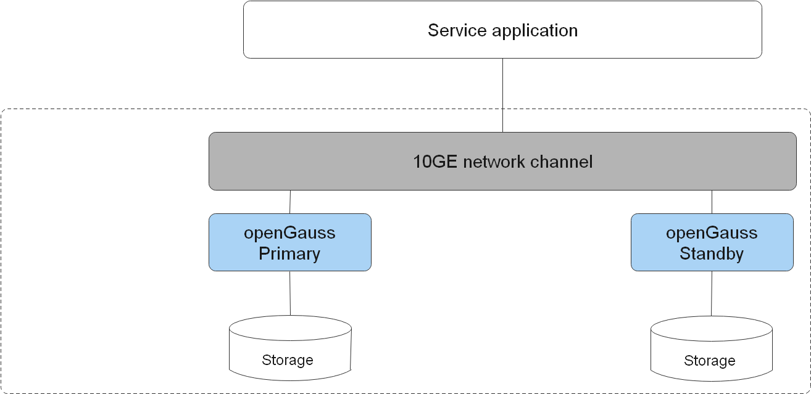

# Deployment Solutions

openGauss can be deployed in standalone mode or with one primary node and multiple standby nodes. openGauss does not provide the CM. Therefore, the high availability solution in the subsequent description is achieved based on the cluster management, arbitration, and recovery provided by users.

## Common Concepts

-   Standalone

    There is only one database instance.

-   Primary/Standby

    There are primary and standby database instances in the system. The primary instance supports read and write, and the standby instance supports read-only.

-   Hot/Cold backup

    Cold backup: There is only a simple backup set that cannot provide services.

    Hot backup: Backup databases can provide services for external systems.

## Deployment Modes

For details about the standalone and primary/standby deployment modes, see  [Table 1](#en-us_topic_0283139012_en-us_topic_0243295239_en-us_topic_0240782908_table138801827134510).

**Table  1**  Deployment modes in openGauss

<table><thead align="left"><tr id="en-us_topic_0283139012_en-us_topic_0243295239_en-us_topic_0240782908_row88806271452"><th class="cellrowborder" valign="top" width="7.830783078307831%" id="mcps1.2.8.1.1">
Deployment Mode

</th>
<th class="cellrowborder" valign="top" width="11.561156115611562%" id="mcps1.2.8.1.2">
Technical Solution

</th>
<th class="cellrowborder" valign="top" width="10.051005100510052%" id="mcps1.2.8.1.3">
High Availability

</th>
<th class="cellrowborder" valign="top" width="10.671067106710671%" id="mcps1.2.8.1.4">
Basic Configuration Requirement

</th>
<th class="cellrowborder" valign="top" width="10.41104110411041%" id="mcps1.2.8.1.5">
Service Scenario

</th>
<th class="cellrowborder" valign="top" width="20.99209920992099%" id="mcps1.2.8.1.6">
Characteristics

</th>
<th class="cellrowborder" valign="top" width="28.48284828482848%" id="mcps1.2.8.1.7">
Specifications

</th>
</tr>
</thead>
<tbody><tr id="en-us_topic_0283139012_en-us_topic_0243295239_en-us_topic_0240782908_row18811277455"><td class="cellrowborder" valign="top" width="7.830783078307831%" headers="mcps1.2.8.1.1 ">
Standalone

</td>
<td class="cellrowborder" valign="top" width="11.561156115611562%" headers="mcps1.2.8.1.2 ">
Standalone

</td>
<td class="cellrowborder" valign="top" width="10.051005100510052%" headers="mcps1.2.8.1.3 ">
HA is not supported.

</td>
<td class="cellrowborder" valign="top" width="10.671067106710671%" headers="mcps1.2.8.1.4 ">
Single equipment room

</td>
<td class="cellrowborder" valign="top" width="10.41104110411041%" headers="mcps1.2.8.1.5 ">
Physical machine

</td>
<td class="cellrowborder" valign="top" width="20.99209920992099%" headers="mcps1.2.8.1.6 "><ul id="en-us_topic_0283139012_en-us_topic_0243295239_en-us_topic_0240782908_ul61827011712"><li>No system reliability and availability requirements</li><li>Applicable to trial use and commissioning scenarios</li></ul>
</td>
<td class="cellrowborder" valign="top" width="28.48284828482848%" headers="mcps1.2.8.1.7 "><ul id="en-us_topic_0283139012_en-us_topic_0243295239_en-us_topic_0240782908_ul83681420142312"><li>RTO and RPO are uncontrollable.</li><li>Instance-level DR is not supported. The system is unavailable when instance faults occur.</li><li>Lost instance data cannot be restored.</li></ul>
</td>
</tr>
<tr id="en-us_topic_0283139012_en-us_topic_0243295239_en-us_topic_0240782908_row16881142774510"><td class="cellrowborder" valign="top" width="7.830783078307831%" headers="mcps1.2.8.1.1 ">
Primary/Standby

</td>
<td class="cellrowborder" valign="top" width="11.561156115611562%" headers="mcps1.2.8.1.2 ">
Primary and standby nodes

</td>
<td class="cellrowborder" valign="top" width="10.051005100510052%" headers="mcps1.2.8.1.3 ">
Instance faults can be withstood.

</td>
<td class="cellrowborder" valign="top" width="10.671067106710671%" headers="mcps1.2.8.1.4 ">
Single equipment room

</td>
<td class="cellrowborder" valign="top" width="10.41104110411041%" headers="mcps1.2.8.1.5 ">
Physical machine

</td>
<td class="cellrowborder" valign="top" width="20.99209920992099%" headers="mcps1.2.8.1.6 "><ul id="en-us_topic_0283139012_en-us_topic_0243295239_en-us_topic_0240782908_ul617272701813"><li>No network delay between nodes</li><li>Able to withstand instance faults in the database</li><li>Applicable to scenarios without high reliability requirements</li></ul>
</td>
<td class="cellrowborder" valign="top" width="28.48284828482848%" headers="mcps1.2.8.1.7 "><ul id="en-us_topic_0283139012_en-us_topic_0243295239_en-us_topic_0240782908_ul15571133112234"><li>RPO = 0</li><li>Instance fault RTO &lt; 10s</li><li>AZ-level DR is not supported.</li><li>The primary and standby nodes in maximum availability mode are recommended.</li></ul>
</td>
</tr>
</tbody>
</table>

## Hardware and Software Specifications

openGauss supports the following CPUs and OSs:

**Table  2**  openGauss software and hardware specifications

<table><thead align="left"><tr id="en-us_topic_0283139012_en-us_topic_0243295239_en-us_topic_0240782908_row1521418485347"><th class="cellrowborder" valign="top" width="33.33333333333333%" id="mcps1.2.4.1.1">
Delivery Mode

</th>
<th class="cellrowborder" valign="top" width="33.33333333333333%" id="mcps1.2.4.1.2">
CPU

</th>
<th class="cellrowborder" valign="top" width="33.33333333333333%" id="mcps1.2.4.1.3">
OS

</th>
</tr>
</thead>
<tbody><tr id="en-us_topic_0283139012_en-us_topic_0243295239_en-us_topic_0240782908_row18214144823411"><td class="cellrowborder" rowspan="2" valign="top" width="33.33333333333333%" headers="mcps1.2.4.1.1 ">
Onsite

</td>
<td class="cellrowborder" valign="top" width="33.33333333333333%" headers="mcps1.2.4.1.2 ">
x86

</td>
<td class="cellrowborder" valign="top" width="33.33333333333333%" headers="mcps1.2.4.1.3 ">
EulerOS V2.0SP10 and SUSE 12.5

</td>
</tr>
<tr id="en-us_topic_0283139012_en-us_topic_0243295239_en-us_topic_0240782908_row221414883410"><td class="cellrowborder" valign="top" headers="mcps1.2.4.1.1 ">
Arm

</td>
<td class="cellrowborder" valign="top" headers="mcps1.2.4.1.2 ">
EulerOS V2.0SP10

</td>
</tr>
</tbody>
</table>

## Introduction to Deployment Solutions

The overall deployment solutions can be classified into two types: standalone and primary/standby.

-   Standalone deployment

    The standalone deployment does not ensure reliability or availability. There is only one data copy. Once data is damaged or lost, only physical backup can be used to restore data. Therefore, this deployment mode applies to scenarios such as experiencing databases and commissioning syntax functions in the test environment. You are not advised to use this mode on the commercial live network.

    **Figure  1**  Standalone deployment  
    

    

-   Primary/standby deployment

    The primary/standby mode is equivalent to two data copies, one for the primary node and the other for the standby node. The standby node receives logs and plays back the logs.

    **Figure  2**  Primary/standby deployment  
    

