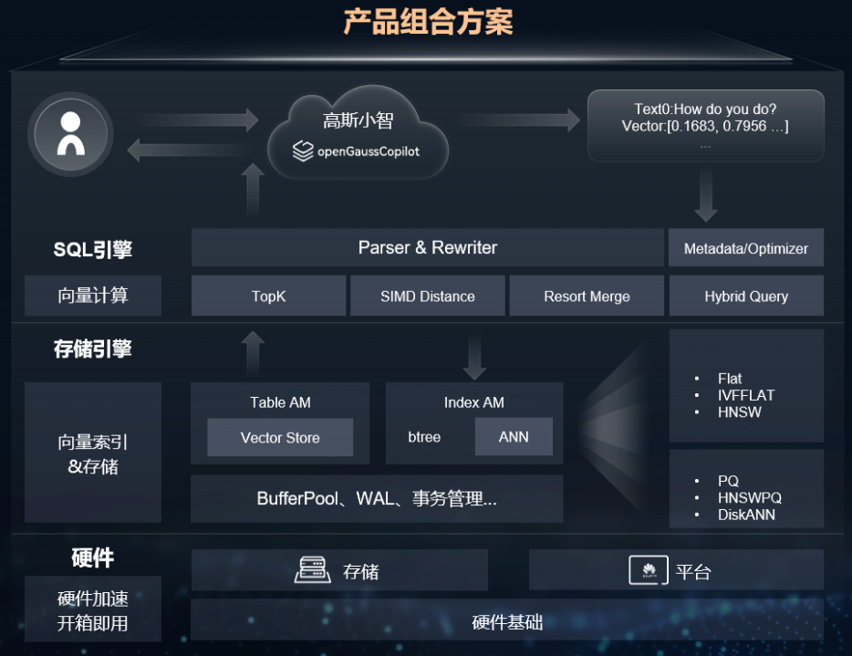
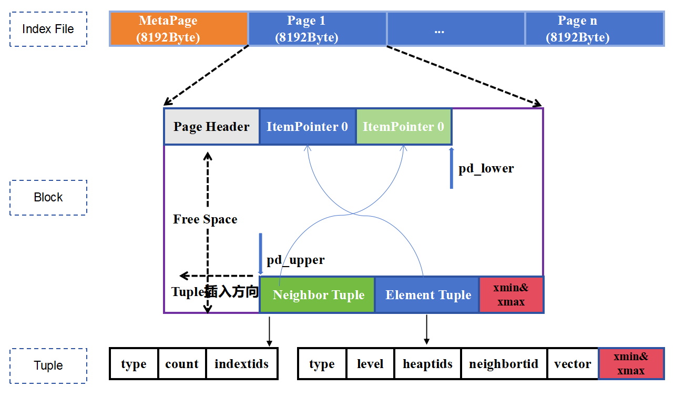
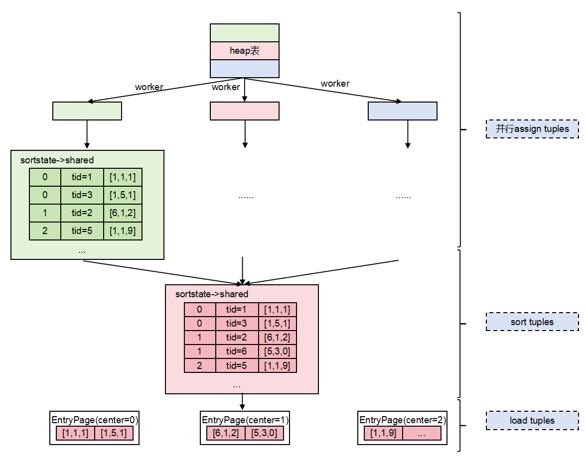
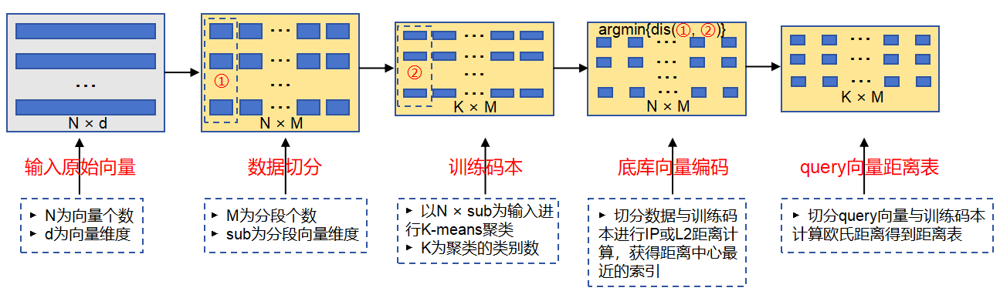
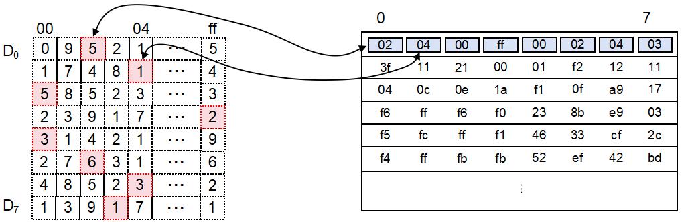
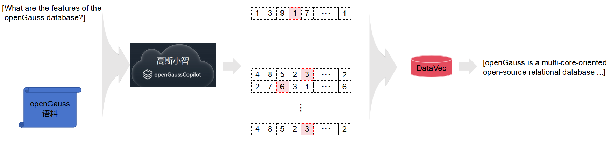

# DataVec向量引擎

## 可获得性
本特性自openGauss 7.0.0-RC1 版本开始引入。

## 特性简介
DataVec是一个基于openGauss的向量引擎，目前支持的向量功能有：精确和近似的最近邻搜索、L2距离&余弦距离&内积、向量索引、向量操作函数和操作符。作为openGauss的内核特性，DataVec使用熟悉的SQL语法操作向量，简化了用户使用向量数据库的过程。

## 快速部署指南
详见[向量数据库容器镜像安装](../InstallationGuide/容器镜像安装.md)。

## 客户价值
伴随着深度学习的不断发展，非结构化数据如图片、视频、音频等得以通过向量的方式进行表征。这种表征方式使得在搜索、推荐、广告等业务中，基于向量的K近邻(K-Nearest Neighbors,KNN)检索需求变得尤为重要。如何在海量数据中高效地实现这一需求，成为了一个重要的研究方向和基础能力。

DataVec的目标是存储和检索由神经网络及机器学习等大模型生成的高维向量数据。为了实现这一目标，DataVec目前支持IVFFlat和HNSW两种索引结构，以加速向量相似度查询。IVFFlat(Inverted File Flat)是一种基于倒排文件的索引结构，适用于大规模数据集的快速检索。HNSW(Hierarchical Navigable Small World)则是一种基于图的索引结构，能够在高维空间中实现高效地近似最近邻搜索。

总的来说，DataVec在处理大规模高维向量数据时，能够提供快速、准确的检索结果，满足各种复杂应用场景的需求。随着深度学习和大数据技术的不断发展，DataVec在向量数据库领域的应用前景将更加广阔。

## 特性描述

DataVec能够无缝对接自研大模型。通过嵌入技术将非结构化数据（如文本、图像等）转换为向量数据，DataVec为之提供存储和检索能力。嵌入是一种将非结构化数据映射到向量空间的技术，使得相似文本、图像在向量空间中的距离相近，从而提高检索的准确性和效率。

此外，DataVec还支持鲲鹏指令集加速，实现毫秒级响应。鲲鹏指令集是华为自主研发的一套高性能计算指令集，能够显著提升数据处理和计算的效率。通过利用鲲鹏指令集，DataVec可以在处理大规模向量数据时，提供更快的想用速度和更高的处理能力。

在实际应用中，DataVec可以广泛应用于各种需要高效向量检索的场景。例如，在推荐系统中，DataVec可以根据用户的历史行为和偏好，快速找到与用户兴趣相似的内容，从而提供个性化的推荐。在图像检索中，DataVec可以通过图像特征向量，快速找到与查询图像相似的图片。在自然语言处理(NLP)中，DataVec可以通过文本嵌入，快速找到与查询文本语义相似的文档。

### 数据类型
- vector - float向量，最高支持2000维
- bitvec - bit向量，最高支持64000维
- sparsevec - sparse向量，最高支持1000非零元素
> **说明：**
这里的最高维度是在使用索引场景下的最大维度上限值。

### 索引支持
- IVFFLAT 
- HNSW
- IVFPQ
- HNSWPQ

### 架构设计

**图 1**  DataVec框架图<a name="zh-cn_topic_0243295241_zh-cn_topic_0243253012_fig1128133574113"></a>    
<div style="display:flex;justfy-content:center;">  
    
</div>

#### SQL层
- Embedding：支持与盘古大模型对接，将高维数据转化为向量。
- 混合查询：基于RBO生成标量和向量混合的查询，支持大规模标签的过滤查询能力以及基于过滤率的向量查询策略。
- 向量计算：通过鲲鹏SVE/SME指令优化的距离计算如欧氏距离、余弦距离等。
#### 存储引擎层
- 向量存储：支持单页最高64000维向量数据存储
- 向量索引：支持多种高效ANN索引。
#### 硬件加速层
- 基于Index AM实现昇腾等硬件加速检索。

## 特性增强
无。

## 特性约束
数据类型、索引构建约束细节参考：
- [向量数据类型](../SQLReference/向量数据类型.md)

- [向量函数和操作符](../SQLReference/向量函数和操作符.md)

- [向量索引](../SQLReference/向量索引.md)

## 依赖关系
无。

## 基本原理
### 支持原地更新引擎

ANN索引页面中在每个Element Tuple尾部附加xmin和xmax字段，从而支持原地更新引擎。这些字段在索引构建和查询过程中起到关键作用，确保数据的可见性和一致性。在实际实现中，插入新数据时系统会记录当前事务ID到xmin字段；在删除数据时系统会更新xmax字段。原地更新引擎采用原位更新的方式极大的节约了空间，将回滚段、数据页面分离存储，具备高效、平稳的IO能力。

**图 2**  ANN原位更新索引页面
<div style="display:flex;justfy-content:center;">  
    
</div>

### 并行构建索引

ANN支持并行构建索引，通过将数据集分成若干个子集分配到不同工作线程上，在每个线程上独立计算并将各线程结果合并形成最终全局索引，这极大地提升了处理大规模数据集的效率。
- 数据分片：数据按照工作线程数划分，切分为若干子集。
- 并行处理：leader线程创建Bgworker，每个Bgworker并行扫描各个数据子集，计算向量之间距离加入候选集。
- 结果合并：leader线程合并所有线程结果并进行排序，然后持久化到页面上。

**图 3**  ANN并行索引构建
<div style="display:flex;justfy-content:center;">  
    
</div>

### 指令集加速

具体来说，鲲鹏指令集包括一系列优化的指令，如NENO指令和内联汇编，这些指令能够加速向量运算、数据预取和流水线处理。通过利用鲲鹏处理器的硬件加速特性和优化的指令集，ANN算法能够在处理大规模数据集时显著提高性能和效率。

### PQ量化压缩

乘积量化(Product Quantization, PQ)是一种基于高效压缩高维向量的方法，适用于大规模数据集的相似度搜索。通过将高维向量分割成为多个低维子向量，并对每个子向量进行独立聚类，将原始向量表示为一系列质心，从而显著减少内存使用和提升检索速度。

#### PQ码本训练

训练阶段：将向量空间按照维度划分成若干子空间，然后再每个子空间采用聚类方法得到N个中心点，最后分段底库向量和分段query向量与分段聚类中心点进行距离求解，进而获得底库索引表和query距离表。流程如下

- step1：原始特征向量进行数据切分，切分后维度为N × M，其中N维底库元素的数量，M维切分的段数。
- step2：对切分数据进行K-Means据类，一般选择2<sup>8</sup> = 256个聚类中心，聚类后的训练码维度维K × M，K维聚类中心的个数。
- step3：底库切分向量和训练码本进行IP或者L2距离求解获得距离值，选择距离值中最小的据类中心索引，进而生成底库向量编码表，其维度为N × M。
- step4：对query向量进行切分，执行与step3相同的操作，生成query向量距离表，其维度为K × M。

**图 4**  PQ码本训练<a name="zh-cn_topic_0243295241_zh-cn_topic_0243253012_fig1128133574113"></a>
<div style="display:flex;justfy-content:center;">  
    
</div>

#### PQ检索

检索阶段：通过训练阶段生成的底库索引表和query距离表，进行查表进而获得query向量与底库向量之间的距离。仅需通过M次查表和M次相加，即可得到query向量和任一底库向量之间的距离。

**图 5**  PQ检索<a name="zh-cn_topic_0243295241_zh-cn_topic_0243253012_fig1128133574113"></a>
<div style="display:flex;justfy-content:center;">  
    
</div>

#### 分层导航+PQ融合索引
将PQ的查表法和分层导航索引结合在一起，用查表法来代替向量距离计算，进而提高检索性能，

在索引构时，并行构建分层导航图和PQ索引。在检索阶段，对0层以上的图求解query向量和图中节点之间的距离时采用Flat求解器求解，这样可以保证为第0层提供较好的入口节点。同时，顶层节点数较小也不会花费较长时间。在第0层进行检索时，采用PQ求解器的码本来代替距离求解，极大提高了计算效率。

为了进一步提高检索精度，对采用PQ查表法获取的候选集，进行二级精排，通过Flat求解器更新候选集中元素的距离，此时更新的距离为候选集向量与query向量之间的真是距离。然后对更新距离后的候选集进行二次更新，输出最终TopK结果。

### 标量向量混合查询
DataVec还能够同时处理标量数据（如数值、类别）和向量数据（如文本、音视频）。这种混合查询的支持使得用户可以在同一个查询中结合不同类型的数据，从而实现更复杂和精细的分析。

## 使用指导
### 创建向量表

DataVec新增多种[向量数据类型](../SQLReference/向量数据类型.md)（vector、bitvector、sparsevector等），向量表的创建与openGauss原生语法保持一致，创建时指定存储向量类型即可。
```
CREATE TABLE [TABLE_NAME]
(
    COL1 DATATYPE,
    ...,
    COLN VECTORTYPE,
);
```

示例1：创建一个带有3维向量的表。

```
openGauss=# CREATE TABLE items (val vector(3));
```

### 数据插入

向量的数据插入与openGauss原生语法保持一致，使用INSERT或者COPY插入，指定数据类型即可。

```
INSERT INTO [TABLE_NAME] VALUES 
(
    DATA1,
    ...,
    [0.1, 0.3, 0.6, ...]
);
```

示例2：向量数据的插入。

```
openGauss=# INSERT INTO items (val) VALUES ('[1,2,3]'), ('[4,5,6]');
```

### 向量索引创建

DataVec目前支持了IVFFLAT、HNSW、IVFPQ及HNSWPQ等算法的[向量索引](../SQLReference/向量索引.md)，基于openGauss中的ASTORE存储实现，通过索引结构能够高效地检索出查询结果。

```
CREATE INDEX [INDEX_NAME]
ON [TABLE_NAME]
USING [ivfflat|hnsw|...]
WITH (
    lists=<LISTS>,|
    m=<M>,
    ef_construction=<EF_CONSTRUCTION>,
    ...
);
```

示例3：索引创建。

```
openGauss=# CREATE INDEX ON items USING ivfflat (val vector_l2_ops) WITH (lists = 100);
openGauss=# CREATE INDEX ON items USING hnsw (val vector_cosine_ops) WITH (m = 16, ef_construction=200);
```

### 向量检索
通过ANN索引，DataVec可以进行高效的近似搜索；此外还可以进行非索引的精确检索。

```
SELECT COL1, COLN 
FROM [TABLE_NAME] 
ORDER BY COLN [VECTOR_OPERATER]  '[0.1, 0.3, 0.7, ...]' 
LIMIT <TOPK>;
```

示例4：计算最近邻。

```
openGauss=# SELECT * FROM items ORDER BY val <-> '[3,1,2]' LIMIT 5;
openGauss=# SELECT * FROM items ORDER BY val <#> '[3,1,2]' LIMIT 5;
openGauss=# SELECT * FROM items ORDER BY val <=> '[3,1,2]' LIMIT 5;
```
> **说明：**<br>
> 如果使用当前索引中不存在的距离计算操作符来进行扫描，即使关闭顺序扫描后仍会执行顺序扫描。<br>
>
> 如果表中向量存在空值或者距离计算结果为NAN，查询结果会将其自动过滤。<br>
>
> 目前向量索引查询语法仅支持`order by <字段> <操作符> <查询向量>`子句，order by子句增加desc、非order by子句等均不支持走向量索引。


更多使用细节请参考：

- [向量数据类型](../SQLReference/向量数据类型.md)

- [向量函数和操作符](../SQLReference/向量函数和操作符.md)

- [向量索引](../SQLReference/向量索引.md)

## 使用场景
- 图像识别：用于安全监控、身份验证等场景，通过分析图像中的人脸特征进行识别。
- 车辆检索：通过摄像头捕捉车辆图像，进行车牌识别和车辆特征分析。
- 实时轨迹跟踪：在物流行业，通过实时跟踪获取运输轨迹，提高物流效率和安全性。
- 推荐系统：根据用户浏览和购买力是，推荐相关产品，提高用户满意度。
- 声纹匹配：在金融、安防等领域，通过声纹识别技术进行身份验证，确保交易和操作的安全性。
- 基因筛选：在药物研发过程中，通过检索特定基因序列，找到潜在的药物靶点，加速新药研发。

这些应用场景展示了DataVec在各个领域的能力，用户可以自由的将向量数据库库使能到各个应用中去。

### DataVec使用场景示例：智能问答系统

**图 6**  高斯小智智能问答系统  
<div style="display:flex;justfy-content:center;">  
    
</div>

当前，openGauss社区的文档数量庞大，用户在查找特定知识时常常面临困难。为了解决这一问题，可以借助DataVec搭建高斯小智问答系统，通过高效的数据处理和混合查询能力，精准提取相关信息，大幅提升用户的使用体验。

智能问答系统是一种利用自然语言处理技术，模拟人类回答问题的智能系统。它能够理解用户提出的自然语言问题，并从海量数据中检索相关信息，最终提供准确、有用的答案。

DataVec通过高斯小智将语料库导入到向量数据库中，并对接自研大模型实现对用户查询语句的实时转换，从而在DataVec中高效检索出相关知识以达到快速、精准的响应。