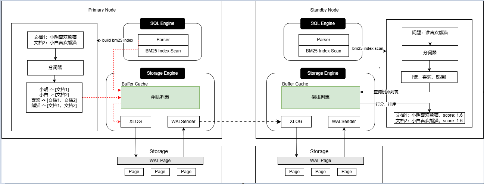

# BM25全文检索索引
## 可获得性

本特性自 openGauss 7.0.0-RC2 版本开始引入。

## 特性简介
**图 1主备场景BM25索引设计方案**  

## 客户价值
RAG（Retrieval-Augmented Generation，检索增强生成）是一种结合检索系统与生成模型的技术框架, 通过从外部知识库中检索相关信息，生成模型根据这些相关信息生成更加准确的答案。越来越多的企业通过RAG技术搭建自己的智能知识问答、业务推荐等系统，提升了效率、优化用户体验和提供精准服务。
如何快速从外部知识库中检索准确度高，相关性高的文档，进而提升 RAG 系统准确性和响应能力，成为了企业的核心诉求。BM25（Best Matching 25）全文检索算法，通过对文档库构建BM25倒排索引，可以快速准确的检索用户提问的相关文档，已成为 RAG 系统的主流选择。

openGauss 新增BM25全文检索索引功能，通过简单的创建索引命令，即可为文档库构建BM25索引，实现对文档的快速检索，支持新增文档实时更新到索引中。查询响应性能超GIN索引几十甚至上百倍。同时，索引数据对接openGauss存储引擎，支持主备部署，提供高可用、故障切换、备份恢复的能力，以保障业务连续性。
## 特性描述
openGauss 单机/主备集群场景下，对文档库中的文档进行分词，随后根据分词结果构建倒排索引。扫描阶段，根据搜索词实现对文档的快速搜索。

- 构建阶段：

    用户发起BM25索引构建请求，主节点通过分词器对文档进行分词，对每个分词构建倒排索引，即每个分词对应着所有包含该分词的文档信息。支持并行构建。
- 基于日志的索引数据同步：
    
    为了保证索引数据的实时性，索引构建和行数据修改都通过日志方式同步到备机。
- 扫描阶段

    用户发起BM25索引查询请求，节点内部会将用户的问题进行分词，根据该分词结果获取相关倒排列表，随后遍历倒排列表通过BM25算法对文档进行打分、排序，最终返回 top-k 个分数最高的文档给大模型生成用户所需答案。同时支持 where 等过滤条件。
## 特性增强

无。

## 特性约束

BM25 全文检索的规格约束如下：
- 表：仅支持普通表的构建BM25索引，不支持分区表。
- 数据类型：仅支持 text 字段类型。
- 支持astore、段页表，不支持ustore表、列存表、MOT表。
- 仅支持单列构建索引，不支持构建多列组合索引，如：create index bm25_index on bm25_table using bm25(col1, col2);
- 仅支持降序排序。
- 不支持极致RTO。
- 仅支持原词检索，不支持同义词检索和语义相关性检索。
- 兼容A、B、C、PG库。
- 不支持CONCURRENTLY创建索引。
- 不支持设置options。