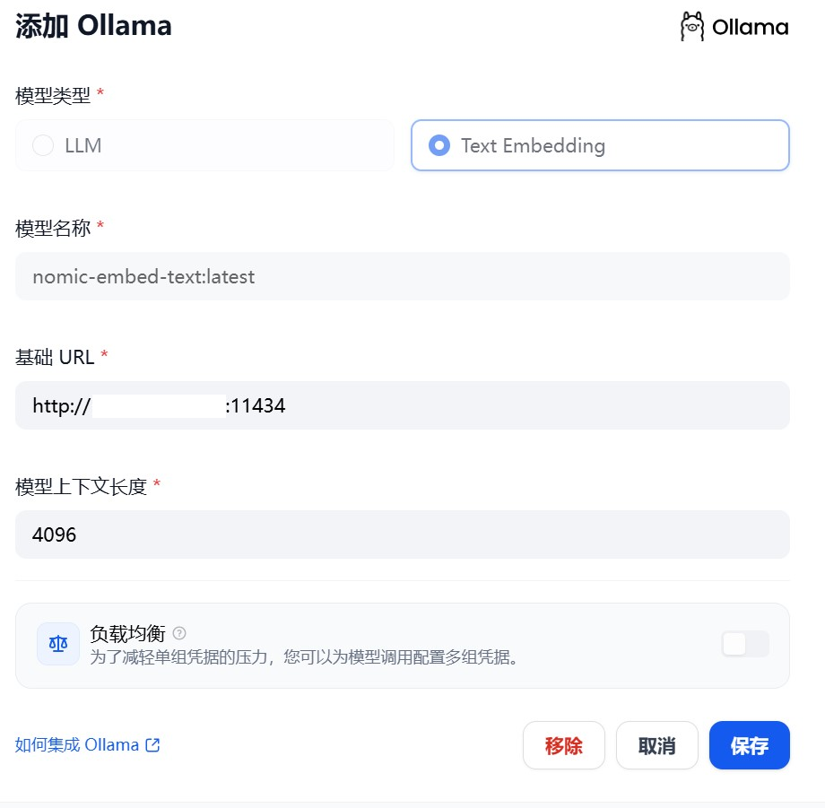

# 基于Qwen3+openGauss，部署个人专属RAG知识库系统

2025年4月29日，阿里巴巴正式发布新一代通义千问大模型**Qwen3系列**，以混合专家架构（MoE）与混合推理模式为核心突破，刷新全球开源大模型性能纪录。Qwen3系列包含两大分支：  
1. **Qwen3模型**：覆盖0.6B、1.7B、4B、8B、14B、30B、32B、235B全尺寸，其中Qwen3-4B性能直逼前代72B模型；
2. **Qwen3-MoE模型**：包含30B-A3B（激活参数量3B）、235B-A22B（激活参数量22B）等版本，以10%激活参数实现超越同规模密集模型的性能，推理成本仅为DeepSeek-R1的1/3。  

**Qwen3的核心技术亮点包括**：  
- **混合推理模式**：支持动态切换“深度思考”（复杂问题多步推理）与“快速响应”（简单任务秒级回复），算力消耗最高降低90%；  
- **性能全面领先**：在AIME'24数学评测中斩获85.7分，LiveCodeBench v5代码测试突破70.7分，超越Grok-3与Gemini-2.5-Pro，登顶全球开源模型榜首；
- **多模态与多语言支持**：覆盖119种语言，集成视觉理解能力，适配医疗诊断、工业质检等跨模态场景。  

---
 
在Qwen3发布后，openGauss团队联合鲲鹏社区第一时间完成**基于Qwen3的RAG解决方案全链路验证**，这意味着开发者现在就可以一键拉起基于openGauss的编排组件容器镜像，并利用Qwen3实现畅快的RAG知识问答及推理。


---

## 快速体验Qwen3

体验之前，您需确认ollama已正确安装并启动，可运行如下命令确认：
```
ollama list
```
您可以使用如下命令，一键拉起Qwen3大模型：
```
ollama run qwen3:latest
```

模型服务起来之后，您可以直接进行问答体验最新版Qwen3，推理结果如下：


## 搭建openGauss知识库

请提前安装好Docker Compose软件，如未安装请按照下面描述进行离线安装。

#### Docker Compose软件安装
下载Docker Compose软件包。
```
wget https://github.com/docker/compose/releases/download/v2.33.1/docker-compose-linux-aarch64
```
安装Docker Compose。
```
mv docker-compose-linux-aarch64 /usr/bin/docker-compose
chmod +x /usr/bin/docker-compose
```
#### 编排组件部署
1.下载Dify 1.1.3软件包。
访问链接<https://github.com/langgenius/dify/tree/1.1.3>，然后如下图所示，直接“Download ZIP”下载压缩包并上传到服务器。


2.创建目录并解压。
```
mkdir /usr/local/dify
unzip dify-1.1.3.zip -d /usr/local/dify/
cd /usr/local/dify/dify-1.1.3
```
3.解压软件包并进到Dify源码目录，执行下面的命令进行安装部署。
```
cd docker
cp .env.example .env
vim .env
```
修改.env第387行为：VECTORE_STORE=opengauss


4.以后台模式运行服务。
命令会在线下载Docker镜像并启动对应的服务，需等待30分钟左右，实际时间根据网络情况而定。该命令会自动拉起openGauss服务，无需手动部署。
```
docker-compose up -d
```

## 在线问答

1.访问本地部署的Dify web服务页面。
```
http://your_server_ip
```
2.创建一个管理员账户。输入邮箱和密码即可创建。

3.接入LLM服务。
在主界面点击右上角用户名，然后点击“设置”进入设置页面，单击“模型供应商”，选择“Ollama”卡片，单击“安装”按钮。


安装完成后，在添加模型页面，“模型类型”选择“LLM”，配置Qwen3模型。


4.接入Embedding服务。
在添加模型页面，“模型类型”选择“Text Embedding”，



5.创建应用。
轻点Dify平台首页左侧的“创建空白应用”，选择“聊天助手”类型应用并进行简单的命名。


6.选择LLM模型。
单击右上角“模型”选择下拉框，选择qwen3模型。


7.对话互动。
配置完成后即可在聊天框中进行互动。输入“xx时尚公司经营范围有哪些”，输出如下所示，即完成了一次对话互动。本次对话还未使用RAG功能，如果需要使能RAG则该聊天助手应用需要关联知识库，具体的操作参考下面“在应用内集成知识库”的流程。


知识库可以作为外部知识提供给大语言模型用于精确回复用户问题，你可以在Dify的所有应用类型内关联已创建的知识库。

8.添加知识库。
为获取更精准回答，本次导入XX公司相关背景介绍信息如下：


等待知识导入完成。


然后，在上面创建的聊天助手应用的编排页面，“上下文”区域内点击“添加”按钮添加知识库。


9.对话互动。
LLM将首先从知识库内获取与问题相关上下文，在此基础上进行总结并给出更高质量的回答。在对话框内输入相同的问题“xx时尚公司经营范围有哪些”，输出如下：


至此，基于Qwen3大模型和openGauss向量数据库为核心的RAG知识库搭建并测试完成。

## 相关链接
Qwen3模型：https://ollama.com/library/qwen3

openGauss项目仓库：https://gitcode.com/opengauss/openGauss-server

鲲鹏社区RAG解决方案：https://www.hikunpeng.com/document/detail/zh/kunpengrag/bestpractice/kunpengrag_21_0001.html

Dify项目仓库：https://github.com/langgenius/dify
