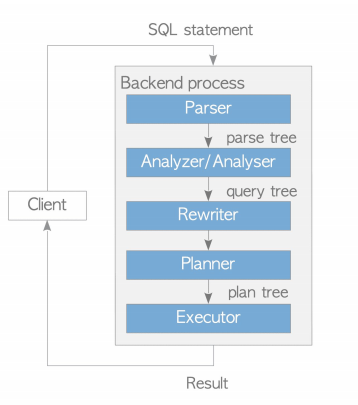

# Apache AGE (incubating) for openGauss

## 介绍
图数据库由于能够处理数据之前的复杂关系，近年来得到了广泛的应用。与传统关系型数据库不同，图数据库将数据表示为节点、边和属性。节点表示实体，边表示实体之间的关系，属性表示两者的属性。

Apache AGE是基于PostgreSQL开发的图数据库引擎，AGE的所有组件都运行在PostgreSQL事务缓存层和存储层之上，AGE实现了一个存储引擎同时处理关系型和图数据模型，用户可使用标准的ANSI SQL和图查询语言openCypher对数据进行查询。

Apache AGE在数据库内核的查询解析，查询重写，查询计划，查询执行，数据存储均有涉及，数据存储方面定义了图数据库的存储模型。openGauss在其他方面使用数据库内核的hook点，对Cypher语言进行了支持，实现了同时处理关系型和图数据的能力。

<a name="zh-cn_topic_0243295241_zh-cn_topic_0243253012_fig1128133574113"></a>
<div style="display:flex;justfy-content:center;">  
    
</div>

openGauss数据库使用插件的方式支持图数据库引擎，在openGauss数据库中可直接采用创建插件的方式使用Apache AGE的能力。

## 安装

> 轻量版的openGauss镜像，已安装AGE，部署好openGauss数据库后，通过加载插件方式可直接使用图数据库能力

### 编译安装

age源码地址：https://gitee.com/opengauss/Plugin/tree/master/contrib/age

#### 方式一（同openGauss一起安装）
将age源码放到openGauss-server源码的contrib目录下，直接编译安装openGauss-server，age会自动编译安装
> 此方式适用于openGauss-server同时编译安装

#### 方式二（使用openGauss源码安装）
1. 将age源码 放到openGauss-server的源码 contrib 目录下
2. 进入 contrib/age 目录,在age的目录下执行 make install
> 此方式适用于openGauss-servery已经使用源码编译安装, 并且源码及编译环境依旧保存，可以使用此方式安装age

#### 安装方式三（使用PGXS安装）
1. 安装必要依赖
```
yum install gcc glibc glib-common readline readline-devel zlib zlib-devel flex bison perl
```
> gcc 版本需要>=7.3.0
2. 需要将openGauss安装目录的bin目录配置到环境变量中 执行命令
```
which pg_config
```
确认pg_config 是 openGauss 安装目录下的 pg_config</br>
3. 进入age根目录 执行
```
make install USE_PGXS=true
```
> 此方式适用于直接使用安装包安装openGauss的方式。这里不建议使用PGXS安装方式， 随着openGauss的升级，必要的头文件不会全部安装到安装目录，因此会存在编译时缺少头文件的问题,可以按照错误提示从openGauss的 头文件拷贝到openGauss安装目录include/postgresql/server/ 文件夹下

##### 安装必要的依赖
> 前提条件：openGauss正常编译安装，并且配置到了环境变量中 在age的源码目录执行命令
```
make install USE_PGXS=true
```

## 快速开始

### 连接openGauss
```
gsql -r
```

### 创建插件

- 执行命令
```
create extension age;
```
- 示例
```
openGauss=# create extension age;
CREATE EXTENSION
```

- 约束

openGauss安装dolphin插件后，B模式下需要使用如下方式安装AGE插件:
```
set dolphin.b_compatibility_mode=off;
create extension age;
set dolphin.b_compatibility_mode=on;
```

### 设置查询空间
- 说明

AGE安装之后，会默认创建ag_catalog的schema，AGE内置的数据类型、函数均存储在ag_catalog下。
- 执行命令
```
SET search_path TO ag_catalog;
```
- 示例
```
openGauss=# SET search_path TO ag_catalog;
SET
```

### 加载插件
- 执行命令
```
load 'age';
```
- 示例
```
openGauss=# load 'age';
LOAD
```

### 创建图空间
- 执行命令
```
SELECT create_graph('test');
```
- 示例
```
openGauss=# SELECT create_graph('test');
NOTICE:  CREATE TABLE / PRIMARY KEY will create implicit index "_ag_label_vertex_pkey" for table "_ag_label_vertex"
CONTEXT:  referenced column: create_graph
NOTICE:  CREATE TABLE / PRIMARY KEY will create implicit index "_ag_label_edge_pkey" for table "_ag_label_edge"
CONTEXT:  referenced column: create_graph
NOTICE:  graph "test" has been created
CONTEXT:  referenced column: create_graph
 create_graph
--------------

(1 row)
```

### 执行cypher语句
- 语法
```
SELECT * FROM cypher(参数1 要查询的图空间,  参数2 cypher语句) AS (a agtype ,[返回元组的个数]);
```
- 示例
```
openGauss=# SELECT * FROM cypher('test', $$CREATE (:v {i: 0})$$) AS (a agtype);
a
---
(0 rows)

openGauss=# SELECT * FROM cypher('test', $$MATCH (n:v) RETURN n$$) AS (n agtype);
n
-----------------------------------------------------------------------
{"id": 844424930131969, "label": "v", "properties": {"i": 0}}::vertex
(1 row)
```

## 适配情况
AGE在openGauss上实现了适配,适配详情参考 [Apache AGE适配openGauss详情说明](Apache-AGE-Adaptation.md)

- 更多资料
> 更详细的使用方式可以参考AGE的官方文档: https://age.apache.org/age-manual/master/

## Apache AGE回归测试语句运行

### 执行步骤
> 前提条件：openGauss使用源码编译的方式安装
1. 将age源码放在openGauss源码的contrib目录下
2. 进入age源码目录,执行命令
```
make installcheck
```
