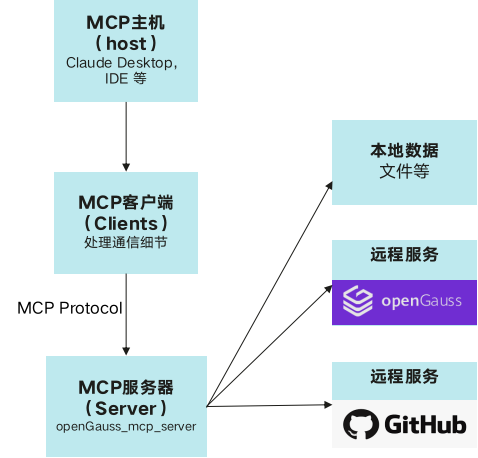
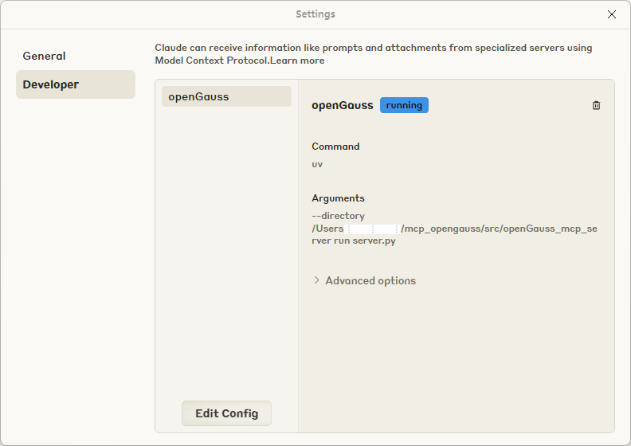
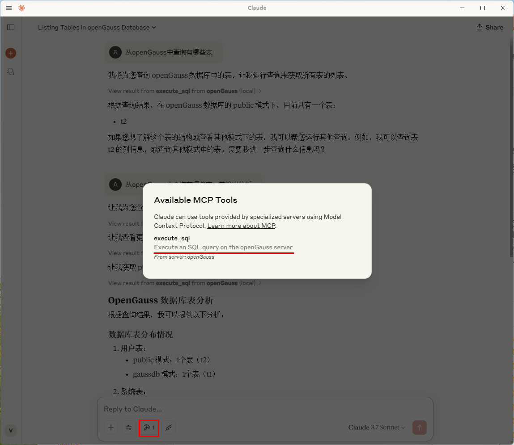
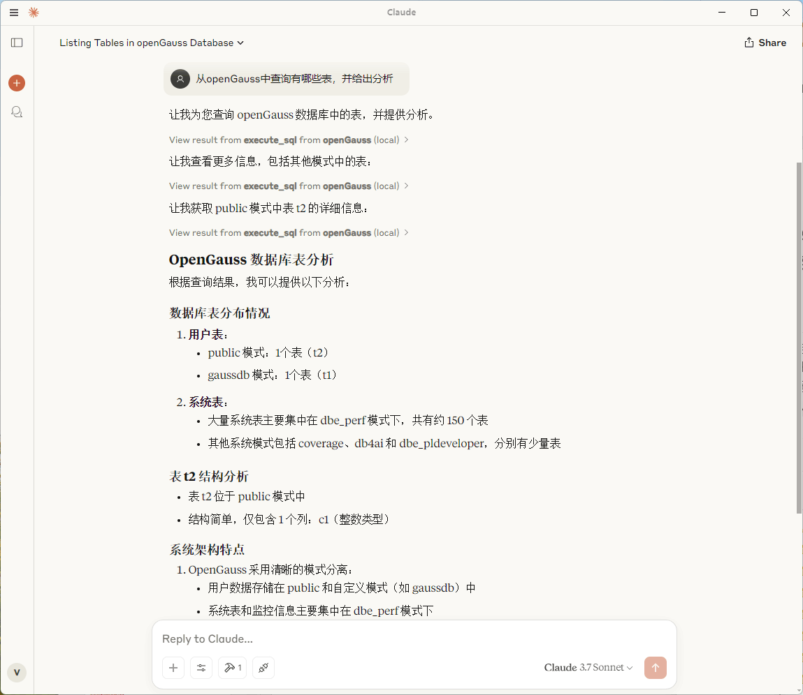

# MCP + openGauss
随着AI从静态推理向动态交互演进，智能体（Agent）逐渐成为焦点。Agent不仅能够调用LLM进行推理，还能访问数据库、调用API、执行任务。然而，当前LLM和Agent之间缺乏标准化交互协议, 每个新数据源都需要自定义实现，使得真正互联的系统难以扩展。MCP(Model Context Protocol, 模型上下文协议)解决了这一挑战，MCP是为LLM和Agent系统设计的标准化交互框架，使LLM可以与外部数据库、API和工具进行高效交互。

## openGauss + MCP + LLM 架构

**图 1**  openGauss + MCP + LLM 架构
<div style="display:flex;justfy-content:center;">  
    
</div>

## 快速搭建openGauss + MCP + LLM的AI Agent应用
### 环境准备
- 安装python3环境，安装uv。
- 通过[容器部署](../InstallationGuide/容器镜像安装.md)并启动openGauss数据库。
- 下载Claude Desktop配合MCP协议进行问答操作。

### 获取openGauss_mcp_server源码
访问链接 https://github.com/vincentsunx/mcp-openGauss.git 获取openGauss_mcp_server源码，当前版本为（0.1.0）。

### 配置参数
- 打开Claude Desktop设置，编辑配置文件。

**图 2**  Claude Desktop配置页面
<div style="display:flex;justfy-content:center;">
    
</div>

- 通过Edit Config增加配置

```
{
    "mcpServers": {
        "openGauss": {
            "command": "uv",
            "args": [
            "--directory",
            "path/to/openGauss_mcp_server",
            "run",
            "server.py"
            ],
            "env": {
                "OPENGAUSS_HOST": "localhost",
                "OPENGAUSS_PORT": "8888",
                "OPENGAUSS_USER": "your_username",
                "OPENGAUSS_PASSWORD": "your_password",
                "OPENGAUSS_DBNAME": "your_database"
            }
        }
    }
}
```
## AI服务集成
### 重新启动Claude Desktop
可以看到可用MCP Tool, 执行sql通过openGauss server

**图 3**  Claude Desktop可用MCP Tool
<div style="display:flex;justfy-content:center;">
    
</div>

### 使用Cluade Desktop通过openGauss进行问答
**图 4**  Claude Desktop问答演示
<div style="display:flex;justfy-content:center;">
    
</div>


