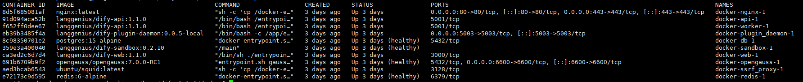
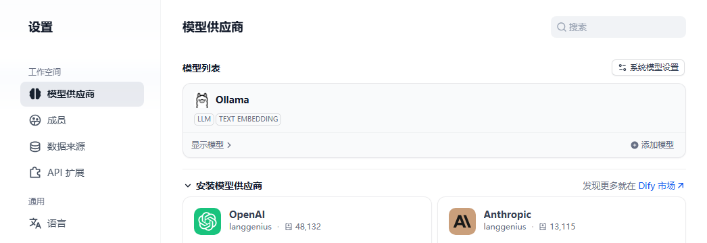
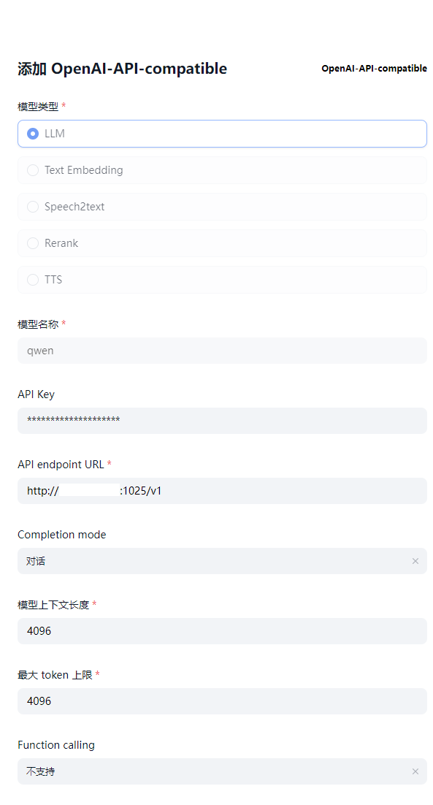
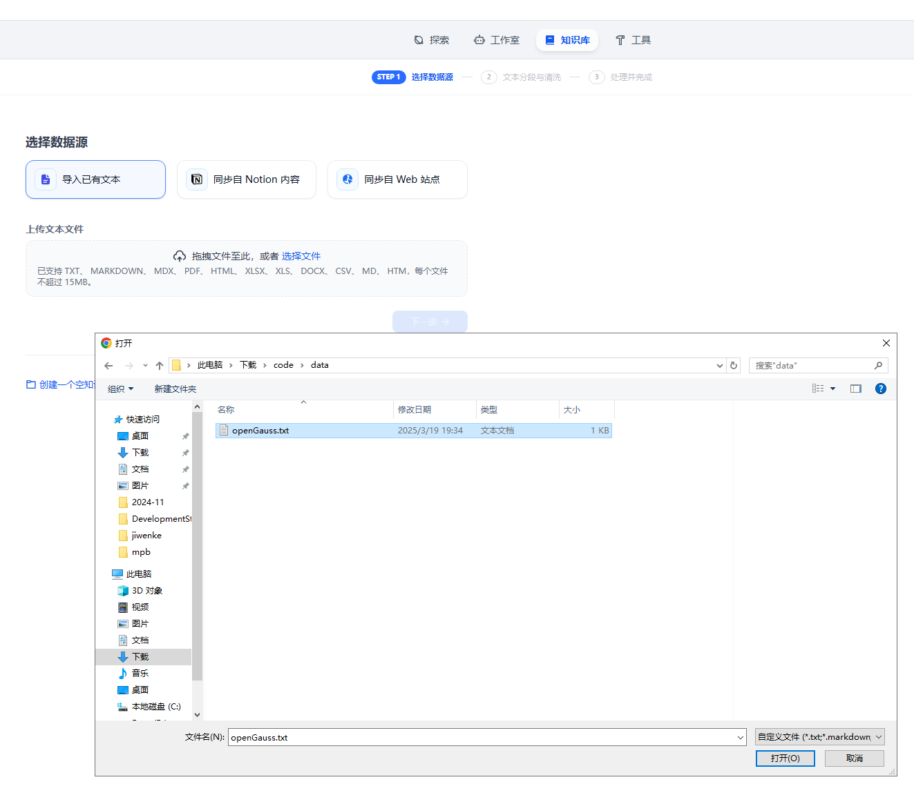
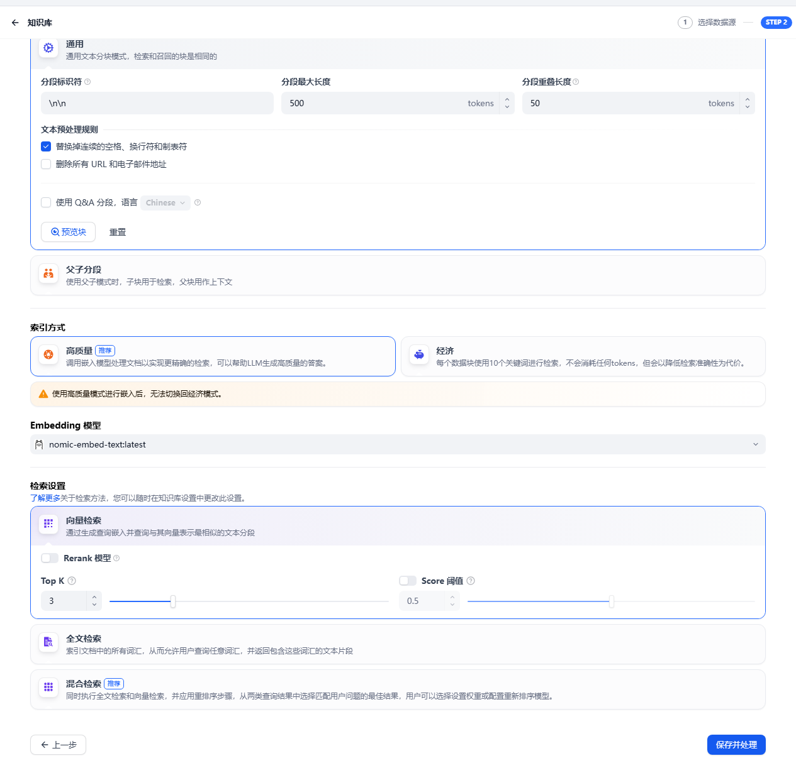
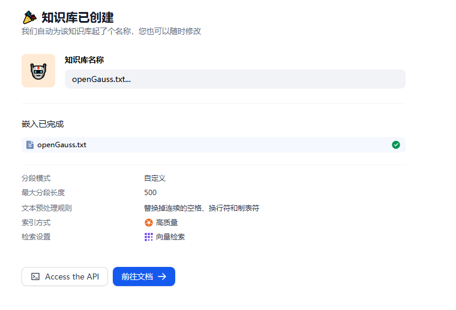
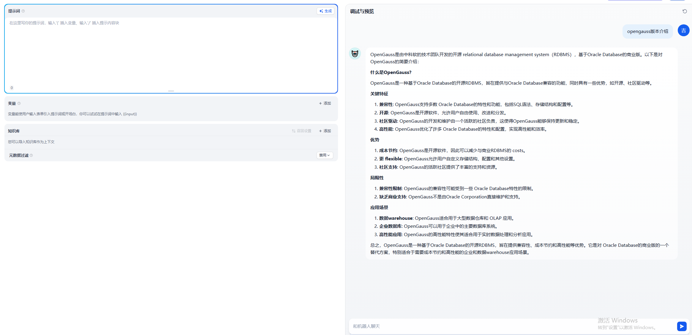
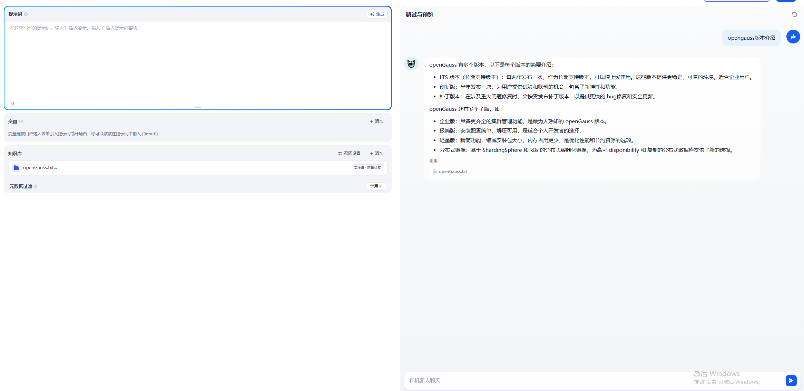

# openGauss Datavec + Dify，快速搭建你的智能助手平台
Dify是一个开源的大语言模型(LLM)应用开发平台。借助检索增强(RAG)引擎，可以对从智能体到复杂人工智能工作流程的大语言模型应用进行编排。
本文着重介绍如何部署Dify，并使用openGauss DataVec向量数据库作为RAG引擎语料库。

## Dify部署
### 获取Dify源码
访问链接https://github.com/langgenius/dify/archive/refs/tags/1.1.0.zip 获取Dify1.1.0源码。(Dify自1.1.0版本开始支持openGauss，本文以Dify1.1.0版本为例)

### 配置参数
创建目录并解压:
```bash
mkdir /usr/local/dify
unzip 1.1.0.zip -d /usr/local/dify/
cd /usr/local/dify/dify-1.1.0/docker
```
配置环境变量，修改.env中VECTOR_STORE=opengauss
```bash
cp .env.example .env
vim .env
```

### 启动容器
执行以下命令，自动拉取对应Docker镜像并启动服务。
```bash
docker-compose up -d
```
容器启动后执行docker ps确保服务都正常运行，如下图所示：


## AI服务集成
### 创建用户并登陆
访问本地部署的Dify web服务页面：
```bash
http://your_server_ip
```

创建管理员用户。输入邮箱及密码：


### 接入大模型
在主界面点击右上角用户名，然后点击“设置”进入设置页面，单击“模型供应商”，选择“Ollama”单击“安装”按钮。（ollama服务及大模型部署参考：[openGauss-RAG实践](https://opengauss.org/zh/blogs/jiwenke/openGauss-RAG%E5%AE%9E%E8%B7%B5.html)）


安装完成后，在添加模型页面，“模型类型”选择“LLM”，配置如下：





接着选择“Text Embeding”，配置如下：


### 导入语料
本文以openGauss语料知识为例，单击“知识库”标签，选择“导入已有文本”将本地语料导入。


“Embeding模型”选择之前配置好的模型，单击“保存并处理”。

等待语料处理完成并存入openGauss向量数据库。


### 对话
开启聊天窗口，输入问题等待回答：


可见回答质量很低，描述并不准确，接下来我们引入之前导入的语料库作为上下文再次进行问答：

借助于openGauss语料库，我们得到了更为准确的答案。至此，基于openGauss向量数据库的Dify RAG引擎搭建完成。