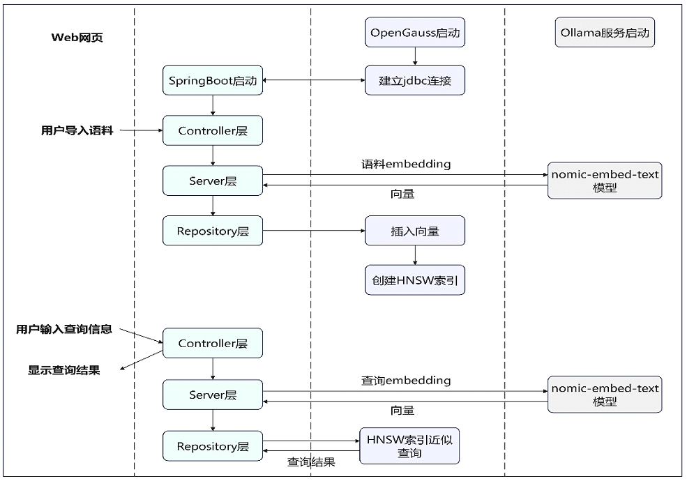

# Spring Boot集成openGauss DataVec实现向量化检索


本文将介绍如何在 Spring Boot 框架中集成 openGauss DataVec 向量数据库，并调用 Ollama 服务提供的 embedding 服务，以此高效实现数据的向量化存储与检索，为 RAG（检索增强生成）提供助力。
## 要求
- 安装java1.8及以上版本 
- Spring Boot 3.X及以上版本
- Ollama服务安装部署 [部署参考](https://github.com/ollama/ollama)
- openGauss数据库安装部署 [容器镜像安装](../InstallationGuide/容器镜像安装.md)

## 添加Maven依赖
在pom.xml中添加openGauss jdbc和ollama sdk依赖
```xml
<dependency>
    <groupId>org.opengauss</groupId>
    <artifactId>opengauss-jdbc</artifactId>
    <version>6.0.1</version>
</dependency>
<dependency>
    <groupId>org.springframework.ai</groupId>
    <artifactId>spring-ai-ollama-spring-boot-starter</artifactId>
    <version>1.0.0.M2</version>
</dependency>
```
## 配置yml文件
在application.properities文件中配置相应的数据信息
```
server.port=8088
spring.application.name=your_project_name

spring.datasource.url=jdbc:opengauss://localhost:port/database_name
spring.datasource.username=username
spring.datasource.password=password
spring.datasource.driver-class-name=org.opengauss.Driver

ollama.model=nomic-embed-text:latest // 你选择的embedding模型
ollama.modelDim=768 // 向量化后数据的维度
ollama.embeddingURL=ip:port // ollama服务运行的服务器ip和port
```

## 向量数据库配置和操作类
- 向量数据库的配置类，获取服务地址、用户名、密码等，并[建立连接](integrationJava.md)
```java
@Configuration
public class opgsConfig {
    @Value("${spring.datasource.url}")
    private String url;

    @Value("${spring.datasource.username}")
    private String username;

    @Value("${spring.datasource.password}")
    private String password;

    @Value("${spring.datasource.driver-class-name}")
    private String driver;

    public Connection getConnection() {
        // 连接数据库
    }
}
```
- 向量数据库的操作类，与数据库交互，完成增删改查，表、向量索引的创建等 [示例参考](integrationJava.md)
```java
@Repository
public class Repository {
    private Connection conn;

    public void CreateTable(int dim)
    {
        ...
    }

    public void CreateIndex()
    {
        ...
    }

    public void InsertDataSingle(int id, String content, String vector)
    {
        ...
    }

    public String findNearestVectors(int efsearch, String vector, int topK)
    {
        ...
    }
    ...
}
```
## Service层
调用Ollama服务将Controller层传递过来的原始数据embedding，并调用操作类中封装的API实现数据访问
```java
@Service
public class Service {
    private final Repository repository;

    @Value("${ollama.modelDim}")
    private int vectorDim;

    @Value("${ollama.embeddingURL}")
    private String embeddingURL;

    @Value("${ollama.model}")
    private String ollamaModel;


    // 调取Ollama服务embedding
    public float[] getEmbedding(String message)
    {
        OllamaApi ollamaApi = new OllamaApi(embeddingURL);
        OllamaOptions options = OllamaOptions.builder().withModel(ollamaModel).build();
        OllamaEmbeddingModel embeddingModel = new OllamaEmbeddingModel(ollamaApi, options);
        EmbeddingResponse embeddingResponse = embeddingModel.call(new EmbeddingRequest(List.of(message), options));
        return embeddingResponse.getResult().getOutput();
    }

    // 调取Repository类与向量数据库交互的API
    public void CreateTxtTable()
    {
        repository.CreateTable(vectorDim);
    }

    public void InsertTuples(int id, String message)
    {
        float[] res = getEmbedding(message);
        repository.InsertDataSingle(id, message, Arrays.toString(res));
    }

    public void IndexTxt()
    {
        repository.CreateIndex();
    }

    public String QueryContent(int efsearch, String query, int topK)
    {
        float[] res = getEmbedding(query);
        return repository.findNearestVectors(efsearch, Arrays.toString(res), int topK);
    }
    ...
}
```

## Controller层
```java
@RestController
public class Controller {
    @Autowired
    private Service service;

    @GetMapping("/index")
    public String IndexDoc()
    {
        service.CreateTxtTable();
        service.InsertTuples(0, "大规模预训练语言模型 高效并行训练 支持多种NLP任务");
        service.InsertTuples(1, "多模态融合模型 结合文本、图像和音频输入 提供全面的数据理解能力");
        service.InsertTuples(2, "分布式深度学习框架 易于扩展 支持大规模数据处理");
        service.InsertTuples(3, "视频理解与生成模型 先进的时间序列分析技术 适用于监控和娱乐");
        service.InsertTuples(4, "超高分辨率图像生成模型 GAN架构 强大的细节捕捉能力");
        service.IndexTxt();
        return "embedding and index succeed!"

    }

    @GetMapping("/queryVector")
    public String queryVector()
    {
        String query = "适合高效并行训练的大语言模型有哪些";
        int topK = 3;
        String res = service.QueryContent(2, query, topK);
        System.out.println(res);
        return res;
    }

}
```

## 结果展示
- 网页中输入localhost:8088/index完成文本的embedding和索引创建

页面会返回如下结果，用户可根据结果自定义前端页面
```
embedding and index succeed!
```
- 网页中输入localhost:8088/queryVector得到json格式的查询结果

```
[
    {
        "id": 0,
        "content": "大规模预训练语言模型 高效并行训练 支持多种NLP任务"
    },
    {
        "id": 4,
        "content": "超高分辨率图像生成模型 GAN架构 强大的细节捕捉能力"
    },
    {
        "id": 2,
        "content": "分布式深度学习框架 易于扩展 支持大规模数据处理"
    },
]
```