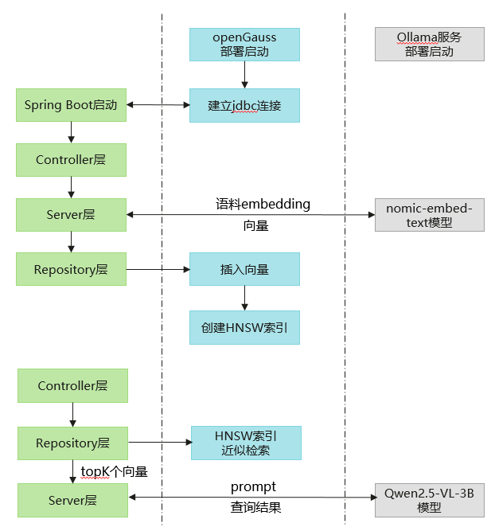
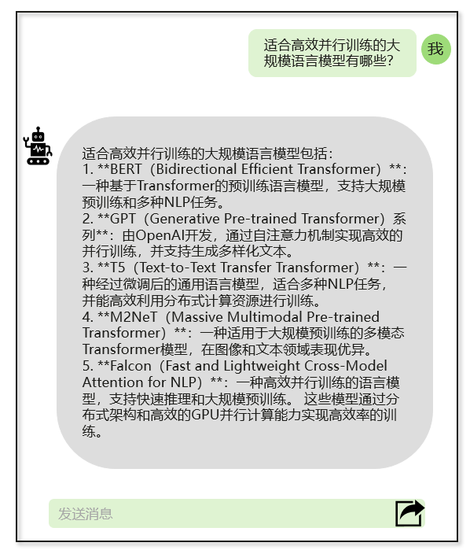

# Spring Boot集成openGauss DataVec实现高效RAG知识问答

随着人工智能和自然语言处理技术的发展，基于检索增强生成（RAG）的知识问答系统因其能够结合现有数据和模型能力，提供准确且有针对性的回答而受到广泛关注。Spring Boot 作为流行的 Java 开发框架，提供了快速构建和部署应用程序的能力，openGauss的向量数据库Datavec可以高效存储检索已知的语料库，以此构建一个高效的 RAG 知识问答系统，以满足企业在知识管理、客户服务等场景下快速、准确获取知识的需求，提升业务效率和用户体验。

本文将介绍如何在 Spring Boot 框架中集成 openGauss DataVec 向量数据库，实现数据的向量化存储与高效检索，构造Prompt并调用 Ollama 服务提供的 embedding 和 chat 服务，为 RAG（检索增强生成）提供助力。
## 要求
- 安装java1.8及以上版本 
- Spring Boot 3.X及以上版本
- Ollama服务安装部署 [部署参考](https://github.com/ollama/ollama)
- openGauss数据库安装部署 [容器镜像安装](https://docs.opengauss.org/zh/docs/latest-lite/docs/InstallationGuide/%E5%AE%B9%E5%99%A8%E9%95%9C%E5%83%8F%E5%AE%89%E8%A3%85.html)

## 添加Maven依赖
在pom.xml中添加openGauss jdbc和ollama sdk依赖
```xml
<dependency>
    <groupId>org.opengauss</groupId>
    <artifactId>opengauss-jdbc</artifactId>
    <version>6.0.1</version>
</dependency>
<dependency>
    <groupId>org.springframework.ai</groupId>
    <artifactId>spring-ai-ollama-spring-boot-starter</artifactId>
    <version>1.0.0-M5</version>
</dependency>
```
## 配置yml文件
在application.properities文件中配置相应的数据信息
```
// Spring Boot服务相关配置
server.port=8088
spring.application.name=your_project_name

// openGauss向量数据库相关配置
spring.datasource.url=jdbc:opengauss://localhost:port/database_name
spring.datasource.username=username
spring.datasource.password=password
spring.datasource.driver-class-name=org.opengauss.Driver

// ollama embedding服务相关配置
ollama.model=nomic-embed-text:latest // 你选择的embedding模型
ollama.modelDim=768 // 向量化后数据的维度
ollama.embeddingURL=ip:port // ollama服务运行的服务器ip和port

// ollama chat服务相关配置
spring.ai.ollama.base-url=ip:port // ollama服务运行的服务器ip和port
spring.ai.ollama.chat.model=qwen2.5:3b //你选择的推理大模型
```

## 向量数据库配置和操作类
- 向量数据库的配置类，获取服务地址、用户名、密码等，并[建立连接](integrationJava.md)
```java
@Configuration
public class opgsConfig {
    @Value("${spring.datasource.url}")
    private String url;

    @Value("${spring.datasource.username}")
    private String username;

    @Value("${spring.datasource.password}")
    private String password;

    @Value("${spring.datasource.driver-class-name}")
    private String driver;

    public Connection getConnection() {
        // 连接数据库
    }
}
```
- 向量数据库的操作类，与数据库交互，完成增删改查，表、向量索引的创建等 [示例参考](integrationJava.md)
```java
@Repository
public class Repository {
    private Connection conn;

    public void CreateTable(int dim)
    {
        ...
    }

    public void CreateIndex()
    {
        ...
    }

    public void InsertDataSingle(int id, String content, String vector)
    {
        ...
    }

    public String findNearestVectors(int efsearch, String vector, int topK)
    {
        ...
    }
    ...
}
```
## Service层
调用Ollama服务将Controller层传递过来的原始数据embedding，并调用操作类中封装的API实现数据访问
```java
@Service
public class Service {
    private final Repository repository;

    @Value("${ollama.modelDim}")
    private int vectorDim;

    @Value("${ollama.embeddingURL}")
    private String embeddingURL;

    @Value("${ollama.model}")
    private String ollamaModel;


    // 调取Ollama服务embedding
    public float[] getEmbedding(String message)
    {
        OllamaApi ollamaApi = new OllamaApi(embeddingURL);
        OllamaOptions options = OllamaOptions.builder().withModel(ollamaModel).build();
        OllamaEmbeddingModel embeddingModel = new OllamaEmbeddingModel(ollamaApi, options);
        EmbeddingResponse embeddingResponse = embeddingModel.call(new EmbeddingRequest(List.of(message), options));
        return embeddingResponse.getResult().getOutput();
    }

    // 调取Repository类与向量数据库交互的API
    public void CreateTxtTable()
    {
        repository.CreateTable(vectorDim);
    }

    public void InsertTuples(int id, String message)
    {
        float[] res = getEmbedding(message);
        repository.InsertDataSingle(id, message, Arrays.toString(res));
    }

    public void IndexTxt()
    {
        repository.CreateIndex();
    }

    public String QueryContent(int efsearch, String query, int topK)
    {
        float[] res = getEmbedding(query);
        return repository.findNearestVectors(efsearch, Arrays.toString(res), int topK);
    }

    public String BuildRagPrompt(String query, List<String> relatedContents, int maxLength)
    {
        List<String> seletedTexts = new ArrayList<>();
        int totalLen = 0;
        for (String content : relatedContents) {
            if (totalLen + content.length() < maxLength) {
                seletedTexts.add(content);
            } else {
                break;
            }
        }
        return String.format("根据以下信息用中文简洁回答：\n%s\n问题：%s\n答案：",
                             String.join("\n", seletedTexts),
                             query);
    }
    ...
}
```
- getEmbedding调用ollama的embedding服务（nomic-embed-text:latest模型）将message向量化。
- CreateTxtTable、InsertTuples、IndexTxt分别表示在向量数据库中创表、插入数据和构建HNSW向量索引。
- QueryContent先将查询query向量化，再根据传入的efsearch查询参数在向量数据库中查询topK个距离最近向量对应的原始内容。
- BuildRagPrompt根据查询query和语料库得到topK个最相近的内容构造大模型的输入prompt，这里限制prompt最长为maxLength。

## Controller层
```java
@RestController
public class Controller {
    @Autowired
    private Service service;

    private final ChatModel chatModel;

    public Controller(ChatModel chatModel)
    {
        this.chatModel = chatModel;
    }

    @GetMapping("/index")
    public String IndexDoc()
    {
        service.CreateTxtTable();
        service.InsertTuples(0, "大规模预训练语言模型 高效并行训练 支持多种NLP任务");
        service.InsertTuples(1, "多模态融合模型 结合文本、图像和音频输入 提供全面的数据理解能力");
        service.InsertTuples(2, "分布式深度学习框架 易于扩展 支持大规模数据处理");
        service.InsertTuples(3, "视频理解与生成模型 先进的时间序列分析技术 适用于监控和娱乐");
        service.InsertTuples(4, "超高分辨率图像生成模型 GAN架构 强大的细节捕捉能力");
        service.IndexTxt();
        return "embedding and index succeed!"

    }

    @GetMapping(value = "/chat", produces = "text/plain;charset=UTF-8")
    public String queryVector(@RequestParam(value = "message", defaultValue = "简单介绍一下openGauss") String query)
    {
        // String query = "适合高效并行训练的大语言模型有哪些";
        int topK = 2;
        int maxPromptLen = 100;

        List<String> res = service.QueryContent(2, query, topK);

        String generatePrompt = service.BuildRagPrompt(query, res, maxPromptLen);
        System.out.println("prompt:");
        System.out.println(generatePrompt);

        Flux<ChatResponse> stream = chatModel.stream(new Prompt(generatePrompt));
        return stream.map(resp -> resp.getResult().getOutput().getText());
    }

}
```
- IndexDoc表示将导入的语料库向量化，存储在openGauss向量数据库中，并构建HNSW索引。
- queryVector提取请求信息中的message作为query，若请求中没有message信息，默认query为"简单介绍一下openGauss"。此函数中调用QueryContent在openGauss向量数据库检索topK个最相关的内容，调用BuildRagPrompt构造prompt，最后调用ollama服务提供的Qwen2.5-VL-3B-Instruct模型完成推理，在前端页面流式输出结果。

## 结果展示
- 网页中输入localhost:8088/index完成文本的embedding和索引创建

页面会返回如下结果，用户可根据结果自定义前端页面
```
embedding and index succeed!
```
- 网页中输入localhost:8088/chat?message=适合高效并行训练的大语言模型有哪些
- 页面流式输出回答结果


## 总结
本文依托 Spring Boot 框架的开发优势，深度集成 openGauss DataVec 向量数据库，通过数据向量化处理技术，实现数据的结构化存储与毫秒级检索能力；针对 RAG 系统中语言模型的输入优化需求，构建适配业务场景的提示词模板，并调用 Ollama 服务提供的 embedding 和 chat 服务，前者完成文本特征提取与向量转换，后者基于大语言模型实现对话生成。通过上述技术的协同应用，实现数据检索与语言生成的有机结合，为 RAG 系统提供完整的技术解决方案，有效提升知识问答的准确性与响应效率。