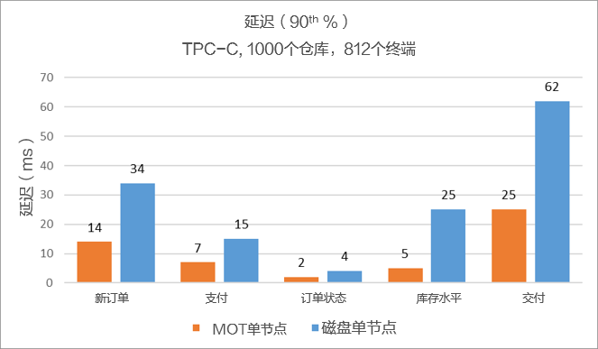

# MOT低延迟

以下是在Arm/鲲鹏两路服务器（128核）上进行测试的结果。单位为毫秒（ms）。

**图 1**  低延迟（90th%）性能基准  

MOT的平均事务速度为2.5倍，MOT延迟为10.5ms，而基于磁盘的表延迟为23至25ms。

> **说明：** 
>
>计算平均数时，已考虑TPC-C的5个事务分布占比。有关更多信息，请参阅[MOT样例TPC-C基准](MOT样例TPC-C基准.md)中关于TPC-C事务的说明。

**图 2**  低延迟（90th%，事务平均）性能基准  

