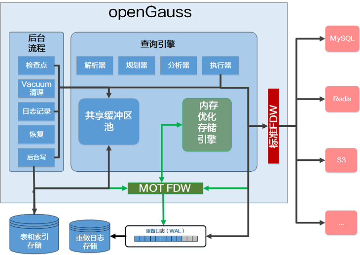

# MOT纵向扩容架构

纵向扩容即为同一台机器添加额外的核以增加算力。纵向扩容是传统上为单对控制器和多核的机器增加算力的常见形式。纵向扩容架构受限于控制器的可扩展性。

## 技术要求

MOT旨在实现以下目标：

-   **线性扩容**：MOT提供事务性存储引擎，利用单个NUMA架构服务器的所有核，以提供近线性的扩容性能。这意味着MOT的目标是在机器的核数和性能提升倍数之间实现直接的、近线性的关系。

> **说明：** 
>
>MOT的近线性扩容效果明显优于所有现有方案，并且尽可能接近于获得最佳效果，因现有方案皆受限于硬件（如电线）的物理限制和局限性。

-   **无最大核数限制**：MOT对最大核数不做任何限制。这意味着MOT可从单核扩展到高达1000秒的多核，并且新增的核退化速度最小，即便是在跨NUMA槽位边界的情况下。
-   **极高的事务性吞吐量**：MOT提供了一个事务性存储引擎，与市场上任何其他OLTP供应商相比，它能够实现极高的事务性吞吐量。
-   **极低的事务性时延**：与市场上任何其他OLTP供应商相比，MOT提供事务性存储引擎，可以达到极低的事务时延。
-   **无缝集成和利用openGauss产品**：MOT事务引擎与openGauss产品标准无缝集成。通过这种方式，MOT最大限度地重用了位于其事务性存储引擎顶部的openGauss层功能。

## 设计原则

为了实现上述要求（特别是在多核的环境中），我们存储引擎的体系结构实施了以下技术和策略：

-   数据和索引只存在于内存中。
-   数据和索引不用物理分区来布局（因为对于某些类型的应用程序，这些分区的性能可能会降低）。
-   事务并发控制基于乐观并发控制（OCC），没有集中的争用点。有关OCC的详细信息，请参见[MOT并发控制机制](MOT并发控制机制.md)。
-   使用平行重做日志（最后单位为核）来有效避免中央锁定点。
-   使用免锁索引。有关免锁索引的详细信息，请参见[MOT索引](MOT索引.md)。
-   使用NUMA感知内存分配，避免跨槽位访问，特别是会话生命周期对象。有关NUMA感知的更多信息，请参见[NUMA-aware分配和亲和性](NUMA-aware分配和亲和性.md)。
-   使用带有预缓存对象池的自定义MOT内存管理分配器，避免昂贵的运行时间分配和额外的争用点。这种专用的MOT内存分配器按需预先访问操作系统中较大的内存块，然后按需将内存分配给MOT，使内存分配更加高效。

## 使用外部数据封装（FDW）进行集成

MOT遵循并利用了openGauss的标准扩展机制——外部数据封装（FDW），如下图所示。

在外部数据封装特性的支持下，作为其他数据源的代理的MOT数据库可以创建外表，如MySQL、Redis、X3等。当对外表执行查询时，FDW将查询外部数据源并返回结果，就像查询内表一样。

openGauss依赖外部数据封装和索引支持，因此SQL完全覆盖，包括存储过程、用户定义函数、系统函数调用。

**图 1**  MOT架构  

上图中绿色表示MOT引擎，蓝色表示现有的openGauss组件。由此可见，FDW在MOT引擎和openGauss组件之间进行中介。

**与MOT相关的FDW定制**

通过FDW集成MOT可以重用最上层的openGauss功能，从而显著缩短MOT的上市时间，同时不影响SQL的覆盖范围。

但是，openGauss中原有的FDW机制并不是为存储引擎扩展而设计的，因此缺少以下基本功能：

-   查询规划阶段待计算的外表的索引感知
-   完整的DDL接口
-   完整的事务生命周期接口
-   检查点接口
-   重做日志接口
-   恢复接口
-   真空接口

为了支持所有缺失的功能，SQL层和FDW接口层已扩展，从而为插入MOT事务存储引擎提供必要的基础设施。

## 结果：线性扩容

以下是上述MOT设计原则和实现的结果：

MOT在符合ACID工作负载的事务吞吐量方面优于所有现有的工业级OLTP数据库。

openGauss和MOT在以下多核系统上进行了测试，性能可扩展性良好。在x86架构Intel和ARM/鲲鹏架构的多核服务器上进行了测试。详细的性能评估请参见[MOT性能基准](MOT性能基准.md)。

以2020年6月的TPC-C基准测试了一台泰山2480服务器上的openGauss MOT数据库（4路ARM/鲲鹏服务器，吞吐量：480万tpmC）。下图显示了MOT数据库的近线性性质，即MOT数据库通过增加核数显著提高性能。

**图 2**  ARM上的TPC-C（256核）  

下面是另一个测试示例，一台基于x86的服务器上也显示了CPU使用率。

**图 3**  tpmC 对比CPU使用率  

图表显示，MOT性能提高与核数增加有显著的相关性。随着核数的增加，MOT对CPU的消耗也越来越大。其他行业解决方案不能提高MOT性能，有时性能甚至略有下降，影响客户的CAPEX和OPEX支出以及运营效率。这是数据库行业的公认问题。

