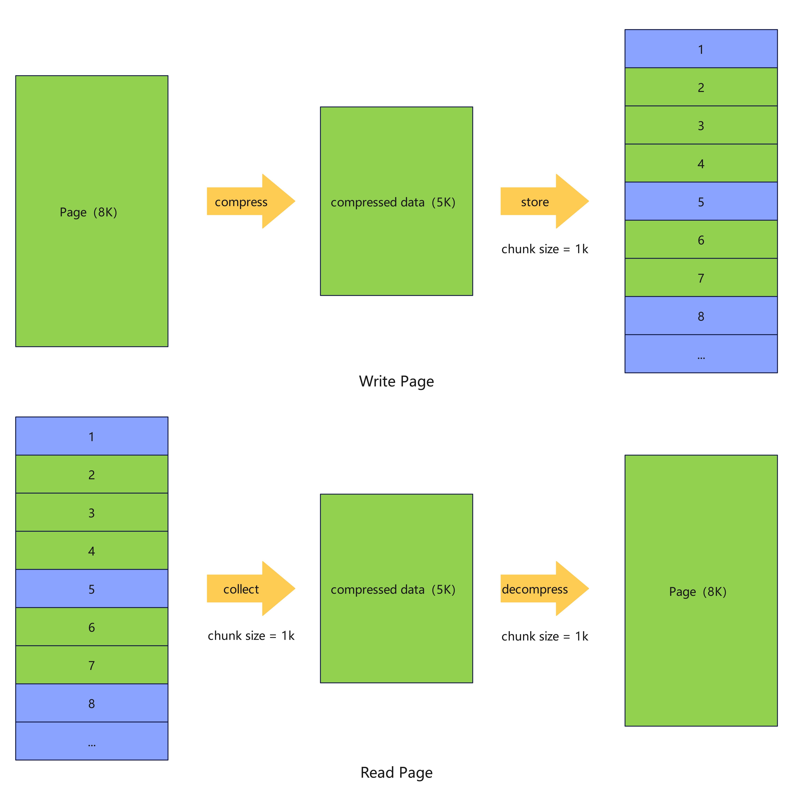
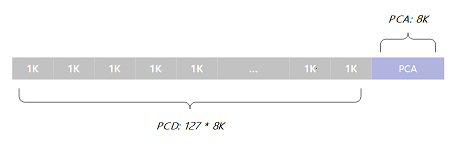
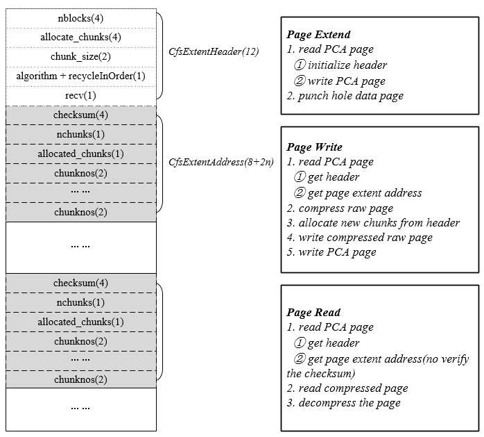
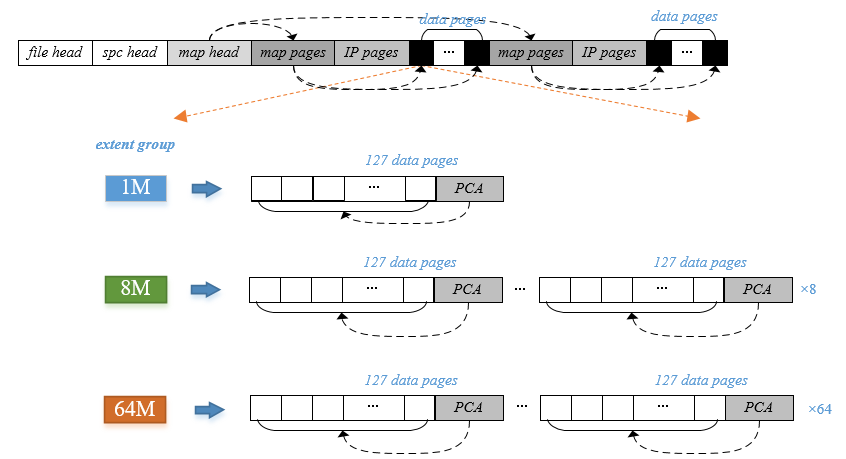

# 支持OLTP场景数据压缩

## 可获得性

本特性自openGauss 3.0.0版本开始引入。

在openGauss 3.1.0版本中将pca文件和pcd文件整合为一个文件；pca独立进行加载淘汰管理，不再依赖mmap操作；新增chunk碎片整理操作。

在openGauss 5.1.0版本支持修改行存表的压缩相关参数。

正式商用版本将在openGauss7.0.0 版本发布。

## 特性简介

OLTP场景下，对行存表(包括Ustore和Astore)的数据和索引页面，openGauss提供基于通用压缩算法的透明页压缩功能，降低磁盘空间占用的同时保持OLTP场景下的高性能。

## 客户价值

数据压缩，降低存储空间占用，同时维持较高OLTP性能。

## 特性描述

openGauss OLTP场景数据压缩，采用透明页压缩的方式实现，在单个页面的写磁盘流程中，首先调用压缩算法进行压缩，压缩后的数据以chunk为单位组织，而后落盘。chunk的大小可以在表定义中配置，与页面大小相关，可选配置为1/2、1/4、1/8或1/16个页面大小。读磁盘逻辑与之相反，首先读取属于同一页面的所有chunk，拼接成压缩后数据，解压后再加载到缓存中。上述改动在文件接口层实现，对于上层接口来讲，这些改动是透明的。

以一个页面为8K，chunk大小为1k，且压缩后大小为5K的页面为例，读写过程中，其原始数据和压缩存储的数据对应关系如图：



压缩后的数据存于一定数量的chunk中，而这些chunk的数量和位置信息也需要存储，这两部分内容分别存储于pcd（页面压缩数据）和pca（页面压缩地址）两个区域内，pcd存储以chunk为单位的压缩后数据，pca存储每个页面对应的chunk数量和地址等信息。如下图所示：



一个pca页面管理127个pcd页面大小的空间，对应128个未压缩的数据页面，称为压缩中的一个`cfsExtent`。由于压缩后数据小于等于原始页面大小（若压缩后变大则不进行压缩），因此一个`cfsExtent`的末尾通常会有空闲空间未被占用，这部分空间我们采用文件系统punch hole的方式分配，不占用实际的磁盘空间，从而实现磁盘空间的压缩。

openGauss压缩采用通用压缩算法，可选算法有：ZSTD、PGLZ和ZLIB。这些通用压缩算法的解压性能通常较压缩算法要好很多，因此压缩特性对读取页面性能影响较小。而对于页面落盘操作，通常由后台线程异步执行，因此对用户sql性能影响也较小。

## 特性约束

- 仅支持行存表和索引的压缩，即普通行存表、Btree/UBtree索引压缩，支持页式存储与段页式存储。
- 操作系统必须支持punch hole操作。
- 数据备份介质必须支持punch hole操作。
- 支持修改行存表的压缩相关参数，修改压缩相关参数会对行存表做重建。不支持修改索引的压缩相关参数。
- 压缩和解压缩的操作会对CPU、性能有一定的影响，优点是增大磁盘的存储能力，提高磁盘利用率，同时节省磁盘IO，减少磁盘IO压力。
- 3.1.0 版本起至7.0.0 版本前，功能转为非商用特性，创建或修改行存压缩数据库对象时，需开启GUC参数`support_extended_features`。
- 7.0.0 版本前不支持段页式。

## 依赖关系

- 要求数据库支持双写操作。
- 压缩时使用开源压缩算法PGLZ、ZSTD和ZLIB。
- 若服务器已安装KAE，并配置相应路径到LD_LIBRARY_PATH，则可使用硬件加速的KAEZstd与KAEZlib代替原生ZSTD和ZLIB，使相应压缩和解压接口的效率提升，CPU使用率降低。KAE简介与安装指导见：[KAE产品简介](https://www.hikunpeng.com/document/detail/zh/kunpengaccel/compress/devg-kaezip/kunpengaccel_kaezip_0001.html)。

## 基本原理

### 压缩页面读写

一个压缩数据`cfsExtent`，由一个pca页面管理，其详细结构如下图：



一个pca页面由头部的`CfsExtentHeader`和多个`CfsExtentAddress`组成。`CfsExtentHeader`中，`nblocks`为`cfsExtent`中逻辑页面个数，`allocate_chunks`表示当前pcd中已分配的chunk数，同时也表示已申请的最后一个chunk的编号，`chunk_size`为单个chunk的大小，`chunk_size`后的一字节存储了压缩算法以及碎片空间整理信息，最后一个字节`recv`为预留。

`CfsExtentAddress`与每个逻辑数据页面一一对应，前4字节为`chunksum`，`nchunks`和`allocated_chunks`各占1字节，分别代表压缩后数据当前占用chunk个数，以及该逻辑页面实际分配的chunk个数，后面为`chunknos`列表，每个占2字节，总共为1个逻辑页面最大可能的chunk数量，其中前`allocated_chunks`有效。例如，页面大小为8k，`chunk_size`为1k则此处`chunknos`为8个，如果压缩后数据占5k且只分配了5个chunk，则后3个`chunknos`无效。

前文介绍过内存逻辑页面和磁盘压缩数据存储的转化，而上图结合pca展示了压缩数据的页面读写流程。

页面写入：

- 根据逻辑页号计算其所在`cfsExtent`和`cfsExten`t内序号，读取cfsExtent内pca页面，获取`CfsExtentHeader`，以及该逻辑页面的地址信息结构`CfsExtentAddress`；
- 通过通用压缩算法压缩数据，并以chunk_size为单位切分数据；
- 从extent内分配相应数量chunk，更新内存`CfsExtentHeader`和`CfsExtentAddress`；
- 将压缩后数据写入磁盘相应chunk内；
- 将`CfsExtentHeader`和`CfsExtentAddress`改动写入磁盘。

页面读取：

- 根据逻辑页号计算其所在`cfsExtent`和`cfsExtent`内序号，读取`cfsExtent`内pca页面，获取`CfsExtentHeader`，以及该逻辑页面的地址信息结构`CfsExtentAddress`；
- 读取所有chunk，拼接成压缩后数据；
- 调用通用解压算法解压缩。

extent扩展：

- 初始化`CfsExtentHeader`，pca页面落盘；
- 以punch hole方式分配128个页面的pcd空间（不占用实际磁盘空间）。

### 碎片整理

正常情况下，新页面压缩落盘时，在pcd空间内占用的是连续的chunk，而随着数据的变化，压缩后数据大小也会变化，这就导致需要分配新chunk，或者已分配的chunk实际没有数据填充。前者会导致读盘时额外的IO读取次数，影响性能，后者会导致压缩率的劣化。为解决这些问题，压缩特性提供了碎片整理接口，整理后的页面对应chunk全部连续，按pca中`CfsExtentAddress`顺序依次排列。

### 段页式适配

段页式的详细介绍可见[段页式存储结构](../DatabaseAdministrationGuide/段页式存储结构.md)。段页式下，数据分布满足如下特点：

- 每个`<tablespace, database>`共享同一个段页式空间（`SegSpace`），其中包含5个`Group`，每个`Group`对应1个逻辑文件，相同类型的extent存放在同一个逻辑文件中，逻辑文件由多个1G物理文件组成，例如`Group 0`对应逻辑文件的文件名为1，其由1、1.1、1.2等一系列物理文件组成，每个物理文件大小上限为1G，超过1G则触发下个物理文件的创建；

- 每个表/索引有一个逻辑上的`segment`，该表的所有数据都存在该`segment`上；

- 每个`segment`会挂载多个`extent`（段页式中的区，不同于压缩的`cfsExtent`），每个`extent`是一块连续的物理页面，`extent`之间不一定连续，但是同一个`extent`中的`page`连续。与此同时，每个`segment`能够申请的每种类型的`extent`的数量和顺序都是确定的，`Group 0`中的`extent`用于存储元数据，对于每个`segment`，在其余4个`Group`中存储的`extent`范围可见下表`Extent count range`，例如每个`segment`只能在`Group 1`也就是逻辑文件2中申请16个extent，每个extent大小为64K（注意这里的`extent count`为1到16是单个`segment`内的序号，实际上逻辑文件2内包含了该段页式空间下所有`segment`的前16个`extent`）。

| Group | Extent size | Extent logical page count | Extent count range | Total logical page count | Total size | File Name |
| ----- | ----------- | ------------------------- | ------------------ | ------------------------ | ---------- | --------- |
| 0     | 8K          | 1                         | /                  | /                        | /          | 1         |
| 1     | 64K         | 8                         | [1, 16]            | 128                      | 1M         | 2         |
| 2     | 1M          | 128                       | [17, 143]          | 16384                    | 128M       | 3         |
| 3     | 8M          | 1024                      | [144, 255]         | 128K                     | 1G         | 4         |
| 4     | 64M         | 8192                      | [256, ...]         | ...                      | ...        | 5         |

段页式表和索引也支持压缩，但由于段页式数据本身以段页式`extent`粒度组织，压缩数据以`cfsExtent`粒度组织，因此对于段页式压缩场景，这两者需要做一个适配。

由于cfsExtent包含128个页面（127个逻辑页面+1个PCA页面），以group 2为例，一个extent正好是128个页面，若分配给压缩表，其实际上由1个cfsExtent组成，因此只能够存储127个逻辑页面。同理，group 3和group 4的每个extent分别由8个以及64个cfsExtent构成。每个cfsExtent内的处理逻辑和页式存储一致，分配128个页面后，pcd区域初始化时采用punch hole打洞，不占用实际空间，到数据写入时才分配空间。而对于group 1，由于其本身extent大小小于1个cfsExtent，即使分配给压缩表，其数据也不会被压缩。



| Group | Extent size | Extent logical page count | Extent count range | Total logical page count | Total size | File Name |
| ----- | ----------- | ------------------------- | ------------------ | ------------------------ | ---------- | --------- |
| 0     | 8K          | 1                         | /                  | /                        | /          | 1         |
| 1     | 64K         | 8                         | [1, 16]            | 128                      | 1M         | 2         |
| 2     | 1M          | 127                       | [17, 143]          | 16252                    | 128M       | 3         |
| 3     | 8M          | 1016                      | [144, 255]         | 127K                     | 1G         | 4         |
| 4     | 64M         | 8128                      | [256, ...]         | ...                      | ...        | 5         |

由于pca页面的存在，压缩表分配到的段页式extent只能表示原有的`127/128`的页面，如1M extent对于非压缩表来说能存放128个页，而若表为压缩表，则这个extent只能存放127个逻辑页面。因此，对于段页式压缩表，逻辑页号和物理页号的转换如上图，group 2、3、4内的extent能够表示的页面变为原有的`127/128`。

### 开启KAE

安装KAE后，在环境变量中配置KAEZlib的lib路径后，启动openGauss，即可使用KAEZlib库(注意KAE的lib路径要放到openGauss自带的zlib库之前)。配置方式如下：

```shell
#配置KAEZlib的lib路径到环境变量
export LD_LIBRARY_PATH=/usr/local/kaezip/lib:$LD_LIBRARY_PATH
```

## 使用指导

相关参数见[高效数据压缩算法相关参数](../DatabaseReference/高效数据压缩算法相关参数.md)。

### 使用示例

- 建压缩表

```sql
-- 页式存储
create table tbl (c_int1 int, c_int2 int) with (compresstype=2,compress_chunk_size=1024,compress_level=1);
-- 段页式存储
create table tbl (c_int1 int, c_int2 int) with (segment=on, compresstype=2,compress_chunk_size=1024,compress_level=1);
```

- 建压缩主键和索引

```sql
-- 创建主键时指定压缩
alter table tbl add constraint tbl_pkey primary key (c_int) WITH (compresstype=2, compress_chunk_size=1024, compress_level=1);
-- 创建索引时指定压缩
create index tbl_idx on tbl (c_int2) WITH (compresstype=2, compress_chunk_size=1024, compress_level=1);
```

- alter表支持压缩

```sql
create table tbl (c_int1 int, c_int2 int);
alter table tbl set (compresstype=2,compress_chunk_size=1024,compress_level=1);
```

- 碎片整理

```sql
shrink table tbl;
```
