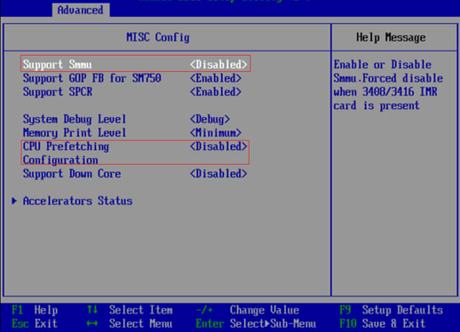

# BIOS配置

1.  恢复BIOS出厂设置。
2.  修改相关BIOS设置，如下所示：
    1.  **BIOS\>Advanced\>MISC Config，配置Support Smmu为Disabled**，如[图1](#zh-cn_topic_0283136610_zh-cn_topic_0263913266_fig1464144318512)所示。

        **图 1**  修改BIOS设置（1）  
        

    2.  **BIOS\>Advanced\>MISC Config，配置CPU Prefetching Configuration为Disabled**，如[图1](#zh-cn_topic_0283136610_zh-cn_topic_0263913266_fig1464144318512)所示。
    3.  **BIOS\>Advanced\>Memory Config，配置Die Interleaving为Disable**，如[图2](#zh-cn_topic_0283136610_zh-cn_topic_0263913266_fig6430185319610)所示。

        **图 2**  修改BIOS设置（2）  
        

3.  重启BIOS系统。

