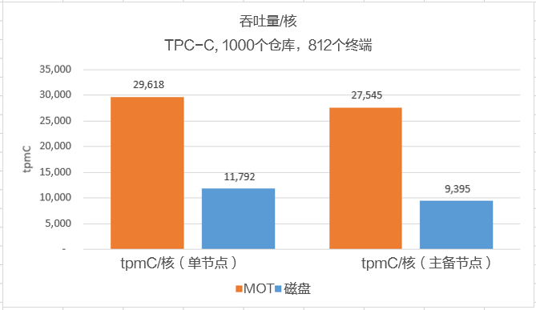

# MOT高吞吐量

MOT高吞吐量测试结果如下。

## Arm/鲲鹏2路128核

-   **性能**

    下图是华为Arm/鲲鹏2路128核服务器TPC-C基准测试的结果。

    一共进行了四类测试：

    -   MOT和openGauss基于磁盘的表各进行了2次测试。
    -   其中两项测试是在单节点（无高可用性）上执行，这意味着没有向备节点执行复制。其余两个测试在主备节点（有高可用性）上执行，即写入主节点的数据被复制到备节点。

    MOT用橙色表示，基于磁盘的表用蓝色表示。

    **图 1**  Arm/鲲鹏2路128核性能基准  
    

    结果表明：

    -   正如预期的那样，在所有情况下，MOT的性能明显高于基于磁盘的表。
    -   单节点：MOT性能为380万tpmC，而基于磁盘的表为150万tpmC。
    -   主备节点：MOT性能为350万tpmC，而基于磁盘的表为120万tpmC。
    -   相比单节点（无高可用性，无复制），在有复制需求的生产级（高可用性）服务器（主备节点）上，使用MOT的好处更显著。
    -   同在主备高可用场景下，MOT复制开销：Arm/鲲鹏为7%，x86为2%；而基于磁盘的表复制开销：Arm/鲲鹏为20%；x86为15%。

-   **单CPU核性能**

    下图是华为Arm/鲲鹏服务器2路128核的单核TPC-C基准性能/吞吐量测试结果。同样地，一共进行了四类测试：

    **图 2**  Arm/鲲鹏2路128核的单核性能标杆  
    

    结果表明，正如预期的那样，在所有情况下，MOT的单核性能明显高于基于磁盘的表。相比单节点（无高可用性，无复制），在有复制需求的生产级（高可用性）服务器（主备节点）上，使用MOT的好处更显著。

## Arm/鲲鹏4路256核

下面通过单连接数的tpmC来展示MOT出色的并发控制性能。

**图 3**  Arm/鲲鹏4路256核性能基准  

结果表明，随着核数增多，性能也显著提高，在768核时性能达到480万tpmC的峰值。

## x86服务器

-   **8路384核**

下面通过比较基于磁盘的表和MOT之间单连接数的tpmC，来展示MOT出色的并发控制性能。本次测试以8路384核x86服务器为例。橙色表示MOT的结果。

**图 4**  8路384核x86服务器性能基准  

结果表明，在386核服务器上，MOT的性能明显优于基于磁盘的表，并且单核性能非常高，达到300万tpmC/核。

-   **4路96核**

在4路96核服务器上，MOT实现了390万tpmC。下图展示了高效MOT的单核性能达到4万tpmC/核。

**图 5**  4路96核服务器性能基准  

