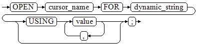

# 执行动态查询语句<a name="ZH-CN_TOPIC_0289899940"></a>

介绍执行动态查询语句。openGauss提供两种方式：使用EXECUTE IMMEDIATE、OPEN FOR实现动态查询。前者通过动态执行SELECT语句，后者结合了游标的使用。当需要将查询的结果保存在一个数据集用于提取时，可使用OPEN FOR实现动态查询。

## EXECUTE IMMEDIATE<a name="zh-cn_topic_0283136869_zh-cn_topic_0237122225_zh-cn_topic_0059778916_sce9164bf21df416f9160ba60d5b29f4a"></a>

语法图请参见[图1](#zh-cn_topic_0283136869_zh-cn_topic_0237122225_zh-cn_topic_0059778916_f67de6df4c6ef4404b41f0f30de36ee64)。

**图 1**  EXECUTE IMMEDIATE dynamic\_select\_clause::=<a name="zh-cn_topic_0283136869_zh-cn_topic_0237122225_zh-cn_topic_0059778916_f67de6df4c6ef4404b41f0f30de36ee64"></a>  


using\_clause子句的语法图参见[图2](#zh-cn_topic_0283136869_zh-cn_topic_0237122225_zh-cn_topic_0059778916_fcfce5c125aec449ba3ce27eec6f7a82b)。

**图 2**  using\_clause::=<a name="zh-cn_topic_0283136869_zh-cn_topic_0237122225_zh-cn_topic_0059778916_fcfce5c125aec449ba3ce27eec6f7a82b"></a>  


对以上语法格式的解释如下：

-   define\_variable：用于指定存放单行查询结果的变量。
-   USING IN bind\_argument：用于指定存放传递给动态SQL值的变量，即在dynamic\_select\_string中存在占位符时使用。
-   USING OUT bind\_argument：用于指定存放动态SQL返回值的变量。

    > **须知：** 
    >-   查询语句中，into和out不能同时存在；
    >-   占位符命名以“:”开始，后面可跟数字、字符或字符串，与USING子句的bind\_argument一一对应；
    >-   bind\_argument只能是值、变量或表达式，不能是表名、列名、数据类型等数据库对象，即不支持使用bind\_argument为动态SQL语句传递模式对象。如果存储过程需要通过声明参数传递数据库对象来构造动态SQL语句（常见于执行DDL语句时），建议采用连接运算符“||”拼接dynamic\_select\_clause；
    >-   动态PL/SQL块允许出现重复的占位符，即相同占位符只能与USING子句的一个bind\_argument按位置对应。


```

```

## OPEN FOR<a name="zh-cn_topic_0283136869_zh-cn_topic_0237122225_zh-cn_topic_0059778916_s597e59e4f39f4c5396fe9a6d1e6c6c09"></a>

动态查询语句还可以使用OPEN FOR打开动态游标来执行。

语法参见[图3](#zh-cn_topic_0283136869_zh-cn_topic_0237122225_zh-cn_topic_0059778916_f3f108da94a694175ac707f4511b7f1a1)。

**图 3**  open\_for::=<a name="zh-cn_topic_0283136869_zh-cn_topic_0237122225_zh-cn_topic_0059778916_f3f108da94a694175ac707f4511b7f1a1"></a>  


参数说明：

-   cursor\_name：要打开的游标名。
-   dynamic\_string：动态查询语句。
-   USING value：在dynamic\_string中存在占位符时使用。

游标的使用请参考[游标](游标.md)。

