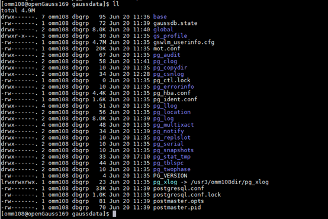

# 测试TPCC性能<a name="ZH-CN_TOPIC_0289900017"></a>

1.  下载TPCC标准测试工具BenchmarkSQL5.0**。**
2.  将目录lib/postgresql下面的\*.jar 替换为openGauss适配的jar包。

    ```
    $ pwd 
    /your path/benchmarksql-5.0/lib/postgres 
    $ ls 
    postgresql.jar #openGauss jdbc驱动。 
    postgresql-9.3-1102.jdbc41.jar.bak    # 自带jar备份。
    ```

    openGauss适配的JDBC版本包获取路径为[openGauss-x.x.x-JDBC .tar.gz](https://opengauss.org/zh/download/)。

3.  进入benchmarksql-5.0根目录, 输入ant命令进行编译。

    ```
    $ cd /your path/benchmarksql-5.0/ 
    $ ant
    ```

    编译成功后会生成build和dist两个目录。

4.  创建benchmarkSQL配置文件，使用benchmarkSQL前需要配置数据库相关的信息, 包括数据库账号、密码、端口、数据库名称.。

    ```
    $ cd /your path/benchmarksql-5.0/run 
    $ cp props.pg props.openGauss.1000w 
    $ vim props.openGauss.1000w
    ```

    从props.pg拷贝一份配置文件并按如下修改，斜体处请根据真实情况进行修改。

    ```
    db=postgres 
    driver=org.postgresql.Driver 
    // 修改连接字符串, 包含IP、端口号、数据库，其中8.92.4.238为数据库服务端的千兆网卡IP。
    conn=jdbc:postgresql://8.92.4.238:21579/tpcc1000?prepareThreshold=1&batchMode=on&fetchsize=10 
    // 设置数据库登录用户和密码。
    user=bot 
    password=XXXXXXXX 
      
    warehouses=1000 
    loadWorkers=200 
      
    // 设置最大并发数量, 跟服务端最大work数对应。 
    terminals=812 
    //要为每个终端运行指定事务--runMins必须等于零
    runTxnsPerTerminal=0 
    //要运行指定的分钟 - runTxnsPerTerminal必须等于零
    runMins=5 
    //每分钟总事务数
    limitTxnsPerMin=0 
      
     
    //在4.x兼容模式下运行时，设置为True。
    //设置为false以均匀使用整个配置的数据库。
    terminalWarehouseFixed=false 
      
    //以下五个值相加之和为100。
    //45、43、4、4和4的默认百分比与TPC-C规范匹配。
    newOrderWeight=45 
    paymentWeight=43 
    orderStatusWeight=4 
    deliveryWeight=4 
    stockLevelWeight=4 
      
    //创建文件夹以收集详细结果数据。
    //通过注释取消此内容。
    resultDirectory=my_result_%tY-%tm-%td_%tH%tM%tS 
    osCollectorScript=./misc/os_collector_linux.py 
    osCollectorInterval=1 
    //收集OS负载信息。
    osCollectorSSHAddr=osuer@10.44.133.78    
    osCollectorDevices=net_enp3s0 blk_nvme0n1 blk_nvme1n1 blk_nvme2n1 blk_nvme3n1
    ```

5.  TPCC导入数据前准备。

    使用如下文件替换benchmarkSQL中的文件，路径为benchmarksql-5.0/run/sql.common/。该文件主要增加了两个表空间和一些附加数据属性。

    ```
    CREATE TABLESPACE example2 relative location 'tablespace2';
    CREATE TABLESPACE example3 relative location 'tablespace3';
    
    create table bmsql_config (
      cfg_name    varchar(30),
      cfg_value   varchar(50)
    );
    
    create table bmsql_warehouse (
      w_id        integer   not null,
      w_ytd       decimal(12,2),
      w_tax       decimal(4,4),
      w_name      varchar(10),
      w_street_1  varchar(20),
      w_street_2  varchar(20),
      w_city      varchar(20),
      w_state     char(2),
      w_zip       char(9)
    ) WITH (FILLFACTOR=80);
    
    create table bmsql_district (
      d_w_id       integer       not null,
      d_id         integer       not null,
      d_ytd        decimal(12,2),
      d_tax        decimal(4,4),
      d_next_o_id  integer,
      d_name       varchar(10),
      d_street_1   varchar(20),
      d_street_2   varchar(20),
      d_city       varchar(20),
      d_state      char(2),
      d_zip        char(9)
     ) WITH (FILLFACTOR=80);
    
    create table bmsql_customer (
      c_w_id         integer        not null,
      c_d_id         integer        not null,
      c_id           integer        not null,
      c_discount     decimal(4,4),
      c_credit       char(2),
      c_last         varchar(16),
      c_first        varchar(16),
      c_credit_lim   decimal(12,2),
      c_balance      decimal(12,2),
      c_ytd_payment  decimal(12,2),
      c_payment_cnt  integer,
      c_delivery_cnt integer,
      c_street_1     varchar(20),
      c_street_2     varchar(20),
      c_city         varchar(20),
      c_state        char(2),
      c_zip          char(9),
      c_phone        char(16),
      c_since        timestamp,
      c_middle       char(2),
      c_data         varchar(500)
    ) WITH (FILLFACTOR=80) tablespace example2;
    
    create sequence bmsql_hist_id_seq;
    
    create table bmsql_history (
      hist_id  integer,
      h_c_id   integer,
      h_c_d_id integer,
      h_c_w_id integer,
      h_d_id   integer,
      h_w_id   integer,
      h_date   timestamp,
      h_amount decimal(6,2),
      h_data   varchar(24)
    ) WITH (FILLFACTOR=80);
    
    create table bmsql_new_order (
      no_w_id  integer   not null,
      no_d_id  integer   not null,
      no_o_id  integer   not null
    ) WITH (FILLFACTOR=80);
    
    create table bmsql_oorder (
      o_w_id       integer      not null,
      o_d_id       integer      not null,
      o_id         integer      not null,
      o_c_id       integer,
      o_carrier_id integer,
      o_ol_cnt     integer,
      o_all_local  integer,
      o_entry_d    timestamp
    ) WITH (FILLFACTOR=80);
    
    create table bmsql_order_line (
      ol_w_id         integer   not null,
      ol_d_id         integer   not null,
      ol_o_id         integer   not null,
      ol_number       integer   not null,
      ol_i_id         integer   not null,
      ol_delivery_d   timestamp,
      ol_amount       decimal(6,2),
      ol_supply_w_id  integer,
      ol_quantity     integer,
      ol_dist_info    char(24)
    ) WITH (FILLFACTOR=80);
    
    create table bmsql_item (
      i_id     integer      not null,
      i_name   varchar(24),
      i_price  decimal(5,2),
      i_data   varchar(50),
      i_im_id  integer
    );
    
    create table bmsql_stock (
      s_w_id       integer       not null,
      s_i_id       integer       not null,
      s_quantity   integer,
      s_ytd        integer,
      s_order_cnt  integer,
      s_remote_cnt integer,
      s_data       varchar(50),
      s_dist_01    char(24),
      s_dist_02    char(24),
      s_dist_03    char(24),
      s_dist_04    char(24),
      s_dist_05    char(24),
      s_dist_06    char(24),
      s_dist_07    char(24),
      s_dist_08    char(24),
      s_dist_09    char(24),
      s_dist_10    char(24)
    ) WITH (FILLFACTOR=80) tablespace example3;
    ```

6.  导入数据。
    1.  创建数据库用户。

        ```
        create user bot identified by 'Gaussdba@Mpp' profile default; 
        alter user bot sysadmin; 
        create database tpcc1000 encoding 'UTF8' template=template0 owner tpcc5q;
        ```

    2.  执行如下命令导入数据。

        ```
        ./runDatabaseBuild.sh props.openGauss.1000w
        ```

7.  <a name="zh-cn_topic_0283137363_zh-cn_topic_0263913274_li11139125793619"></a>备份数据。

    为了方便多次测试， 减少导入数据的时间，可以通过停止数据库，将整个数据目录执行一次拷贝对数据库进行备份。

8.  <a name="zh-cn_topic_0283137363_zh-cn_topic_0263913274_li1840654753618"></a>对数据进行分盘。

    在性能测试过程中，为了增加IO的吞吐量，需要将数据分散到不同的存储介质上。由于机器上有4块NVME盘，可以将数据分散到不同的盘上。 将pg\_xlog、tablespace2、tablespace3这三个目录放置在其他3个NVME盘上，并在原有的位置给出指向真实位置的软连接。pg\_xlog位于数据库目录下，tablespace2、tablespace3分别位于数据库目录pg\_location下。对tablespace2分盘的命令如下:

    ```
    mv $DATA_DIR/pg_location/tablespace2 $TABSPACE2_DIR/tablespace2 
    cd $DATA_DIR/pg_location/ 
    ln -svf $TABSPACE2_DIR/tablespace2 ./
    ```

    创建完成后的效果如下图：

    

    

9.  运行TPCC程序。

    ```
    numactl –C 0-19,32-51,64-83,96-115 ./runBenchmark.sh props.openGauss.1000w
    ```

    运行后的结果如下图，tpmC部分即为测试结果。

    

10. <a name="zh-cn_topic_0283137363_zh-cn_topic_0263913274_li202511145123814"></a>验证数据测试过程正确性。

    使用htop监控数据库服务端和tpcc客户端CPU利用情况，最佳性能测试情况下，各个业务CPU的占用率都非常高（\> 90%）。如果有CPU占用率没有达标，可能是绑核方式不对或其他问题，需要定位找到根因进行调整。

    下图是最佳性能测试情况下所有CPU的使用情况，其中黄线框中的是处理网络中断的CPU。

    

11. 如果为了避免数据的干扰，需要进行重新测试，可以通过[步骤7](#zh-cn_topic_0283137363_zh-cn_topic_0263913274_li11139125793619)备份的数据通过拷贝的方式恢复数据。重复[步骤8](#zh-cn_topic_0283137363_zh-cn_topic_0263913274_li1840654753618)\~[步骤10](#zh-cn_topic_0283137363_zh-cn_topic_0263913274_li202511145123814)可以重新进行测试。

