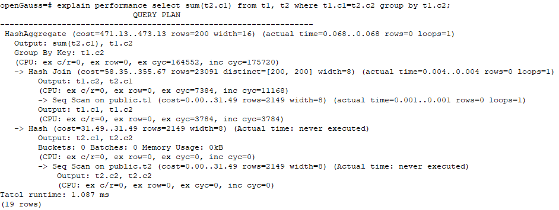

# 详解<a name="ZH-CN_TOPIC_0289899920"></a>

如[SQL执行计划概述](SQL执行计划概述.md)节中所说，EXPLAIN会显示执行计划，但并不会实际执行SQL语句。EXPLAIN ANALYZE和EXPLAIN PERFORMANCE两者都会实际执行SQL语句并返回执行信息。在这一节将详细解释执行计划及执行信息。

## 执行计划<a name="zh-cn_topic_0283137659_zh-cn_topic_0237121511_zh-cn_topic_0073548188_section5369140493714"></a>

以如下SQL语句为例：

```
SELECT * FROM t1, t2 WHERE t1.c1 = t2.c2;
```

执行EXPLAIN的输出为：


**执行计划层级解读（纵向）：**

1.  第一层：Seq Scan on t2

    表扫描算子，用Seq Scan的方式扫描表t2。这一层的作用是把表t2的数据从buffer或者磁盘上读上来输送给上层节点参与计算。

2.  第二层：Hash

    Hash算子，作用是把下层计算输送上来的算子计算hash值，为后续hash join操作做数据准备。

3.  第三层：Seq Scan on t1

    表扫描算子，用Seq Scan的方式扫描表t1。这一层的作用是把表t1的数据从buffer或者磁盘上读上来输送给上层节点参与hash join计算。

4.  第四层：Hash Join

    join算子，主要作用是将t1表和t2表的数据通过hash join的方式连接，并输出结果数据。


**执行计划中的关键字说明：**

1.  表访问方式
    -   Seq Scan

        全表顺序扫描。

    -   Index Scan

        优化器决定使用两步的规划：最底层的规划节点访问一个索引，找出匹配索引条件的行的位置，然后上层规划节点真实地从表中抓取出那些行。独立地抓取数据行比顺序地读取它们的开销高很多，但是因为并非所有表的页面都被访问了，这么做实际上仍然比一次顺序扫描开销要少。使用两层规划的原因是，上层规划节点在读取索引标识出来的行位置之前，会先将它们按照物理位置排序，这样可以最小化独立抓取的开销。

        如果在WHERE里面使用的好几个字段上都有索引，那么优化器可能会使用索引的AND或OR的组合。但是这么做要求访问两个索引，因此与只使用一个索引，而把另外一个条件只当作过滤器相比，这个方法未必是更优。

        索引扫描可以分为以下几类，他们之间的差异在于索引的排序机制。

        -   Bitmap Index Scan

            使用位图索引抓取数据页。

        -   Index Scan using index\_name

            使用简单索引搜索，该方式表的数据行是以索引顺序抓取的，这样就令读取它们的开销更大，但是这里的行少得可怜，因此对行位置的额外排序并不值得。最常见的就是看到这种规划类型只抓取一行，以及那些要求ORDER BY条件匹配索引顺序的查询。因为那时候没有多余的排序步骤是必要的以满足ORDER BY。


2.  表连接方式
    -   Nested Loop

        嵌套循环，适用于被连接的数据子集较小的查询。在嵌套循环中，外表驱动内表，外表返回的每一行都要在内表中检索找到它匹配的行，因此整个查询返回的结果集不能太大（不能大于10000），要把返回子集较小的表作为外表，而且在内表的连接字段上建议要有索引。

    -   \(Sonic\) Hash Join

        哈希连接，适用于数据量大的表的连接方式。优化器使用两个表中较小的表，利用连接键在内存中建立hash表，然后扫描较大的表并探测散列，找到与散列匹配的行。Sonic和非Sonic的Hash Join的区别在于所使用hash表结构不同，不影响执行的结果集。

    -   Merge Join

        归并连接，通常情况下执行性能差于哈希连接。如果源数据已经被排序过，在执行融合连接时，并不需要再排序，此时融合连接的性能优于哈希连接。

3.  运算符
    -   sort

        对结果集进行排序。

    -   filter

        EXPLAIN输出显示WHERE子句当作一个"filter"条件附属于顺序扫描计划节点。这意味着规划节点为它扫描的每一行检查该条件，并且只输出符合条件的行。预计的输出行数降低了，因为有WHERE子句。不过，扫描仍将必须访问所有 10000 行，因此开销没有降低；实际上它还增加了一些（确切的说，通过10000 \* cpu\_operator\_cost）以反映检查WHERE条件的额外CPU时间。

    -   LIMIT

        LIMIT限定了执行结果的输出记录数。如果增加了LIMIT，那么不是所有的行都会被检索到。


## 执行信息<a name="zh-cn_topic_0283137659_zh-cn_topic_0237121511_zh-cn_topic_0073548188_section665450193752"></a>

以如下SQL语句为例：

```
select sum(t2.c1) from t1,t2 where t1.c1=t2.c2 group by t1.c2;
```

执行EXPLAIN PERFORMANCE输出为：



