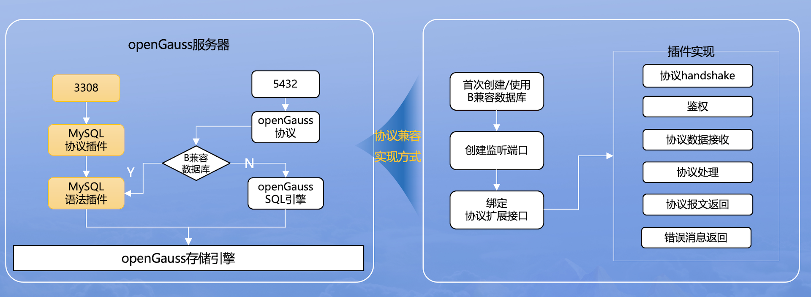

# MySQL协议兼容

-   openGauss通过抽象协议层接口，在dolphin插件中实现了MySQL协议兼容，用户在设置相关参数后，可通过MySQL的JDBC driver或者MySQL命令行客户端，直接连接openGauss。

## 架构图


- openGauss根据协议兼容配置项，拉起相关监听端口号；当用户通过MySQL客户端直连dolphin协议监听端口号时，openGauss可以通过dolphin协议兼容插件来响应本次网络请求。

## 当前支持的MySQL客户端版本

-   MySQL JDBC driver： 8.0.28及其以下
-   MySQL 命令行客户端： 8.0.28及其以下

## 约束

-   不支持游标（指在JDBC中通过useCursorFetch、setFetchSize的方式获取数据）。
-   不支持执行存储过程。
-   通过MySQL协议的连接，参数dolphin.b_compatibility_mode和enable_set_variable_b_format会自动设置为true。
-   openGauss支持TLS 1.2协议标准，而部分MySQL命令行客户端版本仅支持TLS 1和TLS 1.1，例如5.7.27，因此不支持以SSL模式连接openGauss。客户端支持TLS版本情况可通过mysql --help查看。

## 使用方式

### mysql_native_password 认证方式

1. 创建B类型数据库，创建用户并设置MySQL native密码（可根据需要通过GRANT命令给新用户赋权）：
```SQL
CREATE DATABASE proto_test_db DBCOMPATIBILITY 'B';
\c proto_test_db
CREATE USER proto_test WITH PASSWORD 'Proto_test123';
SELECT set_native_password('proto_test', 'Proto_test123', '');
```
> **须知：** （第一个参数为用户名，第二个参数为MySQL连接密码，第三个参数为原密码；第一次设置时可以为空或者任意值，后续更改密码以及更改认证方式需要原密码做验证）

2. 设置GUC参数 [enable_dolphin_proto](../DatabaseReference/连接设置.md#enable_dolphin_proto) 为 on。
3. 设置MySQL协议监听端口号， [dolphin_server_port](../DatabaseReference/连接设置.md#dolphin_server_port)，注意端口号需要与openGauss本身监听的端口号 port 不同。
4. 如果数据库中存在多个B兼容性数据库，需要通过[dolphin.default_database_name](./dolphin-GUC参数说明.md#dolphindefault_database_name)设置默认连接的数据库实例名。
5. 设置完成后，即可通过MySQL客户端，使用对应的用户名和密码连接openGauss。

> **须知：** 
>
>-   enable_dolphin_proto和dolphin_server_port为POSTMASTER类型参数，修改需要重启才生效。
>-   使用MySQL客户端连接openGauss前，请确认listen_addresses配置正确，pg_hba允许MySQL客户端所在机器IP连接。可参考 [配置客户端接入认证](../DatabaseAdministrationGuide/配置客户端接入认证.md)。
>-   使用MySQL客户端连接时，可通过形如 mysql -u [user_name] -p --port [dolphin_server_port] -h [opengauss_listen_address] 的方式连接。
>-   备机的可连接性受参数[hot_standby](../DatabaseReference/备服务器.md)和[dolphin_hot_standby](../DatabaseReference/连接设置.md)参数控制。

### caching_sha2_password 认证方式

1. 创建B类型数据库，创建用户并设置MySQL caching_sha2密码（可根据需要通过GRANT命令给新用户赋权）：
```SQL
CREATE DATABASE proto_test_db DBCOMPATIBILITY 'B';
\c proto_test_db
CREATE USER proto_test WITH PASSWORD 'Proto_test123';
SELECT set_caching_sha2_password('proto_test', 'Proto_test123', '');
```
> **须知：** （第一个参数为用户名，第二个参数为MySQL连接密码，第三个参数为原密码；第一次设置时可以为空或者任意值，后续更改密码以及更改认证方式需要原密码做验证）
2. 设置GUC参数 [enable_dolphin_proto](../DatabaseReference/连接设置.md#enable_dolphin_proto) 为 on。
3. 设置MySQL协议监听端口号， [dolphin_server_port](../DatabaseReference/连接设置.md#dolphin_server_port)，注意端口号需要与openGauss本身监听的端口号 port 不同。
4. 如果数据库中存在多个B兼容性数据库，需要通过[dolphin.default_database_name](./dolphin-GUC参数说明.md#dolphindefault_database_name)设置默认连接的数据库实例名。
5. 设置MySQL得SSL文件信息，文件路径不需要设置且为数据目录
6. 设置完成后，即可通过MySQL客户端，使用对应的用户名和密码连接openGauss。

> **须知：** 
>
>-   enable_dolphin_proto和dolphin_server_port为POSTMASTER类型参数，修改需要重启才生效。
>-   使用MySQL客户端连接openGauss前，请确认listen_addresses配置正确，pg_hba允许MySQL客户端所在机器IP连接。可参考 [配置客户端接入认证](../DatabaseAdministrationGuide/配置客户端接入认证.md)。
>-   使用MySQL客户端连接时，可通过形如 mysql -u [user_name] -p --port [dolphin_server_port] -h [opengauss_listen_address] 的方式连接。
>-   备机的可连接性受参数[hot_standby](../DatabaseReference/备服务器.md)和[dolphin_hot_standby](../DatabaseReference/连接设置.md)参数控制。

## JDBC常用连接参数的兼容表现

- zeroDateTimeBehavior
    - 说明： 该参数指示当驱动程序遇到完全由零组成的 DATETIME 值时（MySQL 使用这种值来表示无效日期），应该采取的处理方式。有以下几种选项："EXCEPTION"：抛出一个异常，表示遇到了无效的日期时间值。"ROUND"：将无效的日期时间值四舍五入到最接近的有效日期。"CONVERT_TO_NULL"：将无效的日期时间值转换为 NULL。

    - 默认值：EXCEPTION

    - 备注：MySQL JDBC驱动版本为5.1.x时，选项值为convertToNull；版本为8.0.x时，选项值为CONVERT_TO_NULL。该参数选项大小写敏感，如若全大写或全小写，则无法得到预期的行为结果。

- tinyInt1isBit
    - 说明： 由于 MySQL 服务器在创建表时会默默地将 BIT 类型转换为 TINYINT(1)，该参数指示驱动程序是否应该将 TINYINT(1) 数据类型视为 BIT 类型来处理。

    - 默认值：true

- transformedBitIsBoolean
    - 说明： 该参数指示如果驱动程序将 TINYINT(1) 转换为不同的类型，它是否应该使用 BOOLEAN 类型而不是 BIT 类型。

    - 默认值：false

    - 备注：transformedBitIsBoolean 只是决定是否直接把驱动中的 sqlType 从 BIT 转换为 Boolean 类型，不管是否转换，在 Java 中都是 Boolean 类型。

- useOldAliasMetadataBehavior
    - 说明： 该参数指示驱动程序是否应该对列和表的 "AS" 子句使用传统的处理方式，即仅在 ResultSetMetaData.getColumnName() 或 ResultSetMetaData.getTableName() 方法中返回别名（如果有的话），而不是返回原始的列名或表名。

    - 默认值：false

    - 备注：目前仅支持getColumnName。当别名用来表示表达式而非表的列时，始终返回别名。

- useaffectedrows
    - 说明： 该参数指示连接到服务器时不设置 'CLIENT_FOUND_ROWS' 标志。注意这不符合 JDBC 规范，并且会影响大多数依赖于 DML 语句的“找到的行”与“受影响的行”之间差异的应用程序，但它确实会导致服务器返回由 "INSERT ... ON DUPLICATE KEY UPDATE" 语句产生的正确的更新计数。

    - 默认值：false

    - 备注：目前不支持该参数。MySQL会比较更新前后的新行和旧行是否一样来决定是否更新行；openGauss在更新时不会作这样的比较，因此openGauss始终返回“找到的行”的个数。

- allowMultiQueries
    - 说明： 该参数指示允许在一个语句中使用 ";" 作为多个查询的分隔符。

    - 默认值：false