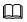

# 向量数据类型

**表 1**  向量类型
DataVec向量引擎所支持的向量数据类型。

名称 | 维度限制 | 描述
--- | --- | --- 
vector[(d)] | 1~16,000 | 单精度浮点数向量，可指定维度d
bit[(d)] |  1~83,886,080 | 位向量，可指定维度d
sparsevec[(d)] | 1~1,000,000,000<br>最大非零元素数:16,000 | 稀疏向量，可指定维度d

> **说明：**
>上述维度限制只限于`Toast表`的向量数据存储以及向量计算，并不包含非TOAST表（设置列储存模式为`plain`）和向量索引的维度限制，具体维度信息请参考[向量索引](../SQLReference/向量索引.md)。


非Toast表存储空间及维度限制：
名称  | 存储空间 | 维度限制 
---  | --- | --- 
vector[(d)] | (4 * 维度 + 8)字节 | 1~2,028 
bit[(d)] | (维度 / 8 + 8)字节| 1~64,896
sparsevec[(d)] | (8 * 非零元素数 + 16)字节| 1~1,000,000,000<br>最大非零元素数:1,013 

## Vector
每个vector占用 `4 * 维度 + 8` 字节的储存空间。
每个元素都是单精度浮点数，并且所有的元素都是有限的：（不能为 `NaN`，`Infinity` 或者 `-Infinity`）。
vector的最大维度为 `16,000`。

### 格式
```
['<ELEMENT>', ..., '<ELEMENT>']::vector
```
- ELEMENT - 元素

**示例1：**
```
openGauss=# SELECT '[1,2,3]'::vector;
 vector  
---------
 [1,2,3]
(1 row)
```

> **说明：**
>单精度浮点数的有效小数位约为 $\log_{10}(2^{24}) \approx 7.225$

## Bit
每个bit向量占用`维度 / 8 + 8`字节的存储空间。
bit的最大维度为`83,886,080`。

### 格式
```
B'0/1, ...'
```

**示例2：**
```
openGauss=# SELECT B'110';
 ?column? 
----------
 110
(1 row)
```

## Sparsevec
每个sparse向量占用`8 * 非零元素数 + 16`字节的存储空间。
每个元素都是单精度浮点数，并且所有的元素都是有限的： （不能为 `NaN`，`Infinity` 或者 `-Infinity`）。
Sparse的最大非零元素数为`16,000`，最大维度为`1,000,000,000`。

### 格式
```
{INDEX:NON-ZERO, INDEX:NON-ZERO}/<DIMENSION>::sparsevec
```
- INDEX - 非零元素下标，需小于指定维度DIMENSION
- NON-ZERO - 非零元素
- DIMENSION - 维度

**示例3：**
```
openGauss=# SELECT '{1:1.5,3:3.5}/5'::sparsevec;
    sparsevec    
-----------------
 {1:1.5,3:3.5}/5
(1 row)
```

## 维度限制
建表时若指定向量数据维度，插入数据必须等于表中的维度；如果不指定维度，则对vector、sparsevec类型的向量数据没有限制，bit默认维度为1。

**示例4：**
```
# vector指定维度
openGauss=# CREATE TABLE test1(val vector(3));
CREATE TABLE
openGauss=# INSERT INTO test1 (val) VALUES ('[1,2,3]');
INSERT 0 1
openGauss=# INSERT INTO test1 (val) VALUES ('[1,2,3,4]');
ERROR:  expected 3 dimensions, not 4
CONTEXT:  referenced column: val

# vector不指定维度
openGauss=# CREATE TABLE test2(val vector);
CREATE TABLE
openGauss=# INSERT INTO test2 (val) VALUES ('[1,2,3]');
INSERT 0 1
openGauss=# INSERT INTO test2 (val) VALUES ('[1,2,3,4]');
INSERT 0 1
```
```
# bit指定维度
openGauss=# CREATE TABLE test1(val bit(3));
CREATE TABLE
openGauss=# INSERT INTO test1 (val) VALUES ('101');
INSERT 0 1
openGauss=# INSERT INTO test1 (val) VALUES ('1010');
ERROR:  bit string length 4 does not match type bit(3)
CONTEXT:  referenced column: val

# bit不指定维度
openGauss=# CREATE TABLE test2(val bit);
CREATE TABLE
openGauss=# INSERT INTO test2 (val) VALUES ('1');
INSERT 0 1
openGauss=# INSERT INTO test2 (val) VALUES ('101');
ERROR:  bit string length 4 does not match type bit(1)
CONTEXT:  referenced column: val
```
```
# sparsevec指定维度
openGauss=# CREATE TABLE test1(val sparsevec(3));
CREATE TABLE
openGauss=# INSERT INTO test1 (val) VALUES ('{1:1,2:1,3:1}/3');
INSERT 0 1
openGauss=# INSERT INTO test1 (val) VALUES ('{1:1,2:1,3:1,4:1}/4');
ERROR:  expected 3 dimensions, not 4
CONTEXT:  referenced column: val

# sparsevec不指定维度
openGauss=# CREATE TABLE test2(val sparsevec);
CREATE TABLE
openGauss=# INSERT INTO test2 (val) VALUES ('{1:1,2:1,3:1}/3');
INSERT 0 1
openGauss=# INSERT INTO test2 (val) VALUES ('{1:1,2:1,3:1,4:1}/4');
INSERT 0 1
```

## 约束
- vector和sparsevec数据类型暂不支持列存表存储
- vector，bit和sparsevec暂不支持外表存储
- 支持普通行存表，临时表，Toast表，Unlogged，段页式表等的向量数据存储