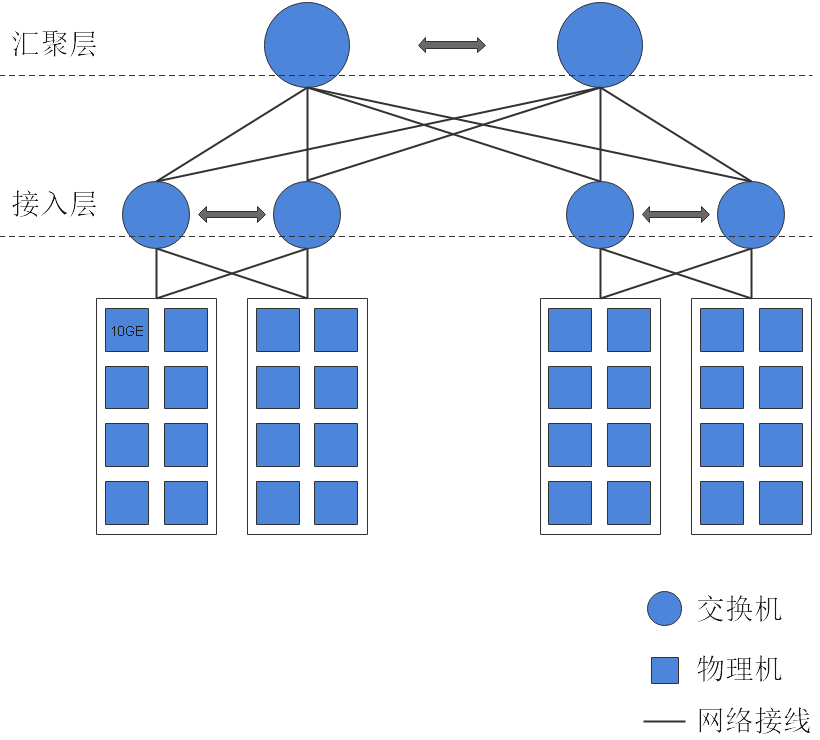

# 典型组网

为了保证整个应用数据的安全性，建议将openGauss的典型组网划分为两个独立网络：前端业务网络和数据管理存储网络。

**图 1**  典型组网  

网络划分说明如[表1](#zh-cn_concept_0283139009_zh-cn_concept_0238166305_zh-cn_topic_0085434654_zh-cn_topic_0059782024_tb80dc4a120b64f6093f63535ce9998ef)所示。

**表 1**  网络划分

<table><thead align="left"><tr id="zh-cn_concept_0283139009_zh-cn_concept_0238166305_zh-cn_topic_0085434654_zh-cn_topic_0059782024_r157fdb513ba046169c041938f8315c67"><th class="cellrowborder" valign="top" width="21.62%" id="mcps1.2.3.1.1">
类型

</th>
<th class="cellrowborder" valign="top" width="78.38000000000001%" id="mcps1.2.3.1.2">
描述

</th>
</tr>
</thead>
<tbody><tr id="zh-cn_concept_0283139009_zh-cn_concept_0238166305_zh-cn_topic_0085434654_zh-cn_topic_0059782024_rc849bac0400340e4b0844f155986cf8e"><td class="cellrowborder" valign="top" width="21.62%" headers="mcps1.2.3.1.1 ">
数据库管理存储网络

</td>
<td class="cellrowborder" valign="top" width="78.38000000000001%" headers="mcps1.2.3.1.2 ">
DBA通过此网络调用OM脚本管理和维护openGauss实例。同时，用于openGauss主备通信组网。数据库管理存储网络也是应用执行系统监控的网络。

</td>
</tr>
<tr id="zh-cn_concept_0283139009_zh-cn_concept_0238166305_zh-cn_topic_0085434654_zh-cn_topic_0059782024_r8ce2e458c24243cd8e5035626c37982d"><td class="cellrowborder" valign="top" width="21.62%" headers="mcps1.2.3.1.1 ">
前端业务网络

</td>
<td class="cellrowborder" valign="top" width="78.38000000000001%" headers="mcps1.2.3.1.2 ">
外部客户端通过此网络访问openGauss数据库。

</td>
</tr>
</tbody>
</table>

该典型组网有如下优点：

-   业务网络与数据库管理存储网络的隔离，有效保护了后端存储数据的安全。
-   业务网络和数据库管理存储网络的隔离，可以防止攻击者通过互联网试图对数据库服务器进行管理操作，增加了系统安全性。

网络独占性及1：1的带宽收敛比是openGauss数据库网络性能的基本要求。因此，在生产系统中，对[图1](#zh-cn_concept_0283139009_zh-cn_concept_0238166305_fig7654172218145)中的后端存储网络，需满足独占性及至少1:1收敛比的要求。例如，[图2](#zh-cn_concept_0283139009_zh-cn_concept_0238166305_zh-cn_topic_0085434654_zh-cn_topic_0059782024_fig397545395542)中，其本质是Fattree组网方式。为实现收敛比1：1，交换网络层级每提高一层，带宽增加一倍。图中每根加粗连接线代表80GE带宽，即8台物理机带宽上限之和。接入层每单台交换机下行带宽160GE，上行带宽160GE，收敛比1：1；汇聚层每单台交换机接入带宽320GE。

对于测试系统，上述要求可以适当降低。

**图 2**  数据库管理存储网络组网示例  

