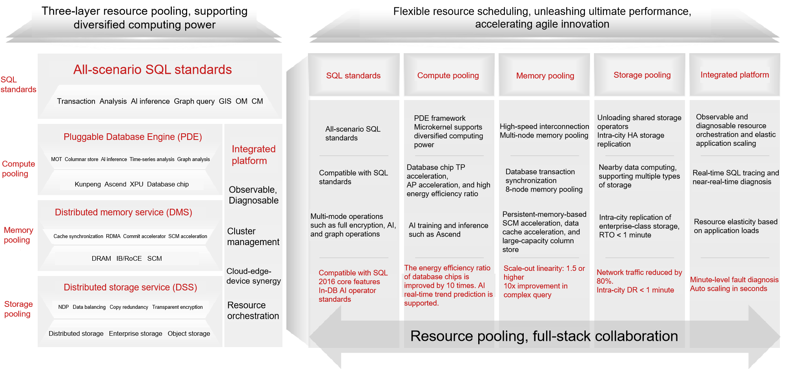
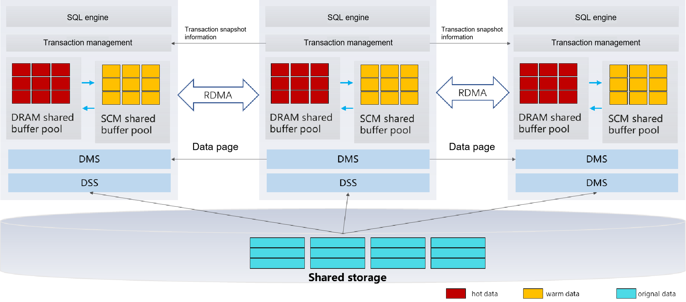

# System Architecture

Digital technologies are accelerating the implementation of industry applications and support abundant online applications and services. Industry digitalization accelerates the generation of massive data. Multiple data types, such as graphs, flows, time sequences, and map spaces, are emerging one after another, requiring different computing architectures for processing. The computing requirements of databases evolve from general-purpose CPUs to diversified computing such as GPUs and NPUs. In addition, to effectively meet the ultimate requirements of large-scale databases for reliability, performance, and usability, databases in the industry gradually adopt a unified and standard resource pooling architecture.

 To address the evolution trend of diversified computing, openGauss implements a resource pooling architecture and decouples computing, memory, and storage for the first time. Layer-by-layer pooling brings better resource scheduling efficiency, better processing performance, and innovation agility. Based on the trend of multi-mode data convergence, the HTAP architecture is implemented. In addition, the data processing capabilities of different models, such as graph databases and time series databases, are jointly developed in the openGauss community. This enables openGauss to implement multi-mode data convergence processing and analysis.

The future-oriented openGauss resource pooling architecture consists of three pooling layers, one platform, and one standard. The following figure shows the architecture.

            

Three pooling layers include storage pooling, memory pooling, and compute pooling. Storage pooling supports multiple types of storage, such as distributed storage and enterprise storage. One data service can be used for multiple types of computing. The NDP technology of SQL operator offloading greatly improves SQL processing efficiency and reduces network I/O traffic. Memory pooling implements memory interconnection between compute nodes. Transaction information and database cache are synchronized to implement consistent read of multi-version snapshots on multiple nodes. RoCE and SCM hardware are used to implement ultimate commit acceleration and large-capacity memory access. Computing pooling supports diversified computing power. Based on computing power such as x86 and Kunpeng, it provides applications with comprehensive data services such as TP row store acceleration, AP column store acceleration, and AI training and inference. Above the three-layer pooling, it is a full-scenario SQL standard that provides applications with a series of query interfaces for data analysis, AI inference, and graph query, fully unleashing data value. In addition, the integrated platform implements intelligent O&M, cluster management, and resource orchestration capabilities to ensure stable running and elastic scaling of databases under heavy loads.

## Software Architecture

The following figure shows the logical architecture of resource pooling in openGauss 5.0.0.

**Figure 1** openGauss logical architecture 

The openGauss resource pooling architecture supports one primary node and seven standby nodes. The primary node supports read and write, and the standby node supports scale-out read capability to meet the performance requirements of typical loads in the real world. Real-time data consistency among multiple nodes supports transparent expansion of data consistency-sensitive application loads from a single node to multiple nodes. It eliminates the overhead of traditional primary/standby log replication, reducing storage costs by more than 50%. The lightweight RPC framework is implemented based on the high-performance RDMA network, significantly reducing the CPU resource overhead and achieving μs-level network latency. The multi-level cache capability of SCM improves performance by 30% at the same memory cost.

**Table 1** Architecture description

| Name  | Description                                                                                    |
|------|-----------------------------------------------------------------------------------------------------------------------------------------|
| DMS  | DMS is a dynamic library integrated in the database. It transmits page content through the TCP/RDMA network, integrates the primary and standby memories, and provides the memory pooling capability to implement real-time consistent read on the standby node.                                                                 |
| DSS  | DSS is an independent process that directly manages raw devices of disk arrays and provides capabilities similar to distributed file systems for external systems. The shared memory and client API dynamic library provide the database with the capabilities of creating files, deleting files, expanding and shrinking files, and reading and writing files.                                                 |
| Shared storage| The enterprise-level storage and distributed storage are supported. Compared with traditional database creation, resource pooling classifies directories into three types: exclusively used and not shared by each instance, exclusively used and shared by each instance, and shared by all instances. The directories to be shared must be stored on the shared storage, and the directories that are not shared must be stored on the local disk. In addition, to create a database on the standby node, you only need to create a directory that belongs to the standby node. You do not need to create a directory structure shared by all instances.|
| OCK-RDMA | OCK RDMA can be used to reduce the latency of DMS primary/standby page switching. After OCK RDMA is enabled, the consistent read latency of the standby node is improved by over 20%.|
|SCM      | SCM acceleration based on persistent memory improves performance by 30% at the same memory cost.|
