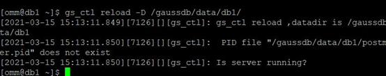
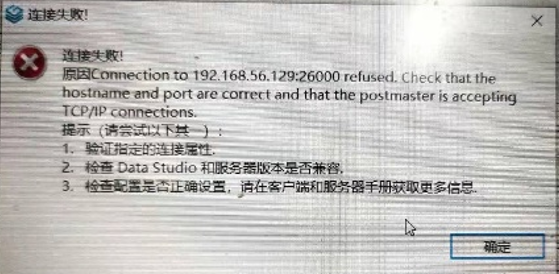

# Usage-related FAQs<a name="EN-US_TOPIC_0000001150545071"></a>

**1. What should I do if the error message "unknow:26000" is displayed when GSQL is used to connect to the database?**

```
gsql -d postgres =p 26000 -r
failed to connect Unkown:26000.
```

**Answer:**

Check whether the database port number is 26000. If the port number is correct, the possible cause is that the database service is not started. Run the following command to start the database service:

```
gs_om -t start
```

**2. When I use the database for the first time, an error message is displayed, indicating that the username and password need to be changed. What should I do?**

**Answer:**

If you use the database for the first time, run the following statement to change the password of user  **omm**:

```
alter role omm identified by 'new password' replace 'old password'
```

If you forget the password of user  **omm**  and cannot change the password, disable the password change function.

```
-- Log out of the database.
\q
-- Disable the password change function.
gs_guc reload -N all -I all -c "modify_initial_password  =  false" 
```

**3. What can I do if an error message is displayed indicating that the PID does not exist when I run the following command?**



**Answer:**

This command is used to restart the database service. If the database is not started, the system displays a message indicating that the PID does not exist. You can ignore this message and go to the next step.

**4. What do I do if an error occurs when Data Studio connects to the openGauss database and the message "Failed to connect to the server." is displayed?**

**Answer:**

The possible cause is that the JDK version is incompatible with the system. The JDK version must be 1.8. You are advised to download and install the JDK again, modify global variables, and try again.

**5. What do I do if an error occurs when Data Studio connects to the openGauss database and the system displays a message indicating that the connection fails? The error information is as follows.**



**Answer:**

If the connection configuration is incorrect, perform the following steps:

1.  Check whether the database is started and use GSQL to connect to the database. When connecting to the database using GSQL, do not use user  **omm**.

    Run the following command to start the database:

    ```
    gs_om -t start
    ```

2.  Check the whitelist configuration. Perform the following operations and ensure that no other content of the configuration file is modified.
    
    Modify the  **pg\_hba.conf**  file of the database.

    Search for the  **pg\_hba.conf**  file in  _GS\_HOME_. Assume that  _GS\_HOME_  is set to  **/gaussdb/data/db1**.

       ```
       cd /gaussdb/data/db1
       vi pg_hba.conf
       ```

       > **NOTE:** 
       >You can view the  _GS\_HOME_  address in the configuration file during the installation.
       >```
       ><PARAM name="dataNode1" value="/gaussdb/data/db1"/>
       >```

    Enter  **:90**  to find the corresponding location, enter  **i**  to switch to the  **INSERT**  mode, add the following content to the  **pg\_hba.conf**  file, press  **ESC**  to exit the  **INSERT**  mode, enter** :wq**, and press  **Enter**  to save the change.
    
       ```
       # IPv4 local connections:
       host    all             all             127.0.0.1/32            trust
       host    all    all    192.168.0.19/32    trust
       host all all 0.0.0.0/0 sha256
       # IPv6 local connections:
       host    all             all             ::1/128                 trust
       ```

       Log in as user  **omm**  and run the  **gs\_ctl**  command to make the policy take effect.
    
       ```
       su - omm
       gs_ctl reload -D /gaussdb/data/db1/
       ```

    Change the database listening address.

    Search for the  **pg\_hba.conf**  file in  _GS\_HOME_. Assume that  _GS\_HOME_  is set to  **/gaussdb/data/db1**.
    
        ```
        cd /gaussdb/data/db1
        vi postgresql.conf
        ```

    Enter  **:60**  to find the corresponding location, enter  **i**  to switch to the  **INSERT**  mode, change the value of  **listen\_addresses**  to  **\***, press  **ESC**  to exit the  **INSERT**  mode, enter  **:wq**, and press  **Enter**  to save the change.
    
        ```
        #listen_addresses = '192.168.0.19'              # what IP address(es) to listen on;
        listen_addresses = '*'
        ```

    After the modification is complete, restart the database for the modification to take effect. \(The default database path following  **-D**  needs to be changed based on the actual situation.\)
    
        ```
        gs_ctl restart -D /gaussdb/data/db1/
        ```


3.  Check whether the VM network is normal.
    a.  In the Linux operating system, run the  **ifconfig**  command to check whether the two network NICs are started normally.

        ```
        [root@db1 ~]# ifconfig
        enp0s3: flags=4163<UP,BROADCAST,RUNNING,MULTICAST>  mtu 1500
                inet 192.168.56.108  netmask 255.255.255.0  broadcast 192.168.56.255
                inet6 fe80::ac2f:dc4f:edfe:1d57  prefixlen 64  scopeid 0x20<link>
                ether 08:00:27:0f:78:e3  txqueuelen 1000  (Ethernet)
                RX packets 519  bytes 48509 (47.3 KiB)
                RX errors 0  dropped 0  overruns 0  frame 0
                TX packets 178  bytes 52937 (51.6 KiB)
                TX errors 0  dropped 0 overruns 0  carrier 0  collisions 0
         
        enp0s8: flags=4163<UP,BROADCAST,RUNNING,MULTICAST>  mtu 1500
                inet 10.0.3.15  netmask 255.255.255.0  broadcast 10.0.3.255
                inet6 fe80::bedc:2040:4b9:23ed  prefixlen 64  scopeid 0x20<link>
                ether 08:00:27:45:8d:f0  txqueuelen 1000  (Ethernet)
                vRX packets 72  bytes 10702 (10.4 KiB)
                RX errors 0  dropped 0  overruns 0  frame 0
                TX packets 124  bytes 11664 (11.3 KiB)
                TX errors 0  dropped 0 overruns 0  carrier 0  collisions 0
        ...................................
        virbr0: flags=4099<UP,BROADCAST,MULTICAST>  mtu 1500
                inet 192.168.122.1  netmask 255.255.255.0  broadcast 192.168.122.255
                ether 52:54:00:05:11:90  txqueuelen 1000  (Ethernet)
                RX packets 0  bytes 0 (0.0 B)
                RX errors 0  dropped 0  overruns 0  frame 0
                TX packets 0  bytes 0 (0.0 B)
                TX errors 0  dropped 0 overruns 0  carrier 0  collisions 0
        ```

    b.  Run the  **ping baidu.com**  command to check whether you can access the Internet.

        ```
        [root@db1 ~]# ping baidu.com
        PING baidu.com (39.156.69.79) 56(84) bytes of data.
        64 bytes from 39.156.69.79 (39.156.69.79): icmp_seq=1 ttl=47 time=48.1 ms
        64 bytes from 39.156.69.79 (39.156.69.79): icmp_seq=2 ttl=47 time=46.5 ms
        64 bytes from 39.156.69.79 (39.156.69.79): icmp_seq=3 ttl=47 time=49.2 ms
        64 bytes from 39.156.69.79 (39.156.69.79): icmp_seq=4 ttl=47 time=47.3 ms
        64 bytes from 39.156.69.79 (39.156.69.79): icmp_seq=5 ttl=47 time=46.7 ms
        64 bytes from 39.156.69.79 (39.156.69.79): icmp_seq=6 ttl=47 time=45.9 ms
        64 bytes from 39.156.69.79 (39.156.69.79): icmp_seq=7 ttl=47 time=46.7 ms
        64 bytes from 39.156.69.79 (39.156.69.79): icmp_seq=8 ttl=47 time=48.3 ms
        ```

    You can press  **Ctrl**+**C**  to stop the output.


**6. During the installation of openGauss, when running gs_ctl, an error is reported that the program path cannot be found or so file is missing. What should I do?**

**Answer:**

The possible cause is that the JDK version is incompatible with the system. The JDK version must be 1.8. You are advised to download and install the JDK again, modify global variables, and try again.

This problem may be caused by the fact that environment variables are not configured. It is recommended to solve this problem by configuring environment variables.

Configure GAUSSHOME as all binary directories, and then configure LD_LIBRARY_PATH and PATH. The sample code is as follows.

```
export GAUSSHOME=/xxxx
export LD_LIBRARY_PATH=$GAUSSHOME/lib::$LD_LIBRARY_PATH
export PATH=$GAUSSHOME/bin:$PATH
```

The above can be placed in the /etc/profile file, /home/user/.bashrc file or a custom environment variable file. Before each use, please source the environment variable file to initialize the environment variable.

If you install the enterprise version of openGauss, the above configuration path has been written into the environment variables, switch the user to a sub-user, import the environment variables, and you can use it normally.