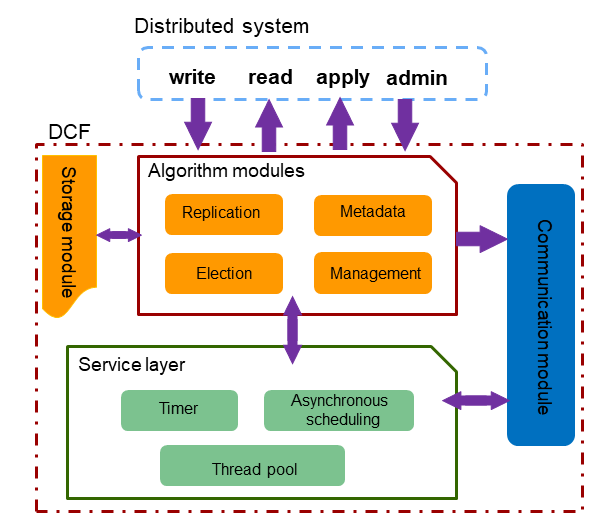

# DCF<a name="EN-US_TOPIC_0000001255021817"></a>

Distributed Consensus Framework \(DCF\) implements typical algorithms such as Paxos and Raft to solve distribution consistency problems. DCF provides capabilities such as log replication, cluster HA, and automatic leader election, and can forcibly start the minority and dynamically adjust traffic for log replication. In addition, multiple Paxos-based roles are provided and can be adjusted.

DCF is a high-performance, highly mature, reliable, scalable, and easy-to-use independent basic library. Other systems can easily interconnect with DCF through interfaces to obtain the strong consistency, high availability, and automatic disaster recovery capabilities provided by the Paxos algorithm.

## Architecture<a name="section1667455612274"></a>

[Figure 1](#fig31591049102410)  shows the functional architecture of the DCF, including the algorithm modules, storage module, communication module, and service layer.

**Figure  1**  Functional architecture of the DCF<a name="fig31591049102410"></a>  


-   **Algorithm modules:**

    Algorithm modules are implemented based on the Multi-Paxos protocol. Based on the service scenarios, and requirements for high performance and ecosystem, DCF has made many function extensions and performance optimization to enrich the functions compared with the basic Multi-Paxos protocol, and the performance is significantly improved in multiple deployment scenarios. It mainly includes a leader election module, a log replication module, a metadata module, and a cluster management module.

-   **Storage module:**

    For specific service scenarios and ultimate performance, the DCF extracts a set of public interfaces for log storage and implements a default high-performance storage module. For specific scenarios or users who have ultimate performance and cost requirements, you can connect the existing storage system to the log storage interface of DCF to meet specific requirements. This is one of the advantages of DCF as an independent third-party library.

-   **Communication module:**

    The communication module is implemented based on the Message Exchange Component \(MEC\) and provides the communication capability between DCF instances and the asynchronous event processing framework. The main features are as follows: multiple extensible communication protocols, unicast, broadcast, and loopback sending interfaces, asynchronous message processing framework, multi-channel mechanism, multi-priority queue, compression, and batch sending.

-   **Service layer:**

    The service layer is the basis for running the entire DCF and provides various basic services required for program running. For example, lock, asynchronous task scheduling, thread pool service, and timer.


## Features<a name="section392523316281"></a>

-   **Nodes can be added and deleted online, and the leader role can be handed over online.**

    Based on the standard Multi-Paxos, the DCF supports online node addition and deletion, and leader handover. This is more suitable for building a development ecosystem in a wide range of service scenarios.

-   **Priority-based leader election and policy-based majority are supported.**
    -   **Policy-based majority**: In the classic Paxos theory, data can be submitted after the majority reaches a consensus. However, the majority is not specific and it cannot be guaranteed that one or some nodes can obtain complete data. In actual applications, the nodes that are geographically close to each other have strongly consistent data, but the nodes that are geographically far away from each other are always in a non-strongly consistent state. These nodes cannot be activated as the primary node for city-level disaster recovery. The policy-based majority mechanism enables users to dynamically configure one or more nodes to be strongly consistent and can be activated as the primary node immediately for disaster recovery.
    -   **Priority-based leader election**: You can specify the priority of each node. The DCF elects a leader node strictly according to the specified priority. The node with a lower priority is activated only when all the nodes with a higher priority are unavailable.

-   **Diversified node roles are provided.**

    In addition to typical roles such as Leader, Follower, and Candidate, the DCF also supports customized roles, for example, the Passive role \(with logs, with data, without the right to be elected, and not participating in the majority voting\) and the Log role \(with logs, without data, without the right to be elected, and participating in the mkajority voting\). With these node roles, DCF supports synchronous and hybrid \(synchronous/asynchronous\) multi-cluster deployment.

-   **Batch & Pipeline**
    -   **Batch**: The DCF supports multi-level batch operations, including:

        -   Combine multiple logs into a single message for sending.
        -   Combine multiple logs for writing to the disk.
        -   Combine multiple logs for replication.

        Batch operations can effectively reduce the extra loss due to the message granularity and improve the throughput.

    -   **Pipeline**: Before the result of a message is returned, the next message is concurrently sent to the corresponding node. By increasing the number of concurrent messages \(pipelines\), the latency of each single concurrent request can be effectively reduced and the performance can be improved. DCF uses the asynchronous mode in multiple phases, such as log persistence, network sending, and log replication, to maximize the pipeline performance.

-   **Efficient flow control algorithm**

    Batching and pipelining can improve the throughput and performance of the entire system. However, if the batch size is too large, the latency of a single request is too long. As a result, the number of concurrent requests is too large, affecting the throughput and request latency. Therefore, the DCF designs a set of efficient and adaptive flow control algorithms, automatically detects parameters such as the network bandwidth, network sending latency, and number of concurrent requests, and adjusts batch and pipeline parameters to control service traffic injection.

    [Figure 2](#fig548518330404)  shows the process of the flow control algorithm.

    **Figure  2**  Process of the flow control algorithm<a name="fig548518330404"></a>  
    

    The core algorithm process is as follows:

    1.  The primary DCF node periodically samples and calculates consensus information, including the end-to-end consensus latency, end-to-end consensus log bandwidth, and overall log playback bandwidth.
    2.  Calculate a new control value: The primary node obtains the performance change trend based on the sampling result and historical results, adjusts the control direction and step based on the historical control value and change trend, and calculates a new control value for better performance.
    3.  Update the control value after the control period expires.
    4.  Continuously apply the control value to service traffic to control the frequency of service traffic injection.


## Example<a name="section763763217423"></a>

Assume that there are three nodes in the cluster and their IP addresses are  **192.168.0.11**,  **192.168.0.12**, and  **192.168.0.13**. The node IDs are 1, 2, and 3, and the node roles are Leader, Follower, and Follower.

To use the DCF component, you need to set  **enable\_dcf**  to  **on**  \(disabled by default\) and configure  **DCF config**  in the configuration file during FusionSphere OpenStack OM installation and deployment.

Obtain the XML file template from  **script/gspylib/etc/conf/centralized/cluster\_config\_template\_HA.xml**.

Each line of information is commented out. The content in bold is related to the DCF. The following is an example:

```
<?xml version="1.0" encoding="UTF-8"?>
<ROOT>
  <!-- Overall information -->
  <CLUSTER>
  <!-- Database name -->
    <PARAM name="clusterName" value="Sample1" />
  <!-- Database node name (hostname) -->
    <PARAM name="nodeNames" value="node1,node2,node3" />
  <!-- Node IP addresses corresponding to the node names, respectively -->
    <PARAM name="backIp1s" value="192.168.0.11,192.168.0.12,192.168.0.13"/>
  <!-- Database installation directory -->
    <PARAM name="gaussdbAppPath" value="/opt/huawei/newsql/app" />
  <!-- Log directory -->
    <PARAM name="gaussdbLogPath" value="/opt/huawei/logs/gaussdb" />
  <!-- Temporary file directory -->
    <PARAM name="tmpMppdbPath" value="/opt/huawei/logs/temp" />
  <!-- Database tool directory -->
    <PARAM name="gaussdbToolPath" value="/opt/huawei/tools" />
  <!-- Cluster or database type. A non-distributed cluster is used as an example here, that is, a centralized cluster.-->
    <PARAM name="clusterType" value="single-inst"/>
  <!-- Whether to enable the DCF mode. on: enable; off: disable -->
    <PARAM name="enable_dcf" value="on/off"/>
  <!-- DCF configuration information -->
    <PARAM name="dcf_config" value="[{&quot;stream_id&quot;:1,&quot;node_id&quot;:1,&quot;ip&quot;:&quot;192.168.0.11&quot;,&quot;port&quot;:17783,&quot;role&quot;:&quot;LEADER&quot;},{&quot;stream_id&quot;:1,&quot;node_id&quot;:2,&quot;ip&quot;:&quot;192.168.0.12&quot;,&quot;port&quot;:17783,&quot;role&quot;:&quot;FOLLOWER&quot;},{&quot;stream_id&quot;:1,&quot;node_id&quot;:3,&quot;ip&quot;:&quot;192.168.0.13&quot;,&quot;port&quot;:17783,&quot;role&quot;:&quot;FOLLOWER&quot;}]"/>  
  </CLUSTER>
...
```

1.  Cluster status query upon installation completion

    Use gs\_ctl to query the cluster status.

    ```
    # gs_ctl query –D <data_dir>
    # gs_ctl query -D /nvme0/gaussdb/cluster/nvme0/dn1
    HA state:
           local role                     : Primary   
           static connections             : 2   
           db state                       : Normal 
           detail information             : Normal 
    Paxos replication info:
           paxos write location           : 964/87134528  
           paxos commit location          : 964/87134528  
           local write location           : 964/87134528  
           local flush location           : 964/87134528  
           local replay location          : 964/87134528  
           dcf replication info           : {"stream_id":1,"local_node_id":1,"role":"LEADER","term":3,"run_mode":0,"work_mode":0,"hb_interval":1000,"elc_timeout":3000,"applied_index":14300633605."commit_index":14300633605,"first_index":14300625186,"last_index":14300633605,"cluster_min_apply_idx'14300633605,"leader_id":1,"leader_ip":"172.16.137.38","leader_port":17783,"nodes":[{"node_id":1,"id":"172.16.137.38","port":17783,"role":"LEADER","next_index":14300633606,"match_index":14300633605,"apply_index":14300633605},{"node_id":2,"ip":"172.16.137.40","port":17783,"role":"FOLLOWER","next_index":14300633606,"match_index":14300633605,"apply_index":14300633605},{"node_id":3,"ip":"172.16.137.42","port":17783,"role":"FOLLOWER","next_index":14300633606,"match_index":14300633605,"apply_index":14300633605}}}
    ```

    Where:

    -   **dcf\_replication\_info**: DCF information of the current node.
    -   **role**: role of the current node. The value can be  **LEADER**,  **FOLLOWER**,  **LOGGER**,  **PASSIVE**,  **PRE\_CANDICATE**,  **CANDIDATE**  or  **UNKNOW**. The preceding code shows that the current node is a leader node.
    -   **term**: election term.
    -   **run\_mode**: DCF running mode. The value  **0**  indicates the automatic election mode, and the value  **2**  indicates that automatic election is disabled.
    -   **work\_mode**: DCF working mode. The value  **0**  indicates the majority mode, and the value  **1**  indicates the minority mode.
    -   **hb\_interval**: heartbeat interval between DCF nodes, in milliseconds.
    -   **elc\_timeout**: DCF election timeout period, in milliseconds.
    -   **applied\_index**: log location that is applied to the state machine.
    -   **commit\_index**: log location that has been saved by most DCF nodes. Logs before  **commit\_index**  have been made persistent.
    -   **first\_index**: location of the first log saved by DCF nodes. This location is moved backward when the DN invokes  **dcf\_truncate**. The previous logs will be cleared.
    -   **last\_index**: location of the last log saved by DCF nodes. This location contains the logs that are stored in the memory of the DCF nodes but are not persisted. Therefore, the value of  **last\_index**  is greater than and equal to that of  **commit\_index**.
    -   **cluster\_min\_apply\_idx**: location of the log that has been applied and assumes the smallest index.
    -   **leader\_id**: ID of the leader node.
    -   **leader\_ip**: IP address of the leader node.
    -   **leader\_port**: port of the leader node, for DCF internal use.
    -   **nodes**: information about other nodes in the cluster.

2.  Online cluster scale adjustment

    To add a copy online, run the following command:

    ```
     # gs_ctl member --operation=add --nodeid=<node_id> --ip=<ip> --port=<port> -D <data_dir>
    ```

    To reduce the number of copies online, run the following command:

    ```
     # gs_ctl member --operation=remove --nodeid=<node_id> -D <data_dir>
    ```

    If the cluster is normal, a single copy can be deleted within 5 minutes.

3.  Forcible minority startup

    In case that the majority is faulty, no consensus can be reached based on the Paxos protocol. As a result, the system cannot continue to provide services. In order to provide emergency service capabilities, the minority needs to be started to continue to provide services.

    Run the following command to start up the minority:

    ```
     # cm_ctl setrunmode -n <node_id> -D <data_dir> --xmode=minority --votenum=<num>
    ```

    In the three-copy cluster scenario, if two copies are faulty, data can be submitted as long as one copy is consistent.

    Run the following command to resume the majority.

    ```
     # cm_ctl setrunmode -n <node_id> -D <data_dir> --xmode=normal --votenum=<num>
    ```

4.  Switchover

    Primary/standby switchover is supported when one primary and multiple standby database nodes are deployed to implement switchover between AZs. Switchover is performed for maintenance. Before a switchover, ensure that the database instances are running properly, and no catchup between the primary and standby nodes is ongoing after services are stopped.

    To promote a standby node to primary, run the following command:

    ```
     # cm_ctl switchover –n <node_id> -D <data_dir>
    ```

5.  Standby node rebuilding

    Full build is supported in primary/standby deployment. After receiving a full build request, the primary DN blocks recycling DCF logs and the standby DN replicates Xlogs and data files from the primary DN. After the standby DN is started, a time point is set for the DCF function to replicate logs.

    To start full build, run the following command:

    ```
    gs_ctl build -b full -D <new_node_data_dir>
    ```
6.  Manual mode

    DCF supports the manual mode, where automatic quorum is not performed. In this mode, DCF interconnects with upper-layer management components such as CM for quorum adaptation, and replicates logs.

    For example:

    ```
    cm_ctl set --param --server -k dn_arbitrate_mode=quorum
    cm_ctl reload --param --server
    gs_guc reload -Z datanode -I all -N all  -c "dcf_run_mode=1"
    ```

    > **NOTICE:**
    >-   The DCF working mode configured in GUC parameters must be the same as that configured in cm\_ctl. That is, both DCF working modes must be set to manual or automatic at the same time.
    >-   After the working mode is switched in a normal cluster, the cluster can still work properly.
