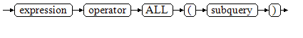

# Expressions<a name="EN-US_TOPIC_0000001179780272"></a>

An expression is similar to a formula. You can use it in a query statement to search for the result set of a specified condition in a database.

## Simple Expressions<a name="section14523125184717"></a>

-   Logical expressions

    [Logical Operators](../DeveloperGuide/operators.md#section2075011374558)  lists the operators and computation rules of logical expressions.

-   Comparison expressions

    [Operators](../Developerguide/Operators.md)  lists the common comparison operators.

    In addition to comparison operators, you can also use the following sentence structures:

    -   BETWEEN operator

        **a  BETWEEN  x  AND  y**  is equivalent to  **a \>= x AND a <= y**.

        **a  NOT BETWEEN  x  AND y**  is equivalent to  **a < x OR a \> y**.

    -   To check whether a value is  **NULL**, use:

        expression IS NULL

        expression IS NOT NULL

        or an equivalent \(non-standard\) sentence structure:

        expression   ISNULL

        expression  NOTNULL

        > **NOTICE:** 
        >Do not write  **expression=NULL**  or  **expression<\>\(!=\)NULL**, because  **NULL**  represents an unknown value, and these expressions cannot determine whether two unknown values are equal.

-   is distinct from/is not distinct from
    -   is distinct from

        If the data types and values of A and B are not completely the same, the value is  **true**.

        If the data types and values of A and B are completely the same, the value is  **false**.

        Null values are considered the same.

    -   is not distinct from

        If the data types and values of A and B are not completely the same, the value is  **false**.

        If the data types and values of A and B are completely the same, the value is  **true**.

        Null values are considered the same.


-   Pseudocolumn \(ROWNUM\)

    **ROWNUM**  is a pseudocolumn that returns a number indicating the row number of the result obtained from the query. The value of  **ROWNUM**  in the first row is  **1**, the value of  **ROWNUM**  in the second row is  **2**, and so on. The return type of  **ROWNUM**  is numeric.  **ROWNUM**  can be used to limit the total number of rows returned by a query. For example, the following statement limits the maximum number of records returned from the  **customer\_t1**  table to 3.

    ```
    openGauss=# SELECT * FROM customer_t1 WHERE ROWNUM <= 3;
     c_customer_sk | c_customer_id | c_first_name | c_last_name | amount
    ---------------+---------------+--------------+-------------+--------
              3869 | hello         | Grace        |             |   1000
              3869 | hello         | Grace        |             |   1000
              3869 |               | Grace        |             |
    (3 rows)
    ```


## Condition Expressions<a name="section245932820484"></a>

Data that meets the requirements specified by conditional expressions are filtered during SQL statement execution.

Conditional expressions include the following types:

-   CASE

    **CASE**  expressions are similar to the  **CASE**  statements in other programming languages.

    [Figure 1](#en-us_topic_0283136958_en-us_topic_0237122002_en-us_topic_0059777797_f6defc8307fd0434380b6ba22838ed5f1)  shows the syntax of a  **CASE**  expression.

    **Figure  1**  case::=<a name="en-us_topic_0283136958_en-us_topic_0237122002_en-us_topic_0059777797_f6defc8307fd0434380b6ba22838ed5f1"></a>  
    

    A  **CASE**  clause can be used in a valid expression.  **condition**  is an expression that returns a value of Boolean type.

    -   If the result is  **true**, the result of the  **CASE**  expression is the required result.
    -   If the result is  **false**, the following  **WHEN**  or  **ELSE**  clauses are processed in the same way.
    -   If every  **WHEN condition**  is  **false**, the result of the expression is the result of the  **ELSE**  clause. If the  **ELSE**  clause is omitted and has no match condition, the result is  **NULL**.

    Example:

    Note: If the tpcds schema does not exist, create the tpcds schema and then create the table.

    ```
    openGauss=# CREATE TABLE tpcds.case_when_t1(CW_COL1 INT);
    
    openGauss=# INSERT INTO tpcds.case_when_t1 VALUES (1), (2), (3);
    
    openGauss=# SELECT * FROM tpcds.case_when_t1;
    cw_col1 
    ---------
     1
     2
     3
    (3 rows)
    
    openGauss=# SELECT CW_COL1, CASE WHEN CW_COL1=1 THEN 'one' WHEN CW_COL1=2 THEN 'two' ELSE 'other' END FROM tpcds.case_when_t1 ORDER BY 1;
     cw_col1 | case  
    ---------+-------
           1 | one
           2 | two
           3 | other
    (3 rows)
    
    openGauss=# DROP TABLE tpcds.case_when_t1;
    ```

-   DECODE

    [Figure 2](#en-us_topic_0283136958_en-us_topic_0237122002_en-us_topic_0059777797_f8e62b15fa92349339fcdb77fcc5fef4d)  shows the syntax of a  **DECODE**  expression.

    **Figure  2**  decode::=<a name="en-us_topic_0283136958_en-us_topic_0237122002_en-us_topic_0059777797_f8e62b15fa92349339fcdb77fcc5fef4d"></a>  
    

    Compare each following  **compare\(n\)**  with  **base\_expr**.  **value\(n\)**  is returned if a  **compare\(n\)**  matches the  **base\_expr**  expression. If  **base\_expr**  does not match each  **compare\(n\)**, the default value is returned.

    Example:

    ```
    openGauss=# SELECT DECODE('A','A',1,'B',2,0);
     case 
    ------
        1
    (1 row)
    ```

-   COALESCE

    [Figure 3](#en-us_topic_0283136958_en-us_topic_0237122002_en-us_topic_0059777797_f1877c9f8d2ac4964828a6eaaddf5f35f)  shows the syntax of a  **COALESCE**  expression.

    **Figure  3**  coalesce::=<a name="en-us_topic_0283136958_en-us_topic_0237122002_en-us_topic_0059777797_f1877c9f8d2ac4964828a6eaaddf5f35f"></a>  
    

    **COALESCE**  returns its first not-**NULL**  value. If all the parameters are  **NULL**,  **NULL**  is returned. This value is replaced by the default value when data is displayed. Like a  **CASE**  expression,  **COALESCE**  only calculates the parameters that are needed to determine the result. That is, parameters to the right of the first non-null parameter are not calculated.

    Example:

    Note: If the tpcds schema does not exist, create the tpcds schema and then create the table.

    ```
    openGauss=# CREATE TABLE tpcds.c_tabl(description varchar(10), short_description varchar(10), last_value varchar(10)) ;
    
    openGauss=# INSERT INTO tpcds.c_tabl VALUES('abc', 'efg', '123');
    openGauss=# INSERT INTO tpcds.c_tabl VALUES(NULL, 'efg', '123');
    
    openGauss=# INSERT INTO tpcds.c_tabl VALUES(NULL, NULL, '123');
    
    openGauss=# SELECT description, short_description, last_value, COALESCE(description, short_description, last_value) FROM tpcds.c_tabl ORDER BY 1, 2, 3, 4;
     description | short_description | last_value | coalesce
    -------------+-------------------+------------+----------
     abc         | efg               | 123        | abc
                 | efg               | 123        | efg
                 |                   | 123        | 123
    (3 rows)
    
    openGauss=# DROP TABLE tpcds.c_tabl;
    ```

    If  **description**  is not  **NULL**, the value of  **description**  is returned. Otherwise, parameter  **short\_description**  is calculated. If  **short\_description**  is not  **NULL**, the value of  **short\_description**  is returned. Otherwise, parameter  **last\_value**  is calculated. If  **last\_value**  is not  **NULL**, the value of  **last\_value**  is returned. Otherwise,  **none**  is returned.

    ```
    openGauss=# SELECT COALESCE(NULL,'Hello World');
       coalesce    
    ---------------
     Hello World
    (1 row)
    ```

-   NULLIF

    [Figure 4](#en-us_topic_0283136958_en-us_topic_0237122002_en-us_topic_0059777797_f6c5bc64bf5de4b728ed1d73d97768e6e)  shows the syntax of a  **NULLIF**  expression.

    **Figure  4**  nullif::=<a name="en-us_topic_0283136958_en-us_topic_0237122002_en-us_topic_0059777797_f6c5bc64bf5de4b728ed1d73d97768e6e"></a>  
    

    Only if the value of  **value1**  is equal to that of  **value2**  can  **NULLIF**  return  **NULL**. Otherwise,  **value1**  is returned.

    Example:

    Note: If the tpcds schema does not exist, create the tpcds schema and then create the table.

    ```
    openGauss=# CREATE TABLE tpcds.null_if_t1 (
        NI_VALUE1 VARCHAR(10),
        NI_VALUE2 VARCHAR(10)
    );
    
    openGauss=# INSERT INTO tpcds.null_if_t1 VALUES('abc', 'abc');
    openGauss=# INSERT INTO tpcds.null_if_t1 VALUES('abc', 'efg');
    
    openGauss=# SELECT NI_VALUE1, NI_VALUE2, NULLIF(NI_VALUE1, NI_VALUE2) FROM tpcds.null_if_t1 ORDER BY 1, 2, 3;
    
     ni_value1 | ni_value2 | nullif 
    -----------+-----------+--------
     abc       | abc       | 
     abc       | efg       | abc
    (2 rows)
    openGauss=# DROP TABLE tpcds.null_if_t1;
    ```

    If the value of  **value1**  is equal to that of  **value2**,  **NULL**  is returned. Otherwise, the value of  **value1**  is returned.

    ```
    openGauss=# SELECT NULLIF('Hello','Hello World');
     nullif 
    --------
     Hello
    (1 row)
    ```

-   GREATEST \(maximum value\) and LEAST \(minimum value\)

    [Figure 5](#en-us_topic_0283136958_en-us_topic_0237122002_en-us_topic_0059777797_f23a83b0f987a49e0b6890280568afbd2)  shows the syntax of a  **GREATEST**  expression.

    **Figure  5**  greatest::=<a name="en-us_topic_0283136958_en-us_topic_0237122002_en-us_topic_0059777797_f23a83b0f987a49e0b6890280568afbd2"></a>  
    

    You can select the maximum value from any numerical expression list.

    ```
    openGauss=# SELECT greatest(9000,155555,2.01);
     greatest 
    ----------
       155555
    (1 row)
    ```

    [Figure 6](#en-us_topic_0283136958_en-us_topic_0237122002_en-us_topic_0059777797_f30a16b0edbde4750a42053619840b384)  shows the syntax of a  **LEAST**  expression.

    **Figure  6**  least::=<a name="en-us_topic_0283136958_en-us_topic_0237122002_en-us_topic_0059777797_f30a16b0edbde4750a42053619840b384"></a>  
    

    You can select the minimum value from any numerical expression list.

    Each of the preceding numeric expressions can be converted into a common data type, which will be the data type of the result.

    The  **NULL**  values in the list will be omitted. The result is  **NULL**  only if the results of all expressions are  **NULL**.

    Example:

    ```
    openGauss=# SELECT least(9000,2);
     least 
    -------
         2
    (1 row)
    ```

-   NVL

    [Figure 7](#en-us_topic_0283136958_en-us_topic_0237122002_en-us_topic_0059777797_f69cd4e01dd6e4280b756eb98d3c77c91)  shows the syntax of an  **NVL**  expression.

    **Figure  7**  nvl::=<a name="en-us_topic_0283136958_en-us_topic_0237122002_en-us_topic_0059777797_f69cd4e01dd6e4280b756eb98d3c77c91"></a>  
    

    If the value of  **value1**  is  **NULL**, the value of  **value2**  is returned. Otherwise, the value of  **value1**  is returned.

    Example:

    ```
    openGauss=# SELECT nvl(null,1);
    nvl 
    -----
     1
    (1 row)
    
    openGauss=# SELECT nvl ('Hello World' ,1);
          nvl      
    ---------------
     Hello World
    (1 row)
    ```


## Subquery Expressions<a name="section09964854818"></a>

Subquery expressions include the following types:

-   EXISTS/NOT EXISTS

    [Figure 8](#en-us_topic_0283136595_en-us_topic_0237122003_en-us_topic_0059777701_f0d971ea580d241e5a0dca682165b4d16)  shows the syntax of an  **EXISTS/NOT EXISTS**  expression.

    **Figure  8**  EXISTS/NOT EXISTS::=<a name="en-us_topic_0283136595_en-us_topic_0237122003_en-us_topic_0059777701_f0d971ea580d241e5a0dca682165b4d16"></a>  
    

    The parameter of an  **EXISTS**  expression is an arbitrary  **SELECT**  statement, or a subquery. The subquery is computed to determine whether it returns any rows. If it returns at least one row, the result of  **EXISTS**  is  **true**. If it returns no rows, the result of  **EXISTS**  is  **false**.

    The subquery will generally only be executed long enough to determine whether at least one row is returned, not all the way to completion.

    Example:

    Note: In the following query statement, **tpcds** indicates the schema name.

    ```
    openGauss=# SELECT sr_reason_sk,sr_customer_sk FROM tpcds.store_returns WHERE EXISTS (SELECT d_dom FROM tpcds.date_dim WHERE d_dom = store_returns.sr_reason_sk and sr_customer_sk <10);
    sr_reason_sk | sr_customer_sk 
    --------------+----------------
               13 |              2
               22 |              5
               17 |              7
               25 |              7
                3 |              7
               31 |              5
                7 |              7
               14 |              6
               20 |              4
                5 |              6
               10 |              3
                1 |              5
               15 |              2
                4 |              1
               26 |              3
    (15 rows)
    ```

-   IN/NOT IN

    [Figure 9](#en-us_topic_0283136595_en-us_topic_0237122003_en-us_topic_0059777701_fd3c74d5deb5f456bab447575214b74b0)  shows the syntax of an  **IN/NOT IN**  expression.

    **Figure  9**  IN/NOT IN::=<a name="en-us_topic_0283136595_en-us_topic_0237122003_en-us_topic_0059777701_fd3c74d5deb5f456bab447575214b74b0"></a>  
    

    The right-side parenthesized subquery returns only one column. The left-side expression is calculated and compared to each row of the subquery result. The result of  **IN**  is  **true**  if any equal subquery row is found. The result is  **false**  if no equal row is found \(including the case where the subquery returns no rows\).

    This is in accordance with SQL normal rules for Boolean combinations of null values. If the columns corresponding to two rows equal and are not null, the two rows are equal to each other. If any columns corresponding to the two rows do not equal and are not null, the two rows are not equal to each other. Otherwise, the result is  **NULL**. If the result of each row does not equal and at least one row yields  **NULL**, the result of  **IN**  will be  **NULL**.

    Example:

    Note: In the following query statement, **tpcds** indicates the schema name.

    ```
    openGauss=# SELECT sr_reason_sk,sr_customer_sk  FROM tpcds.store_returns WHERE sr_customer_sk IN (SELECT d_dom FROM tpcds.date_dim WHERE d_dom < 10);
    sr_reason_sk | sr_customer_sk 
    --------------+----------------
               10 |              3
               26 |              3
               22 |              5
               31 |              5
                1 |              5
               32 |              5
               32 |              5
                4 |              1
               15 |              2
               13 |              2
               33 |              4
               20 |              4
               33 |              8
                5 |              6
               14 |              6
               17 |              7
                3 |              7
               25 |              7
                7 |              7
    (19 rows)
    ```

-   ANY/SOME

    [Figure 10](#en-us_topic_0283136595_en-us_topic_0237122003_en-us_topic_0059777701_f34ef57cea9fe4936b6874f259ee5bc0f)  shows the syntax of an  **ANY/SOME**  expression.

    **Figure  10**  any/some::=<a name="en-us_topic_0283136595_en-us_topic_0237122003_en-us_topic_0059777701_f34ef57cea9fe4936b6874f259ee5bc0f"></a>  
    

    The right-side parenthesized subquery returns only one column. The left-side expression is calculated and compared to each row of the subquery result by using a given operator, which must yield a Boolean result. The result of  **ANY**  is  **true**  if any true result is obtained. The result is  **false**  if no true result is found \(including the case where the subquery returns no rows\).  **SOME**  is a synonym of  **ANY**.  **IN**  can be equivalently replaced by  **ANY**.

    Example:

    Note: In the following query statement, **tpcds** indicates the schema name.

    ```
    openGauss=# SELECT sr_reason_sk,sr_customer_sk  FROM tpcds.store_returns WHERE sr_customer_sk < ANY (SELECT d_dom FROM tpcds.date_dim WHERE d_dom < 10);
    sr_reason_sk | sr_customer_sk 
    --------------+----------------
               26 |              3
               17 |              7
               32 |              5
               32 |              5
               13 |              2
               31 |              5
               25 |              7
                5 |              6
                7 |              7
               10 |              3
                1 |              5
               14 |              6
                4 |              1
                3 |              7
               22 |              5
               33 |              4
               20 |              4
               33 |              8
               15 |              2
    (19 rows)
    ```

-   ALL

    [Figure 11](#en-us_topic_0283136595_en-us_topic_0237122003_en-us_topic_0059777701_fdf5a38b067314bf7b8847e80f5346f52)  shows the syntax of an  **ALL**  expression.

    **Figure  11**  all::=<a name="en-us_topic_0283136595_en-us_topic_0237122003_en-us_topic_0059777701_fdf5a38b067314bf7b8847e80f5346f52"></a>  
    

    The right-side parenthesized subquery returns only one column. The left-side expression is calculated and compared to each row of the subquery result by using a given operator, which must yield a Boolean result. The result of  **ALL**  is  **true**  if all rows yield true results \(including the case where the subquery returns no rows\). The result is  **false**  if any false result is found.

    Example:

    Note: In the following query statement, **tpcds** indicates the schema name.

    ```
    openGauss=# SELECT sr_reason_sk,sr_customer_sk  FROM tpcds.store_returns WHERE sr_customer_sk < all(SELECT d_dom FROM tpcds.date_dim WHERE d_dom < 10);
     sr_reason_sk | sr_customer_sk 
    --------------+----------------
    (0 rows)
    ```


## Array Expressions<a name="section587913984912"></a>

-   IN

    *expression **IN ***\(value \[, ...\]\)

    The parentheses on the right contain an expression list. The expression result on the left is compared with the content in the expression list. If the content in the list meets the expression result on the left, the result of  **IN**  is  **true**. If no content meets the expression result, the result of  **IN**  is  **false**.

    Example:

    ```
    openGauss=# SELECT 8000+500 IN (10000, 9000) AS RESULT;
      result 
    ----------
     f
    (1 row)
    ```

    If the expression result is null or the expression list does not meet the expression conditions and at least one null value is returned for the expression list on the right, the result of  **IN**  is  **null**  rather than  **false**. This method is consistent with the Boolean rules used when SQL statements return null values.


-   NOT IN

    *expression  **NOT IN*** \(value \[, ...\]\)

    The parentheses on the right contain an expression list. The expression result on the left is compared with the content in the expression list. If the content in the list does not meet the expression result on the left, the result of  **NOT IN**  is  **true**. If any content meets the expression result, the result of  **NOT IN**  is  **false**.

    Example:

    ```
    openGauss=# SELECT 8000+500 NOT IN (10000, 9000) AS RESULT;
      result 
    ----------
     t
    (1 row)
    ```

    If the query statement result is null or the expression list does not meet the expression conditions and at least one null value is returned for the expression list on the right, the result of  **NOT IN**  is  **null**  rather than  **false**. This method is consistent with the Boolean rules used when SQL statements return null values.

    > **NOTE:** 
    >In all situations,  **X NOT IN Y**  equals to  **NOT\(X IN Y\)**.


-   ANY/SOME\(array\)

    *expression operator  **ANY ***\(array expression\)

    *expression operator  **SOME ***\(array expression\)

    The right side is a parenthesized expression, which must yield an array value. The result of the expression on the left uses operators to calculate and compare the results in each row of the array expression. The comparison result must be a Boolean value.

    -   If at least one comparison result is  **true**, the result of  **ANY**  is  **true**.
    -   If no comparison result is  **true**, the result of  **ANY**  is  **false**.
    -   If no comparison result is  **true**  and the array expression generates at least one null value, the value of  **ANY**  is  **NULL**  rather than  **false**. This method is consistent with the Boolean rules used when SQL statements return null values.
    -   **SOME**  is a synonym of  **ANY**.

    Example:

    ```
    openGauss=# SELECT 8000+500 < SOME (array[10000,9000]) AS RESULT;
      result 
    ----------
     t
    (1 row)
    
    openGauss=# SELECT 8000+500 < ANY (array[10000,9000]) AS RESULT;
      result 
    ----------
     t
    (1 row)
    ```


-   ALL\(array\)

    *expression operator  **ALL ***\(array expression\)

    The right side is a parenthesized expression, which must yield an array value. The result of the expression on the left uses operators to calculate and compare the results in each row of the array expression. The comparison result must be a Boolean value.

    -   The result of  **ALL**  is  **true**  if all comparison results are  **true**  \(including the case where the array has zero elements\).
    -   The result of  **ALL**  is  **false**  if one or multiple comparison results are  **false**.
    -   If the array expression yields a null array, the result of  **ALL**  is  **NULL**. If the left-hand expression yields  **NULL**, the result of  **ALL**  is generally  **NULL**  \(though a non-strict comparison operator could possibly yield a different result\). Also, if the right-hand array contains any null elements and no false comparison result is obtained, the result of  **ALL**  is  **NULL**, not  **true**  \(again, assuming a strict comparison operator\). This method is consistent with the Boolean rules used when SQL statements return null values.

    Example

    ```
    openGauss=# SELECT 8000+500 < ALL (array[10000,9000]) AS RESULT;
      result
    ----------
     t
    (1 row)
    ```


## Row Expressions<a name="section178254113494"></a>

The syntax is as follows:

```
row_constructor operator row_constructor
```

Both sides of the row expression are row constructors. The values of both rows must have the same number of columns and they are compared with each other. Row comparison allows operators including =, <\>, <, <=, and \>= or a similar operator.

The use of operators = and <\> is slightly different from the other operators. If all columns of two rows are not null and equal, the two rows are equal. If any column in two rows is not null and not equal, the two rows are not equal. Otherwise, the comparison result is null.

For operators <, <=, \>, and \> =, the columns in rows are compared from left to right until a pair of columns that are not equal or are null are detected. If this pair of columns contains at least one null value, the comparison result is null. Otherwise, the comparison result of this pair of columns is the final result.

Example:

```
openGauss=# SELECT ROW(1,2,NULL) < ROW(1,3,0) AS RESULT;
  result
----------
 t
(1 row)
```
