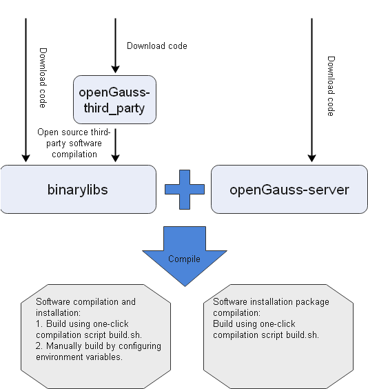

# Compiling the Version<a name="EN-US_TOPIC_0241496980"></a>

A  **build.sh**  script is provided for compiling openGauss and generating the installation package. You can compile openGauss by using the script. You can also configure environment variables and run commands to compile openGauss.
<!-- TOC -->

- [Preparation Before Compiling](#preparation-before-compiling)
- [Software Compilation and Installation](#software-compilation-and-installation)
- [Compiling the Installation Package](#compiling-the-installation-package)
- [Verification After Build](#Verification After Build<a name="EN-US_TOPIC_0000001267744405"></a>)
- [openGauss-OM Build](#openGauss-OM Build<a name="EN-US_TOPIC_0000001223104256"></a>)

<!-- /TOC -->

This section describes the prerequisites and procedure for openGauss compilation. The following figure shows the compilation process.

  


## Preparation Before Compiling

### Downloading Code

**Prerequisites**

The git and git-lfs have been installed and configured on the local host.

**Procedure**

1.  Run the following command to download the code and open-source and third-party software repository.  *\[git ssh address\]*  indicates the actual code download address. You can obtain them from the openGauss community.

    ```
    [user@linux sda]$ git clone [git ssh address] openGauss-server
    [user@linux sda]$ git clone [git ssh address] openGauss-third_party
    [user@linux sda]$ # mkdir binarylibs        For details about this comment, see the following note.
    ```

    > **NOTE:**   
    >-   **openGauss-server**: openGauss code repository.  
    >-   **openGauss-third\_party**: open-source third-party software repository on which openGauss depends.  
    >-   **binarylibs**: package for storing the built open-source third-party software. You can obtain the package by referring to  [Compiling Open-source Software](#Compiling Open-source Software)  . Since compiling and building open-source software take a long time, we have compiled and built  **binarylibs**  using  **openGauss-third\_party**  and compress and upload  **binarylibs**  to the Internet.  
    > The community provides binary files compiled on three platforms. The download links are as follows:\
      **openEuler_arm:** https://opengauss.obs.cn-south-1.myhuaweicloud.com/3.1.0/binarylibs/openGauss-third_party_binarylibs_openEuler_arm.tar.gz
      **openEuler_x86:** https://opengauss.obs.cn-south-1.myhuaweicloud.com/3.1.0/binarylibs/openGauss-third_party_binarylibs_openEuler_x86_64.tar.gz
      **Centos_x86:** https://opengauss.obs.cn-south-1.myhuaweicloud.com/3.1.0/binarylibs/openGauss-third_party_binarylibs_Centos7.6_x86_64.tar.gz

    >  After the download is complete, decompress and rename the package: **mv openGauss-third\_party\_binarylibs binarylibs**.

2.  When the progress of each download reaches 100%, the download is successful.

### Compiling Open-source Software

**Compiling Open-source Software**

Before compiling the openGauss, compile and build the open-source and third-party software on which the openGauss depends. These open-source and third-party software is stored in the  **openGauss-third\_party**  code repository. After downloading the software, you can use  **git lfs pull**  to obtain large files from the code repository. Generally, you only need to build the software once. If the open-source software is updated, rebuild the software.

Since this step takes a long time, we have compiled and built  **binarylibs**  using  **openGauss-third\_party**. You can download the package by referring to  [Downloading Code](#Downloading Code).

**Table  1**  openGauss open-source third-party software required before build

<a name="en-us_topic_0283136302_table1212531681911"></a>

<table><thead align="left"><tr id="en-us_topic_0283136302_row317811661910"><th class="cellrowborder" valign="top" width="50%" id="mcps1.2.3.1.1"><p id="en-us_topic_0283136302_p14178216101910"><a name="en-us_topic_0283136302_p14178216101910"></a><a name="en-us_topic_0283136302_p14178216101910"></a>Software</p>
</th>
<th class="cellrowborder" valign="top" width="50%" id="mcps1.2.3.1.2"><p id="en-us_topic_0283136302_p1117815167195"><a name="en-us_topic_0283136302_p1117815167195"></a><a name="en-us_topic_0283136302_p1117815167195"></a>Recommended Version</p>
</th>
</tr>
</thead>
<tbody><tr id="en-us_topic_0283136302_row12665347175013"><td class="cellrowborder" valign="top" width="50%" headers="mcps1.2.3.1.1 "><p id="en-us_topic_0283136302_p666574775019"><a name="en-us_topic_0283136302_p666574775019"></a><a name="en-us_topic_0283136302_p666574775019"></a>python3</p>
</td>
<td class="cellrowborder" valign="top" width="50%" headers="mcps1.2.3.1.2 "><p id="en-us_topic_0283136302_p10665104719506"><a name="en-us_topic_0283136302_p10665104719506"></a><a name="en-us_topic_0283136302_p10665104719506"></a>3.6</p>
</td>
</tr>
<tr id="en-us_topic_0283136302_row197487916204"><td class="cellrowborder" valign="top" width="50%" headers="mcps1.2.3.1.1 "><p id="en-us_topic_0283136302_p107489922013"><a name="en-us_topic_0283136302_p107489922013"></a><a name="en-us_topic_0283136302_p107489922013"></a>python3-devel</p>
</td>
<td class="cellrowborder" valign="top" width="50%" headers="mcps1.2.3.1.2 "><p id="en-us_topic_0283136302_p2748179172017"><a name="en-us_topic_0283136302_p2748179172017"></a><a name="en-us_topic_0283136302_p2748179172017"></a>3</p>
</td>
</tr>
<tr id="row263592810916"><td class="cellrowborder" valign="top" width="50%" headers="mcps1.2.3.1.1 "><p id="p3635128198"><a name="p3635128198"></a><a name="p3635128198"></a>setuptools</p>
</td>
<td class="cellrowborder" valign="top" width="50%" headers="mcps1.2.3.1.2 "><p id="p14635728598"><a name="p14635728598"></a><a name="p14635728598"></a>36.6.1</p>
</td>
</tr>
<tr id="row07201041201615"><td class="cellrowborder" valign="top" width="50%" headers="mcps1.2.3.1.1 "><p id="p18720144111617"><a name="p18720144111617"></a><a name="p18720144111617"></a>libaio-devel</p>
</td>
<td class="cellrowborder" valign="top" width="50%" headers="mcps1.2.3.1.2 "><p id="p2720144110166"><a name="p2720144110166"></a><a name="p2720144110166"></a>0.3.109-13</p>
</td>
</tr>
<tr id="row56941338161617"><td class="cellrowborder" valign="top" width="50%" headers="mcps1.2.3.1.1 "><p id="p126948386168"><a name="p126948386168"></a><a name="p126948386168"></a>flex</p>
</td>
<td class="cellrowborder" valign="top" width="50%" headers="mcps1.2.3.1.2 "><p id="p56954385169"><a name="p56954385169"></a><a name="p56954385169"></a>2.5.31 or later</p>
</td>
</tr>
<tr id="row18537134151611"><td class="cellrowborder" valign="top" width="50%" headers="mcps1.2.3.1.1 "><p id="p135391734101615"><a name="p135391734101615"></a><a name="p135391734101615"></a>ncurses-devel</p>
</td>
<td class="cellrowborder" valign="top" width="50%" headers="mcps1.2.3.1.2 "><p id="p553973412160"><a name="p553973412160"></a><a name="p553973412160"></a>5.9-13.20130511</p>
</td>
</tr>
<tr id="row10128237131716"><td class="cellrowborder" valign="top" width="50%" headers="mcps1.2.3.1.1 "><p id="p1912963771719"><a name="p1912963771719"></a><a name="p1912963771719"></a>lsb_release</p>
</td>
<td class="cellrowborder" valign="top" width="50%" headers="mcps1.2.3.1.2 "><p id="p14129143711712"><a name="p14129143711712"></a><a name="p14129143711712"></a>4.1</p>
</td>
</tr>
<tr id="en-us_topic_0283136302_row36571916172017"><td class="cellrowborder" valign="top" width="50%" headers="mcps1.2.3.1.1 "><p id="en-us_topic_0283136302_p18657151610204"><a name="en-us_topic_0283136302_p18657151610204"></a><a name="en-us_topic_0283136302_p18657151610204"></a>pam-devel</p>
</td>
<td class="cellrowborder" valign="top" width="50%" headers="mcps1.2.3.1.2 "><p id="en-us_topic_0283136302_p16578161209"><a name="en-us_topic_0283136302_p16578161209"></a><a name="en-us_topic_0283136302_p16578161209"></a>1.1.8-1.3.1</p>
</td>
</tr>
<tr id="en-us_topic_0283136302_row8539145811555"><td class="cellrowborder" valign="top" width="50%" headers="mcps1.2.3.1.1 "><p id="en-us_topic_0283136302_p154012589557"><a name="en-us_topic_0283136302_p154012589557"></a><a name="en-us_topic_0283136302_p154012589557"></a>libffi-devel</p>
</td>
<td class="cellrowborder" valign="top" width="50%" headers="mcps1.2.3.1.2 "><p id="en-us_topic_0283136302_p115401158175510"><a name="en-us_topic_0283136302_p115401158175510"></a><a name="en-us_topic_0283136302_p115401158175510"></a>3.1</p>
</td>
</tr>
<tr id="en-us_topic_0283136302_row317914169193"><td class="cellrowborder" valign="top" width="50%" headers="mcps1.2.3.1.1 "><p id="en-us_topic_0283136302_p201791916201910"><a name="en-us_topic_0283136302_p201791916201910"></a><a name="en-us_topic_0283136302_p201791916201910"></a>patch</p>
</td>
<td class="cellrowborder" valign="top" width="50%" headers="mcps1.2.3.1.2 "><p id="en-us_topic_0283136302_p1018051610198"><a name="en-us_topic_0283136302_p1018051610198"></a><a name="en-us_topic_0283136302_p1018051610198"></a>2.7.1-10</p>
</td>
</tr>
<tr id="row058514201981"><td class="cellrowborder" valign="top" width="50%" headers="mcps1.2.3.1.1 "><p id="p1658614202084"><a name="p1658614202084"></a><a name="p1658614202084"></a>golang</p>
</td>
<td class="cellrowborder" valign="top" width="50%" headers="mcps1.2.3.1.2 "><p id="p18586192014810"><a name="p18586192014810"></a><a name="p18586192014810"></a>1.13.3 or later</p>
</td>
</tr>
<tr id="row1128152932212"><td class="cellrowborder" valign="top" width="50%" headers="mcps1.2.3.1.1 "><p id="p17291829182210"><a name="p17291829182210"></a><a name="p17291829182210"></a>autoconf</p>
</td>
<td class="cellrowborder" valign="top" width="50%" headers="mcps1.2.3.1.2 "><p id="p53092915223"><a name="p53092915223"></a><a name="p53092915223"></a>2.69</p>
</td>
</tr>
<tr id="row1172523915224"><td class="cellrowborder" valign="top" width="50%" headers="mcps1.2.3.1.1 "><p id="p1725143902212"><a name="p1725143902212"></a><a name="p1725143902212"></a>automake</p>
</td>
<td class="cellrowborder" valign="top" width="50%" headers="mcps1.2.3.1.2 "><p id="p07251739142211"><a name="p07251739142211"></a><a name="p07251739142211"></a>1.13.4</p>
</td>
</tr>
<tr id="row8361101702315"><td class="cellrowborder" valign="top" width="50%" headers="mcps1.2.3.1.1 "><p id="p13361117192311"><a name="p13361117192311"></a><a name="p13361117192311"></a>cmake</p>
</td>
<td class="cellrowborder" valign="top" width="50%" headers="mcps1.2.3.1.2 "><p id="p63616179237"><a name="p63616179237"></a><a name="p63616179237"></a>3.18</p>
</td>
</tr>
<tr id="row6332136277"><td class="cellrowborder" valign="top" width="50%" headers="mcps1.2.3.1.1 "><p id="p83339361373"><a name="p83339361373"></a><a name="p83339361373"></a>diffutils</p>
</td>
<td class="cellrowborder" valign="top" width="50%" headers="mcps1.2.3.1.2 "><p id="p1133414367715"><a name="p1133414367715"></a><a name="p1133414367715"></a>3.7</p>
</td>
</tr>
<tr id="row142086918107"><td class="cellrowborder" valign="top" width="50%" headers="mcps1.2.3.1.1 "><p id="p62105941014"><a name="p62105941014"></a><a name="p62105941014"></a>openssl-devel</p>
</td>
<td class="cellrowborder" valign="top" width="50%" headers="mcps1.2.3.1.2 "><p id="p1421039181011"><a name="p1421039181011"></a><a name="p1421039181011"></a>1.1.1</p>
</td>
</tr>
<tr id="row116164361033"><td class="cellrowborder" valign="top" width="50%" headers="mcps1.2.3.1.1 "><p id="p76176361630"><a name="p76176361630"></a><a name="p76176361630"></a>libtool</p>
</td>
<td class="cellrowborder" valign="top" width="50%" headers="mcps1.2.3.1.2 "><p id="p161720364313"><a name="p161720364313"></a><a name="p161720364313"></a>2.4.2 or later</p>
</td>
</tr>
<tr id="en-us_topic_0283136302_row185636241451"><td class="cellrowborder" valign="top" width="50%" headers="mcps1.2.3.1.1 "><p id="en-us_topic_0283136302_p65646241259"><a name="en-us_topic_0283136302_p65646241259"></a><a name="en-us_topic_0283136302_p65646241259"></a>libtool-devel</p>
</td>
<td class="cellrowborder" valign="top" width="50%" headers="mcps1.2.3.1.2 "><p id="en-us_topic_0283136302_p9564624153"><a name="en-us_topic_0283136302_p9564624153"></a><a name="en-us_topic_0283136302_p9564624153"></a>2.4.2 or later</p>
</td>
</tr>
</tbody>
</table>


Prepare GCC 7.3 before building the third-party libraries. You are advised to use the released and built third-party library GCC and configure environment variables.

After installing the software listed in  [Table 1](#en-us_topic_0283136302_table1212531681911), point the default Python version to  **python3.x**  and perform the following operations:

1. Run the following commands to go to the directory of the open-source and third-party software on which the kernel depends, compile and build the open-source and third-party software, and generate binary programs or library files.  **/sda/openGauss-third\_party**  is the directory for downloading open-source third-party software.

   ```
   [user@linux sda]$ cd /sda/openGauss-third_party/build
   [user@linux build]$ sh build_all.sh
   ```

2. After the preceding commands are executed, the open-source third-party software required for openGauss build is automatically generated. To generate any open-source third-party software independently, go to the corresponding directory and run the  **build.sh**  script. For example:

   ```
   [user@linux sda]$ cd /sda/openGauss-third_party/dependency/openssl
   [user@linux openssl]$ sh build.sh
   ```

   The openssl is generated.

3. > **NOTE:** 
   >For error logs, you can view the corresponding log in the build directory and the log in the corresponding module. For example, you can view the OpenSSL compilation and installation logs in the  **dependency**  module.
   >
   >-   /sda/openGauss-third\_party/build/dependency\_build.log
   >-   /sda/openGauss-third\_party/dependency/build/openssl\_build.log
   >-   /sda/openGauss-third\_party/dependency/openssl/build\_openssl.log


**Compilation and Build Result**

After the preceding script is executed, the final compilation and build result is stored in the  **output **directory under the  **openGauss-third\_party**  directory These files will be used during the compilation of  **openGauss-server**.

### Introduction to compile script

**openGauss-server/build.sh**  is an important script tool during compilation. It integrates software installation and compilation and product installation package compilation functions to quickly compile and package code.

The following table describes the parameters.

**Table  2**  build.sh parameters

<a name="en-us_topic_0283136302_table1575410358472"></a>

<table><thead align="left"><tr id="en-us_topic_0283136302_row1975463519471"><th class="cellrowborder" valign="top" width="14.84148414841484%" id="mcps1.2.5.1.1"><p id="en-us_topic_0283136302_p27541635104712"><a name="en-us_topic_0283136302_p27541635104712"></a><a name="en-us_topic_0283136302_p27541635104712"></a>Option</p>
</th>
<th class="cellrowborder" valign="top" width="20.4020402040204%" id="mcps1.2.5.1.2"><p id="en-us_topic_0283136302_p272091325813"><a name="en-us_topic_0283136302_p272091325813"></a><a name="en-us_topic_0283136302_p272091325813"></a>Default Value</p>
</th>
<th class="cellrowborder" valign="top" width="21.992199219921993%" id="mcps1.2.5.1.3"><p id="en-us_topic_0283136302_p493319175413"><a name="en-us_topic_0283136302_p493319175413"></a><a name="en-us_topic_0283136302_p493319175413"></a>Parameter</p>
</th>
<th class="cellrowborder" valign="top" width="42.76427642764276%" id="mcps1.2.5.1.4"><p id="en-us_topic_0283136302_p1675513514716"><a name="en-us_topic_0283136302_p1675513514716"></a><a name="en-us_topic_0283136302_p1675513514716"></a>Description</p>
</th>
</tr>
</thead>
<tbody><tr id="en-us_topic_0283136302_row107551359472"><td class="cellrowborder" valign="top" width="14.84148414841484%" headers="mcps1.2.5.1.1 "><p id="en-us_topic_0283136302_p117551135124713"><a name="en-us_topic_0283136302_p117551135124713"></a><a name="en-us_topic_0283136302_p117551135124713"></a>-h</p>
</td>
<td class="cellrowborder" valign="top" width="20.4020402040204%" headers="mcps1.2.5.1.2 "><p id="en-us_topic_0283136302_p117201513155810"><a name="en-us_topic_0283136302_p117201513155810"></a><a name="en-us_topic_0283136302_p117201513155810"></a>Do not use this option.</p>
</td>
<td class="cellrowborder" valign="top" width="21.992199219921993%" headers="mcps1.2.5.1.3 "><p id="en-us_topic_0283136302_p169341617443"><a name="en-us_topic_0283136302_p169341617443"></a><a name="en-us_topic_0283136302_p169341617443"></a>-</p>
</td>
<td class="cellrowborder" valign="top" width="42.76427642764276%" headers="mcps1.2.5.1.4 "><p id="en-us_topic_0283136302_p157551835144710"><a name="en-us_topic_0283136302_p157551835144710"></a><a name="en-us_topic_0283136302_p157551835144710"></a>Help menu</p>
</td>
</tr>
<tr id="en-us_topic_0283136302_row0188244165818"><td class="cellrowborder" valign="top" width="14.84148414841484%" headers="mcps1.2.5.1.1 "><p id="en-us_topic_0283136302_p51882044145810"><a name="en-us_topic_0283136302_p51882044145810"></a><a name="en-us_topic_0283136302_p51882044145810"></a>-m</p>
</td>
<td class="cellrowborder" valign="top" width="20.4020402040204%" headers="mcps1.2.5.1.2 "><p id="en-us_topic_0283136302_p718894410584"><a name="en-us_topic_0283136302_p718894410584"></a><a name="en-us_topic_0283136302_p718894410584"></a>release</p>
</td>
<td class="cellrowborder" valign="top" width="21.992199219921993%" headers="mcps1.2.5.1.3 "><p id="en-us_topic_0283136302_p1993418171411"><a name="en-us_topic_0283136302_p1993418171411"></a><a name="en-us_topic_0283136302_p1993418171411"></a>[debug | release | memcheck]</p>
</td>
<td class="cellrowborder" valign="top" width="42.76427642764276%" headers="mcps1.2.5.1.4 "><p id="en-us_topic_0283136302_p5188184405812"><a name="en-us_topic_0283136302_p5188184405812"></a><a name="en-us_topic_0283136302_p5188184405812"></a>Selects the target version.</p>
</td>
</tr>
<tr id="en-us_topic_0283136302_row1675515357477"><td class="cellrowborder" valign="top" width="14.84148414841484%" headers="mcps1.2.5.1.1 "><p id="en-us_topic_0283136302_p6755235114711"><a name="en-us_topic_0283136302_p6755235114711"></a><a name="en-us_topic_0283136302_p6755235114711"></a>-3rd</p>
</td>
<td class="cellrowborder" valign="top" width="20.4020402040204%" headers="mcps1.2.5.1.2 "><p id="en-us_topic_0283136302_p1772010136588"><a name="en-us_topic_0283136302_p1772010136588"></a><a name="en-us_topic_0283136302_p1772010136588"></a>${<em id="i982062218113418"><a name="i982062218113418"></a><a name="i982062218113418"></a>Code directory</em>}/binarylibs</p>
</td>
<td class="cellrowborder" valign="top" width="21.992199219921993%" headers="mcps1.2.5.1.3 "><p id="en-us_topic_0283136302_p1493614171349"><a name="en-us_topic_0283136302_p1493614171349"></a><a name="en-us_topic_0283136302_p1493614171349"></a>[binarylibs path]</p>
</td>
<td class="cellrowborder" valign="top" width="42.76427642764276%" headers="mcps1.2.5.1.4 "><p id="en-us_topic_0283136302_p1755173520474"><a name="en-us_topic_0283136302_p1755173520474"></a><a name="en-us_topic_0283136302_p1755173520474"></a>Specifies the path of <strong id="b1303969713113418"><a name="b1303969713113418"></a><a name="b1303969713113418"></a>binarylibs</strong>. The path must be an absolute path.</p>
</td>
</tr>
<tr id="en-us_topic_0283136302_row1875543594716"><td class="cellrowborder" valign="top" width="14.84148414841484%" headers="mcps1.2.5.1.1 "><p id="en-us_topic_0283136302_p475523515475"><a name="en-us_topic_0283136302_p475523515475"></a><a name="en-us_topic_0283136302_p475523515475"></a>-pkg</p>
</td>
<td class="cellrowborder" valign="top" width="20.4020402040204%" headers="mcps1.2.5.1.2 "><p id="en-us_topic_0283136302_p372131325815"><a name="en-us_topic_0283136302_p372131325815"></a><a name="en-us_topic_0283136302_p372131325815"></a>Do not use this option.</p>
</td>
<td class="cellrowborder" valign="top" width="21.992199219921993%" headers="mcps1.2.5.1.3 "><p id="en-us_topic_0283136302_p693619174418"><a name="en-us_topic_0283136302_p693619174418"></a><a name="en-us_topic_0283136302_p693619174418"></a>-</p>
</td>
<td class="cellrowborder" valign="top" width="42.76427642764276%" headers="mcps1.2.5.1.4 "><p id="en-us_topic_0283136302_p13756143512476"><a name="en-us_topic_0283136302_p13756143512476"></a><a name="en-us_topic_0283136302_p13756143512476"></a>Compresses the code compilation result into an installation package.</p>
</td>
</tr>
<tr id="en-us_topic_0283136302_row1271210213485"><td class="cellrowborder" valign="top" width="14.84148414841484%" headers="mcps1.2.5.1.1 "><p id="en-us_topic_0283136302_p3713112184817"><a name="en-us_topic_0283136302_p3713112184817"></a><a name="en-us_topic_0283136302_p3713112184817"></a>-nopt</p>
</td>
<td class="cellrowborder" valign="top" width="20.4020402040204%" headers="mcps1.2.5.1.2 "><p id="en-us_topic_0283136302_p11982718195610"><a name="en-us_topic_0283136302_p11982718195610"></a><a name="en-us_topic_0283136302_p11982718195610"></a>Do not use this option.</p>
</td>
<td class="cellrowborder" valign="top" width="21.992199219921993%" headers="mcps1.2.5.1.3 "><p id="en-us_topic_0283136302_p12969132175620"><a name="en-us_topic_0283136302_p12969132175620"></a><a name="en-us_topic_0283136302_p12969132175620"></a>-</p>
</td>
<td class="cellrowborder" valign="top" width="42.76427642764276%" headers="mcps1.2.5.1.4 "><p id="en-us_topic_0283136302_p371302154814"><a name="en-us_topic_0283136302_p371302154814"></a><a name="en-us_topic_0283136302_p371302154814"></a>If this option is used, the CPU of the Kunpeng platform is not optimized.</p>
</td>
</tr>
</tbody>
</table>


>![] (public_sys-resources/icon-note.gif) **NOTE:**
>
>1.  **-m \[debug | release | memcheck\]**  indicates that three target versions can be selected:
>    -   **release**: indicates that the binary program of the release version is generated. During compilation of this version, the GCC high-level optimization option is configured to remove the kernel debugging code. This option is usually used in the production environment or performance test environment.
>    -   **debug**: indicates that a binary program of the debug version is generated. During compilation of this version, the kernel code debugging function is added, which is usually used in the development self-test environment.
>    -   **memcheck**: indicates that a binary program of the memcheck version is generated. During compilation of this version, the ASAN function is added based on the debug version to locate memory problems.
>2.  **-3rd \[binarylibs path\]**  is the path of  **binarylibs**. By default,  **binarylibs**  exists in the current code folder. If  **binarylibs**  is moved to  **openGauss-server**  or a soft link to  **binarylibs**  is created in  **openGauss-server**, you do not need to specify the parameter. However, if you do so, please note that the file is easy to be deleted by the  **git clean**  command.
>3.  Each option in this script has a default value. The number of options is small and the dependency is simple. Therefore, this script is easy to use. If the required value is different from the default value, set this parameter based on the actual requirements.

## Software Compilation and Installation

Software build and installation are to build code to generate software and install the software on a computer. The one-click build script  **build.sh**  is provided. You can also manually configure environment variables. The two methods are described below in this section.

### Prerequisites

-   The software and hardware have been prepared based on the requirements in  [Setting up the Compilation Environment](setting-up-the-compilation-environment.md), and the code has been downloaded by referring to  [Downloading Code](#Downloading Code).
-   Open-source software has been compiled and built. For details, see   [Compiling Open-source Software](#Compiling Open-source Software). GCC 7.3 has been placed in the  **output**  directory based on the directory structure of the released and compiled third-party library.
-   You are familiar with the parameter options and functions of the  [Introduction to build.sh](#Introduction to compile script)  script.
-   The code environment is clean, and no file is generated before the current compilation. For details, see  [FAQ](faqs.md).

### Compilation Using the One-click Script

1.  Run the following command to go to the directory where the software code compilation script is stored:

    ```
    [user@linux sda]$ cd /sda/openGauss-server
    ```

2.  <a name="li1666842982511"></a>Run the following command to compile openGauss:

    ```
    [user@linux openGauss-server]$ sh build.sh -m [debug | release | memcheck] -3rd [binarylibs path]
    ```

    For example:

    ```
    sh build.sh      # Compile and install openGauss of the release version. binarylibs or its soft link must exist in the code directory. Otherwise, the operation fails.
    sh build.sh -m debug -3rd /sdc/binarylibs            # Compile and install openGauss of the debug version.
    ```

3.  If the following information is displayed, the compilation is successful:

    ```
    make compile sucessfully!
    ```

    -   The software installation path after compilation is  **/sda/openGauss-server/mppdb_temp_install**.
    -   The compiled binary files are stored in  **/sda/openGauss-server/mppdb_temp_install/bin**.
    -   Compilation log: **./build/script/makemppdb_pkg.log**
    
4. Import environment variables to initialize and start the database.

   ```
   export CODE_BASE=________     # openGauss-server path
   export GAUSSHOME=$CODE_BASE/mppdb_temp_install/
   export LD_LIBRARY_PATH=$GAUSSHOME/lib::$LD_LIBRARY_PATH
   export PATH=$GAUSSHOME/bin:$PATH
   ```

   


### Manual Compilation

1.  Run the following command to go to the software code directory:

    ```
    [user@linux sda]$ cd /sda/openGauss-server
    ```

2.  Obtain the third-party library binary file of the corresponding platform.

3.  Configure environment variables, add  **\_\_\_\_**  based on the code download location.

    ```
    export CODE_BASE=________     # Path of the openGauss-server file
    export BINARYLIBS=________    # Path of the binarylibs file
    export GAUSSHOME=$CODE_BASE/dest/
    export GCC_PATH=$BINARYLIBS/buildtools/gcc7.3/
    export CC=$GCC_PATH/gcc/bin/gcc
    export CXX=$GCC_PATH/gcc/bin/g++
    export LD_LIBRARY_PATH=$GAUSSHOME/lib:$GCC_PATH/gcc/lib64:$GCC_PATH/isl/lib:$GCC_PATH/mpc/lib/:$GCC_PATH/mpfr/lib/:$GCC_PATH/gmp/lib/:$LD_LIBRARY_PATH
    export PATH=$GAUSSHOME/bin:$GCC_PATH/gcc/bin:$PATH
    ```

4. Select a version and configure it.

   **debug**  version:

   ```
   ./configure --gcc-version=7.3.0 CC=g++ CFLAGS='-O0' --prefix=$GAUSSHOME --3rd=$BINARYLIBS --enable-debug --enable-cassert --enable-thread-safety --with-readline --without-zlib
   ```

   **release**  version:

   ```
   ./configure --gcc-version=7.3.0 CC=g++ CFLAGS="-O2 -g3" --prefix=$GAUSSHOME --3rd=$BINARYLIBS --enable-thread-safety --with-readline --without-zlib
   ```

   **memcheck**  version:

   ```
   ./configure --gcc-version=7.3.0 CC=g++ CFLAGS='-O0' --prefix=$GAUSSHOME --3rd=$BINARYLIBS --enable-debug --enable-cassert --enable-thread-safety --with-readline --without-zlib --enable-memory-check
   ```

   > **NOTE:**   
   >
   >- *\[debug | release | memcheck\]*  indicates that three target versions are available. The three target versions are as follows:
   >   -   **release**: indicates that the binary program of the release version is generated. During this version build, the GCC high-level optimization option is configured to remove the kernel debugging code. This option is usually used in the production environment or performance test environment.
   >   -   **debug**: indicates that a binary program of the debug version is generated. During this version build, the kernel code debugging function is added, which is usually used in the development self-test environment.
   >   -   **memcheck**: indicates that a binary program of the memcheck version is generated. During this version build, the ASAN function is added based on the debug version to locate memory problems.
   >- On the ARM-based platform,  **-D\_\_USE\_NUMA**  needs to be added to  **CFLAGS**.
   >- On the  **ARMv8.1**  platform or a later version \(for example, Kunpeng 920\),  **-D\_\_ARM\_LSE**  needs to be added to  **CFLAGS**.
   >- If  **binarylibs**  is moved to  **openGauss-server**  or a soft link to  **binarylibs**  is created in  **openGauss-server**, you do not need to specify the  **--3rd**  parameter. However, if you do so, please note that the file is easy to be deleted by the  **git clean**  command.
   >- To use the MOT, you need to add  **--enable-mot**  to the command.
   
5.  Run the following commands to compile openGauss:

    ```
    [user@linux openGauss-server]$ make -sj
    [user@linux openGauss-server]$ make install -sj
    ```

6.  If the following information is displayed, the compilation and installation are successful:

    ```
    openGauss installation complete.
    ```

    -   The software installation path after compilation is  *$GAUSSHOME*.
    -   The compiled binary files are stored in  *$GAUSSHOME***/bin**.

## Compiling the Installation Package

To compile the installation package is to compile the code and generate the software installation package. The compilation and packaging process of the installation package is also integrated in  **build.sh**.

### Prerequisites

-   TThe software and hardware have been prepared based on the requirements for setting up the compilation environment, and the code has been downloaded by referring to  [Downloading Code](#Downloading-Code).
-   The open-source software has been compiled and built. For details, see   [Compiling Open-source Software](#Compiling Open-source Software).
-   You are familiar with the parameter options and functions of the  [Introduction to build.sh](#Introduction to compile script)  script.
-   The code environment is clean, and no file is generated before the current compilation. For details, see  [FAQ](faqs.md).

### Procedure

1.  Run the following command to go to the code directory:

    ```
    [user@linux sda]$ cd /sda/openGauss-server
    ```

2.  Run the following command to compile the openGauss installation package:

    ```
    [user@linux openGauss-server]$ sh build.sh -m [debug | release | memcheck] -3rd [binarylibs path] -pkg
    ```

    For example:

    ```
    sh build.sh -pkg      # Generate the openGauss installation package of the release version. binarylibs or its soft link must exist in the code directory. Otherwise, the operation fails.
    sh build.sh -m debug -3rd /sdc/binarylibs -pkg            # Generate the openGauss installation package of the debug version.
    ```

    Compared with  [Software Compilation and Installation](#software-compilation-and-installation), this operation involves the process of generating software by one-click compilation and the process of encapsulating the software into an installation package. Compared with the  **build.sh**  command in  [Software Compilation and Installation](#software-compilation-and-installation), only the  **-pkg**  option is added.

3.  If the following information is displayed, the installation package compilation is successful:

    ```
    success!
    ```

    -   The build and packaging log file is stored in  **./build/script/makemppdb\_pkg.log**.

## Verification After Build<a name="EN-US_TOPIC_0000001267744405"></a>

After the build is complete, perform the following steps to verify openGauss:

1. Run the following command to create user  **omm**  as user  **root**:

   ```
   [user@linux sda]# useradd omm -g dbgrp
   [user@linux sda]# passwd omm
   ```

2. Add the following environment variables to  **\~/.bashrc**  as user  **omm**:

   ```
   export GAUSSHOME=/root/openGauss-server/dest/ ## Path of the build result. You can change the path as required.
   export LD_LIBRARY_PATH=$GAUSSHOME/lib:$LD_LIBRARY_PATH
   export PATH=$GAUSSHOME/bin:$PATH
   ```

   Run the following command for environment variables to take effect:

   ```
     [user@linux sda]$ source ~/.bashrc
   ```

3. Create the data directory and log directory.

   ```
   [user@linux sda]$ mkdir ~/data
   [user@linux sda]$ mkdir ~/log
   [user@linux sda]$ chown -R omm:dbgrp /root/openGauss-server
   ```

4. Initialize the database.

   ```
   [user@linux sda]$ gs_initdb -D /home/omm/data --nodename=db1 
   ```

5. Start the database.

   ```
   [user@linux sda]$ gs_ctl start -D /home/omm/data -Z single_node -l /home/omm/log/opengauss.log
   ```

   After the database is started, you can run the  **ps -ef | grep gaussdb**  command to check the database process status, run the  **gs\_ctl query -D /home/omm/data**  command to check the database status, or run the  **gsql -d postgres**  command to enter the  **gsql**  command line to view database information.

## openGauss-OM Build<a name="EN-US_TOPIC_0000001223104256"></a>

After the openGauss-server code repository is built using the source code, gs\_om does not exist. To use gs\_om, you need to compile openGauss-OM separately, copy the built  **openGauss-***xxx***-om.tar.gz**  package to the directory where the openGauss-server installation package is located, and install the openGauss-OM in the same way as the enterprise edition.

## Procedure<a name="section1794492142011"></a>

1. Run the  **git clone**  command to clone the OM code repository:

   ```
   [user@linux sda]$ git clone https://gitee.com/opengauss/openGauss-OM.git
   ```

2. Run the following build command:

   ```
   [user@linux sda]$ cd openGauss-OM
   [user@linux sda]$ chmod +x build.sh
   [user@linux sda]$ export BINARYLIBS_PATH=/root/binarylibs (Enter the directory generated after the third-party software package is decompressed.)
   [user@linux sda]$ ./build.sh -3rd $BINARYLIBS_PATH
   ```

3. The Gauss-OM is built successfully if the following information is displayed:

   ```
   ROOT_DIR: /root/binarylibs
   Everything is ready.
   success!
   ```
