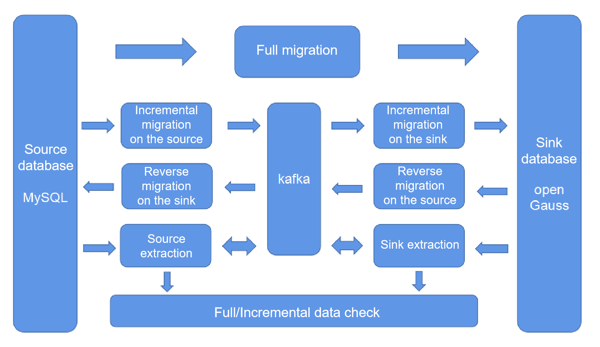

# Migrating Data from MySQL Database to openGauss

## Tool Deployment Architecture

Currently, openGauss supports the following MySQL migration services:

- **[Quick MySQL Migration](quick-mysql-migration.md)**  

-   **[Full migration](full-migration.md)** 
-   **[Incremental migration](incremental-migration.md)** 
-   **[Reverse migration](reverse-migration.md)** 
-   **[Data check](data-check.md)** 
