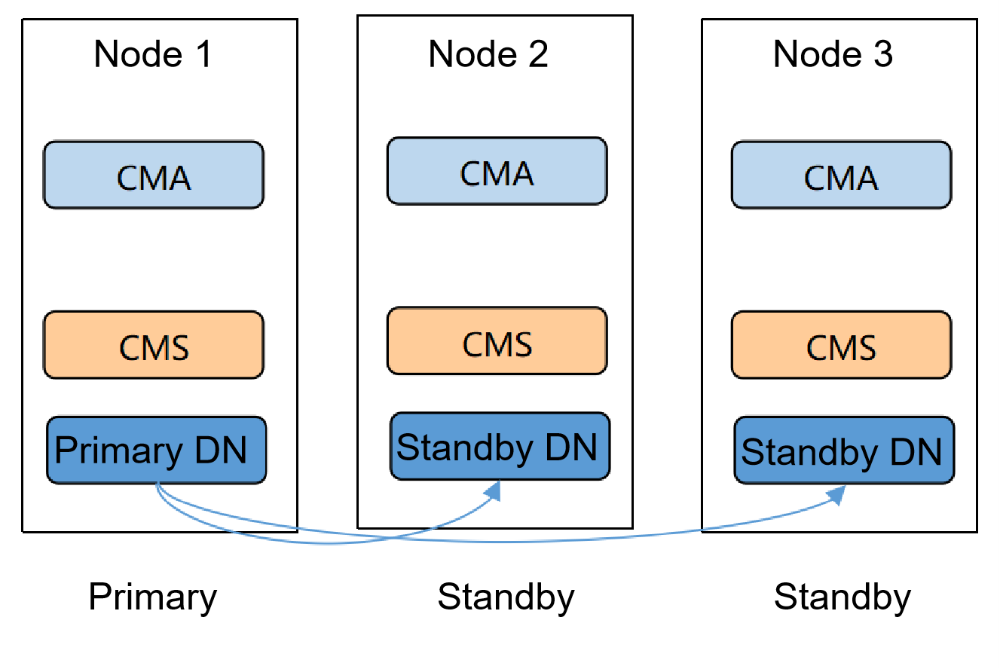
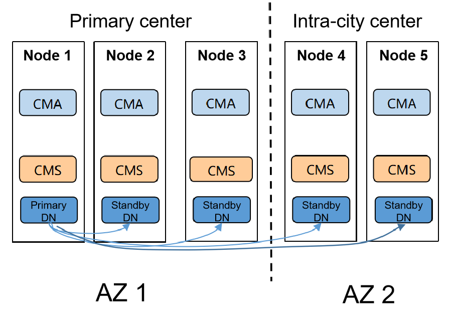
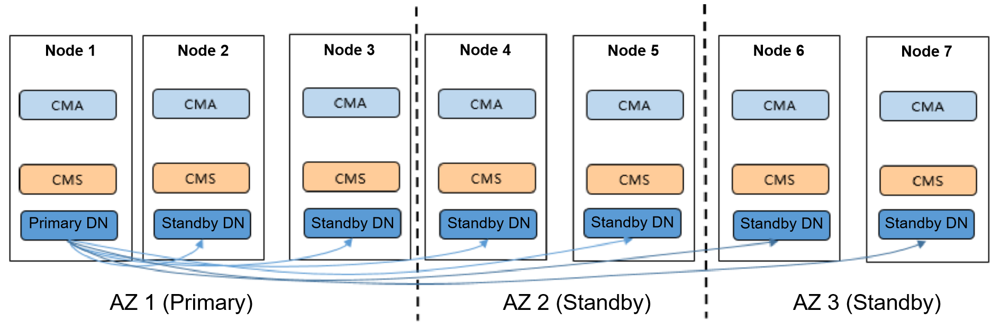
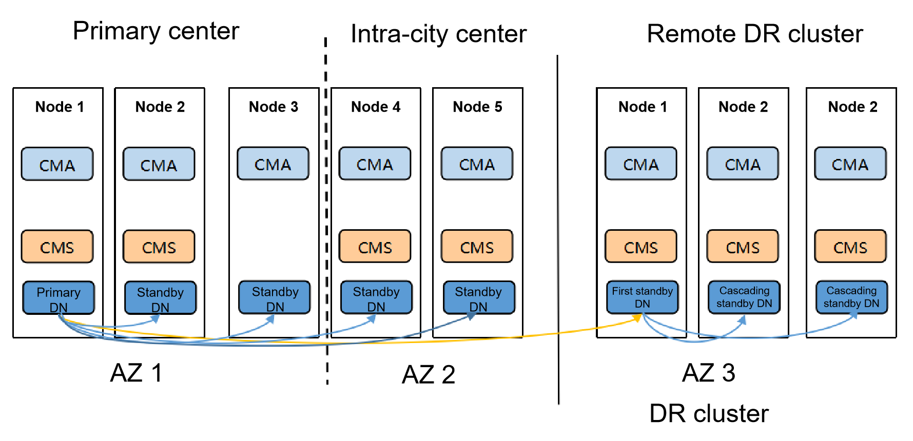

# Common Primary/Standby Deployment Solutions

## Single-Center Deployment

**Figure 1** Single-center deployment 
    

Networking features:
If a single AZ is deployed, one synchronous standby node and one asynchronous standby node can be configured.

Advantages:
1. Three nodes are equivalent. If any node is faulty, the other nodes can still provide services.
2. The cost is low.

Disadvantages:
The high availability (HA) is low. If an AZ-level fault occurs, you can only restore the entire node.

Applicability:
Applicable to service systems that have low requirements on HA.

## Intra-City Dual-Center Deployment

**Figure 2** Intra-city dual-center deployment 
    

Networking features:
Two intra-city AZs are more reliable than a single AZ. A synchronous standby node can be configured for the primary center and the intra-city center respectively.

Advantages:
1. Intra-city synchronous replication. If one data center is faulty, the other data center can still provide services without data loss. RPO = 0.
2. The cost is reasonable.

Disadvantages:
1. The intra-city distance should not be too long. It is recommended that the distance be within 70 km. The total latency caused by excessive read/write times should be considered during service design.
2. Remote DR is not supported.

Applicability:
Applicable to common service systems.

## Two-City Three-DC Deployment

**Figure 3** Two-city three-dc deployment 
    

Networking features:
In the two-city three-DC deployment, each AZ must have at least one synchronous standby node. The cluster reliability can reach the highest level when the number of cities and data centers increases.

Advantages:
It supports zero data loss in remote DR, and has the highest reliability. RPO = 0.

Disadvantages:
1. If the remote DR distance is long and synchronous standby node is configured in the remote center, the performance may be affected.
2. The cost is relatively high.

Applicability:
Applicable to core and important service systems.

## Two-City Three-DC Streaming DR Solution

**Figure 4** Two-city three-DC streaming DR solution 
    

Networking features:
Two independent clusters are deployed in the dual-cluster DR solution. The primary and DR cluster networking modes can be selected as required. The DR cluster selects the first standby DN to connect to the primary DN of the primary cluster. In the DR cluster, the first standby DN is connected in cascading standby mode.

Advantages:
1. The primary cluster has the advantage of single-cluster networking. You need to manually switch to the standby cluster only when the primary cluster is unavailable.
2. There is only one cross-cluster (remote) replication link regardless of whether a DR switchover occurs. Therefore, less network bandwidth is occupied.
3. The networking is more flexible. The primary cluster and DR cluster can use different networking modes.

Disadvantages:
1. DR clusters need to be added, increasing costs.
2. Remote DR RPO > 0

Applicability:
Applicable to core and important service systems.

For more information, see [Two-City Three-DC DR](two-city-three-dc-dr.md).

> **NOTE:**
>
>The preceding deployments are typical solutions. You can adjust the deployment solutions based on actual service scenarios, for example, adding or deleting standby nodes, adjusting the number of centers, properly deploying synchronous and asynchronous standby nodes, and properly using cascaded standby nodes.
