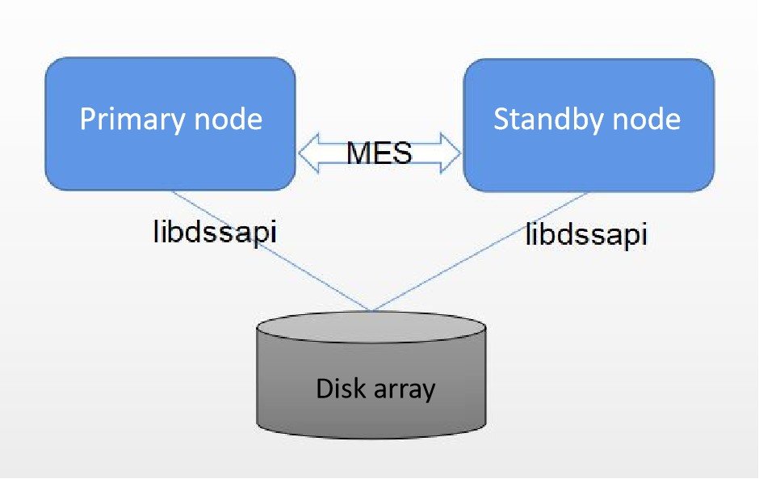

# Resource Pooling Environment Deployment Guide

## Description

openGauss resource pooling is a new cluster architecture launched by openGauss. The DMS and DSS components are used to implement underlying shared storage among multiple nodes in a cluster and real-time memory sharing among nodes. In this way, underlying storage resources are saved, write-once-read-many is supported in a cluster, and real-time consistent read is supported.
This document describes how to set up a resource pooling environment for self-learning or development.

## Background Knowledge

Developers are advised to:
- Understand basic Linux commands, such as **dd** and **iscis**.
- Understand disk arrays.
- Be familiar with the traditional openGauss compilation mode.

## Precautions

  - The following figure shows the resource pooling deployment.

<p align="center"><b>Figure 1: openGauss resource pooling deployment</b></p>
<div align="center"></div>

  - In the installation package of the enterprise edition officially released in the community, if the resource pooling architecture needs to be set up, disk arrays, servers, and optical switches need to be prepared, and the CM and OM components need to be deployed.

  - This document describes how to set up a compilation environment without the disk array, CM, or OM component. Only a common physical machine is required to set up a resource pooling environment.

  - Note that the environment set up in this mode cannot be used to debug primary/standby switchover or failover because no real CM is used. It can only be used to verify the normal running of the cluster.

## Preparing for the Environment
  - An independent physical machine with at least one disk partition whose free space is greater than 200 GB.
  - The openGauss installation package of the debug version with resource pooling code has been compiled.You can check whether dssserver and dsscmd exist in the generated **bin** directory. Check whether **libdms.so**, **libdssapi.so**, and **libdssaio.so** exist in the **lib** directory. Ensure that the DSS and DMS components of the test version are used during openGauss compilation. For details, see the following steps.

## Independent Compilation and Installation
> **CAUTION:** 
>
> Do not perform the following deployment operations in the production environment.

 > **NOTE:**  
  > - openGauss must be compiled in debug mode instead of release mode. The DMS and DSS components of the test version are used.
  > - The manual compilation and installation mode does not contain the CM and OM components. In the formal environment, the DSS and DMS components depend on the CM. Therefore, you need to compile the DSS and DMS components in test mode before compiling the openGauss. For details, see the following compilation mode description.

1. Compile the DSS component of the test version.

      a. Download the CBB code of the latest version. Then, compile, install, and use it to replace CBB in the third-party library.

      b. Download the DSS code of the latest version and roll back the DSS to the specified version based on the version number in **src/gausskernel/ddes/ddes\_commit\_id**.

      c. Compile, install, and use the downloaded DSS component to replace the DSS component in the third-party library. (**DSS\_CODE\_PATH** indicates the directory of the decompressed DSS source code, and **ThirdParty\_Binarylibs\_Path** indicates the directory of the decompressed third-party library.)
```shell
  #-**-3rd** is followed by the absolute path of the third-party library.
  cd [DSS_CODE_PATH]/build/linux/opengauss
  sh build.sh -3rd [ThirdParty_Binarylibs_Path] -t cmake -m DebugDsstest
```
2. Compile the DMS component of the test version.

      a. Download the CBB code of the latest version. Then, compile, install, and use it to replace CBB in the third-party library.

      b. Download the DMS code of the latest version and roll back the DMS to the specified version based on the version number in **src/gausskernel/ddes/ddes\_commit\_id**.

      c. Compile, install, and use the downloaded DMS component to replace the DMS component in the third-party library. (**DMS\_CODE\_PATH** indicates the directory of the decompressed DSS source code, and **ThirdParty\_Binarylibs\_Path** indicates the directory of the decompressed third-party library.)
```shell
  cd [DMS_CODE_PATH]/build/linux/opengauss
  sh build.sh -3rd [ThirdParty_Binarylibs_Path] -t cmake -m Release
  cd [DMS_CODE_PATH]
  mkdir -p tmp
  export BUILD_MODE=Debug
  cmake . -DCMAKE_BUILD_TYPE=Debug -D DMS_TEST=ON -DOPENGAUSS=yes -B ./tmp
  cd tmp/
  make -sj
```
>  **CAUTION:** 
>
>    After the DSS, DMS, and CBB are compiled, they are automatically updated to the third-party library. You do not need to manually copy them. You only need to compile the database according to the standard procedure.

3. Configure environment variables.

   The following uses two nodes as an example. **DSS\_HOME** indicates the directory required for running dssserver of DN 1 and needs to be manually created. Write the following content to **/home/test/envfile** as environment variables.

  ```shell
export GAUSSHOME=/home/test/openGauss-server/dest/
export LD_LIBRARY_PATH=$GAUSSHOME/lib:$LD_LIBRARY_PATH
export PATH=$GAUSSHOME/bin:$PATH
export DSS_HOME=/home/test/dss/dss0/dssdba
  ```
4. Create directories for **dssserver**.
  ```shell
  cd /home/test
  mkdir -p dss/dss0/dssdba/cfg
  mkdir -p dss/dss0/dssdba/log
  mkdir -p dss/dss1/dssdba/cfg
  mkdir -p dss/dss1/dssdba/log
  mkdir -p dss/dev
  ```

5. Run the **dd** command to create a simulated block device file.

  The following command is used to create a 2 TB disk. Adjust the values of **bs** and **count** as required. The execution time depends on the disk performance.
  ```shell
  dd if=/dev/zero of=/home/test/dss/dev/dss-dba bs=2M count=1024000 >/dev/null 2>&1
  ```

6. Create the configuration files of DSS 0 and DSS 1 required by the two DNs.

    Create the configuration file of DSS 0.
  ```shell
  vim /home/test/dss/dss0/dssdba/cfg/dss_inst.ini
  ```
  The file content is as follows:
  ```shell
  INST_ID=0
  _LOG_LEVEL=255
  DSS_NODES_LIST=0:127.0.0.1:17102,1:127.0.0.1:18102
  DISK_LOCK_FILE_PATH=/home/test/dss/dss0
  LSNR_PATH=/home/test/dss/dss0
  _LOG_MAX_FILE_SIZE=20M
  _LOG_BACKUP_FILE_COUNT=128
  ```

  Create the volume configuration file of DSS 0.
  ```shell
  vim /home/test/dss/dss0/dssdba/cfg/dss_vg_conf.ini
  ```
  The content in the file is as follows, which is the volume name plus the device name simulated by **dd**:
  ```shell
  data:/home/test/dss/dev/dss-dba
  ```

  Create the configuration file of DSS 1.
  ```shell
  vim /home/test/dss/dss1/dssdba/cfg/dss_inst.ini
  ```
  The content in the file is as follows. Note that the value of **DISK\_LOCK\_FILE\_PATH** is the same as that in DSS 0.
  ```shell
  INST_ID=1
  _LOG_LEVEL=255
  DSS_NODES_LIST=0:127.0.0.1:17102,1:127.0.0.1:18102
  DISK_LOCK_FILE_PATH=/home/test/dss/dss0
  LSNR_PATH=/home/test/dss/dss1
  _LOG_MAX_FILE_SIZE=20M
  _LOG_BACKUP_FILE_COUNT=128
  ```

  Create the volume configuration file of DSS 1.
  ```shell
  vim /home/test/dss/dss1/dssdba/cfg/dss_vg_conf.ini
  ```
  The content in the file is as follows, which is the volume name plus the device name simulated by **dd**:
  ```shell
  data:/home/test/dss/dev/dss-dba
  ```
>  **CAUTION:** 
>
> Multiple DNs (databases) are created on a server. The IP addresses are the same, but the port numbers used by services are different.

7. Create a data volume for storing database data and start the dssserver service.

  ```shell
  ##This is the environment variable configured in step 3.
  source /home/test/envfile
  dsscmd cv -g data -v /home/test/dss/dev/dss-dba
  dssserver -D /home/test/dss/dss0/dssdba &
  #If **DSS SERVER STARTED** is displayed in the previous command output, the operation is successful.
  dssserver -D /home/test/dss/dss1/dssdba &
  #If **DSS SERVER STARTED** is displayed in the previous command output, the operation is successful.

  #Run the following command to check whether the volume is successfully created.
  dsscmd lsvg -U UDS:/home/test/dss/dss0/.dss_unix_d_socket
  dsscmd ls -m M -p +data -U UDS:/home/test/dss/dss0/.dss_unix_d_socket
  ```
>  **CAUTION:** 
>
> The DSS does not support volume group configuration modification after startup. If the volume group configuration needs to be modified, perform the preceding steps again.

8. Perform the gs_initdb operation on each node in sequence.

  ```shell
mkdir -p /home/test/data
rm -rf node1 node2

gs_intdb -D /home/test/data/node1 --nodename=node1 -U tester -w Pasword --vgname=+data --enable-dss --dms_url="0:127.0.0.1:1613,1:127.0.0.1:1614" -I 0 --socketpath='UDS:/home/test/dss/dss0/.dss_unix_d_socket'

echo "ss_enable_ssl = off
listen_addresses = '*'
port=12210
ss_enable_reform = off
ss_work_thread_count = 32
enable_segment = on
ss_log_level = 255
ss_log_backup_file_count = 100
ss_log_max_file_size = 1GB
" >> /home/test/data/node1/postgresql.conf

sed '91 ahost       all        all         0.0.0.0/0        sha256' -i /home/test/data/node1/pg_hba.conf

gs_intdb -D /home/test/data/node2 --nodename=node2 -U tester -w Pasword --vgname=+data --enable-dss --dms_url="0:127.0.0.1:1613,1:127.0.0.1:1614" -I 1 --socketpath='UDS:/home/test/dss/dss1/.dss_unix_d_socket'

echo "ss_enable_ssl = off
listen_addresses = '*'
port=13210
ss_enable_reform = off
ss_work_thread_count = 32
enable_segment = on
ss_log_level = 255
ss_log_backup_file_count = 100
ss_log_max_file_size = 1GB
" >> /home/test/data/node2/postgresql.conf

sed '91 ahost       all        all         0.0.0.0/0        sha256' -i /home/test/data/node2/pg_hba.conf
  ```

9. Create a file that simulates the CM function and add it to the environment variable created in step 3.
```shell
  echo "REFORMER_ID = 0" > /home/test/cm_config.ini
  echo "BITMAP_ONLINE = 3" >> /home/test/cm_config.ini
  echo "export CM_CONFIG_PATH=/home/test/cm_config.ini" >> /home/test/envfile
```

10. Start node 1 and node 2 in sequence.
```shell
  source /home/test/envfile
  gs_ctrl start -D /home/test/data/node1
  gs_ctrl start -D /home/test/data/node2
```

## Supplementary Information

+ The **ss\_log\_level** parameter is used to determine whether to print DMS and DSS logs. The log directory is **pg\_log/DMS**.

  - Ports 17102 and 18102 are used by the dssserver.

  - Ports 1613 and 1614 are used for DMS communication.

  - Ports 12210 and 13210 are used by the openGauss database to provide services.

  - The values of **INST\_ID** in the dssserver configuration cannot conflict with each other. For example, the values of **INST\_ID** for multiple dssservers cannot be the same.

  - The environment set up in this mode does not support HA, and switchover and failover cannot be tested.

  - If an error message such as "dms library version is not matched" is displayed during the startup, the DMS or DSS component version is incorrect. In this case, recompile the DMS or DSS component by referring to the compilation procedure.

  - In a non-CM environment, node 0 is restricted to be the primary node. Therefore, ensure that node 0 is successfully created in the initdb phase.

  - If an error is reported during the installation, the system may display a message indicating that the directory is not empty when you perform the initdb operation again. In this case, you need to clear the residual files in the file system and DSS. You can run the **rm** command to delete the node folder from the file system. In DSS, you can write 0 to the header of the simulated block device file (DSS records the metadata information in the header). After the clearing is complete, start from step 7. The clearing command is as follows:
  
    ```
    rm -rf /home/test/data/node1 /home/test/data/node2
    dd if=/dev/zero of=/home/test/dss/dev/dss-dba bs=2M count=10 conv=notrunc >/dev/null 2>&1
    ```
    
    
