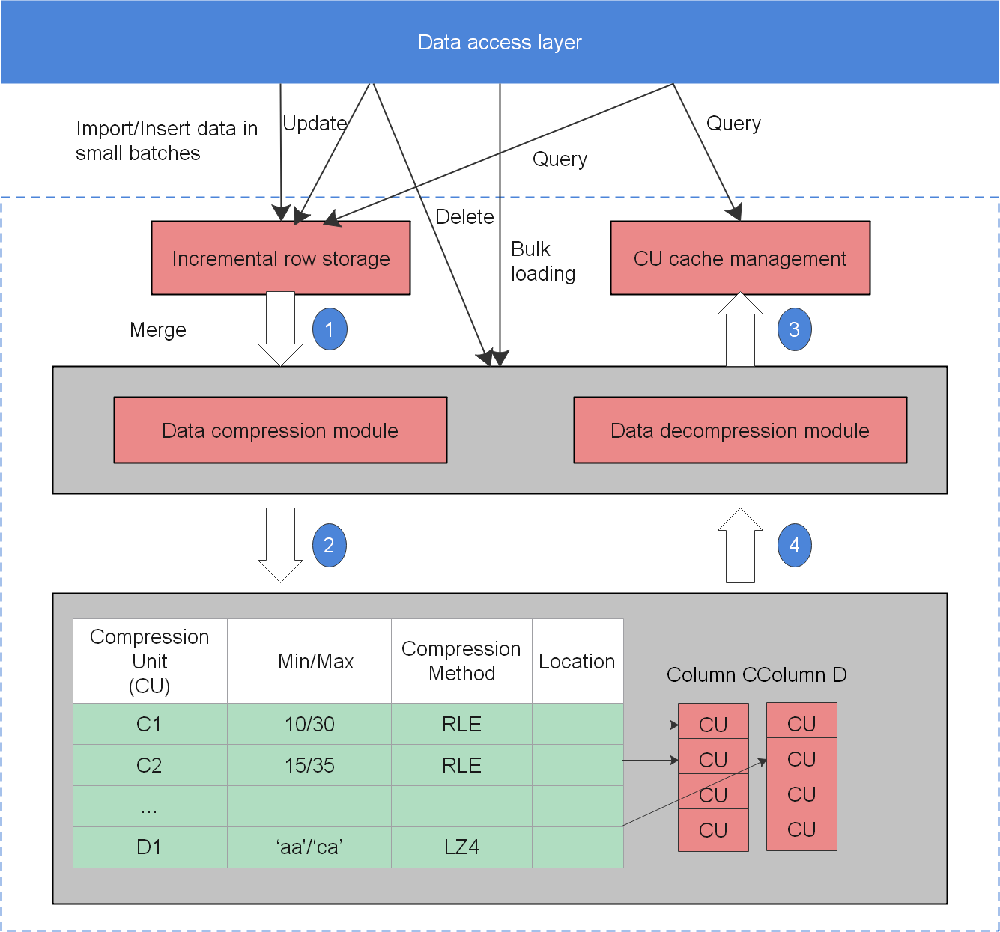

# Enhanced Features

## Data Partitioning

Data partitioning is a general function for most database products. In openGauss, data partitioning is to partition data horizontally based on a user-specified policy, splitting a table into multiple partitions that are not overlapped.

openGauss supports range partitioning, where records to be inserted into a table are divided into multiple ranges based on one or more columns. A partition for each range is created to store data, and partition ranges do not overlap. If you specify the  **PARTITION**  parameter in the  **CREATE TABLE**  statement, data in the table will be partitioned.

For example,  [Table 1](#en-us_topic_0237080621_en-us_topic_0231764089_en-us_topic_0059777656_t77b9e09809f742f1aaadea05d041bc23)  uses an xDR scenario to describe the benefits provided after data is partitioned based on time fragments.

**Table  1**  Partitioning benefits

<table><thead align="left"><tr id="en-us_topic_0237080621_en-us_topic_0231764089_en-us_topic_0059777656_r136f4522bccc4ec8ac473a07709c0737"><th class="cellrowborder" valign="top" width="50%" id="mcps1.2.3.1.1">
Application Scenario

</th>
<th class="cellrowborder" valign="top" width="50%" id="mcps1.2.3.1.2">
Benefits

</th>
</tr>
</thead>
<tbody><tr id="en-us_topic_0237080621_en-us_topic_0231764089_en-us_topic_0059777656_rdfb6ee78653a46059253db9ed1e35114"><td class="cellrowborder" valign="top" width="50%" headers="mcps1.2.3.1.1 ">
Frequently accessed rows in a table are located in one separate or a few partitions.

</td>
<td class="cellrowborder" valign="top" width="50%" headers="mcps1.2.3.1.2 ">
Improve access performance by significantly reducing search space.

</td>
</tr>
<tr id="en-us_topic_0237080621_en-us_topic_0231764089_en-us_topic_0059777656_r7ddefafe50e44ec0bddd409e82ecafa5"><td class="cellrowborder" valign="top" width="50%" headers="mcps1.2.3.1.1 ">
Most partition records need to be queried or updated.

</td>
<td class="cellrowborder" valign="top" width="50%" headers="mcps1.2.3.1.2 ">
Improve performance because only one partition rather than the whole table needs to be consecutively scanned

</td>
</tr>
<tr id="en-us_topic_0237080621_en-us_topic_0231764089_en-us_topic_0059777656_r569c0fbda7794f0b9d7c2f11ab573eab"><td class="cellrowborder" valign="top" width="50%" headers="mcps1.2.3.1.1 ">
Records that need to be loaded or deleted in batches are located in one separate or a few partitions.

</td>
<td class="cellrowborder" valign="top" width="50%" headers="mcps1.2.3.1.2 ">
Improve processing performance because related partitions can be directly read or deleted. Reduce fragmented deleting operations because records can be deleted in batches.

</td>
</tr>
</tbody>
</table>

Data partitioning provides the following benefits:

-   **Improve manageability:**  Tables and indexes are divided into smaller and more manageable units. In this way, data management can be performed by partitions. Database administrators will perform maintenance in the designated area of the table.
-   **Improve deleting performance:**  Delete an entire partition rather than delete data by row, which is very efficient.

    The  **DROP TABLE**  syntax can be used to delete both ordinary tables and partitioned tables.

-   **Improve query performance:**  Restrict the volume of data to be checked or operated to facilitate query.

    With partition pruning, also known as partition elimination, openGauss filters out unexpected partitions and scans only the remaining partitions. Partition pruning greatly improves query performance.

-   **Partition-wise Join**: Partitioning can also improve the performance of multi-table joins by using a technique known as partition-wise join. Partition-wise joins can be applied when two tables are joined and at least one of these tables is partitioned using a join key. Partition-wise joins break a large join into smaller joins of "identical" datasets. "Identical" here is defined as covering the same set of partitioning key values on both sides of the join, ensuring that only a join of these 'identical' datasets will produce a result without considering other datasets.

## Vectorized Executor and Hybrid Row-Column Storage Engine

In a wide table containing a huge amount of data, a query usually only involves certain columns. In this case, the query performance of the row-store engine is poor. For example, a single table containing the data of a meteorological agency has 200 to 800 columns. Among these columns, only ten of them are frequently accessed. In this case, a vectorized executor and column-store engine can significantly improve performance by saving storage space.

-   Vectorized executor

    [Figure 1](#en-us_topic_0237080624_en-us_topic_0231764690_en-us_topic_0059777898_f9d90aebe179a40759039d0263492489d)  shows a standard iterator module. Control flow travels in the downlink direction \(shown as solid lines in the following figure\) and data flow in the uplink direction \(shown as dotted lines in the following figure\). The upper-layer node invokes the lower-layer node to request data and the lower-layer node only returns one tuple to the upper-layer node at a time.

    By contrast, the vectorized executor returns a batch of tuples at a time, which significantly improves performance using column store.

    **Figure  1**  Vectorized executor  
    

    .png)

-   Hybrid Row-Column Storage Engine

    openGauss supports both row and column store models. Choose a row- or column-store table as needed.

    Column store is recommended if a table contains many columns \(called a wide table\) but its query involves only a few columns. Row store is recommended if a table contains only a few columns and a query involves most of the columns.

    The hybrid row-column storage engine achieves higher data compression ratio \(column store\), index performance \(column store\), and point update and point query \(row store\) performance, as shown in  [Figure 2](#en-us_topic_0237080624_en-us_topic_0231764690_en-us_topic_0059777898_fbb2af39ce12a419cb437829aaf1cf4fb).

    **Figure  2**  Hybrid row-column storage engine  
    

    
The restrictions of the column store engine are as follows:
    

-   For DDL statements, only CREATE TABLE, DROP TABLE, and TRUNCATE TABLE are supported.
    
    Partition management using DDL statements \(such as  **ADD PARTITION**,  **DROP PARTITION**,** MERGE PARTITION**,** and EXCHANGE**\) is supported.
    
    The  **CREATE TABLE LIKE**  statement is supported.
    
    The  **ALTER TABLE**  statement is partially supported.
    
    Other DDL statements are not supported.
    
-   For DML statements, UPDATE, COPY, BULKLOAD, and DELETE are supported.
    -   Triggers and primary foreign keys are not supported.
    -   Psort index, B-tree index, and GIN index are supported. For details, see "**SQL Reference**  \>  **SQL Syntax**  \>  **CREATE INDEX**" in the  _Developer Guide_.
    
-   Data compression in column store

    Inactive and earlier data can be compressed to free up space, reducing procurement and O&M costs.

    In openGauss, data can be compressed using delta encoding, dictionary coder, RLE, LZ4, and ZLIB algorithms in column store. The system automatically selects a compression algorithm based on data characteristics. The average compression ratio is 7:1. Compressed data can be directly accessed and is transparent to services. This greatly reduces the preparation time before accessing historical data.

## High Availability \(HA\) Transaction Processing

openGauss manages transactions and guarantees the ACID properties.

openGauss provides a primary/standby HA mechanism to reduce the service interruption time when the primary node is faulty. It protects key user programs and continuously provides external services, minimizing the impact of hardware, software, and human faults on services to ensure service continuity.

**Fault recovery**

Node faults can be recovered and the ACID properties still exist after the recovery. openGauss ensures zero data loss after a node is recovered from a fault or restarted.

**Transaction management**

-   Support transaction blocks. The  **Start Transaction**  command can be used to start a transaction block explicitly.
-   Support single-statement transactions. If explicit startup is not performed, a single statement is processed as a transaction.

## High Concurrency and High Performance

openGauss supports 10,000 concurrent connections through server thread pools. It supports thread nucleophilicity and millions of tpmC using the NUMA-based kernel data structure, manages TB-level large memory buffers through efficient hot and cold data elimination, achieves multi-version access without read/write blocks using CSN-based snapshots, and avoids performance fluctuation caused by full-page writes using incremental checkpoints.

## SQL Self-Diagnosis

To locate performance issues of a query, you can use  **EXPLAIN PERFORMANCE**  to query its execution plan. However, this method produces many logs, requires to modify service logic, and depends on expertise to locate problems. SQL self-diagnosis enables users to locate performance issues more efficiently.

Before running a job, set the GUC parameters  **resource\_track\_level**  and  **resource\_track\_cost**, and obtain the possible performance issues after job execution by checking the related system view. The system view describes the possible causes of performance issues. To optimize low-performance jobs, see "**Performance Tuning **\>  **SQL Tuning**  \>  **Typical SQL Optimization Methods**  \>  **Optimizing SQL Self-Diagnosis**" in the  _Developer Guide_.

SQL self-diagnosis helps users locate and optimize performance issues without affecting operations or modifying service logic.

## Memory Table

With memory tables, all data access is lock-free and concurrent, optimizing data processing and meeting real-time requirements.

## Primary/Standby Deployment

The primary/standby deployment mode supports synchronous and asynchronous replication. Applications are deployed based on service scenarios. For synchronous replication, one primary node and two standby nodes are deployed. This ensures reliability but affects performance. For asynchronous replication, one primary node and one standby node are deployed. This has little impact on performance, but data may be lost when exceptions occur. openGauss supports automatic recovery of damaged pages. When a page on the primary node is damaged, the damaged page can be automatically recovered on the standby node. Besides, openGauss supports concurrent log recovery on the standby node to minimize the service unavailability time when the primary node is down.

In addition, in primary/standby deployment mode, if the read function of the standby node is enabled, the standby node supports read operations instead of write operations \(such as table creation, data insertion, and data deletion\), reducing the pressure on the primary node.

## AI-based O&M Optimization

-   Automatic parameter optimization

    In database scenarios, the optimal parameter value combinations of different types of jobs are different from each other. To achieve better running performance, users want to quickly optimize database parameters. People learning to adjust parameters is not cost-effective, real-time or widely available. Automatic adjustment of database parameters through machine learning helps improve the parameter adjustment efficiency and reduce the cost of parameter adjustment.

    Automatic parameter optimization: The parameter optimization service is an offline service and consists of two phases: training and testing.

    When the model is in the training phase, a new parameter value combination is obtained by using the reinforcement learning and heuristic algorithm based on an input database parameter value \(including a current parameter value and a current performance parameter value of the database\). The parameter adjustment of the database is obtained by mixing output results of two parts: reinforcement learning and heuristic algorithm. The output of the model is de-normalized to obtain a new parameter value. The new value is inserted into the database and the testing job is run to obtain the database performance under the current value combination, such as the execution duration and throughput. Finally, the performance is fed back to the learning model and iterated.

    When the model is in the testing phase, the parameter values of the current database are used as the input, including the current parameter value and current performance parameter value of the database. The optimal parameter adjustment solution in the current situation is obtained through the model.

-   Slow SQL diagnosis

    In the actual production environment, users usually hope that jobs can be successfully executed in the fastest way. However, because the complexity of statements varies, execution times are different. Users want to identify the statements that may take a long time before execution, and execute them separately to prevent long-time locks from affecting the execution of other statements. In addition, users hope that the advance identification function does not occupy the original resources of the user database or affect the original response time.

    The slow SQL diagnosis feature uses machine learning algorithms to construct an AI framework, parses the semantic structures of the statements, and qualitatively or quantitatively predicts the execution time of unknown statements based on the parsing results to meet users' requirements for identifying slow SQL statements in advance.

    Slow SQL diagnosis has two main phases: training and prediction.

    -   Training phase: Prepare the historical SQL records of typical services. The input format is as follows: \(SQL execution duration, SQL statement, SQL lock waiting duration\). Ensure that at least one of the lock waiting duration and SQL execution duration is not 0. Press  **Tab**  to separate lines. Import historical SQL data based on the log address entered by the user, and train the self-encoded model, clustering model, and execution time sequence model.
    -   Prediction phase: A user enters a to-be-predicted load. The system encodes the load based on the self-encoded model generated in the training phase, classifies the load based on the clustering model generated in the training phase, and then predicts the execution time based on the historical information of each type.

-   SQL execution time prediction

    In scenarios such as query performance optimization and service load analysis, users often need to predict the execution time of SQL statements. Currently, the database optimizer is based on the cost model and cannot accurately predict the execution time. This feature uses AI models to predict the execution time of historical or similar queries, meeting the SQL execution time prediction requirements.

    SQL execution time prediction: Coding and deep learning-based training and prediction are performed based on the collected historical performance data.

    Historical data is collected by the database kernel process. The kernel process sends HTTPS requests to the Python AI engine through curl to \(1\) configure the machine learning model \(2\) send training data \(3\) trigger model training \(4\) request the training process monitoring service port \(5\) load the model used for training \(6\) and use the loaded model for prediction. The data encoding phase is completed in the database to ensure that the exported data has been anonymized. In the prediction phase, after the query plan is generated, the entire plan needs to be encoded and written into a file and then sent to the Python end. The TensorFlow computational graph on the Python end needs to be loaded only once to perform highly parallel batch prediction.

-   Database monitoring

    During routine O&M, users need to continuously monitor the database running status. However, due to the complexity of the database, it is difficult for users to efficiently extract key data. Database self-monitoring improves O&M efficiency. You only need to pay attention to core metrics and abnormal data.

    1.  The transaction summary information includes the transaction numbers of Submit \(commit\_counter\) and Rollback \(rollback\_counter\) and the transaction response time. The above transactions are accumulated values since the last restart.
    2.  The workload SQL summary information includes the distribution of DDL, DCL, and DML in a workload and the number of SELECT, UPDATE, INSERT, and DELETE in DML. The SQL type distribution is the accumulated value since the last restart.
    3.  The workload SUID time summary information includes the total, average, maximum, and minimum time consumptions of SELECT, UPDATE, INSERT, and DELETE operations in a workload.
    4.  The SQL response time percentile information includes 80% and 95% of the SQL response time in the system in a past period of time.
    5.  The Waitevents summary information contains only the event waiting information on a single node and does not contain the global aggregation information. It includes the waiting status \(STATUS\), I/O event \(IO\_EVENT\), lock event \(LOCK\_EVENT\), Lwlock event \(LWLOCK\_EVENT\), successful waiting times, failed waiting times, total event waiting times on the node, minimum event waiting times, maximum event waiting times, and average event waiting times.
    6.  For the SQL statements that are sent to the Parser, the Parser generates the normalized Unique SQL ID and the corresponding SQL text strings, collects statistics on the time consumed by unique SQL statements in each execution phase to analyze, optimizes SQL performance based on the time distribution, and collects statistics on the time consumed by instances and sessions in each phase to help optimize the overall system performance. It also queries the number of SQL execution times, SQL kernel response times, I/O times, CPU times, network transmission times, numbers of physical and logical reads, result sets returned by Select, scanned tuples, updated rows, deleted rows, inserted rows, and newly generated \(hard\) reuse \(soft\) plans.

## Logical Log Replication

In logical replication, the primary database is called the source database, and the standby database is called the target database. The source database parses the WAL file based on the specified logical parsing rules and parses the DML operations into certain logical change information \(standard SQL statements\). The source database sends standard SQL statements to the target database. After receiving the SQL statements, the target database applies them to implement data synchronization. Logical replication involves only DML operations. Logical replication can implement cross-version replication, heterogeneous database replication, dual-write database replication, and table-level replication.

## Stored Procedure Debugging

Stored procedure debugging is a debugging method. During the development of a stored procedure, you can trace the execution process of a stored procedure step by step and find the error causes or program bugs based on the variable values to improve the fault locating efficiency. It supports breakpoint settings and step-by-step debugging.

## Automatic WDR Performance Analysis Report

Periodically and proactively analyzes run logs and WDR reports \(which are automatically generated in the background and can be triggered by key indicator thresholds such as the CPU usage, memory usage, and long SQL statement proportions\) and generates reports in HTML and PDF formats. The performance report can be automatically generated. The WDR generates a performance report between two different time points based on the system performance snapshot data at two different time points. The report is used to diagnose database kernel performance faults.

The WDR module consists of the following two components:

-   Snapshot: The performance snapshot can be configured to collect a certain amount of performance data from the kernel at a specified interval and store the data in the user tablespace. Any snapshot can be used as a performance baseline for comparison with other snapshots.
-   WDR Reporter: This tool analyzes the overall system performance based on two snapshots, calculates the changes of more specific performance indicators between the two time points, and generates summarized and detailed performance data.

## Incremental Backup and Recovery (beta)

Supports full backup and incremental backup of the database, manages backup data, and views the backup status. Supports combination of incremental backups and deletion of expired backups. The database server dynamically tracks page changes, and when a relational page is updated, the page is marked for backup. The incremental backup function requires that the GUC parameter enable\_cbm\_tracking be enabled to allow the server to track the modification page.

## Point-In-Time Recovery

Point-in-time recovery \(PITR\) uses basic hot backup, write-ahead logs \(WALs\), and archived WALs for backup and recovery. Replaying a WAL record can be stopped at any point of time, so that there is a consistent snapshot of the database at any point of time. That is, you can restore the database to the state at any time since the backup starts. During recovery, you can specify a recovery stop point with a terminal ID \(TID\), time, and license serial number \(LSN\).

