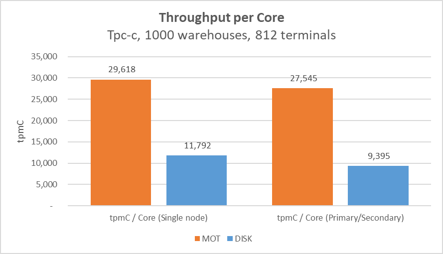

# ARM/Kunpeng 2-Socket 128 Cores

Two types of tests were performed – Single Node \(without HA\) and Primary/Secondary \(with HA\).

-   Performance

As seen in the Figure above, in MOT the replication overhead of a Primary/Secondary High Availability scenario is 7% on ARM/Kunpeng and 2% on x86 servers, as opposed to the overhead in Disk-tables of 20% on ARM/Kunpeng and 15% on x86 servers.

-   Performance per CPU core

**Figure  1**  ARM/Kunpeng 2-Socket 128 Cores – Performance Benchmarks  

