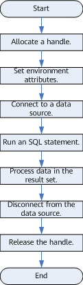

# Development Process

**Figure  1**  ODBC-based application development process  

## APIs Involved in the Development Process

**Table  1**  API description

<table><thead align="left"><tr id="en-us_topic_0237120409_en-us_topic_0059778957_ra4bc7ab7d7a7493ea839a0e52ecf4825"><th class="cellrowborder" valign="top" width="37.2%" id="mcps1.2.3.1.1">
<strong id="en-us_topic_0237120409_b01271032232">Function</strong>

</th>
<th class="cellrowborder" valign="top" width="62.8%" id="mcps1.2.3.1.2">
<strong id="en-us_topic_0237120409_en-us_topic_0059778957_a16bae9c276314a118debccb05cc4734f">API</strong>

</th>
</tr>
</thead>
<tbody><tr id="en-us_topic_0237120409_en-us_topic_0059778957_r6ff7b44edfc64cc69677920a5fd8a9af"><td class="cellrowborder" valign="top" width="37.2%" headers="mcps1.2.3.1.1 ">
Allocate a handle

</td>
<td class="cellrowborder" valign="top" width="62.8%" headers="mcps1.2.3.1.2 ">
<a href="sqlallochandle.md">SQLAllocHandle</a> is a generic function for allocating a handle. It can replace the following functions:

<ul id="en-us_topic_0237120409_en-us_topic_0059778957_u9a01eda0e47a4f5791a8febb1bb4d13d"><li><a href="sqlallocenv.md">SQLAllocEnv</a>: allocate an environment handle</li><li><a href="sqlallocconnect.md">SQLAllocConnect</a>: allocate a connection handle</li><li><a href="sqlallocstmt.md">SQLAllocStmt</a>: allocate a statement handle</li></ul>
</td>
</tr>
<tr id="en-us_topic_0237120409_en-us_topic_0059778957_reca69a78621d4b29bfdbb97fc83bb8d8"><td class="cellrowborder" valign="top" width="37.2%" headers="mcps1.2.3.1.1 ">
Set environment attributes

</td>
<td class="cellrowborder" valign="top" width="62.8%" headers="mcps1.2.3.1.2 ">
<a href="sqlsetenvattr.md">SQLSetEnvAttr</a>

</td>
</tr>
<tr id="en-us_topic_0237120409_en-us_topic_0059778957_r8a93f2fb0cf94874b2c487c93cf898c8"><td class="cellrowborder" valign="top" width="37.2%" headers="mcps1.2.3.1.1 ">
Set connection attributes

</td>
<td class="cellrowborder" valign="top" width="62.8%" headers="mcps1.2.3.1.2 ">
<a href="sqlsetconnectattr.md">SQLSetConnectAttr</a>

</td>
</tr>
<tr id="en-us_topic_0237120409_en-us_topic_0059778957_r215312d81bd845ef9af783522d0a5d31"><td class="cellrowborder" valign="top" width="37.2%" headers="mcps1.2.3.1.1 ">
Set statement attributes

</td>
<td class="cellrowborder" valign="top" width="62.8%" headers="mcps1.2.3.1.2 ">
<a href="sqlsetstmtattr.md">SQLSetStmtAttr</a>

</td>
</tr>
<tr id="en-us_topic_0237120409_en-us_topic_0059778957_r6b385e2697d94978b0f72e9c319dfc62"><td class="cellrowborder" valign="top" width="37.2%" headers="mcps1.2.3.1.1 ">
Connect to a data source

</td>
<td class="cellrowborder" valign="top" width="62.8%" headers="mcps1.2.3.1.2 ">
<a href="sqlconnect.md">SQLConnect</a>

</td>
</tr>
<tr id="en-us_topic_0237120409_en-us_topic_0059778957_r74f5e5648cc545bd989724498fd61272"><td class="cellrowborder" valign="top" width="37.2%" headers="mcps1.2.3.1.1 ">
Bind a buffer to a column in the result set

</td>
<td class="cellrowborder" valign="top" width="62.8%" headers="mcps1.2.3.1.2 ">
<a href="sqlbindcol.md">SQLBindCol</a>

</td>
</tr>
<tr id="en-us_topic_0237120409_en-us_topic_0059778957_r2310b53cbeb44e5189d23d8cb4d54e93"><td class="cellrowborder" valign="top" width="37.2%" headers="mcps1.2.3.1.1 ">
Bind the parameter marker of an SQL statement to a buffer

</td>
<td class="cellrowborder" valign="top" width="62.8%" headers="mcps1.2.3.1.2 ">
<a href="sqlbindparameter.md">SQLBindParameter</a>

</td>
</tr>
<tr id="en-us_topic_0237120409_en-us_topic_0059778957_rb868d10c6c8049dda87a0655f29547a8"><td class="cellrowborder" valign="top" width="37.2%" headers="mcps1.2.3.1.1 ">
Return the error message of the last operation

</td>
<td class="cellrowborder" valign="top" width="62.8%" headers="mcps1.2.3.1.2 ">
<a href="sqlgetdiagrec.md">SQLGetDiagRec</a>

</td>
</tr>
<tr id="en-us_topic_0237120409_en-us_topic_0059778957_r64f440bf6f134ca09eb319dce4445f92"><td class="cellrowborder" valign="top" width="37.2%" headers="mcps1.2.3.1.1 ">
Prepare an SQL statement for execution

</td>
<td class="cellrowborder" valign="top" width="62.8%" headers="mcps1.2.3.1.2 ">
<a href="sqlprepare.md">SQLPrepare</a>

</td>
</tr>
<tr id="en-us_topic_0237120409_en-us_topic_0059778957_r86d122da7e6a45a98abd0d2c1ceeb611"><td class="cellrowborder" valign="top" width="37.2%" headers="mcps1.2.3.1.1 ">
Run a prepared SQL statement

</td>
<td class="cellrowborder" valign="top" width="62.8%" headers="mcps1.2.3.1.2 ">
<a href="sqlexecute.md">SQLExecute</a>

</td>
</tr>
<tr id="en-us_topic_0237120409_en-us_topic_0059778957_r62d4c8e0f9d3431399af1211f6fb6ee2"><td class="cellrowborder" valign="top" width="37.2%" headers="mcps1.2.3.1.1 ">
Run an SQL statement directly

</td>
<td class="cellrowborder" valign="top" width="62.8%" headers="mcps1.2.3.1.2 ">
<a href="sqlexecdirect.md">SQLExecDirect</a>

</td>
</tr>
<tr id="en-us_topic_0237120409_en-us_topic_0059778957_r568da8c171a74a8e84f5f8c8c0979afc"><td class="cellrowborder" valign="top" width="37.2%" headers="mcps1.2.3.1.1 ">
Fetch the next row (or rows) from the result set

</td>
<td class="cellrowborder" valign="top" width="62.8%" headers="mcps1.2.3.1.2 ">
<a href="sqlfetch.md">SQLFetch</a>

</td>
</tr>
<tr id="en-us_topic_0237120409_en-us_topic_0059778957_r38d974abf84e450ca7f96100e8a6a077"><td class="cellrowborder" valign="top" width="37.2%" headers="mcps1.2.3.1.1 ">
Return data in a column of the result set

</td>
<td class="cellrowborder" valign="top" width="62.8%" headers="mcps1.2.3.1.2 ">
<a href="sqlgetdata.md">SQLGetData</a>

</td>
</tr>
<tr id="en-us_topic_0237120409_en-us_topic_0059778957_r91f9e273dc364f31b8661698941c8f92"><td class="cellrowborder" valign="top" width="37.2%" headers="mcps1.2.3.1.1 ">
Get the column information from a result set

</td>
<td class="cellrowborder" valign="top" width="62.8%" headers="mcps1.2.3.1.2 ">
<a href="sqlcolattribute.md">SQLColAttribute</a>

</td>
</tr>
<tr id="en-us_topic_0237120409_en-us_topic_0059778957_re2de0c9ab1fd476dad5108b6e9a8e21c"><td class="cellrowborder" valign="top" width="37.2%" headers="mcps1.2.3.1.1 ">
Disconnect from a data source

</td>
<td class="cellrowborder" valign="top" width="62.8%" headers="mcps1.2.3.1.2 ">
<a href="sqldisconnect.md">SQLDisconnect</a>

</td>
</tr>
<tr id="en-us_topic_0237120409_en-us_topic_0059778957_r2f6f79089ce944fc96e3c5299ab3529d"><td class="cellrowborder" valign="top" width="37.2%" headers="mcps1.2.3.1.1 ">
Release a handle

</td>
<td class="cellrowborder" valign="top" width="62.8%" headers="mcps1.2.3.1.2 ">
<a href="sqlfreehandle.md">SQLFreeHandle</a> is a generic function for releasing a handle. It can replace the following functions:

<ul id="en-us_topic_0237120409_en-us_topic_0059778957_u912c46b1932d4d4b8b4136bd8317d0b5"><li><a href="sqlfreeenv.md">SQLFreeEnv</a>: release an environment handle</li><li><a href="sqlfreeconnect.md">SQLFreeConnect</a>: release a connection handle</li><li><a href="sqlfreestmt.md">SQLFreeStmt</a>: release a statement handle</li></ul>
</td>
</tr>
</tbody>
</table>

> **NOTE:**   
>If an execution request \(not in a transaction block\) received in the database contains multiple statements, the request is packed into a transaction. If one of the statements fails, the entire request will be rolled back.  

>  **警告：**   
>
> ODBC is the central layer of the application program and the database. It is responsible for transmitting the SQL instructions issued by the application program to the database, and does not parse the SQL syntax by itself. Therefore, when an SQL statement with confidential information (such as a plaintext password) is written in an application, the confidential information will be exposed in the driver log.

