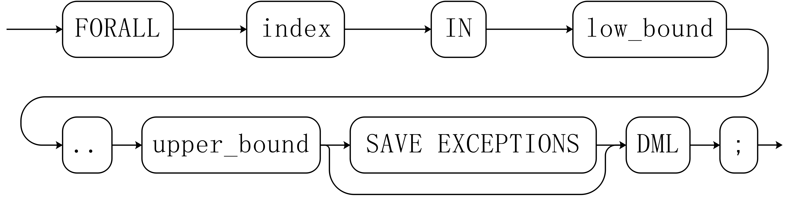

# Loop Statements<a name="EN-US_TOPIC_0245374624"></a>

## Simple LOOP Statements<a name="en-us_topic_0237122234_en-us_topic_0059778638_s27557775f6014d78b9a100c65a4cbb41"></a>

The syntax diagram is as follows:

**Figure  1**  loop::=<a name="en-us_topic_0237122234_en-us_topic_0059778638_fa21272428ed842298772423d38c5cc4b"></a>  


**Example**

```
CREATE OR REPLACE PROCEDURE proc_loop(i in integer, count out integer) 
AS 
    BEGIN 
        count:=0; 
        LOOP 
        IF count > i THEN 
            raise info 'count is %. ', count;  
            EXIT; 
        ELSE 
            count:=count+1; 
        END IF; 
        END LOOP; 
    END;
/

CALL proc_loop(10,5);
```

> **NOTICE:**   
>The loop must be exploited together with  **EXIT**; otherwise, a dead loop occurs.  

## WHILE-LOOP Statements<a name="en-us_topic_0237122234_en-us_topic_0059778638_s14510a113df844eaa0b7e00aa2868313"></a>

**Syntax diagram**

**Figure  2**  while\_loop::=<a name="en-us_topic_0237122234_en-us_topic_0059778638_fc93167bb5ad54010979321d4e0fdbd55"></a>  


If the conditional expression is true, a series of statements in the WHILE statement are repeatedly executed and the condition is decided each time the loop body is executed.

**Example**

```
CREATE TABLE integertable(c1 integer) ; 
CREATE OR REPLACE PROCEDURE proc_while_loop(maxval in integer) 
AS 
    DECLARE 
    i int :=1;  
    BEGIN 
        WHILE i < maxval LOOP 
            INSERT INTO integertable VALUES(i); 
            i:=i+1; 
        END LOOP; 
    END; 
/

-- Invoke a function:
CALL proc_while_loop(10);

-- Delete the stored procedure and table.
DROP PROCEDURE proc_while_loop;
DROP TABLE integertable;
```

## FOR\_LOOP \(_Integer variable_\)  _Statement_<a name="en-us_topic_0237122234_en-us_topic_0059778638_s8d545e0d7dc542958236a07d6c428df3"></a>

**Syntax diagram**

**Figure  3**  for\_loop::=<a name="en-us_topic_0237122234_en-us_topic_0059778638_f225dca3e3bb8473198031bfc2a49f3e1"></a>  


> **NOTE:**   
>-   The variable  **name**  is automatically defined as the  **integer**  type and exists only in this loop. The variable name falls between lower\_bound and upper\_bound.  
>-   When the keyword  **REVERSE**  is used, the lower bound must be greater than or equal to the upper bound; otherwise, the loop body is not executed.  

## FOR\_LOOP Query Statements<a name="en-us_topic_0237122234_en-us_topic_0059778638_s93d5c1ba93874e4496553a9e1e840476"></a>

**Syntax diagram**

**Figure  4**  for\_loop\_query::=<a name="en-us_topic_0237122234_en-us_topic_0059778638_f4043c6dc0195466388bb2b9b42874e52"></a>  


> **NOTE:**   
>The variable  **target**  is automatically defined, its type is the same as that in the  **query**  result, and it is valid only in this loop. The target value is the query result.  

## FORALL Batch Query Statements<a name="en-us_topic_0237122234_en-us_topic_0059778638_sfb1cf79f590142f19c106d6c9a9e700b"></a>

**Syntax diagram**

**Figure  5**  forall::=<a name="en-us_topic_0237122234_en-us_topic_0059778638_f1977a3c1a8284e4da8a52c042293d873"></a>  


> **NOTE:**   
>The variable  **index**  is automatically defined as the  **integer**  type and exists only in this loop. The index value falls between low\_bound and upper\_bound.  

**Example**

```
CREATE TABLE hdfs_t1 (
  title NUMBER(6),
  did VARCHAR2(20),
  data_peroid VARCHAR2(25),
  kind VARCHAR2(25),
  interval VARCHAR2(20),
  time DATE,
  isModified VARCHAR2(10)
);

INSERT INTO hdfs_t1 VALUES( 8, 'Donald', 'OConnell', 'DOCONNEL', '650.507.9833', to_date('21-06-1999', 'dd-mm-yyyy'), 'SH_CLERK' );

CREATE OR REPLACE PROCEDURE proc_forall()
AS 
BEGIN 
    FORALL i IN 100..120 
        update hdfs_t1 set title = title + 100*i;
END; 
/

-- Invoke a function:
CALL proc_forall();

-Query the invocation result of the stored procedure.
SELECT * FROM hdfs_t1 WHERE title BETWEEN 100 AND 120;

-- Delete the stored procedure and table.
DROP PROCEDURE proc_forall;
DROP TABLE hdfs_t1;
```

