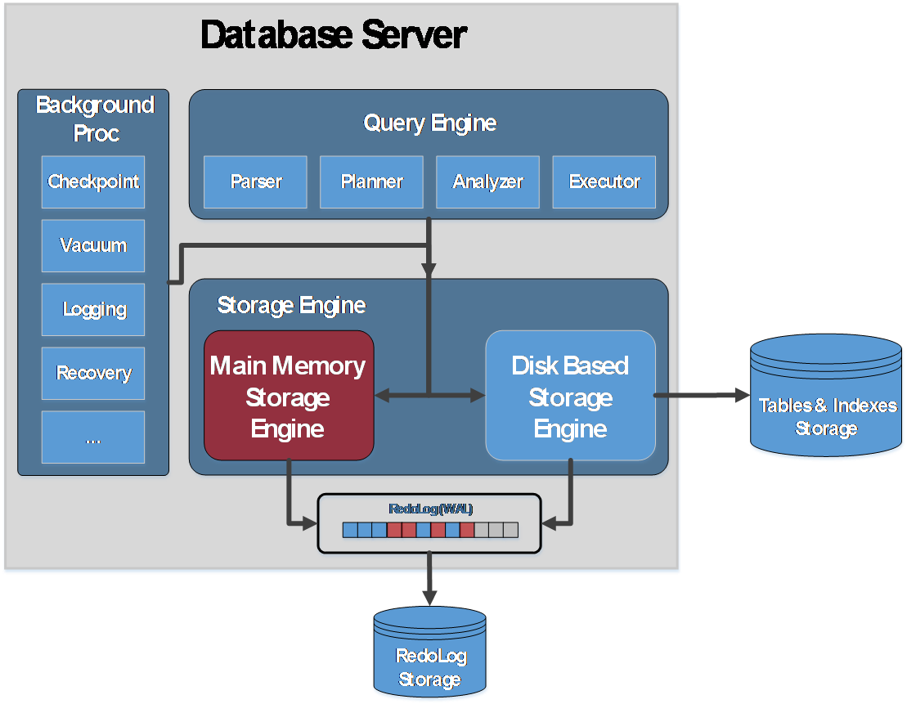

# MOT Introduction

openGauss introduces Memory-Optimized Tables \(MOT\) storage engine – a transactional row-based store \(rowstore\), that is optimized for many-core and large memory servers. MOT is a state-of-the-art production‑grade feature \(beta release\) of openGauss database that provides greater performance for transactional workloads. MOT is fully ACID compliant and includes strict durability and high availability support. Businesses can leverage MOT for mission-critical, performance-sensitive Online Transaction Processing \(OLTP\) applications in order to achieve high performance, high throughput, low and predictable latency and high utilization of many‑core servers. MOT is especially suited to leverage and scale-up when run on modern servers with multiple sockets and many-core processors, such as Huawei Taishan servers with ARM/Kunpeng processors and x86-based Dell or similar servers.

**Figure  1**  Memory-Optimized Storage Engine Within openGauss  

[Figure 1](#fig136991747161510)  presents the Memory-Optimized Storage Engine component \(in green\) of openGauss database and is responsible for managing MOT and transactions.

MOT tables are created side-by-side regular disk-based tables. MOT’s effective design enables almost full SQL coverage and support for a full database feature-set, such as stored procedures and user-defined functions \(excluding the  features listed in  [SQL Coverage and Limitations](sql-coverage-and-limitations.md)  section\).

With data and indexes stored totally in-memory, a Non-Uniform Memory Access \(NUMA\)-aware design, algorithms that eliminate lock and latch contention and query native compilation, MOT provides faster data access and more efficient transaction execution.

MOT’s effective almost lock-free design and highly tuned implementation enable exceptional near-linear throughput scale-up on many-core servers – probably the best in the industry.

Memory-Optimized Tables are fully ACID compliant, as follows

-   **Atomicity –**  An atomic transaction is an indivisible series of database operations that either all occur or none occur after a transaction has been completed \(committed or aborted, respectively\).
-   **Consistency –**  Every transaction leaves the database in a consistent \(data integrity\) state.
-   **Isolation –**Transactions cannot interfere with each other. MOT supports repeatable‑reads and read-committed isolation levels. In the next release, MOT will also support serializable isolation. See the  [OCC vs 2PL Differences by Example](occ-vs-2pl-differences-by-example.md)  section for more information.
-   **Durability –**  The effects of successfully completed \(committed\) transactions must persist despite crashes and failures. MOT is fully integrated with the WAL-based logging of openGauss. Both synchronous and asynchronous logging options are supported. MOT also uniquely supports synchronous + group commit with NUMA-awareness optimization. See the  [Durability](durability-0.md)  section for more information.

