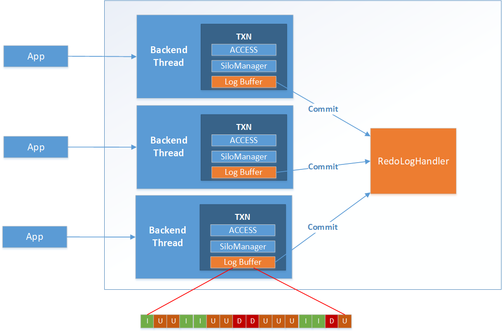

# Per-transaction Logging

In the In-Memory Engine, the transaction log records are stored in a transaction buffer which is part of the transaction object \(TXN\). The transaction buffer is logged during the calls to addToLog\(\) – if the buffer exceeds a threshold it is then flushed and reused. When a transaction commits and passes the validation phase \(OCC SILO\[[Comparison – Disk vs. MOT](comparison-disk-vs-mot.md)\]  validation\) or aborts for some reason, the appropriate message is saved in the log as well in order to make it possible to determine the transaction's state during a recovery.

**Figure  1**  Per-transaction Logging

Parallel Logging is performed both by MOT and disk engines. However, the MOT engine enhances this design with a log-buffer per transaction, lockless preparation and a single log record.

