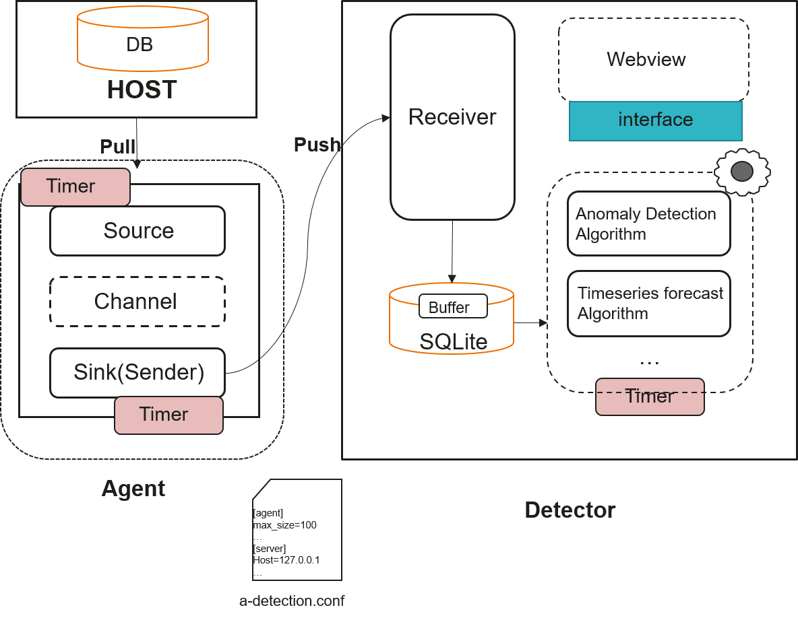

# Preparations<a name="EN-US_TOPIC_0303986164"></a>

## Prerequisites and Precautions<a name="en-us_topic_0283137591_section887921944913"></a>

-   The database is normal, and the data directory has been written into environment variables and named  **PGDATA**.
-   If you log in to the database host as a Linux user, add  **$GAUSSHOME/bin**  to the  _PATH _environment variable so that you can directly run database O&M tools, such as gsql, gs\_guc, and gs\_ctl.
-   The recommended Python version is Python 3.6 or later. The required dependency has been installed in the operating environment, and the optimization program can be started properly.
-   This tool consists of the agent and detector. Data is transmitted between the agent and detector in HTTP or HTTPS mode. Therefore, ensure that the agent server can communicate with the detector server properly.
-   Detector module runs the server and monitor services, which need to be started separately.
-   If HTTPS is used for communication, you need to prepare the CA certificate, and certificates and keys of the agent and detector, and save them to  **ca**,  **agent**, and  **server **in the  **root **directory of the project, respectively. In addition, you need to save the key encryption password to  **pwf **of the certificate, and set the permission to  **600**  to prevent other users from performing read and write operations. You can also use the script in the  **share **directory to generate certificates and keys.

## Principles<a name="en-us_topic_0283137591_section1767203555113"></a>



Figure 1 anomaly\_detection structure

anomaly\_detection is a tool independent of the database kernel. Figure 1 shows the structure of anomaly\_detection. anomaly\_detection consists of the agent and detector modules.

-   **agent**: data agent module, which consists of the source, channel, and sink. It collects metrics in the database and sends the metrics to the remote detector in HTTP or HTTPS mode.
-   **detector**: collects and stores data pushed by the agent, monitors and detects database metrics based on algorithms such as time series forecasting and exception detection, and notifies users of the exceptions through logs.

## Running and Installation of anomaly\_detection<a name="section7752113811419"></a>

1.  Switch to the  **anomaly\_detection **directory. For the openGauss community code, the path is  **openGauss-server/src/gausskernel/dbmind/tools/anomaly\_detection**. For an installed database system, the source code path is  **$GAUSSHOME/bin/dbmind/anomaly\_detection**.
2.  You can view the  **requirements.txt**  file in the current directory. Use the pip package management tool to install the dependency based on the  **requirements.txt**  file.

    ```
    pip install -r requirements.txt
    ```

3.  After the installation is successful, run  **main.py**. For example, to obtain the help information, run the following command:

    ```
    cd anomaly_detection # Switch to the directory where the main.py entry file is located.
    python main.py --help # Obtain help information. The methods of using other functions are similar.
    ```


## Description of the anomaly\_detection Configuration File<a name="section5892154973918"></a>

The  **a-detection.conf **and  **metric\_task.conf **configuration files need to be loaded before  **anomaly\_detection**  is executed. You can run the  **python main.py --help**  command to view the configuration file path.

**a-detection.conf**  contains six sections: agent, server, database, security, forecast, and log. The parameters are described as follows:

```
# Parameter configuration on the agent.
[agent] 
# Interval for the agent to collect data, in seconds.
source_timer_interval = 1 
# Interval for the agent to send data to the detector, in seconds.
sink_timer_interval = 1 
# Length of the buffer queue on the agent.
channel_capacity = 300  

# Communication mode configuration
[security] 
# tls=True. The HTTPS communication mode is used. You must place the certificate and key in the following path.
# Use gen_ca_certificate.sh in the share script to generate a CA certificate.
# Use gen_certificate.sh to generate the server certificate and key, and write the key encryption password to the pwf file of certificates.
# tls=False. The HTTP communication mode is used. You do not need to configure the paths of the following certificates and keys.
tls = False 
# CA certificate path
ca = ./certificate/ca/ca.crt 
# Path of the certificate on the detector
server_cert = ./certificate/server/server.crt 
# Path of the key on the detector.
server_key = ./certificate/server/server.key 
# Path of the certificate on the agent
agent_cert = ./certificate/agent/agent.crt 
# Path of the key on the agent
agent_key = ./certificate/agent/agent.key  

# Database parameter configuration
[database]
# Path for storing the database
database_path = ./data/metric.db 
# Maximum number of rows in a database table. This parameter is used to prevent insufficient disk space due to a large amount of data.
max_rows = 20000 
# Frequency of refreshing the database table. In this example, the table is refreshed before 1000 rows are inserted. The old data that is greater than the value of max_rows is refreshed to store the new data.
max_flush_cache = 1000  

# Server parameter configuration
[server]
# IP address of the detector
host = 127.0.0.1 
# Listening IP address of the detector
listen_host = 0.0.0.0 
# Listening port of the detector. Make sure that the port is not occupied.
listen_port = 8080  

# Forecasting algorithm configuration. By default, the auto_arima and fbprophet algorithms are included.
[forecast] 
#Time series forecasting algorithm. The default algorithm is arima.
predict_alg = auto_arima

# Path for storing logs
[log] 
# Location for storing logs
log_dir = ./log
```

**metric\_task.conf**  contains parameters of all monitoring metrics. The following uses  **disk\_space **as an example:

```
[disk_space] 
# Lower limit of the metric (used for monitoring and alarming)
minimum = 20 
# Upper limit of the metric (used for monitoring and alarming)
maximum = 100 
# Training data length during forecasting. The value can be an integer or an integer plus the time unit.
# If the value is an integer, the training data of the corresponding length is obtained. If the value is an integer plus a time unit, the training data of the corresponding length is obtained.
# 100S indicates that the data in the latest 100 seconds is used as the training data.
data_period = 100S 
# Interval of forecasting. The following indicates that the forecasting is performed every 100s.
forecast_interval = 100S 
# Period of forecasting. The following indicates that the data of the next 60 seconds is forecasted each time.
forecast_period = 60S 
```

> **NOTE:** 
>-   The following time units are supported:
>    'S': second
>    'M': minute
>    'H': hour
>    'D': day
>    'W': week
>-   At least one of  **minimum **and  **maximum **must be provided.
>-   The value of  **data\_period **can be an integer or an integer plus a time unit, for example, 100 or 100S.
>-   Ensure that the training data length is greater than the forecasting length. Otherwise, the forecasting effect will be affected.

