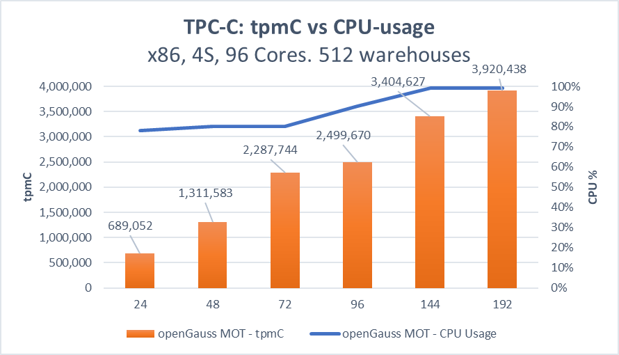

# Result – Linear Scale-up

The following shows the results achieved by the MOT design principles and implementation described above.

To the best of our knowledge, MOT outperforms all existing industry-grade OLTP databases in transactional throughput of ACID-compliant workloads.

openGauss and MOT have been tested on the following many-core systems with excellent performance scalability results. The tests were performed both on x86 Intel-based and ARM/Kunpeng-based many-core servers. You may refer to the  [Performance Benchmarks](performance-benchmarks.md)  section for more detailed performance review.

Our TPC-C benchmark dated June 2020 tested an openGauss MOT database on a Taishan 2480 server. A 4-socket ARM/Kunpeng server, achieved throughput of 4.8 M tpmC. The following graph shows the near-linear nature of the results, meaning that it shows a significant increase in performance correlating to the increase of the quantity of cores

**Figure  1**  TPC-C on ARM \(256 Cores\)The following is an additional example that shows a test on an x86-based server also showing CPU utilization  
the-following-is-an-additional-example-that-shows-a-test-on-an-x86-based-ser.png)

**Figure  2**  tpmC vs CPU Usage  

The chart shows that MOT demonstrates a significant performance increase correlation with an increase of the quantity of cores. MOT consumes more and more of the CPU correlating to the increase of the quantity of cores. Other industry solutions do not increase and sometimes show slightly degraded performance, which is a well-known problem in the database industry that affects customers’ CAPEX and OPEX expenses and operational efficiency.

